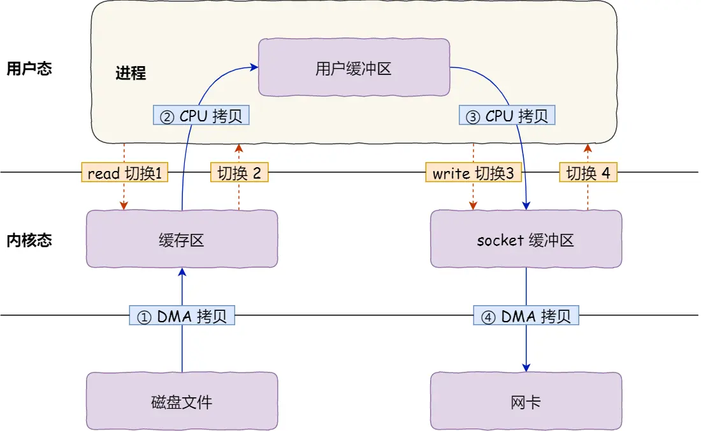
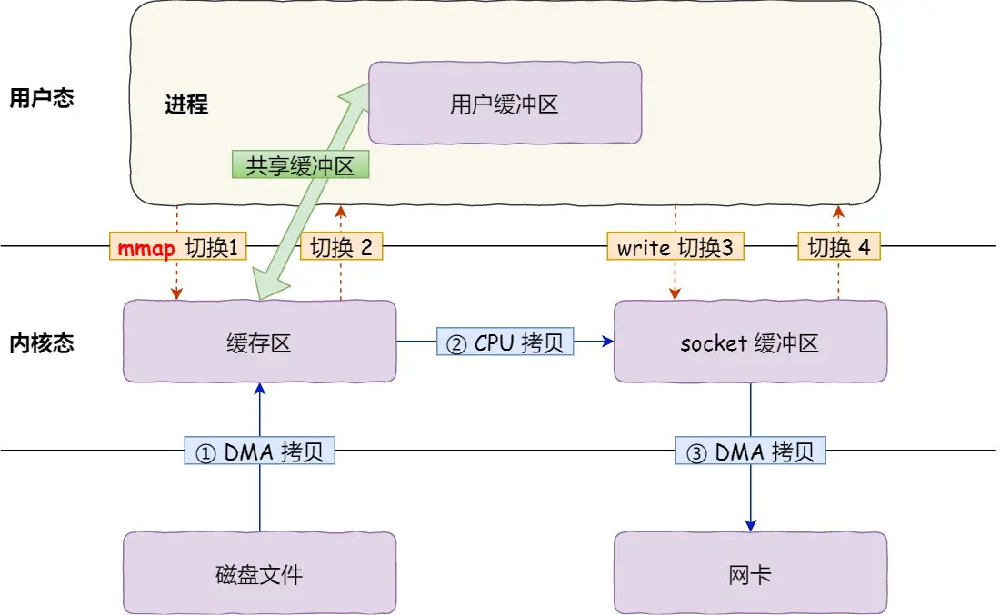
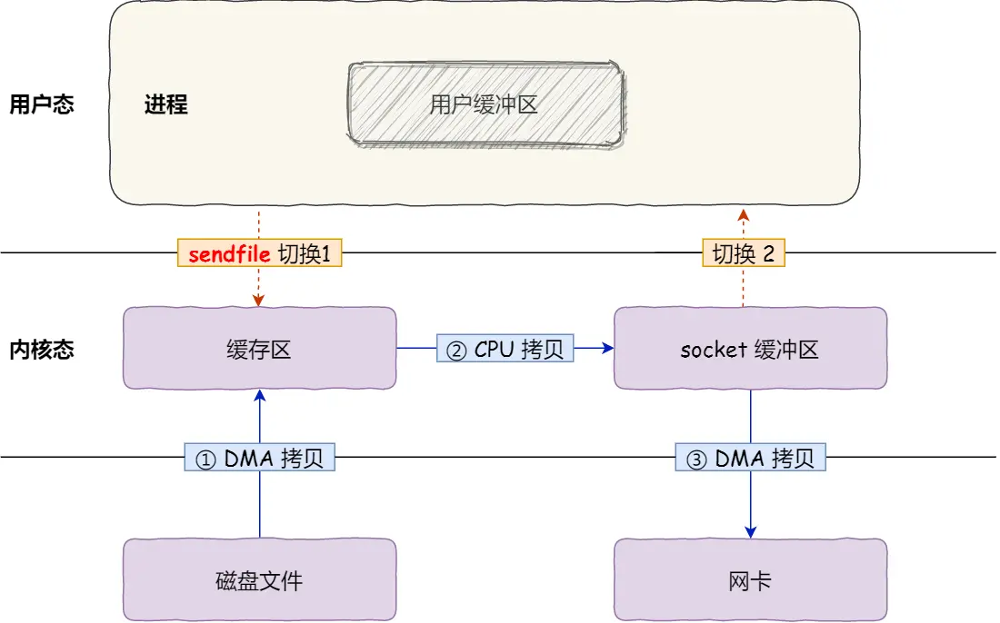

# 实战梳理


## CPU


64位系统中：
寄存器：一次能处理8字节数据
L1缓存：一次能处理64字节数据
L2缓存：一次能处理512字节数据
L3缓存：一次能处理4096字节数据

分为：
- 数据缓存
- 指令缓存

提升缓存的命中率 -> 提升程序的性能

提升数据缓存的命中率
- 空间局部性: 一旦访问了某个存储单元，很可能在不久之后再次访问附近的存储单元, Cache Line会将附近的存储单元一并加载到缓存中,

提升指令缓存的命中率
- CPU的分支预测机制: 分支预测可以预测到接下来要执行 if 里的指令，还是 else 指令的话，就可以「提前」把这些指令放在指令缓存中，这样 CPU 可以直接从 Cache 读取到指令，于是执行速度就会很快。

比如
```C++
// arr是随机的

// 操作1
for (int i = 0; i < 100; i++) {
    if (arr[i] < 10) {
        // 操作
    } 
}

// 操作2 排序
sort(arr, arr + 100);
```
如果先进行操作2，再进行操作1. 那么可以进行分支预测，将`if (arr[i] < 10)`的指令放入指令缓存中，这样就可以提高指令缓存的命中率。


提升多核CPU的命中率

因为L3缓存是共享的，而L1,L2缓存不是共享的.
因此如果因为进程每次被分配到不同的核心上，那么L1,L2缓存的命中率就会降低，因为每次都要重新加载数据到L1,L2缓存中。

为了防止因为切换到不同的核心，而导致缓存命中率下降的问题，我们可以把线程绑定在某一个 CPU 核心上，这样性能可以得到非常可观的提升

如: `sched_setaffinity` 函数可以将线程绑定到某一个CPU核心上。

```C++
#include <sched.h>
int sched_setaffinity(pid_t pid, size_t cpusetsize, const cpu_set_t *mask);
```

### CPU缓存一致性

现在 CPU 都是多核的，由于 L1/L2 Cache 是多个核心各自独有的，那么会带来多核心的缓存一致性（Cache Coherence） 的问题，如果不能保证缓存一致性的问题，就可能造成结果错误。

解决机制:
- 写传播: 某个 CPU 核心里的 Cache 数据更新时，必须要传播到其他核心的 Cache
- 事务的串行化: 某个 CPU 核心里对数据的操作顺序，必须在其他核心看起来顺序是一样的


基于总线嗅探机制的 MESI 协议，就满足上面了这两点


总线嗅探方法很简单， CPU 需要每时每刻监听总线上的一切活动，但是不管别的核心的 Cache 是否缓存相同的数据，都需要发出一个广播事件

整个 MESI 的状态可以用一个有限状态机来表示它的状态流转

当 Cache Line 状态是「已修改」或者「独占」状态时，修改更新其数据不需要发送广播给其他 CPU 核心，这在一定程度上减少了总线带宽压力


  - M(Modified): 表示数据已经被修改，且只存在于当前 CPU 的 Cache 中
  - E(Exclusive): 表示数据只存在于当前 CPU 的 Cache 中，但是没有被修改
  - S(Shared): 表示数据存在于多个 CPU 的 Cache 中，且没有被修改
  - I(Invalid): 表示数据无效，需要从内存中重新读取

### 伪共享问题

MESI解决了多核CPU的缓存一致性问题，但是还有伪共享问题.

如果 1 号和 2 号 CPU 核心这样持续交替的分别修改变量 A 和 B，Cache 并没有起到缓存的效果，虽然变量 A 和 B 之间其实并没有任何的关系，但是因为同时归属于一个 Cache Line 

多个线程同时读写同一个 Cache Line 的不同变量时，而导致 CPU Cache 失效的现象称为伪共享


Linux内核有 __cache_aligned_in_smp 宏，可以解决伪共享问题

```C++

#ifdef __cache_aligned_in_smp
#define __cacheline_aligned_in_smp __cache_aligned
#else
#define __cacheline_aligned_in_smp
#endif

```
多核系统里, __cache_aligned 是 64 字节，也就是一个 Cache Line 的大小

防止伪共享现象的发生，可以采用上面的宏定义使得变量在 Cache Line 里是**对齐**的

```C++
struct mystruct {
    int a;
    int b __cacheline_aligned_in_smp;
};
```

这样就可以保证变量 a 和 b 不会在同一个 Cache Line 里，从而避免伪共享问题


### 中断


通过查看 /proc/softirqs 的 内容来知晓「软中断」的运行情况，以及 /proc/interrupts 的 内容来知晓「硬中断」的运行情况。

中断处理程序的上部分和下半部可以理解为：

上半部直接处理硬件请求，也就是硬中断，主要是负责耗时短的工作，特点是快速执行；
下半部是由内核触发，也就说软中断，主要是负责上半部未完成的工作，通常都是**耗时比较长的事情**，特点是延迟执行；

定位软中断 CPU 使用率过高的问题？

- 通过 `top` 命令查看软中断的 CPU 使用率
- 通过`watch -n 1 cat /proc/softirqs`查看软中断的运行情况

## 内存管理


## 网络系统


### 零拷贝

零拷贝（Zero-copy）技术，因为我们没有在内存层面去拷贝数据，也就是说全程没有通过 CPU 来搬运数据，所有的数据都是通过 DMA 来进行传输的

DMA: 在进行 I/O 设备和内存的数据传输的时候，数据搬运的工作全部交给 DMA 控制器，而 CPU 不再参与任何与数据搬运相关的事情，这样 CPU 就可以去处理别的事务。



传统的文件传输：
- 共发生了 4 次用户态与内核态的上下文切换
  - 因为发生了两次系统调用，一次是 read() ，一次是 write()
- 发送了 4 次数据拷贝
  - 第一次拷贝，把磁盘上的数据拷贝到操作系统内核的缓冲区里，这个拷贝的过程是通过 DMA 搬运的。
  - 第二次拷贝，把内核缓冲区的数据拷贝到用户的缓冲区里，于是我们应用程序就可以使用这部分数据了，这个拷贝到过程是由 CPU 完成的
  - 第三次拷贝，把刚才拷贝到用户的缓冲区里的数据，再拷贝到内核的 socket 的缓冲区里，这个过程依然还是由 CPU 搬运的。
  - 第四次拷贝，把内核的 socket 缓冲区里的数据，拷贝到网卡的缓冲区里，这个过程又是由 DMA 搬运的。


减少切换次数就要减少系统调用次数

减少数据拷贝可以通过利用缓存区


传统的文件传输方式会历经 4 次数据拷贝，而且这里面，「从内核的读缓冲区拷贝到用户的缓冲区里，再从用户的缓冲区里拷贝到 socket 的缓冲区里」，这个过程是没有必要的。

实现零拷贝的方式：
- mmap + write
- sendfile



mmap() 系统调用函数会直接把内核缓冲区里的数据「映射」到用户空间

但仍然需要 4 次上下文切换，因为系统调用还是 2 次。




但上面的仍有CPU参与拷贝.


SG-DMA (The Scatter-Gather Direct Memory Access)：是一种 DMA 的方式，可以让 DMA 控制器在一个传输过程中，不需要 CPU 的干预，就可以完成多个不连续的数据块的传输。 需要网卡支持.


只需要 2 次上下文切换和数据拷贝次数，就可以完成文件的传输，而且 2 次的数据拷贝过程，都不需要通过 CPU，2 次都是由 DMA 来搬运。

零拷贝技术可以把文件传输的性能提高至少一倍以上


零拷贝的应用:
- Kafka

#### PageCache 内核缓存区作用

PageCache 的优点主要是两个：

- 缓存最近被访问的数据；
- 预读功能: 假设 read 方法每次只会读 32 KB 的字节，虽然 read 刚开始只会读 0 ～ 32 KB 的字节，但内核会把其后面的 32～64 KB 也读取到 PageCache(空间局部性)

但大文件传输的情况下, PageCache 会不起作用，那就白白浪费 DMA 多做的一次数据拷贝，造成性能的降低，即使使用了 PageCache 的零拷贝也会损失性能

#### 大文件传输


会阻塞read

在高并发的场景下，针对大文件的传输的方式，应该使用「异步 I/O + 直接 I/O」来替代零拷贝技术


使用异步I/O来绕开 PageCache 的限制 , 又称 直接 I/O


传输文件的时候，我们要根据文件的大小来使用不同的方式：

- 传输大文件的时候，使用「异步 I/O + 直接 I/O」；
- 传输小文件的时候，则使用「零拷贝技术」；


在 nginx 中，我们可以用如下配置，来根据文件的大小来使用不同的方式：

```
location /video/ { 
    sendfile on; 
    aio on; 
    directio 1024m; 
}
```
当文件大小大于 directio 值后，使用「异步 I/O + 直接 I/O」，否则使用「零拷贝技术」。
