# 操作系统基础
## ⼀、计算机系统概述

### 1.1 基本概念

OS指控制和管理整个计算机系统的硬件与软件资源，合理组织、调度计算机的⼯作与资源分配，进⽽为⽤户和其他软件提供⽅便接⼝与环境的程序集合；

基本特征：
- 并发: 两个或多个事件在同⼀时间间隔内发⽣；
- 共享: 系统中的资源可供多个并发进程共同使⽤；
- 虚拟: 通过某种技术将⼀个物理实体变为多个逻辑实体；
- 异步: 事件以不可知的速度推进；

功能根据目标的划分:
- 对硬件资源抽象（OS作为 扩充机器 ）
  - 将裸机改造为功能更强、使⽤更⽅便的机器，因此把覆盖了软件的机器叫做 虚拟机 和 扩充机器；
- 资源管理
  - 处理机管理
  - 存储器管理
  - ⽂件管理
  - 设备管理
- 提供用户与硬件之间的接⼝
  - 命令接⼝
      - 联机命令接⼝（交互式命令接⼝）
      - 脱机命令接⼝（批处理命令接⼝）
  - 程序接⼝
    - 由⼀组 作业控制命令 组成；

功能从应用角度划分:

- 进程管理
- 存储管理(内/外存管理)
- ⽂件管理
- 设备管理(IO管理)

### 1.2 发展与分类*

- ⼿⼯操作阶段：没有操作系统出现，每个操作都由⼈来控制；
- 批处理阶段
  - 将多个操作打包成作业使计算机进程批处理；
  - 单道批处理：操作是成批进⾏的（⼀份作业包含很多操作），内存只有⼀道作业；
  - 多道批处理：内存包含多道作业（等待事件发⽣时可以⾃动切换作业）；宏观并⾏，微观串⾏（ 并发执行 ）；
  - ENIAC、GM-NAA I／O
- 分时操作系统：多⽤户通过终端同时共享⼀台主机（⼀般采⽤分时技术），提⾼ 交
互性 ；
  - Multics、UNIX、Linux
  - 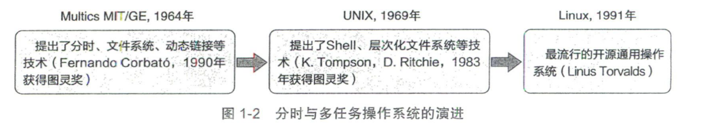
- 实时操作系统：提⾼ 及时性 和 可靠性 ；
- ⽹络操作系统和分布式计算机系统
- 个⼈计算机操作系统
  - macOS、Windows

### 1.3 硬件结构*

冯诺依曼结构
- 中央处理器（CPU）：根据程序指令对数据进⾏处理；主要负责运算和逻辑控制；
- 存储器：存放程序和数据。
- 输入输出设备

CPU的指令集架构（Instruction Set Architecture，ISA）包含了CPU的指令集、特叹级、寄存器、执行模式｀安全扩展。

指令集：
- 精简指令集（RISC）
  - AArch64体系结构（ARMv8）
- 复杂指令集（CISC）
  - x86体系结构

**CPU运⾏状态**
不同架构下CPU的特权级划分不一致

如AArch64按如下划分：
- EL0: 最低的特权级，应用程序通常运行在该特权级，也称为**用户态**。
- EL1:操作系统通常运行在该特权级，也称为**内核态**。
- EL2:在虚拟化场景下需要，虚拟机监控器(VirtualMachine Monitor，VMM，也称为 Hypervisor)通常运行在该特权级。
- EL3:和安全特性 TrustZone相关，负责普通世界(normal world)和安全世界secure world)之间的切换。

x86按如下划分：
- Ring 0: 内核态
- Ring 1-3: 用户态
- Ring 0是最高特权级，Ring 3是最低特权级。

通常只需要区分内核态和用户态即可

- 内核态（ 管态 ）
  - 可以使⽤ **特权指令** ；
  - OS的 内核程序 运⾏在管态；
  - 内核态特权指令对应的实体为 内核 ；
    > 系统调⽤相关位于⾼层，硬件相关位于底层；
    > 内核是计算机上配置的 底层软件 ，是计算机功能的延伸；
  - 系统调⽤相关；
    > 引发⼴义中断⾥⾯的系统异常（⽤户执⾏陷⼊指令⽽触发的操作系统的系统调⽤引起的中断）；
    - 进程管理
    - 存储器管理
    - 设备管理
  - 硬件模块相关；
    - 时钟管理
    - 中断机制
      - 只有⼀⼩部分在内核（保护和恢复中断现场的信息，转移控制权到相关的处理程序）；
    - 原语
    - 设备驱动
    - CPU切换
    - 进程通信
    - …
- ⽤户态（ 目态 ）
  - **不可以使⽤特权指令**；
  - ⽤户的⾃编程序（ 应用程序 ）运⾏在⽬态；

用户态切换到内核态的三种方式
- 系统调用(Trap)
- 中断(Interrupt)
- 异常(Exception)

中断和异常
异常（硬件故障：访管指令）> 中断（外部中断，程序性中断）>系统异常（重启）

- 异常（不可屏蔽,缺⻚中断为内中断）
  - ⾃愿中断（系统异常）
    - 时钟中断
    - 特权指令
    - 切换核⼼态
  - 强迫中断（狭义异常）
    - **CPU内部** 硬件故障
    - 软中断
- 中断（分为可屏蔽中断和不可屏蔽中断）
  - 硬中断（外设导致的中断）
  - 与程序运⾏⽆关的中断（⼈的⼲预）

系统调⽤: ⽤户在程序中调⽤操作系统所提供的⼀些⼦功能；
1. 需先执⾏ **陷入指令Trap** （⾮特权指令）切换为内核态。此时发生了
2. 再处理OS的系统调⽤，
3. 处理完成后,执⾏ 返回指令 （特权指令，⼀般为中断返回指令），切换为⽤户态；

### 1.4 体系结构

⼤内核（单内核）：将OS的主要功能模块作为⼀个紧密整体运⾏在核⼼态；

微内核
- 保留基本功能，其它服务移动到⽤户态；
- 有效分离了内核与服务、服务与服务；

## ⼆、进程管理

### 2.1 进程与线程*
#### 2.1.1 进程的概念和特征

1）概念
- 进程实体：程序段、数据段、进程控制块 PCB 组成  ；
  - PCB是进程存在的唯⼀标志；
- **进程**是**进程实体**的运⾏过程，是系统进⾏ **资源分配** 的独⽴单位；
- 进程是 动态 的，进程实体是 静态 的；
- 引⼊进程是为了**描述程序的动态执⾏过程**，更好的⽀持和管理多道程序的并发执⾏（进程的异步性与进程同步机制）；

PCB包含：
- 进程描述信息（PID，UID）
- 进程控制和管理信息
- 资源分配清单
- 处理机相关信息

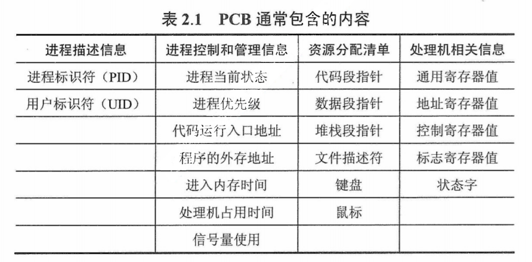

> c语⾔程序对内存分为正⽂段（代码和常量）、数据堆段（动态分配到存储区）、数据栈段（临时变量）；

对于有线程系统：
- 进程是**资源分配**的独立单位
- 线程是**资源调度**的独立单位
对于无线程系统：
- 进程是资源调度、分配的独立单位

2）特点
动态性：具有⽣命周期，是动态变化的（进程最基本的特征）；
并发性: 多个进程并发执⾏.
独⽴性: 进程是系统资源分配的基本单位，是独⽴的实体；
异步性：进程以不可知速度推进，需要配置相应的 进程同步 机制；
结构性: 每个进程都配置一个PCB进行描述。

#### 2.1.2 进程的状态和转换

五种状态
- 创建态：正在被创建，尚未到就绪状态。
- 运⾏态：进程正在处理器上运行(单核 CPU 下任意时刻只有一个进程处于运行状态)。
- 就绪态：即进程获得了除了处理器之外的一切所需资源，一旦得到处理器资源(处理器分配的时间片)即可运行。
- 阻塞态（等待态）：正在等待某一事件而暂停运行如**等待某资源为可用或等待 IO 操作**完成。（即使处理器空闲，该进程也不能运行）
- 结束态：进程正常结束或其他原因中断退出运行。

状态转换

- ⼀个进程从运⾏态变成阻塞态是 主动 的⾏为
- 从阻塞态变成就绪态是 被动 的⾏为，需要其他相关进程的协助。

#### 2.1.3 进程控制-

进程控制通过 原语 操作，在核⼼态运⾏；

进程创建（ 创建原语 ）
1. 申请空⽩的PCB，申请失败（PCB有限）则创建失败；
2. 为进程分配资源，申请失败进⼊等待态；
3. 初始化PCB；
4. 等待被调度；

进程终⽌（ 撤销原语 ）
- 由 正常结束 、 异常结束 、 外界干预 三种终⽌事件；
- 根据被终⽌进程的 标识符 ，检索PCB，读取进程状态；
- 处于执⾏状态则终⽌，归还 处理机资源 给其他进程；
- 若该进程有⼦进程，则终⽌⼦进程；
- 由进程创建的进程为该⽗进程的⼦进程；
- 归还 其它资源 给⽗进程或OS；

进程阻塞
- 系统⾃动执⾏ 阻塞原语 （主动）；
- 找到被阻塞进程标识号对应的PCB；
- 若为运⾏态，则保护现场，将其状态转为等待态；
- 将该PCB插⼊ 等待队列 ，将处理机调度给其它就绪进程；

进程唤醒
- 由有关进程调⽤ 唤醒原语 （被动）；
- 与阻塞原语成对出现；
- 在该事件的等待队列找到相应的PCB；
- 从等待队列移除，置其状态转为就绪态；
- PCB插⼊ 就绪队列 ，等待调度；

进程切换
> 进程切换和处理机模式切换不同，模式切换时，处理机逻辑上还在执⾏同⼀进程，所以进程环境不变，只需要 恢复CPU现场 ；但进程切换时，进程改变， 进程环境改变 （处理机上下⽂改变）；
> 调度和切换：调度决定资源分配的进程，是⼀种决策⾏为；切换是实际分配⾏为，是⼀种执⾏⾏为； 先有调度再有切换 ；
- 保存处理机上下⽂（PC和其它寄存器）；
- 更新PCB信息；
- 将PCB移⼊相应队列；
- 选择另⼀进程执⾏，并更新其PCB；
- 更新内存管理的数据结构；
- 恢复处理机上下⽂；

#### 2.1.4 进程的组织-
进程控制块
> 通常采⽤ 链接方式 和 索引方式 来组织不同状态的PCB；
- PCB结构
- 程序段
  - 程序段就是能被进程调度程序调度到CPU执⾏的程序代码段。注意，程序可被多个进程共享，即,多个进程可以运⾏同⼀个程序；
- 数据段
  - ⼀个进程的数据段，可以是进程对应的程序加⼯处理的原始数据，也可以是程序执⾏时产⽣的中间或最终结果。

#### 2.1.5 进程的通信

进程通信就是进程之间的数据交换。

PV操作时低级通信方式，高级通信方式是指以较高的效率传输大量数据的通信方式。高级通信方法可分为共享存储、消息传递和管道通信三大类。

[详细](https://www.jianshu.com/p/c1015f5ffa74)

管道（PIPE）
- 无名管道：只存在于内存中的文件；命名管道：存在于实际的磁盘介质或者文件系统
- 有名管道：一种半双工的通信方式，它允许无亲缘关系进程间的通信
  - 优点：可以实现任意关系的进程间的通信
  - 缺点：
    - **名字以文件的形式**长期存于系统中，使用不当容易出错
    - 缓冲区有限
- 无名管道：一种半双工的通信方式，只能在具有亲缘关系的进程间使用（父子进程/兄弟进程）
  - 优点：简单方便
  - 缺点：
    - 局限于**单向通信**
    - 只能创建在它的进程以及其有亲缘关系的进程之间
    - 缓冲区有限

信号量（Semaphore）：一个计数器，可以用来控制多个线程对共享资源的访问，信号量的意图在于进程间同步。
- 优点：可以同步进程
- 缺点：信号量有限

信号（Signal）：一种比较复杂的通信方式，用于通知接收进程某个事件已经发生  . 如SIGKILL：用户终止进程执行信号。shell下执行kill -9发送该信号。

消息队列（Message Queue）：是消息的链表，存放在内核中并由消息队列标识符标识。
- 与管道不同
  - 消息队列**存放在内核中**，只有在内核重启(即，操作系统重启)或者显示地删除一个消息队列时，该消息队列才会被真正的删除。
  - 消息队列在某个进程往一个队列写入消息之前，并不需要另外某个进程在该队列上等待消息的到达。
- 优点：可以实现任意进程间的通信，并通过系统调用函数来实现消息发送和接收之间的同步，无需考虑同步问题，方便
- 缺点：信息的复制需要额外消耗 CPU 的时间，不适宜于信息量大或操作频繁的场合

共享内存（Shared Memory）：映射一段能被其他进程所访问的内存，这段共享内存由一个进程创建，但多个进程都可以访问
- 优点：无须复制，快捷，信息量大
- 缺点：
  - 通信是通过将共享空间缓冲区直接附加到进程的虚拟地址空间中来实现的，因此进程间的读写操作的同步问题
  - 利用内存缓冲区直接交换信息，内存的实体存在于计算机中，只能同一个计算机系统中的诸多进程共享，不方便网络通信

套接字（Socket）：可用于**不同计算机间**的进程通信

- 优点：
  - 传输数据为字节级，传输数据可自定义，数据量小效率高传输数据时间短，性能高
  - 适合于客户端和服务器端之间信息实时交互
  - 可以加密,数据安全性强
- 缺点：需对传输的数据进行解析，转化成应用级的数据。

#### 2.1.6 线程的概念和多线程模型

1）线程和进程⽐较

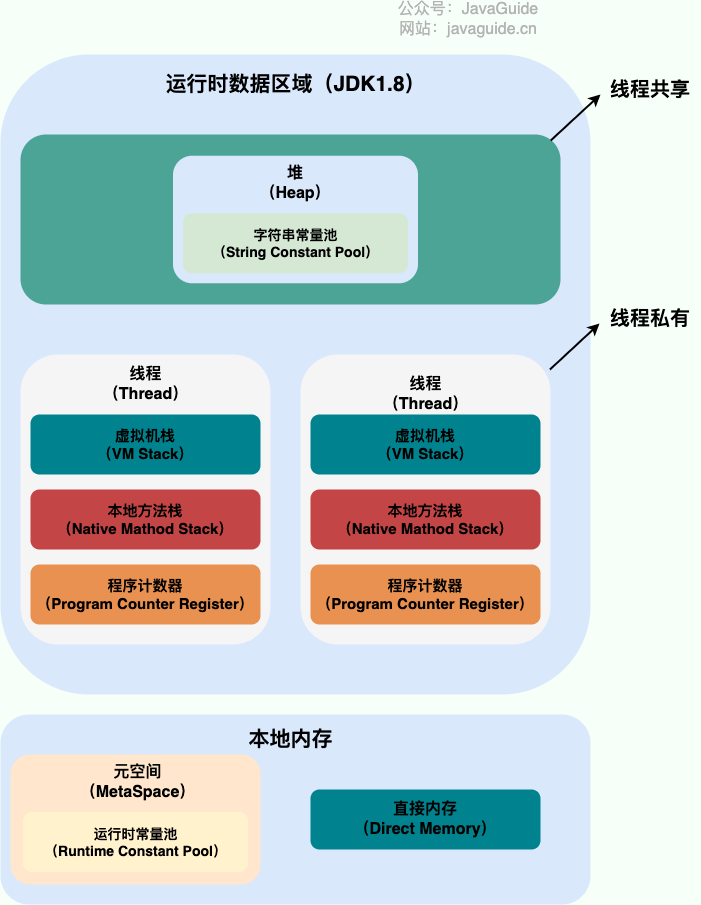

一个进程中可以有多个线程，多个线程共享进程的堆和方法区 (JDK1.8 之后的元空间)资源，但是每个线程有自己的程序计数器、虚拟机栈 和 本地方法栈。

调度：线程是 处理机独立调度 的基本单位，进程是 资源分配 （除CPU外）的基本单位；

资源：线程不拥有系统资源（有⼀点），但可以访问所属进程的资源；

并发：线程也可以并发执⾏；

通信：线程可以直接读写进程数据段（全局变量）来通信，进程需要使⽤同步互斥⼿段；

系统开销：线程不拥有资源，因此切换的开销⼩；

**线程的通信**
线程间的通信目的**主要是用于线程同步**，所以线程没有像进程通信中的用于数据交换的通信机制

- 锁机制：包括互斥锁/量（mutex）、读写锁（reader-writer lock）、自旋锁（spin lock）、条件变量（condition）
  - 互斥锁/量（mutex）：提供了以排他方式防止数据结构被并发修改的方法。
  - 读写锁（reader-writer lock）：允许多个线程同时读共享数据，而对写操作是互斥的。
  - 自旋锁（spin lock）与互斥锁类似，都是为了保护共享资源。互斥锁是当资源被占用，申请者进入睡眠状态；而自旋锁则循环检测保持者是否已经释放锁。
  - 条件变量（condition）：可以以原子的方式阻塞进程，直到某个特定条件为真为止。对条件的测试是在互斥锁的保护下进行的。条件变量始终与互斥锁一起使用。
- 信号量机制(Semaphore)
  - 无名线程信号量
  - 命名线程信号量
- 信号机制(Signal)：类似进程间的信号处理
- 屏障（barrier）：屏障允许每个线程等待，直到所有的合作线程都达到某一点，然后从该点继续执行。

2）线程的实现
用户级线程和内核级线程

⽤户级线程 ULT ；
- 管理由应⽤程序通过 线程库 （最简单可以由的if语句构建）来完成，操作系统意识不到线程，在 用户态 下就可以完成；
- 内核调度的还是进程，因此并发度低（⽆法利⽤多核处理机）；
- ⼀个线程阻塞，进程就⽆法继续执⾏；

内核级线程 KLT ；
- 管理由OS完成，需要切换为 内核态 （切换CPU态需要开销）；
- 内核调度的是线程，并发度⾼（可以利⽤多核处理机）；
即使某⼀线程阻塞，其它线程也可以执⾏（内核线程都阻塞时才阻塞）；

多线程模型 （组合⽅式）；
多对⼀：等价于ULT；
⼀对⼀：等价于KLT；
多对多（ 内核级线程数少于用户级线程 ）：相⽐ULT提⾼了并发度；相⽐KLT节省了管理开销；

### 2.2 处理机调度*

为合理的处理计算机软硬件资源⽽进⾏调度；

#### 2.2.1 三级调度

⾼级调度（作业调度）
- 内存与辅存之间的调度。创建态的调度；
- 每个作业只调⼊⼀次；
中级调度（内存调度）
- 将暂时不能运⾏的进程**调⾄外存**等待， 挂起态的调度；
- 为提⾼内存利⽤率和系统吞吐量；
低级调度（进程调度）
- 就绪队列到 运行态的调度；

#### 2.2.2 调度和切换的时机-
进程切换在进程调度之后⽴刻发⽣；

不调度的情况
- 处理 中断 的过程中；
- 进程在OS内核程序 临界区 中；
- 原⼦操作（ 原语 ）过程中；

调度的情况
- 非剥夺调度 （⾮抢占⽅式）：调度条件发送后，等进程运⾏结束或⽆法继续运⾏时，才进⾏调度与切换；
- 剥夺调度 （抢占⽅式）：调度条件发送后，除遇到不能调度情况需等待结束后再调度外，其它情况⽴刻调度；

#### 2.2.3 调度的评价标准-
- CPU利⽤率
- 系统吞吐量：单位时间完成作业的数量；
- 周转时间：⽤户提交作业到作业完成经历的时间；包含所有调度的时间；
- 响应时间：⽤户提交作业到⾸次响应的时间；包含作业调度和⼀部分中低级调度；
- 等待时间：进程等待分配处理机的等待时间和进⼊内存却未被分配处理机的时间；

#### 2.2.4 调度算法

优先级调度适⽤于 实时系统 ；

⾼响应⽐调度、时间⽚轮转调度、多级反馈队列调度适⽤于 分时系统 ；

1）先来先服务 FCFS 调度算法；
适⽤于进程调度和作业调度；
优缺点: 简单、公平,不会产生饥饿现象，因为⼀个长作业会拖累后⾯的短作业；

2）优先级调度算法；
适⽤于进程调度和作业调度；
优缺点： 可能会产生饥饿现象,即低优先级进程长期得不到服务。静态优先级不够灵活,动态优先级可以更好地反映进程当前状态。剥夺式优先级可能会导致进程频繁切换,影响性能

优先级：
- 系统进程 > ⽤户进程
- 交互型进程 > ⾮交互型进⾏
- I/O型进程 > 计算型进程
分类：
- 静态优先级、动态优先级；
- 剥夺式优先级、⾮剥夺式优先级；

3）短作业优先 SJF 调度算法；
适⽤于进程调度和作业调度；
SJF调度 的平均等待时间、平均周转时间最少；
优缺点: 提高系统的整体吞吐量，导致⻓作业饥饿；

4）⾼响应比调度算法；
主要⽤于作业调度；
响应⽐⾼的先调度（取决于 已等待时间 与 需要服务时间 ）；
已等待时间越⻓响应⽐越⾼；
需要服务时间越⼩响应⽐越⾼；
优缺点：需要估计作业的服务时间,实现复杂度较高

5）时间⽚轮转调度算法；
⽤于进程调度；
优先级：需要设置合理的时间片长度,过长会降低响应时间,过短会增加进程切换开销

6）多级反馈队列调度算法；
⽤于进程调度；
设置多个不同优先级的队列，优先级越⾼的队列对应的可执⾏时间⽚越⼩；
初始进程放⼊第⼀级队列队尾，按FCFS排队，在第⼀级未执⾏完后放⼊第⼆级；
知道前⼀级队列为空时，才执⾏下⼀级队列；

Linux中的CFS Completely Fair Scheduler 完全公平调度器
为每个任务安排一个虚拟运行时间 vruntime，如果一个任务在运行，其运行的越久，该任务的 vruntime 自然就会越大，而没有被运行的任务，vruntime 是不会变化的。

那么，在 CFS 算法调度的时候，会优先选择 vruntime 少的任务，以保证每个任务的公平性。

CFS使用红黑树来存储所有的进程，红黑树是一种自平衡的二叉查找树，可以保证在 O(logN) 的时间复杂度内完成查找、插入、删除等操作。

优点：公平、高效、低延迟
缺点：复杂度高、难以调试、

#### 2.2.5 僵尸进程和孤儿进程

当一个进程调用 exit()系统调用结束自己的生命时，内核会释放该进程的所有资源，包括打开的文件、占用的内存等，但是该进程对应的 **PCB 依然存在于系统中**。这些信息只有在父进程调用 wait()或 waitpid()系统调用时才会被释放，**以便让父进程得到子进程的状态信息**

僵尸进程：
- 子进程已经终止，但是其父进程仍在运行，且父进程没有调用 wait()或 waitpid()等系统调用来获取子进程的状态信息，释放子进程占用的资源，导致子进程的 PCB 依然存在于系统中，但无法被进一步使用。
- 这种情况下，子进程被称为“僵尸进程”。避免僵尸进程的产生，父进程需要及时调用 wait()或 waitpid()系统调用来回收子进程。

Linux 下可以使用 Top 命令查找，zombie 值表示僵尸进程的数量，为 0 则代表没有僵尸进程。
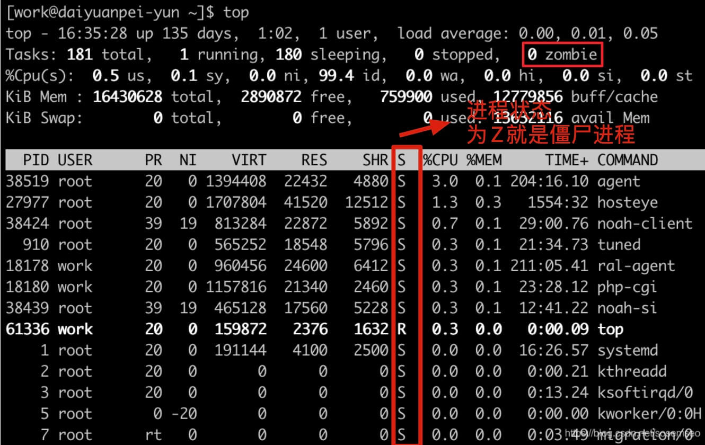

定位僵尸进程以及该僵尸进程的父进程:
`ps -A -ostat,ppid,pid,cmd |grep -e '^[Zz]'`

孤儿进程：
- 一个进程的父进程已经终止或者不存在，但是该进程仍在运行。这种情况下，该进程就是孤儿进程。
- 孤儿进程通常是由于父进程意外终止或未及时调用 wait()或 waitpid()等系统调用来回收子进程导致的。
- 为了避免孤儿进程占用系统资源，操作系统会**将孤儿进程的父进程设置为 init 进程（进程号为 1）**，由 init 进程来回收孤儿进程的资源。

### 2.3 进程同步*

为了协调进程之间的相互制约关系；

#### 2.3.1 基本概念-
临界资源: ⼀次仅允许⼀个进程使⽤；
临界区 （临界段）: 进程中访问临界资源的代码

同步 （直接制约关系）：为完成某个任务，针对多个进程的⼯作次序⽽产⽣的制约；

互斥 （间接制约关系）：当⼀个进程访问临界资源时，另⼀个进程必须等待；
- 空闲让进：临界区空闲，则可以使⼀个进程进⼊；
- 忙则等待：已有进程进⼊临界区则等待；
- 有限等待：等待时间为有限时间；
- 让权等待：等待时让出处理器（防⽌ 忙等待 ）；

#### 2.3.2 互斥实现⽅法-

1）软件⽅法
- 单标志法
- 双标志法先检查
- 双标志法后检查
- Peterson's Algorithm
- 创建管程

2）硬件⽅法
- 中断屏蔽⽅法
- 硬件指令⽅法
- 指令由硬件逻辑直接实现；
- 指令均为原⼦操作；
- TestAndSet指令
- Swap指令
- PV指令

#### 2.3.3 同步实现⽅法
1）信号量
- 整型信号量
  - P操作不遵从 让权等待 ，进程⼀直占⽤处理器查询是否可以进⼊临界区；
- 记录型信号量
  - P操作：信号量减⼀，信号量 小于 0时，⾃动阻塞进程；
  - V操作：信号量加⼀，信号量 小于等于 0时，唤醒⼀个等待进程；
- 信号量实现互斥
  - 信号 初值为1 ，在临界区前加上P操作，后加上V操作；
- 信号量实现同步
  - 信号量 初值为0 ，在前⼀进程后加上V操作，后⼀进程前加上P操作；
  - 每有⼀个前后关系设置⼀个信号量；

2）管程
- 管程把对共享资源的操作封装起来；
- 只能通过管程的操作访问共享资源；
- 每次只允许⼀个进程进⼊管程；
- 管程的 条件变量 为没有值的信号量，仅实现 等待排队 功能；

#### 2.3.4 经典同步问题

同步问题:
- ⽣产者-消费者问题
- 吸烟者问题：相当于⽣产者⽣成多种产品的⽣产者-消费者问题；

互斥问题:
- 读者-写者问题：设置计数器；
- 哲学家进餐问题：使⽤信号量数组；

### 2.4 死锁*

#### 2.4.1 死锁的必要条件

互斥条件 ：某资源⼀段时间内只允许⼀个进程进⾏访问；
不可剥夺条件 ：进程所获得的资源只能由进程⾃⼰释放；
请求并保持 ：已占有资源，并继续请求其他资源；
循环等待条件 ：存在⼀种进程资源的循环等待链；

产生原因:
- 系统资源不⾜；
- 资源分配不当；
- 进程推进顺序不当；

#### 2.4.2 死锁的处理策略

1） 死锁预防 ；

破坏死锁的必要条件；
  - 破环互斥条件：某些场合（打印机）应保持互斥性；
  - 破坏⾮剥夺条件：请求新资源得不到满⾜时， 释放已申请 的所有资源重新申请；(仅适用于 主存资源 和 处理器资源 的分配),会导致资源利用率下降
  - 破环请求并保持条件：使⽤ **静态分配 （运⾏前⼀次申请完毕）**；
  - 破坏循环等待条件：采⽤ **顺序资源分配 （按资源编号申请资源）**；

2） 死锁避免 ；

资源动态分配过程中，防⽌系统进⼊不安全状态；

每次分配都预先验证是否会使系统保持 安全状态 ；
并⾮所有不安全状态都是死锁状态；

银⾏家算法：
- 进程后续申请资源数和已占⽤资源数之和 与 最⼤需求量⽐较，超过则拒绝分配；
- 系统将现存资源数量 与 进程请求量进⾏⽐较，如果超过则拒绝分配；
- 执⾏安全性算法，检测此次分配后是否满⾜安全状态，满⾜则正式分配；

3） 死锁的检测和解除 ；

系统采取措施检测死锁并解除；

死锁检测： 死锁条件 是 **资源分配图 不可完全简化**；
- 既 不独立也不阻塞 （有有向边连接且申请资源数⼩于系统资源数）的进程点即可释放所有资源；
  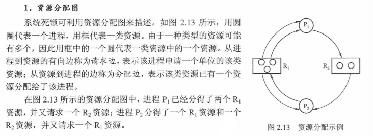

死锁解除：
- 撤销进程法：撤销进程；
- 进程回退法：回退进程；

- 立即结束所有进程的执行，重新启动操作系统：这种方法简单，但以前所在的工作全部作废，损失很大。
- 撤销涉及死锁的所有进程，解除死锁后继续运行：这种方法能彻底打破死锁的循环等待条件，但将付出很大代价，例如有些进程可能已经计算了很长时间，由于被撤销而使产生的部分结果也被消除了，再重新执行时还要再次进行计算。
- 逐个撤销涉及死锁的进程，回收其资源直至死锁解除。抢占资源：从涉及死锁的一个或几个进程中
- 抢占资源，把夺得的资源再分配给涉及死锁的进程直至死锁解除。

### 2.5 作业、程序、进程的关系-
⼀份作业包含多段程序；

进程是程序的动态运⾏过程；
> ⼀个程序可以形成⼏个进程，⼀个进程也可以执⾏多个程序（程序有⼤有⼩）；

每个作业动态转换为⼀个进程族；
- 批处理系统 ，每个作业有⼀个 根进程 ，该进程执⾏作业控制命令解释程序，解释改作业说明书，根进程在运⾏过程中可以动态的创建多个⼦进程；
- 分时系统 的作业为⽤户的⼀次 上机交互过程 ，根进程为 终端进程 ，执⾏命令解释程序；
- 交互提交批作业 的操作系统中，可以交互式的提交批作业，动态转化为⼀个进程族；

## 三、内存管理

### 3.1 内存管理概念

#### 3.1.1 内存管理功能*

- 内存空间的分配和回收: 对进程所需的内存进行分配和释放，malloc 函数：申请内存，free 函数：释放内存。
- 地址转换: 将程序中的虚拟地址转换成内存中的物理地址。
- 空间扩充: 当系统没有足够的内存时，利用**虚拟内存技术或自动覆盖技术**，从逻辑上扩充内存。
- 内存保护: 保证进程之间使用内存互不干扰，避免一些恶意程序通过修改内存来破坏系统的安全性。

#### 3.1.2 程序执⾏步骤

1）编译：由编译程序将源代码编译成各**⽬标模块的机器语⾔代码**；
2）链接：由链接程序按 各模块代码 与 库函数 的相对地址链接成从0开始编制的 **统一逻辑地址空间** ，形成 装入模块 ；
- 静态链接：装⼊之前就链接；
- 装⼊时动态链接：装⼊时链接；
- 运⾏时动态链接：程序执⾏时需要⽤到⽬标模块再链接；
3）装⼊：由装⼊程序将装⼊模块 分配地址 装⼊内存；
- 绝对装⼊：由 程序员 直接赋予或由 编译程序 给出 绝对/物理地址 ；
- 静态重定位： 装入前 为从0开始的 逻辑地址 ，装⼊后重定位为 绝对/物理地址 ；
- 动态重定位： 运行时 将逻辑地址转为绝对/物理地址（需 重定位寄存器/基址寄存器 ）；

#### 3.1.3 逻辑地址和物理地址

每个⽬标模块都**从0开始编制，为其相对地址（逻辑地址）**，
链接程序将 各模块和库函数 链接为同⼀的从0编制的逻辑地址空间，对程序员不透明；

物理地址为内存的实际地址，对程序员时 透明 的；

### 3.2 地址分配和回收*

内部内存碎片(Internal Memory Fragmentation，简称为内存碎片)：已经**分配给进程使用但未被使用的内存**。

外部内存碎片(External Memory Fragmentation，简称为外部碎片)：由于未分配的连续内存区域太小，以至于**不能满足任意进程所需要的内存分配请求**，这些小片段且不连续的内存空间被称为外部碎片。

#### 3.2.1 连续分配 管理⽅式

1）单⼀连续分配
仅分为低位的 系统区 和⾼位的 用户区 ；
内存只有⼀道程序， 无需系统保护 ；

2）固定分区分配
每个分区装⼊⼀道作业；
- 分为 分区⼤⼩相等、分区⼤⼩不等 两种划分⽅式；
- 使⽤ 覆盖技术 扩⼤分区可容纳的程序⼤⼩；
- ⽆外部碎⽚，易产⽣ 内部碎片 ；

3）动态分区分配（可变分区分配）
- 根据装⼊进程的⼤⼩ 动态的 建⽴分区；
- 易产⽣ 外部碎片 ，可采⽤ 紧凑技术 解决，需要动态重定位寄存器（ 基址寄存器 ）的⽀持；
- 分区 分配策略 ：
  - ⾸次适应算法
    - ⽐其它三种都好；
  - 最佳适应算法
    - ⽐最⼤适应好；
    - 最容易产⽣内部碎⽚；
  - 最坏/⼤适应算法
  - 临近适应算法（循环⾸次适应算法）

块式管理 是早期计算机操作系统的一种连续内存管理方式，存在严重的内存碎片问题。

在 Linux 系统中，连续内存管理采用了 伙伴系统（Buddy System）算法.一种经典的连续内存分配算法，可以有效解决外部内存碎片的问题。伙伴系统的主要思想是将内存按 2 的幂次划分（每一块内存大小都是 2 的幂次比如 2^6=64 KB），并将相邻的内存块组合成一对伙伴（注意：必须是相邻的才是伙伴）。

- 当进行内存分配时，伙伴系统会尝试找到大小最合适的内存块。如果找到的内存块过大，就将其一分为二，分成两个大小相等的伙伴块。如果还是大的话，就继续切分，直到到达合适的大小为止。
- 假设两块相邻的内存块都被释放，系统会将这两个内存块合并，进而形成一个更大的内存块，以便后续的内存分配。这样就可以减少内存碎片的问题，提高内存利用率。

对于内部内碎片问题, Linux采用SLAB解决.

#### 3.2.2 非连续分配 管理⽅式

##### 1 基本 页式 存储管理
分⻚是 **系统行为** ，对程序员是 透明的 ；

A）基本概念

⻚⾯
- 将进程的块称为 页/页面 ，内存中块称为 页框/页架 ，两者 一一对应 ；
- ⻚⾯⼤⼩是2的整数次幂；
- 每个进程有多个逻辑模块，⻚式存储每个⻚表对应进程的⼀个逻辑模块，因此 **页表内所有页为统一的逻辑地址空间** ；

⻚表和⻚表项

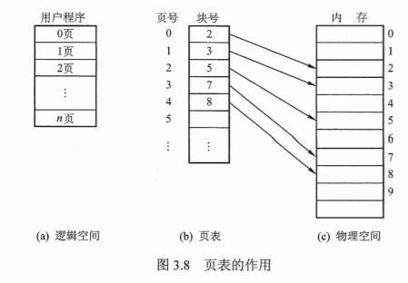

- ⻚表记录了对应进程每个⻚⾯在内存中所对应的 物理页号 ；
- ⻚表由⻚表项构成；
- ⻚表项分为 页号 （ 隐含 ，**因为定⻓且顺序存储**）和 块号 ；

⻚式逻辑地址
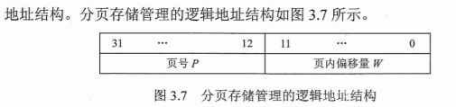
- ⾼位为 页号 ，低位为 页内偏移量 ；
- ⻚内偏移量的位数决定了 页面大小 ；
- ⻚式管理中地址空间是 **一维** 的（只要知道逻辑地址,根据页面大小可以确定页号和偏移量）；

B）⻚式地址转换

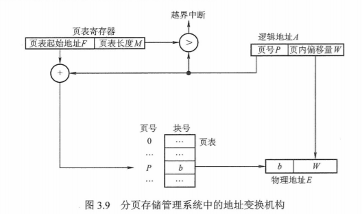

- 根据进程号找到 页表基址寄存器PTR 内的⻚表基址；
- 计算 页号和偏移量 ：⽤逻辑地址⼤⼩除以⻚⾯⼤⼩，整数部分为⻚号，余数部分为⻚内偏移量；
- 当⻚号⼤于⻚表⻓度（表项个数）时，产⽣ 越界中断 ；
- 取出⻚表内对应的物理⻚号，与偏移量组成物理地址；

C）快表（ **相联存储器TLB** ）
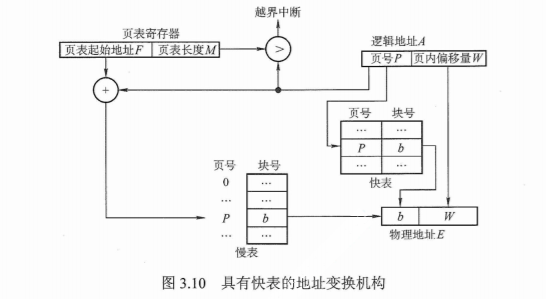

- 将常⽤的⻚表项存储到⾼速存储器；
- CPU给出逻辑地址后同时查找快表和内存⻚表（或先查快表再查⻚表）；
- 快表的有效性取决于 **局部性原理** （空间局部性、时间局部性）
  - 空间局部性：活跃部分集中在临近空间；
  - 时间局部性：某部分在单位时间内多次使⽤；

D）两级⻚表
地址转换过程和段⻚式存储相似；
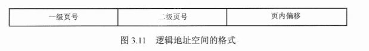
- 由于进程⻚表过⼤占⽤多个⻚⾯，且不需要所有保存⻚表项的⻚⾯都调⼊内存，因此采⽤⼆级⻚表；

- ⼀级⻚表（⻚⽬录表/顶级⻚表）负责 ⼆级⻚表逻辑地址和物理地址的映射关系；
- 最底层⻚表负责 进程逻辑地址到物理地址的映射关系；

##### 2 基本 段式 存储管理
分段是 **按用户进程** 的⾃然段划分的逻辑空间；

A）基本概念

分段是 按用户进程 的⾃然段划分的逻辑空间；
分段的⻓度 不固定 ；
每个进程对应⼀个段表，每个逻辑模块对应⼀个段表项，因此 **段内逻辑地址连续，段间不连续**；

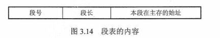

段式逻辑地址：段式逻辑地址空间是 二维 的，**因为段⻓不固定**，因此需要段号和偏移量才能知道物理地址；

B）段式地址转换
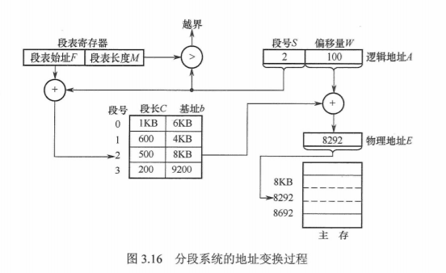
- 根据进程号找到 段表基址寄存器 的基址；
- 段号⼤于段表⻓则产⽣ 越界中断 ；
- 根据段号找到段表项，如果取出的段⻓⼩于段内偏移量产⽣ 越界中断 ；
- 最后取出物理段号，和偏移量组合成物理地址；

C）段的共享和保护
- 段共享通过将两个作业的段表中相应表项指向同⼀个物理地址来实现；
- 段保护为 存取控制保护 和 地址越界保护;
  - 存取控制保护设置共享段的存取权限，地址越界保护和⻚保护相似（多了⼀个偏移量越界中断）；
- 只有 纯代码/可重入代码 （不能修改的代码，因此 不属于临界资源 ）才可以共享；

##### 3 基本 段页式 管理⽅式

A）基本概念
段⻚式逻辑地址结构
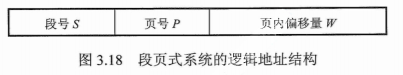

段表和⻚表，⻚表和⻚式存储相同，段表与段式存储相⽐段始址换位 页表基址 ；

每个进程有**⼀个段表，多个⻚表**；

B）段⻚式地址转换
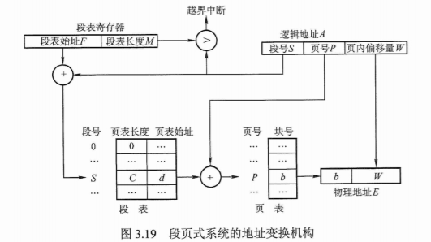
分别检测 段表越界 和 页表越界 （相当于段式存储中断偏移量越界）；

### 3.3 地址转换和内存保护

#### 3.3.1 地址转换（ 装入 ）

连续分配管理
- 单⼀连续分配：绝对装⼊、静态重定位、动态重定位；
- 固定分区分配：绝对装⼊、静态重定位、动态重定位；
- 可变分区分配：绝对装⼊、静态重定位、动态重定位；

⾮连续分配管理：动态重定位；

#### 3.3.2 地址保护

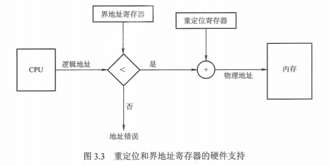

### 3.4 内存空间扩充*

#### 3.4.1 覆盖 和 交换

覆盖⽤于同⼀进程，⽽交换⽤于多个不同进程；

1）覆盖
- 不需要装⼊进程的全部信息；⽤于单⼀分配和固定分区；
- 把⽤户空间分为⼀个**固定区和若⼲覆盖区**；
- 固定区存放进程中活跃的部分；
- 覆盖区存放即将要访问的段(将不活跃的部分划分为永**远不会同时运⾏的段**)；

2）交换
- 就是 进程挂起 ；
- 进程完全空闲时，将进程交换到辅存内独⽴于⽂件系统的 对换区 （采⽤连续分配⽅式因此读写速度更快）；

#### 3.4.2 虚拟内存 技术（以 请求页式存储管理 为例）

虚拟内存(Virtual Memory) 是计算机系统内存管理非常重要的一个技术，本质上来说它**只是逻辑存在的，是一个假想出来的内存空间，主要作用是作为进程访问主存（物理内存）的桥梁并简化内存管理**。

虚拟内存的作用:
- 隔离进程：物理内存通过虚拟地址空间访问，虚拟地址空间与进程一一对应。进程之间彼此隔离，一个进程中的代码无法更改正在由另一进程或操作系统使用的物理内存。
- 提升物理内存利用率：有了虚拟地址空间后，操作系统只需要将进程当前正在使用的部分数据或指令加载入物理内存。
- 简化内存管理：进程都有一个一致且私有的虚拟地址空间，程序员不用和真正的物理内存打交道，而是借助虚拟地址空间访问物理内存，从而简化了内存管理。
- 多个进程共享物理内存：进程在运行过程中，会加载许多操作系统的动态库。这些库对于每个进程而言都是公用的，它们在内存中实际只会加载一份，这部分称为共享内存。
- 提高内存使用安全性：控制进程对物理内存的访问，隔离不同进程的访问权限，提高系统的安全性。
- 提供更大的可使用内存空间：可以让程序拥有超过系统物理内存大小的可用内存空间。这是因为当物理内存不够用时，可以利用磁盘充当，将物理内存页（通常大小为 4 KB）保存到磁盘文件（会影响读写速度），数据或代码页会根据需要在物理内存与磁盘之间移动。
 

没有虚拟内存有什么问题？
- 系统不安全: 用户程序可以访问任意物理内存，可能会不小心操作到系统运行必需的内存，进而造成操作系统崩溃，严重影响系统的安全。
- 进程不稳定: 同时运行多个程序容易崩溃。比如你想同时运行一个微信和一个 QQ 音乐，微信在运行的时候给内存地址 1xxx 赋值后，QQ 音乐也同样给内存地址 1xxx 赋值，那么 QQ 音乐对内存的赋值就会覆盖微信之前所赋的值，这就可能会造成微信这个程序会崩溃。
- 浪费内存: 程序运行过程中使用的所有数据或指令都要载入物理内存，根据局部性原理，其中很大一部分可能都不会用到，白白占用了宝贵的物理内存资源。

1）请求⻚式存储管理
2）请求段式存储管理
3）请求段⻚式存储管理

A）⻚表项
- 状态位/有效位：是否调⼊内存；
- 访问字段/置换位：⼀段时间内被访问次数，配合⻚⾯置换算法使
- 修改位/脏位：是否被修改
- 外存地址：该⻚在外存的地址；

B）缺⻚中断
- 缺⻚中断为 内中断 ；

C）⻚⾯置换策略/算法
- 最佳置换 OPT 算法
  - 无法实现, 用于评价其他算法
- 先进先出 FIFO 置换算法
  - 会产⽣belady异常, 分配的页面数增多，但缺页率反而提高
- 最近不经常使⽤ LRU 算法
- 时钟置换 CLOCK 算法（最近未使⽤ NRU 算法）
  - 因LRU实现困难，开销⼤⽽设计；增加访问位和修改位；
  - 最近未被访问，也未被修改(u=0, m= 0)；
  - 最近未被访问，但被修改(u=0,m=1)；
  - 最近被访问，但未被修改(u= 1,m=0)；
  - 最近被访问，被修改(u=1,m= 1)；

D）⻚⾯分配
反复的调⼊调出叫 抖动/颠簸 ；
驻留集: 是内存为进程分配的空间⼤⼩；
工作集: 为某段时间间隔内（⼯作集窗⼝），进程访问的⻚⾯集合（ 驻留集需要大于工作集 ）；

分配策略/算法
- 固定分配
  - 驻留集⼤⼩不变；
  - 固定分配局部置换：驻留集⼤⼩不变，且只在分配的驻留集内进程⻚⾯置换；
- 可变分配
  - 驻留集⼤⼩可变；
  - 可变分配全局置换：驻留集⼤⼩可变，且将欲调⼊的⻚置换到OS的空闲块队列；
  - 可变分配局部置换：驻留集⼤⼩可变，将欲调⼊的⻚置换到驻留集，根据缺⻚率动态调整驻留集⼤⼩；

⻚⾯调⼊时机
- 预调页 策略/算法：运⾏前预测需要调⼊的⻚⾯，⼀次调⼊内存；
- 请求调页 策略/算法：运⾏时根据请求来逐⻚的调⼊内存；
调⼊调出的位置
- 当系统拥有⾜够对换区空间时，调⼊调出都使⽤对换区；
- 当系统没有⾜够对换区空间时，从⽂件区调⼊，从对换区调出修改过的内容（未修改的不⽤调出，直接下次再从⽂件区调⼊）；
- UNIX方式 ：从⽂件区调⼊，从对换区调出（只要是从内存调出都放⼊对换区）；

## 四、⽂件管理

### 4.1 ⽂件系统基础*
Windows：FCB 表 + FAT + 位图
Unix：inode + 混合索引 + 成组链接

文件系统主要负责管理和组织计算机存储设备上的文件和目录，其功能包括以下几个方面：
- 存储管理：将文件数据存储到物理存储介质中，并且管理空间分配，以确保每个文件都有足够的空间存储，并避免文件之间发生冲突。
- 文件管理：文件的创建、删除、移动、重命名、压缩、加密、共享等等。
- 目录管理：目录的创建、删除、移动、重命名等等。
- 文件访问控制：管理不同用户或进程对文件的访问权限，以确保用户只能访问其被授权访问的文件，以保证文件的安全性和保密性

#### 4.1.1 ⽬录结构

1）⽂件控制块和索引结点

A）⽂件控制块 FCB
- 为实现 按名存取 ⽽设计，FCB的有序集合位⽬录，⼀个FCB为⼀个⽂件⽬录项；
- 基本信息 （⽂件名、物理位置、逻辑结构、物理结构等）、 存取控制信息（存取权限等）、 使用信息 （建⽴时间、修改时间等）；

B） 索引结点
- 将FCB的⽂件名和⽂件描述信息分离（使得磁盘块可以存储更多的FCB）；
- 索引结点为 文件描述信息 ，FCB只包含⽂件名和索引结点指针；

2）⽬录结构

- 单级⽬录结构：整个系统就⼀个⽬录；
- 两级⽬录结构：每个⽤户有⼀个⽬录；
- 多级⽬录结构（树形⽬录结构）：有多级⽬录，出现 绝对路径 和 相对路径 ；
- ⽆环图⽬录结构：多个⽗结点指向同⼀个结点（实现 文件共享 ）；
  - 某个⽗结点删除共享结点后不⼀定删除，需要所有指向共享结点的结点都断开才删除；

#### 4.1.2 ⽂件共享与保护*

1）⽂件共享
- 基于索引结点共享（ 硬链接 ）：直接使**⽬录项指向该⽂件的索引结点**；
  - 只有删除了源文件和所有对应的硬链接文件，该文件才会被真正删除 
  - `ln` 命令用于创建硬链接。
  - 限制
    - 不能对目录以及不存在的文件创建硬链接
    - 硬链接不能跨越文件系统。
- 基于符号链共享（ 软链接 ）：建⽴ **LINK文件** 保存共享⽂件的绝对路径；
  - 使⽤时根据绝对路径⼀级⼀级查找；
  - `ln -s` 命令用于创建软链接

2）⽂件保护

A）访问控制：每个⽂件增加⼀个 访问控制列表ACL ，规定不同⽤户/⽤户组的访问权限；

B）其它
⼝令：输⼊FCB上的⼝令来访问⽂件；
密码：保存的⽂件是加密过的不能正常读写，需要输⼊密码修改为正常⽂件

#### 4.1.3 ⽂件的逻辑结构
1）⽆结构⽂件（流式⽂件）
2）有结构⽂件（记录式⽂件）
- 为实现 顺序查找 、 索引查找 、 索引顺序查找 、 哈希查找 ⽽设计；

A）顺序⽂件: 顺序存储
- 定⻓顺序存储：可实现 随机存取 ；
  - 定⻓串结构
    - 记录⻓度相等，记录之间顺序与关键字⽆关（由时间决定）；
  - 定⻓顺序结构：可实现 随机存取 与 快速检索 ；
    - 记录⻓度相等，记录之间按关键字排列；
- 变⻓顺序存储
  - 变⻓串结构
  - 变⻓顺序结构

B）索引⽂件：建⽴的索引表可以实现 随机存取 ；

C）索引顺序⽂件：顺序⽂件分组，建⽴索引表，索引表每个表项指向其中⼀组；

D）直接⽂件（散列⽂件）：根据散列函数存取；

### 4.2 ⽂件系统实现

⽂件区和⽬录区是分开的；

#### 4.2.1 ⽬录实现

线性表: 顺序和链式均可；
哈希表

#### 4.2.2 ⽂件的物理结构
1）⽂件分配⽅式（⾮空闲磁盘块的管理）
- A）连续分配
- B）链接分配
  - 显式链接：建⽴⽂件分配表 FAT ，使每个物理块号有指定的下⼀块指针；⽂件分配表FAT可以 随机访问 ；
  - 隐式链接：直接在块上⾯存放指针；
C）索引分配：每个⽂件建⽴ 索引表 ，使得⽂件的每个逻辑块号都有对应的物理块号；
- 和⻚表相似；
- 链接⽅案：为解决索引表⼤于磁盘块的问题，使⽤指针将多个索引块链接；
- 多层索引：类⽐内存管理的多级⻚表；
- 混合索引：建⽴包含直接地址、间接索引表地址的 **顶级索引表** ；

2）⽂件存储空间管理（空闲磁盘块的管理）

A）空闲表法

B）空闲链表法
- 空闲 盘块 链
- 空闲 盘区 链：有下⼀盘区的指针与本盘区的⼤⼩；
C）位示图法
D）成组链表 法
- 适⽤于⼤型⽂件系统；
- 把空闲块依次填⼊其余空闲块的地址，从第⼀个块开始读取地址分配空间；
- 第⼀个填⼊地址的空闲块叫做 超级块 ，需要预先读⼊主存；

#### 4.2.3 ⽂件系统的层次结构
1）⽤户调⽤接⼝
2）⽂件⽬录系统: 管理⽂件⽬录；
3）存取控制验证模块: 通过⽂件⽬录的FCB实现 文件保护 ；
4）逻辑⽂件系统与⽂件信息缓冲区: 根据⽂件的逻辑结构将⽤户的要读写的逻辑记录转换成⽂件逻辑结构内的相应块号；
5）物理⽂件系统: 将逻辑记录所在的相应块号转换为实际的物理地址；
6）辅助分配模块: 管理辅存空间；
7）设备管理程序模块: 硬件相关 ；

#### 4.2.4 提高文件系统性能的方式有哪些？*

- 优化硬件：使用高速硬件设备（如 SSD、NVMe）替代传统的机械硬盘，使用 RAID（Redundant Array of Inexpensive Disks）等技术提高磁盘性能。
- 选择合适的文件系统选型：不同的文件系统具有不同的特性，对于不同的应用场景选择合适的文件系统可以提高系统性能。
- 运用缓存：访问磁盘的效率比较低，可以运用缓存来减少磁盘的访问次数。不过，需要注意缓存命中率，缓存命中率过低的话，效果太差。
- 避免磁盘过度使用：注意磁盘的使用率，避免将磁盘用满，尽量留一些剩余空间，以免对文件系统的性能产生负面影响。
- 对磁盘进行合理的分区：合理的磁盘分区方案，能够使文件系统在不同的区域存储文件，从而减少文件碎片，提高文件读写性能。

### 4.3 磁盘组织与管理

#### 4.3.1 磁盘的结构
组成:
- 柱⾯
- 磁头
- 扇区

分类
- 活动头磁盘、固定头磁盘
- 固定盘磁盘、可换盘磁盘

#### 4.3.2 磁盘调度算法*

标准：寻找时间（找磁道时间）、延迟时间（找扇区时间）、传输时间；

- 先来先服务 FCFS 算法
  - 按照请求到达磁盘调度器的顺序进行处理，先到达的请求的先被服务。FCFS 算法实现起来比较简单，不存在算法开销。
- 最短寻找时间 SSTF 算法
  - 也被称为最佳服务优先（Shortest Service Time First，SSTF）算法，优先选择距离当前磁头位置最近的请求进行服务。
- 扫描 SCAN 算法：双向扫描；
  - 可默认为LOOK算法，双向扫描到此⽅向最后⼀个柱⾯就转向；⼜称电梯调度算法；
- 循环扫描 C-CSAN 算法：单向扫描；
  - 可默认为C-LOOK算法，单向扫描到最后⼀个柱⾯就返回；
  - 只在磁盘的一侧进行扫描，并且只按照一个方向扫描，直到到达磁盘边界，然后回到磁盘起点，重新开始循环。

#### 4.3.3 磁盘的管理
1）磁盘初始化

低级格式化 （物理分区）
- 每个扇区分为头、尾和数据部分（头尾包含磁盘控制所⽤的信息）
逻辑格式化 （创建⽂件系统）

2）引导块

磁盘上的引导块装⼊ 自举程序 （计算机启动时运⾏的初始化程序），在ROM硬件上只保留很⼩的 自居装入程序 （为了⽅便更改）；

3）坏块

简单磁盘会将坏扇区在FAT表中表明；

复杂磁盘会使⽤控制器维护⼀个磁盘坏块链表，使⽤低级格式化时保留的备⽤块进⾏替换，这种⽅式对OS 透明 ；（ 扇区备用 ）

## 五、输⼊/输出管理

### 5.1 I/O管理概述
#### 5.1.1 I/O控制⽅式

程序查询⽅式
- 全程需要CPU参与；
- 按字读写；

中断⽅式
- 设备运⾏完成，准备就绪后发⽣中断使CPU参与；
- 按字读写；

DMA⽅式
- DMA控制器为⼀种 块设备 的I/O控制器，且每个DMA仅对应⼀台设备；块设备可寻址；
- DMA控制器：命令/状态寄存器CR、数据寄存器DR、主存地址寄存器MAR、数据计数器DC；
- 数据交换过程不需要经过CPU寄存器，CPU需最后读取DMA状态（还包括DMA启动时的预处理）；
- DMA⽅式下每条I/O指令，只能读写连续的数据块；
- 按块读写；

通道控制⽅式
- CPU发送的I/O指令负责启动通道程序，最后CPU读取状态；
- 通道执⾏内存中的通道程序（不必只操作连续数据块）；对⼀组块进程操作；

#### 5.1.2 I/O⼦系统的层次结构

1）⽤户层I/O软件：实现与⽤户交互的接⼝；

2）设备独⽴性软件

A）执⾏所有设备的公有操作；
- I/O调度
- 缓冲管理
- 设备分配与回收
- 设备保护
- SPOOLing技术
B）⾯向⽤户层提供接⼝；

3）设备驱动程序：与硬件相关；
4）中断处理程序：与硬件相关；
5）硬件设备

### 5.2 I/O核⼼⼦系统
#### 5.2.1 I/O调度：如磁盘调度；
#### 5.2.2 缓冲区
> 磁盘高速缓存 的缓冲区⼀般为内存，逻辑上属于磁盘，实际为内存；
- 单缓冲：
  - 两次相同状态间的时间为：【CPU处理时间】与【I/O输⼊到缓存区的时间】取最⼤值，加上【缓存区传输到CPU的时间】；
  - 因为单缓冲区时，CPU和I/O设备都不能和缓存区冲突，因此最后【缓存区传输到CPU的时间】与其它相加；
- 双缓冲：
  - 【CPU处理时间】加上【缓存区传输到CPU的时间】，与【I/O输⼊到缓存区的时间】取最⼤值；
  - 因为双缓存时，缓存交替使⽤，所以I/O设备的传输可以和其它操作并⾏，所以【I/O输⼊到缓存区的时间】与其它操作时间取最⼤值；
- 循环缓存
- 缓冲池

#### 5.2.3 设备分配与回收
1）设备类型
独占式设备
分时共享设备
共享设备（SPOOLing技术）

2）设备分配的数据结构

从物理设备名依次按照SDT → DCT → COCT → CHCT的顺序查找并分配设备，所有部件都分配成功则设备分配完成；
⽤逻辑设备名查找时第⼀次使⽤SDT查找，并在LUT建⽴表项，以后基础使⽤LUT进程查找；

通道控制表 CHCT ：描述通道状态，有 指向控制器 的指针；
控制器控制表 COCT ：描述控制器状态，有 指向通道 的指针；
设备控制表 DCT ：描述设备状态，有 指向控制器 的指针；
系统设备表 SDT ：⼀个系统只有⼀个，每个表项都有⼀个 DCT ；
逻辑设备表 LUT ：负责保存逻辑设备名（设备类型）到物理设备名的映射关系；
将常⽤设备名映射关系从⼤表SDT转移到⼩表LUT；

3）分配策略
分配⽅式
- 静态分配：⼀次性分配所有要求的设备；
- 动态分配

分配算法：FCFS、优先级等
类似进程调度算法；

4）分配安全性（设备保护？）
- 安全分配⽅式：发出I/O请求后就阻塞进程，直到I/O操作完成；
- 不安全分配⽅式：发出I/O请求后也不阻塞，可以继续申请；

#### 5.2.4 SPOOLing技术 （假脱机技术）
1）组成
- 输⼊井和输出井
- 输⼊缓冲区和输⼊缓冲区
- 输⼊进程和输出进程

2）特点（空间换时间）
- 提⾼I/O速度；
- 将独占设备改为共享设备；
- 实现了虚拟设备功能；
