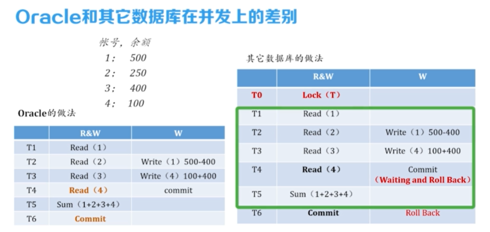
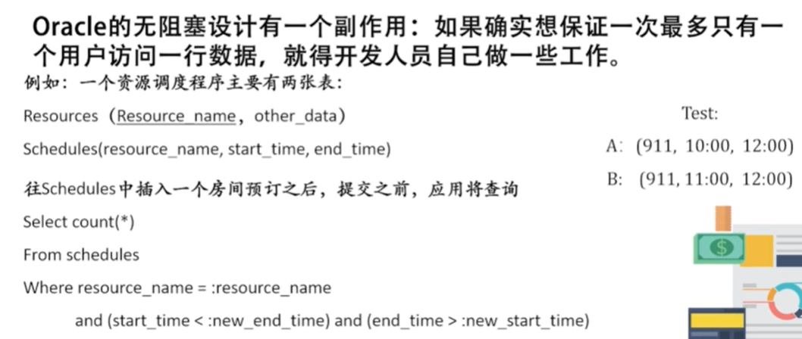
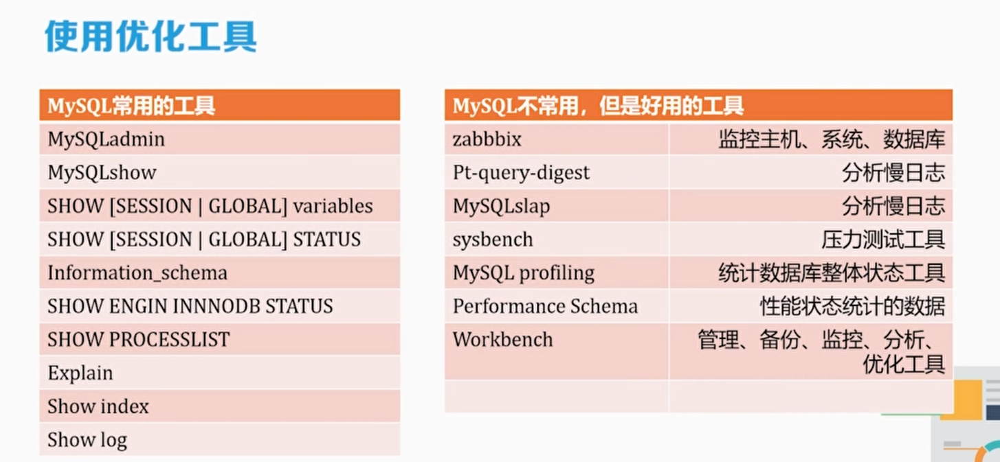
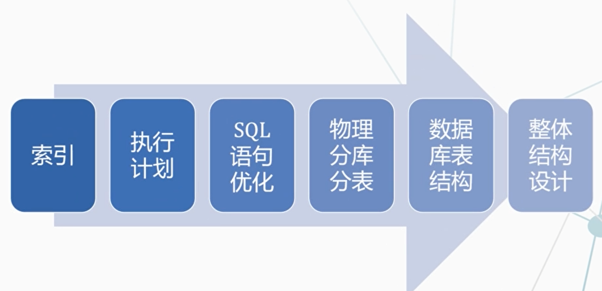

## 1.黑盒问题

不能当作黑盒。

因为数据库其实不存在独立性。

### 1.1体系结构的巨大差异

会导致数据库的连接，数据库并发处理等差异

数据库迁移会出现很多问题。

### 1.2黑盒与数据库独立性的问题

数据库有脱离实现级别的使用方法。

- 要构建一个完全的数据库独立应用，而且是高度可扩展的应用是极其-
  - 困难不依赖于任何一个数据库，既可在Oracle上运行，也可在MySQL上运行实际上几乎不可能
- 要构建一个完全独立的数据库应用:
  - 必须真正了解每个数据库具体如何工作
  - 如果清楚每个数据库工作的具体细节，数据库独立性可能并不满足

如**Null值**造成的**数据库迁移障碍**

- 在Sybase中间（is NULL）返回的是true
- 在Oracle中间返回的仍然是空

## 2.不同数据库中的差异 —— 并发控制

并发控制是用于保护数据库完整性的技术

- 产生并发问题主要原因: 事务的隔离性没控制好，一致性不能得到保证
- 并发机制不正确可能导致脏读、幻读和不可重复读等此类问题

### 2.1不同数据库的并发控制不同

如果不了解数据库如何实现并发控制，就没有办法做**性能优异的并发系统**，就**一定会有不好的结果**。

车辆排队时间随着数量增加，后续会呈现**指数增长**

- 一方面要花费更大的额外时间来管理，需要划线，需要维持现场秩序。
- 另一方面，收费站问题，最终可能引起整个**高速公路连锁反应**。
- 在数据库中间把它称之为**上下文切换**。
- 现实存在并发，需保持**数据一致性**，所以要做并发控制。‘

### 2.2当前数据库系统如何使用锁机制

数据库通过锁机制来处理并发问题。

行级锁：乐观锁、二段锁。

不同数据库的**锁机制不一致**、**差异性**将极大程度地影响数据库的并发控制机制。

- 有些数据可能有页级锁、另外一些有行级锁，有些实现会把行级锁升级为页级锁，另外一些则不然; 有些使用读锁，另外一些不使用。
- 有些通过锁定实现**串行化事务**，另外一些则通过数据库的**“读一致”视图**来实现(没有锁）。

不了解锁机制有时将导致致命的bug。

### 2.3Orcale数据库的锁机制有时无法读正确数据。 特别地

Orcale的多版本控制、读一致性模型：

- 读一致性：对一个时间点的查询结果是一致的。
- 非阻塞性读：读不会被写阻塞。//但其他数据库可能会

Orcale锁机制的好处：

- 因为没有读锁，读和写可以并发，并发效率提高。
- **其他数据库**使用了**读共享锁**。

充分了解锁机制、才能发挥数据库管理系统的最大潜能。

## 3.数据库的并发控制——对程序员影响

### 3.1 Orcale的读一致性

特点：对一个时间点的查询结果是一致的。读和写可以并发，并发效率提高。

Orcale的无阻塞设计的**副作用**：

当要保证一次最多只有一个用户访问一行数据，需要开发人员做工作。

因为where中查询时，两条数据都是合法的，都能插入，此时会出现业务逻辑错误。

**修改方式**：

使用FOR UPDATE关键字，表示这个读是用来修改的，此时有个共享锁机制。

### 3.2 不能把数据库当成黑盒使用

HIBERNATE
·对可持续化的类直接连接数据库，进行可持续化的存储。

- Hibernate并不会为 sqlserver，DB2，oracle生成不同的代码，而每个数据库的特征又是如此的不一样。
- 数据库有时跟编译器一样，只能做语法检查
- 很难对一个数据库的操作进行对错的判断，**很难debug**
- 因此需要在每个环节尽量**避免引入bug**

oracle mysql SqlServer数据库上差异，导致了并发处理上的差别

### 3.3程序员通过程序来考虑并发问题的情况：

回答：不知道、看情况。

- 并发控制
  90%的情况下，
  并发都是完全透明，无需担心。
- 10%的情况下，必须清楚哪些情况下需要自己考虑
  并发控制。

需要做什么：

- 了解每个feature的
  结构和实现，避免犯错。
- 测试，而且要**学会在多用户环境下**对代码进行不断的测试。

## 4.为性能而设计

### 4.1 性能调优

避免依赖专家调优。因为专家调优不靠谱。

### 性能调优的两种方式：

- 根据当前CPU能力、可用内存、I/O子系统等资源情况来设置相应参数。数据库管理员（专家）要做的事情，大概提高20-30%。
- 通过索引、物理结构、SQL的优化，具体提高某--个查询的性能。本身是程序员要做的事情。

**决定性能的根本原因—— 设计（提高性能的基础）**

体系结构设计决定了数据库系统的性能上限（**性能级别**）。

比如：

- 动态页面：对于百万量级访问负担重。

- 静态页面：还需要额外的内容管理系统。

修改对顺序文件是极大的性能障碍，所以这些系统都不提供修改功能。

**设计决定了性能指标**，性能拙劣的罪魁祸首都是错误的设计。

性能指标都是有成本的，性能设计是在安全和优化中寻找平衡

### 4.2性能指标 —— 要考虑整体性

- 以前的，查询事务，多少s能够返回数据
- 以**吞吐量**为核心。每秒**处理多少事务**。（**整体性**）
- 数据库环境，web服务器的环境，只能支持3000个并发
- 比如OceanBase的成绩单上写，它承载了双十一峰值6100万次/秒的数据库访问这就是针对访问吞吐量的指标

一个**具体的sql的性能提升**，也许会**导致其它操作性能的下降**，使整个**系统吞吐量**下降。‘性能指标要考虑整体性：

- 任何一个技术可以解决一个问题，但必然存在另一个问题的风险

- debug能力和使用优化工具的能力，是每个数据库工程师应该有的。

### 4.3 整体层面考虑性能优化

数据的**性能直接指标**就是**CPU或者是I/O的负载**的问题.所以要监控CPU，IO负载。

- CPU负载高，I/O负载低
  - 内存不够
  - 磁盘性能差(磁盘问题、RAID设计不好，
    RAID降级)
  - **SQL的问题**
  - **并发锁机制的问题**
  - **事务设计问题，大量小数据I/O**
  - **大量的全表扫描**

- I/O负载高，CPU负载低
  - **大量小的I/O执行写操作**
  - **Autocommit，产生大量小/0 **自动提交
  - **大量大的I/O执行写操作**
  - **SQL的问题**
  - IOPS: 磁盘每秒的读写次数
- 都高
  - 硬件不够用
  - **SQL存在明显问题**

性能问题 90%是程序员问题，开发环境到生产环境容易出问题。

**数据库应用要从自己身上找原因**

sql优化的方向：

