并发问题: 单独一个session执行的时候，很多问题不会暴露，但多个
session一起访问的时候，就会遇到问题。

并发用户遇到最多的是更新问题，即**多个用户更新相同资源的时候**，会
产生数据冲突的问题，以及随后会采用的各种级别的锁的问题。

并发也会涉及**读取问题** （各种资源竞争）

一、并发读取和并发修改的常见问题和解决方案;

二、数据库事务隔离级别:

三、大数据量的一些处理手段。

## 1.处理并发和大数据量

### 1.1并发读取问题

**有索引和没索引对数据访问的差距**：

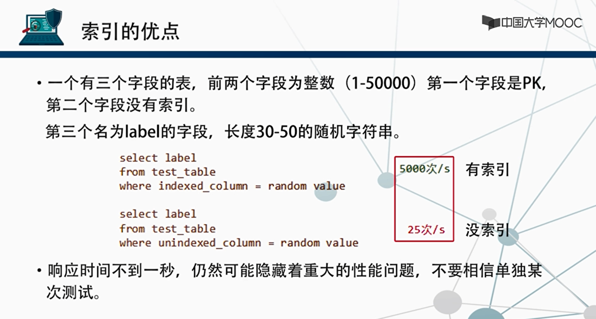

5000数据量太少，所以单次查询的测试感觉不明显。

单位时间内，随机间隔执行若干次。

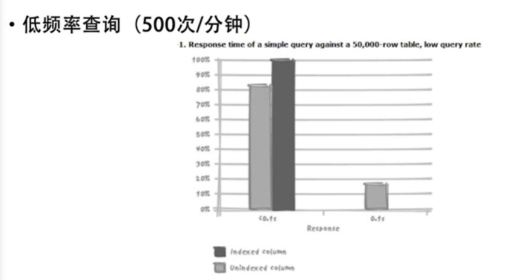

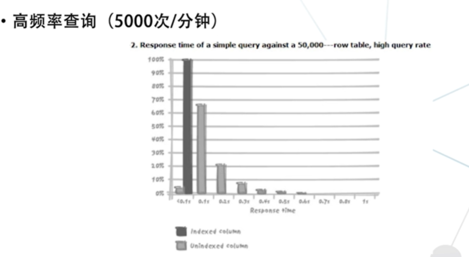

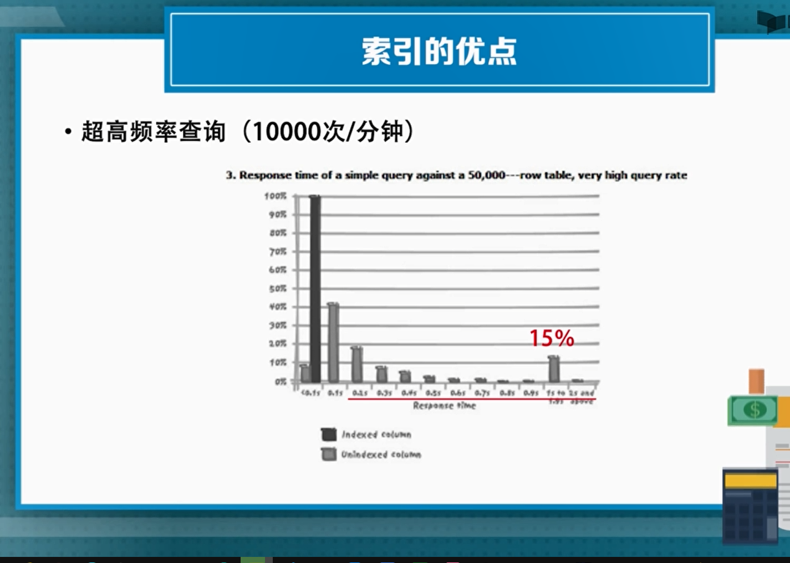

### 1.2排队

单个查询的时间慢，队会越排越长，性能也越来越差。

队伍的增长速度与查询的执行频率和查询所需平均时间之间的比例有关,比例拉高，查询越来越快，**队伍就越拉越长**。

即**阈值效应**。数据库是非常典型的具备闯值效应的东西.

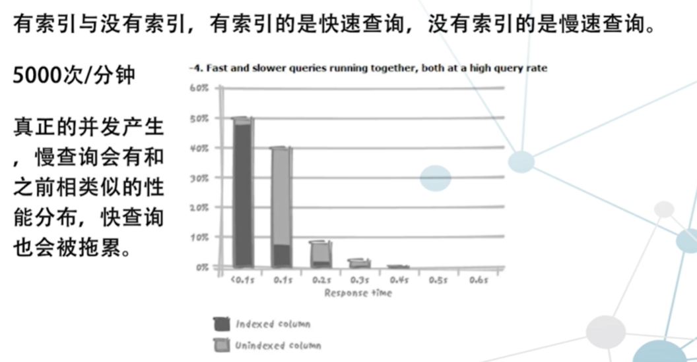

## 2.并发修改数据-加锁

**并发真正影响的是写**。

保证每个sesssion，:每个事务，都有不被别人影响的写的权力，此时要使用锁。

并发过程中，有多少用户会相互产生影响**取决于锁的粒度**。

### 2.1看锁的粒度

不同的DBMS支持不同的锁类型。支持何种粒度的锁，在大型系统和小规模系统之间
存在极大的差异。

大型系统对于锁的粒度选择非常谨慎，而在小规模系统中往往不是那么计较锁的粒度。

加锁的数据量小的锁，称之为细粒度锁。

行锁是粒度很细的锁，只锁一条记录行。
在行锁的环境下，多个并发进程就可能同时修改同一表中的不同行的数据,
而不会造成阻塞。

**行锁不同进程之间可以有一定的重叠**，不一定要等到一个进程执行的事务结束才可以执行。

而**表锁则必须等到上一个对本表执行操作的事务执行结束后才能执行**，粒度较大;所以一般选择粒度更小的锁。

更小的锁意味着处理器有更多的工作要做，从而提高硬件资源的利用率。

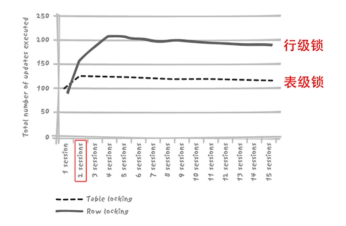

**加锁处理的原则**

- 不要随便使用表级锁
- 尽量缩短加锁时间
- 缩小事务的大小

**编程上的处理原则**

- 尽可能**避免**SQL语句上的**循环处理**，在程序体中，不能有一个循环体，循环体中
  包含一个SQL语句。
  - SQL本身就是集合读取的过
    程，不需要放在循环中。
- 尽可能**减少程序和数据库之间的交互次数**，尽可
  能一个SQL就能完成所有的工作，或者一-次查询就读
  到尽量多的数据，再本地
  处理;
- **跨机器的交互次数越少越好**。
- 未来工作中读取或更新了错误信息，错误处理顺序应该是，**先rolIback，**
  **结束事务，再去查询错误信息表。**
  - 先结束事务，可以先解锁。

### 2.2加锁与提交

这里的频繁提交，是指可以减小事务的大小。

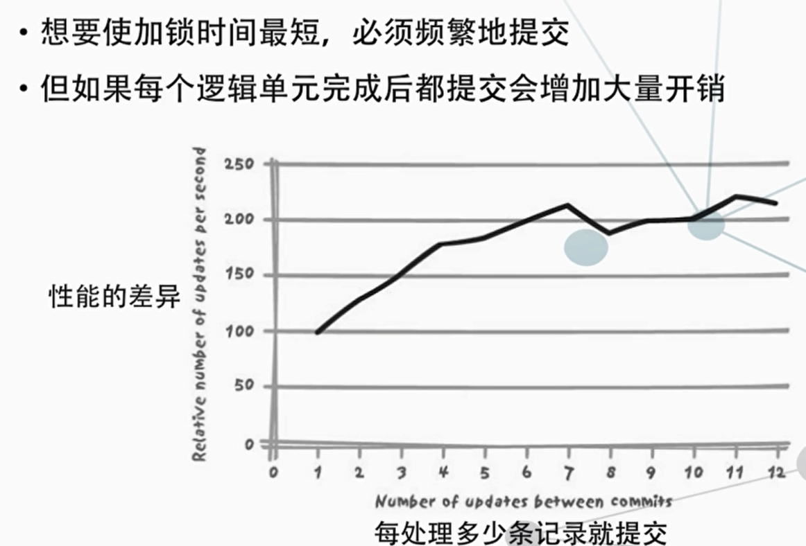

这个和物理组织形式有关。

- 事务越大，提交越不频繁，资源被锁住的时间越少，**并发出现冲突的概率就越小**。
- 事务越小，提交越频繁，处理事务付出的平均代价就越大

对于批处理程序，并发控制不是问题，**避免频繁提交才是明智的做法**。

对于用户交互程序，则需要**高频提交，加快释放锁**。

## 3.资源竞争

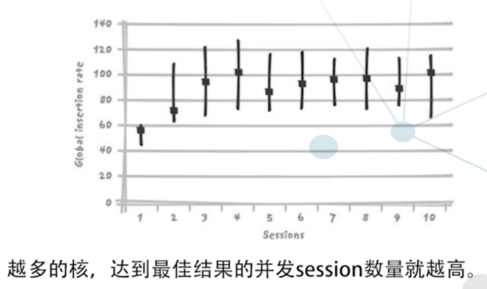

真正的问题是“是否可以更好地利用这些资源。

进程之间仍然会发生资源竞争，竞争发生在两个地方: 表和索引。

系统层次也可能发生资源竞争，但通常由数据库层面的竞争引起。

数据库层面资源竞争消耗CPU，因为处理竞争问题要执行一些代码在等待另一个处理器上执行的进程释放资源时，还可能出现“活动等待”或“闲置循环” 

解决资源竞争的手段，比解决锁的方法多。除了降低锁的粒度外，还可以：

DBA、架构、开发三方法

### 3.1DBA解决方案

DBA——数据库管理员的解决方案。

DBA的解决方案，是解决插入的问题，对其它事务的影响比较少

手段针对对象：事务空间](Transaction space. 可用列表(Freelist)

### 3.2架构解决方案

- 分区(Partitioning)
- 逆序索引(Reverseindex )
- 索引组织表 (Indexorganized table)

### 3.3开发解决方案

- 调节并发数
  - 限制session个数为最高性能的session个数，使周转更快

- 不使用系统产生值
  - 连续值只在范围查询中使用，在连续值本身毫无现实意义的情况下，范围查询的场景也不多见;
  - 可以只使用随机数来做主键，遇到随机数碰撞，就再生成一个随机数。

### 3.4比较

**session比较多时**

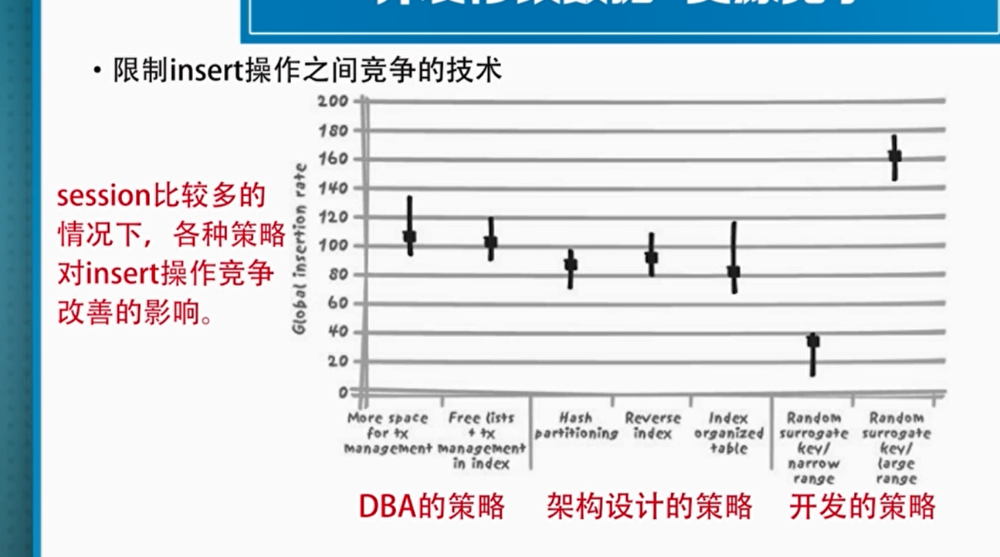

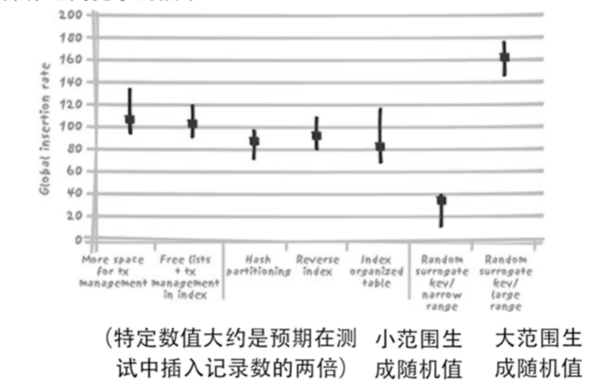

违反主键约束必须到插入主键值之时才可发现，索引保存的是物理地址此时记录已被插入表中，所以需要undo，产生额外的时间成本。

产生随机数的范围比最糟情况大100倍时，**性能显著改善**。

如果要设置随机值作为主键来解决资源竞争的问题，只要range足够大效率就会得到足够的改善。

**session比较少时**

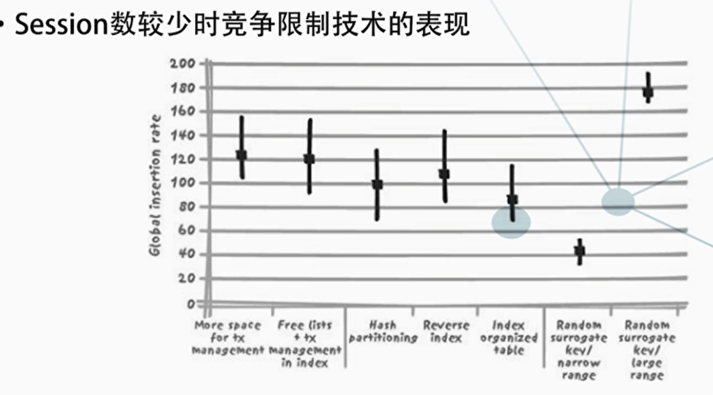

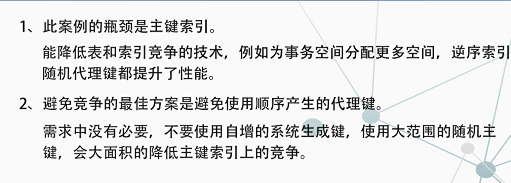

## 4.事务的隔离级别*

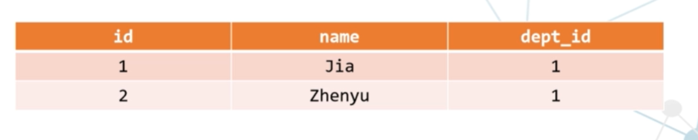

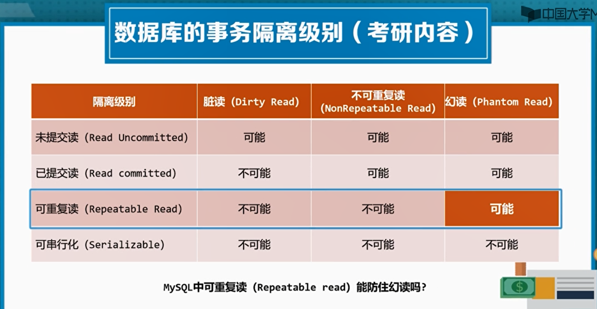

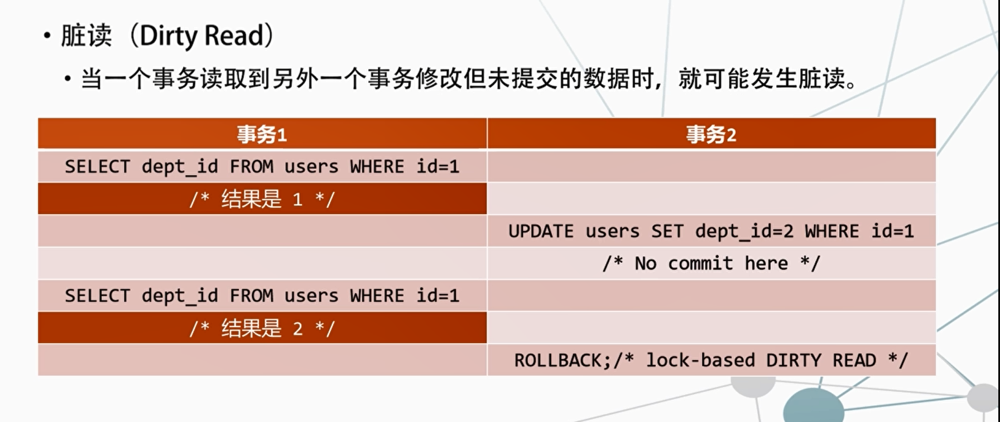

**另一个事务是修改但没成果提交，读到错误数据**

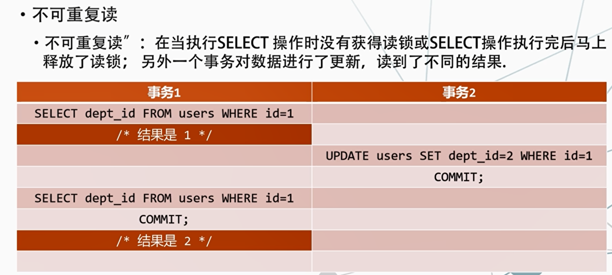

**另一个事务是修改后并提交，两次读到的数据不同**

**另一个事务是插入后并提交，第二次读的时候数据量不一样**

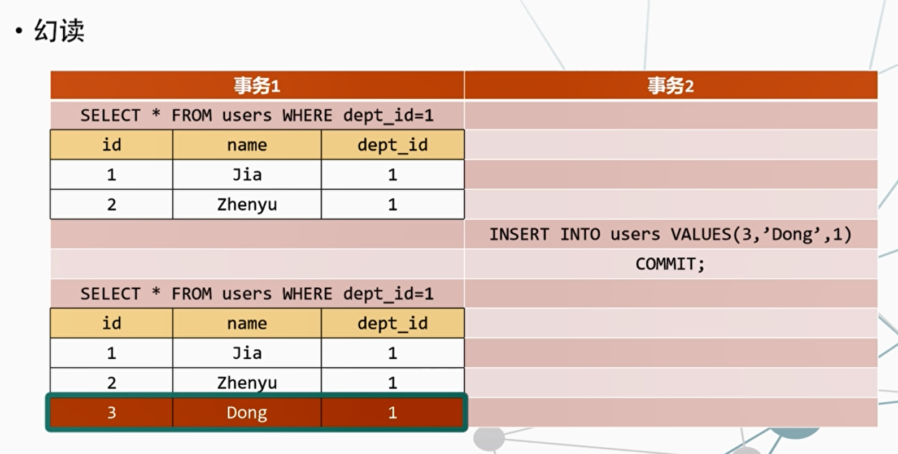

对应MySql四种事务隔离级别

未提交读(READ UNCOMMITTED)：脏读

已提交读(READ COMMITTED)：解决脏读产生不可重复读

可重复读(REPEATABLE READS)：解决不可重复读，产生幻读

可串行化(Serializable )：解决幻读

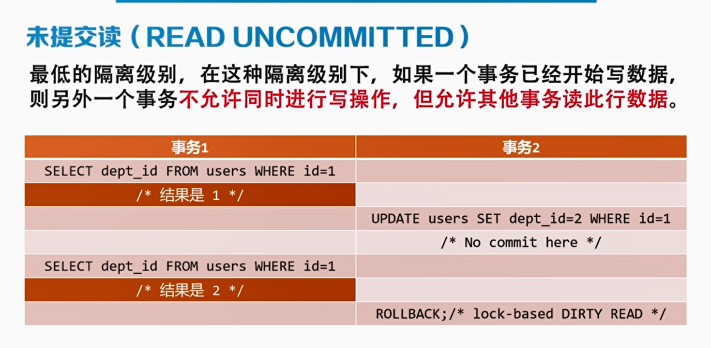

更新时只加了个读锁。其他人不能写但还可以读，会读到自己产生的脏数据。

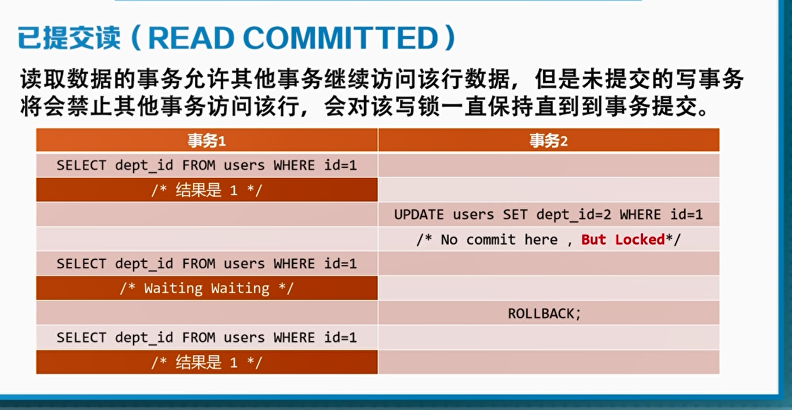

加了个写锁。自己写完后（即使失败），别人才能读。

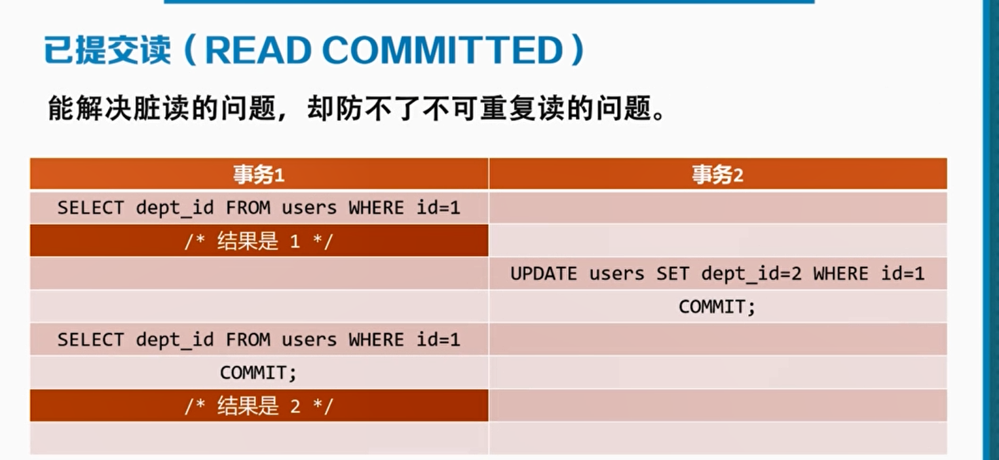

提交后锁解开了，仍能有不可重复读。

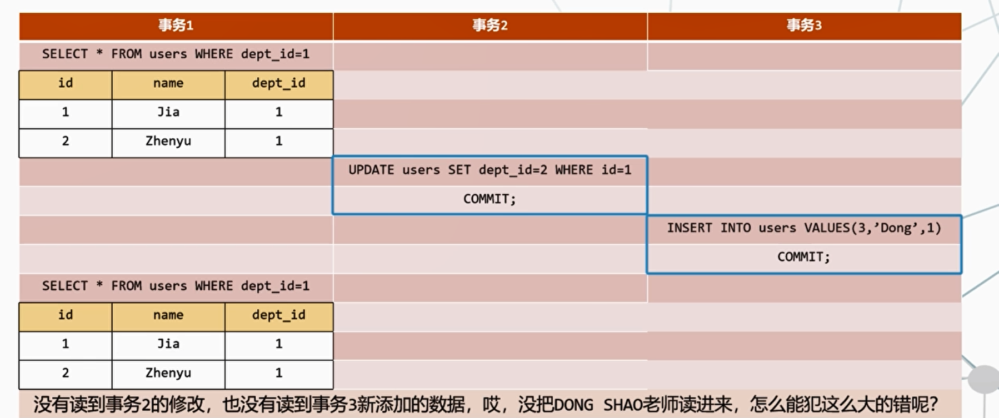

此时情况，既防重复读也防止了幻读。

**它是怎么做到的**?

MVCC(多版本并发控制)

在InnoDB中，会在每行数据后**添加两个额外的隐藏的值来实现MVCC**,

这两个值一
个记录这行数据**何时被创建**，另外一个记录这行数据**何时过期(或者被删除)。**

在实际操作中，存储的不是时间，而是**事务版本号**，每开启一个新事务，**事务版本号就会递增。** 用一个乐观锁实现。

此外，Mysql还有**邻键锁**。

### 4.2Next-Key锁

也属于行锁的一种，且**是INNODB的行锁默认算法**，临键锁会把查询出
的记录锁住，也会把**该范围查询内的所有间隙空间也会锁住**，再之它会**把相邻的下一个区间也会锁住**。

临键锁避免了在范围查询时出现脏读、重复读、幻读问题。
加了临键锁之后，**在范围区间内数据不允许被修改和插入。**

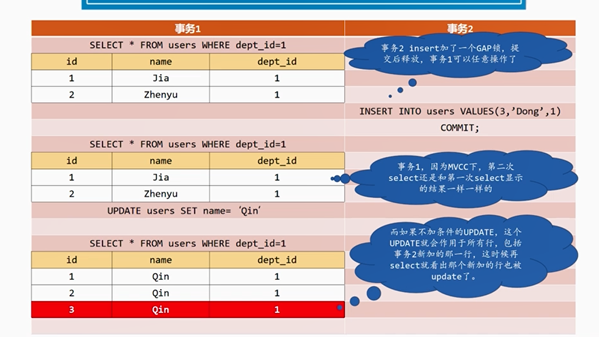

## 5.数据量增加的不同影响

如何高效搜索庞大的表。

如何避免数据量稍有增长就可能出现的性能下降。

5.1应用面临 “要处理的数据量会大幅度增长"的问题。

- 某一个应用突然火了，数据量暴增，或者业务时间很长，数据库存放了好多年的不经常被用到的数据。
- 很多原本能快速处理批处理程序，消耗的时间越来越大，甚至会干扰其它正常操作的查询速度。

**不同的sql操作对于数据量增加的敏感性不同**

### 5.1影响不大的情况

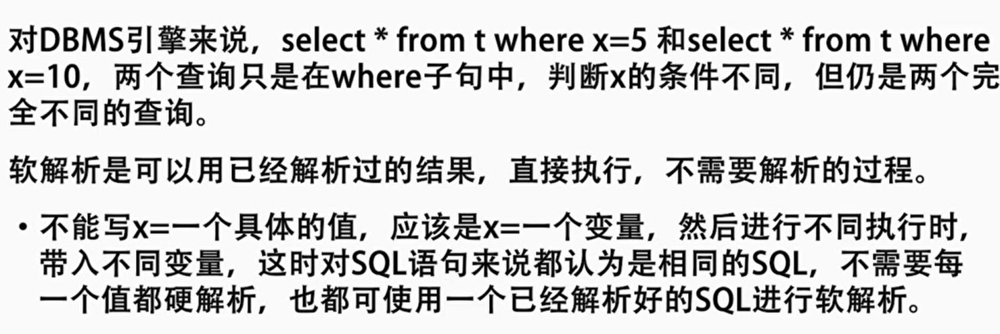

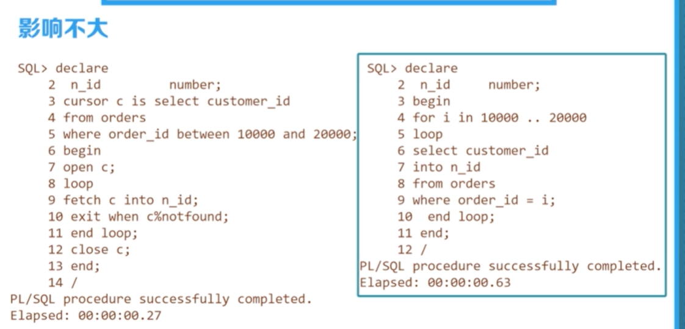

### 5.2**常见是线性影响**

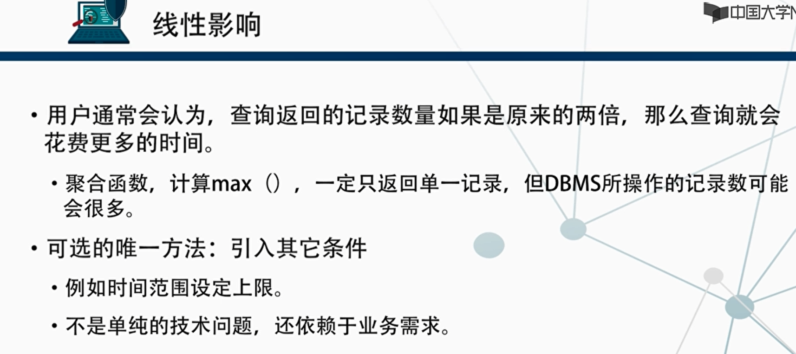

### 5.3非线性影响

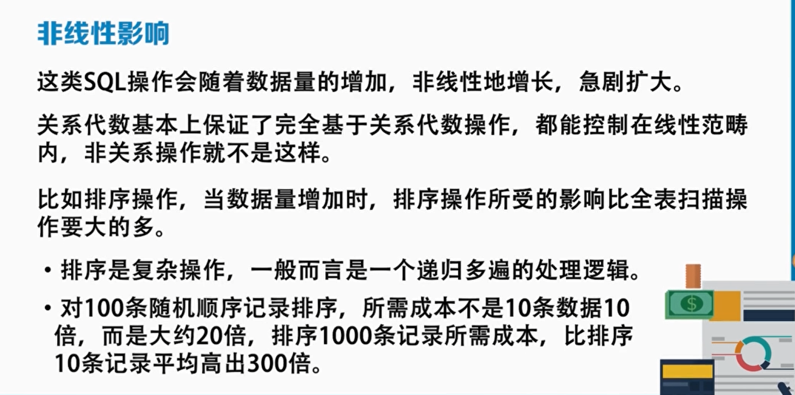

**现代数据库的处理方式**：

比如聚簇索引，比如很多有序的索引，除了为了快速检索，也同样为了简单的排序逻辑依照索引读出数据的顺序就是有序的。

注意：排序性能降低常间歇发生，时快时慢，较小型排序全部在内存中执行，较大型排序(涉及多个有序子集的合并) 则需将有序子集临时存储到硬盘中

通过调整**分配排序内存大小**，
来改善排序密集型操作的性能
是**常见有效的调优技巧。**

## 6.大数据量的处理逻辑

是否需要在需求之外，添加一个格外的查询条件，来限制需要查询的数据规模。这是一个普遍的原则。

排序主要是读写硬盘的影响。

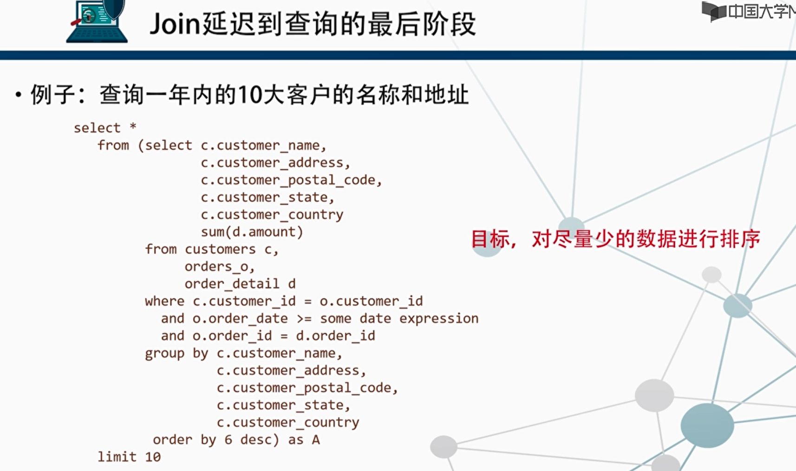

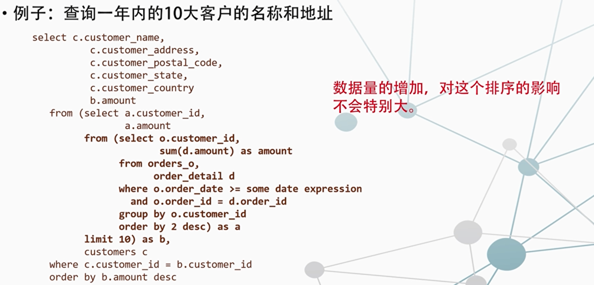

SQL优化中： 必须限制SQL查询中**非关系层部分**，因为非关系层与操作数据数
量、复杂度有关，排序、limit
都是非关系层操作。

遇到非关系操作，SQL会把一个查询，在关系和非关系操作边界上切一刀，内层是一个sql进行优化，外层是另一个sql进行优化，这样避免查询优化器对语义理解的错误。

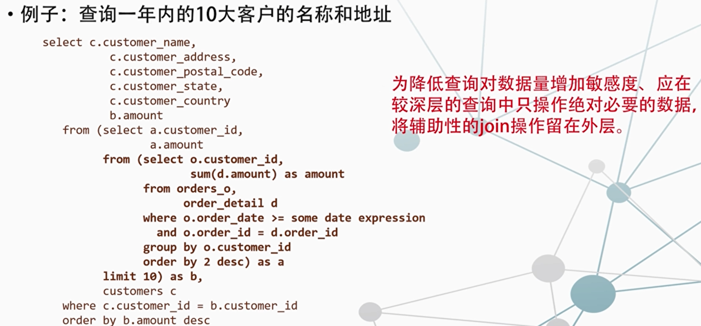

### 消除关联子查询

exists是关联嵌套子查询

它和非关联嵌套子查询in的最大的差异:子查询要执行多次。

它想效率高只有一个方式: 外层查询的条件足够的好，否则有风险。

关联嵌套子查询在计算每一条返回记录时，**都被调用一次**。

死亡sql：但常见

随数据量增加，减少关联子查询，否则风险很大。

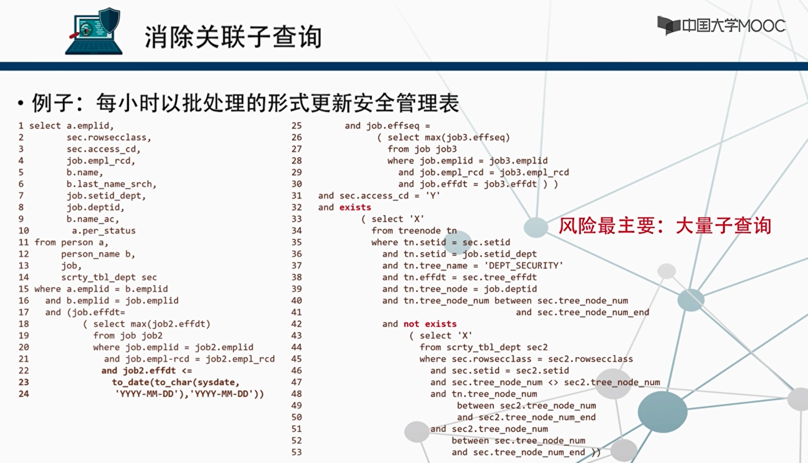

