索引概述

**索引与目录**

- 目录和索引是两种不同的机制
- 索引是一种以原子粒度访问数据的手段，而不是为
  了检索大量数据的

## 1.B+树索引的结构和应用

### 1.1B+树的结构

必须关注关键数据的读取，并为它们提供**最高效的访问路径**，而**建立索引可能是你第一个能想到的策略**。

几乎所有关系型数据库的缺省索引都是B+树索引，OceanBase也用了。

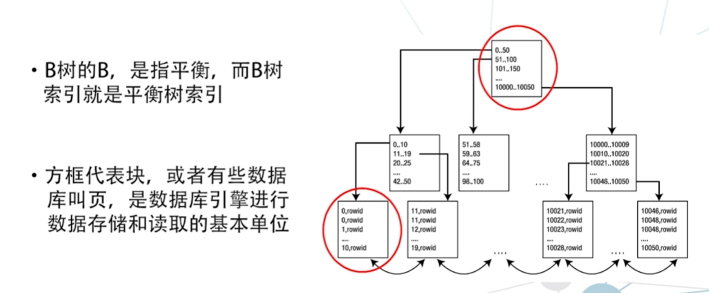

数据库引擎**读取的方式**

- 是从硬盘上**整块整块地读取**数据到内存里
- 接着在内存中把块中的某一条记录提取出来
  再进行使用。
- 一个块大概4k，存多条记录。

- 数据库引擎的某次读取**只是为了读取一条记录**，但是它**会首先读一个完整的块**而这个过程就叫**物理IO读取**

- 数据库性能最大的消耗，就是在物理IO上。一个查询的物理IO次数越多，这个查询的速度就越慢

B+树索引为什么能够降低物理IO次数

- 索引结构是一个树状结构，一个层次化的结构。
- 根节点，会把节点上的数值分成几个区间，每个区间用指针指向下一层节点，在下一层节点上也划分成几个区间，再指向下一层，直到最下层的叶节点。
- 叶节点会记录索引字段的值，以及这个值所对应的记录**在基本表上的存放地址**，我们把这个地址叫作rowid。
- 物理IO次数 = 经过的结点数量 + 1次基本表查询。

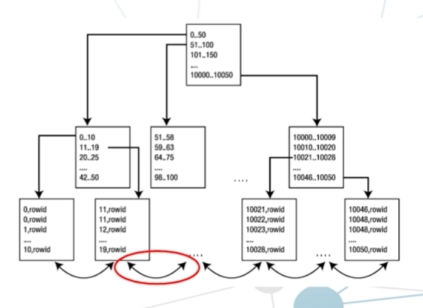

- **叶节点到根节点的距离叫深度**，例子深度是3，一般B树索引的深度都是3，有些是4
- B树索引要提高查询效率**首先要控制的就是树的深度**
- 本质上B树索引通常意味着数据存储是有序的，每个叶子页到根的距离都是一样的
- B树索引的**叶节点**就构成了一个**顺序存储的数据结构**它们对于范围查询，也就是**搜索范围数据很有用**。

### 1.2B树索引的应用 能做什么

1、**全键值查询**

比如**字段x上有索引**，where子 句中的条件是**x=123**，就可以使用B树索引做高速的查询。

2、**键值范围查询**

比如x在45-123之间，先进行x==45这个等值查询，查询到相关的地址,
是顺序存储，**横向直接顺序读取叶节点**，直到找到最右侧x=123对应的地址。

**读完索引之后，再去基本表去读那些地址相关的块**。

3、键值的前缀查询 与键值类似

 

### 1.3索引的另一面

B+树索引是最典型的索引结构。

索引可以大幅提高查询的速度; 但与此同时，我们也不能忽略**索引带来的沉重的成本**

**存储的成本**：

- 很多业务系统，**索引数据量远大于被索引的实际数据量**，也就是基本表的数据量。
- 索引**通常是镜像的**，还需要在热备、灾备、甚至是物理备份中存储，**存储成本非常高**。
- 当需要备份恢复的时候，索引还大大地增加了从备份中**恢复的停机时间**。

而最大的问题**不在于存储**，**在于处理的开销**

基本表数据更改时，索引也需要更新。

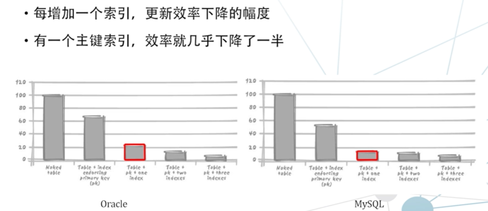

在并发访问的环境中，更多的索引将意味着**更多的并发冲突**

- 更新操作**需要更新数据本身和更新索引数据**
- 索引通常是一种比数据库表**更紧凑**的结构。
- 在更新索引时，在更小的区间中**并发操作产生冲突的概率就会更大**

索引在**物理存储上**、在**更新处理开销上**以及**在并发冲突的概率**上，都会大幅度地影响系统的效率

但索引仍然是最重要的组成部分，因为在实际业务中，**查询的次数一般比更新次数要多得多**。

索引也**不一定能提高查询效率**

## 2.建立索引的基础 —— 让索引发挥作用

### 2.1索引发挥作用的指标

基本表很小的时候，B+树索引还不如全表查询。

- 索引只是一种特殊的访问数据的方式，它并不是一定会提高查询效率，要看具体的情况
- 这种访问数据的手段是一种**原子粒度的，直接读取记录的**，它**不是为了检索大量数据而存在的技术**.
- 如果数据是沙滩中的沙子，全表遍历是一把铲子，用来大块大块地读取数据，那么索引就像一个小勺子，一勺一勺地取数据

每建立一个索引，都需要这个索引能发挥所需要的作用，否则就不该建立，这是**建立索引的基本原则**.

判断建立一个**索引到底有没有作用的指标**，最常用的就是**检索比例**，
也就是查询检索到的数据占总数据的百分比，往往这个百分比被设
置为10%。

- 也就是说,如果你查询到的结果集占整个源数据集的10%以下，
  那么**在这个查询中使用索引是有效的**。

这也称之为索引的选择性，检索出来的**数据占总数据的百分比越低**、**索引越有选择性**。

这里是**从索引的有效性来说**.

### 2.2胖表和瘦表的问题

胖表是一条记录很长的表，长的原因，很可能是字段数量很多，也可能是每个字段的长度很长

瘦表的特点与胖表相反它的字段很少，每个字段长度很短。

- 它们决定了基本表中一个块，能存储的记录的数量。
- 瘦表中，一个块能存储更多的行，而胖表中，**一个块能存储的行数就少于瘦表**。
- 原则上，瘦表的**检索比例会更低一些**，比如5%，而胖表相对来说索引的**检索比例会更高**，对索引的使用更宽容。（低于检索比例，索引才被认为是有效的）

**检索比例没有明确的分界线**，判断索引是否可以被使用，只能**进行实际的测试与验证**。即只访问基本表中的**少量行是适合使用索引**的。

### 2.3只使用索引不使用表

即使你需要访问基本表中的**很多行也可以使用索引**，这种情况就是**只使用索引不使用表**。

- 单键值索引：只对一个字段建立索引。如B+树索引就是典型。

- 复合键索引，本质上**是按照第一个字段构建的索引**，区别是**页节点上增加y的顺序存储**

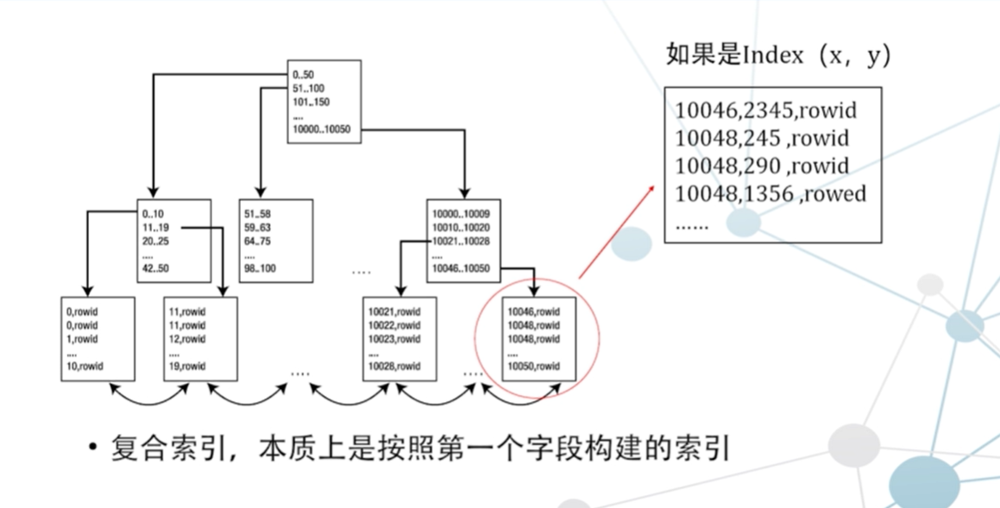

●虽然要检索很多行，
但是可以只使用索引不使用基本表。

●即**只查询索引的值**，此时**不需要读取基本表**。

以上可以总结**使用B+树索引的两个条件（索引可用性）**:

1、只需要获取少量的行;

2、即便获取很多行，但是可以只使用索引不使用基本表。

但索引读取是复杂的事情，记录的位置也会导致索引效率的不同。

下图是5条记录在同一块，和不在同一块的索引次数对比：

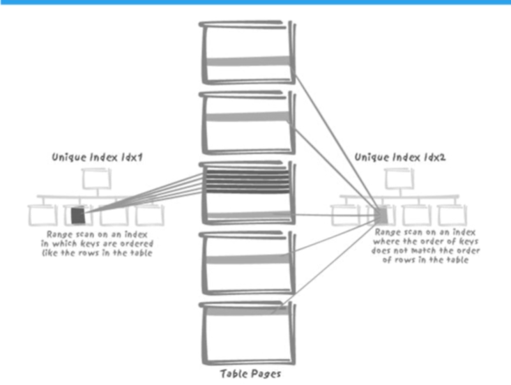

**为什么很多查询在开发环境中运行效率都比生产环境高呢?**

因为往往生成的记录是按顺序一起插入的，**记录的存储顺序和索引的顺序非常相似**，所以当读完索引后就能用最小的代价读取所检索到的记录。

但是**生产环境下**，由于并发、修改以及各种情况的产生，真实的数据很可能是**混乱地分散在硬盘的不同块中**的，这时查询效率必然会下降。

**解决办法：**

只有在**开发环境测试并且远超过需求的性能标准**，这样才能在**生产环境达到需求的性能指标**

**总结**

索引是一个非常复杂的存在。虽然它的结构很简单，但是使用中会**受到很多复杂因素的影响**。

因为索引的成本很大，所以我们要**谨慎地选择构建索引**，务必让索引变得可用。

## 3.哈希索引和函数索引

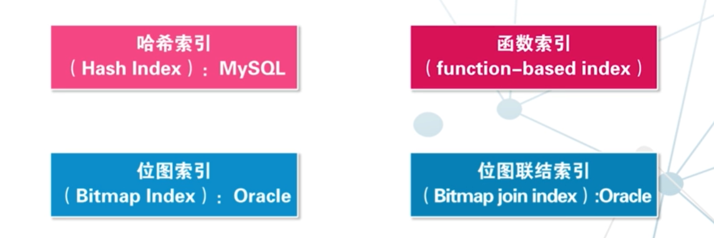

学习索引的方法：

1. 学习结构
2. 根据结构找出特点和作用

### 3.1哈希索引

**哈希索引的结构**

所有的数据类型，通过哈希函数变成一个**等长的哈希值**。

将这个**等长的哈希值**作为**组织成索引的结构 —— 哈希链表**。

哈希链表的结点上，储存哈希值 和 指向记录哈希值的地址 uid（索引行的地址）。

**哈希索引能做什么不能做什么？**

- 哈希索引只能用来进行**全键值**的查询
  - 不能前缀查询
- 哈希索引只支持**击中运算符**
  - 击中运算符：= , != , in
- 哈希索引**不支持对字段排序**
- 哈希索引**不支持范围查询**
- 哈希索引**读取效率高于B树索引**
  - 哈希索引结构非常紧凑.
  - 哈希索引**使用数值的比较**,远高于字符串比较速度.

**碰撞率的问题**

碰撞指不同的字段值，通过计算得到了相同的哈希值，而碰撞发生的频繁程度就是碰撞率。

当发生碰撞时，存储引擎必须访问链表中相同哈希值的**每一个行**指针，然后**逐行进行数据比较**，以确定正确的数据。

- 如果有很多碰撞，一些索引维护操作就有可能会变慢。如果在一个**选择性很低的列**(**列的基数占总行数**的比例低) 上创建哈希索引就会产生很多碰撞.
- 这时假如从表中删除一行,那么从索引中**找到这一行的代价会很高**。存储引擎将**不得不检查哈希键链表中的每一行**，以找到和移除被删除行的索引。

数据仓库层面中的**星型结构**, 在查找很多表的连接时, 哈希索引正是其所需要的.

**mysql中不同引擎 对哈希索引的支持**

- 只有Memory引擎有显式的哈希索引
- NBD cluster存储引擎支持唯一的哈希索引
- InnoDB引擎有**自适应哈希索引**
  - 当存储引擎发现一些索引值被频率很高访问时,将自动在B+树的顶端构建哈希索引.
  - 这时的B+树索引有哈希索引的特征 ---- 很快的哈希索引.
  - 但是自动的过程,不能控制也不能配置.
  - 即**越使用某个查询, 查询越快**.

### 3.2函数索引

B树索引是对一个字段构建索引,而函数索引是对**这个字段上的一个函数值**构建索引.

**结构同样是B+树索引,只是叶节点的值是函数的值而不是字段值.**

- B+树索引 , B+树上对X构建索引,
- 函数索引, B+树上对F(x)的值构建索引
- 但他们叶子结点指向的地址,**都是字段对应的地址**

是最具创造力的索引结构,用得好可用解决并发冲突,优化存储结构.等很多事情.

**能用在哪**

- **不区分大小写**查询

- **T、F比例巨大差异**的查询

  > 有一个事务处理的表，处理过的事务记录，flag取值为T或者Y,而没有处理的
  > 就是F或者N。时间一久，表中大部分记录都是T,而少部分记录是F。
  >
  > 怎么才能在
  > 索引中不记录T的记录，只把flag的值 等于F的记录记在索引结构中呢?
  >
  > 答案:给flag做--个函数索引。
  >
  > 解析:编写一个函数，如果是T，就返回NULL;如果是F，就返回一个非NULL的
  > 值。

- **有选择的唯一性**

  
  
  项目表有两个状态, active和inactive.
  
  要求active的项目,必须要有唯一名. 而inactive没有这个要求.
  
  解决方法: **函数索引上构建唯一索引**.

## 4.位图索引和位图连续索引

### 4.1 位图索引 oracle独有的

结构: 用一个**索引键条目存储指向多行**的指针。01图

- B树索引中，索引键和表中的行存在着对应关系，-一个索引就指向一行;
- 位图索引中，可能**只有很少的索引条目**，但**每个索引指向多行**。

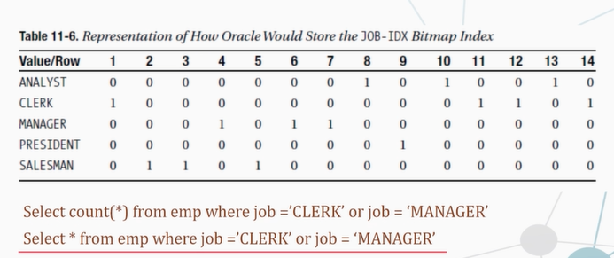

**统计行数非常快**.压缩地很紧凑

**位图索引适合**

- **相异基数(distinct cardinality)低**的字段进行快速查询 (复合查询)
  - 可以取的值的范围小: 性别、真假,年龄段 等.
  - 使用B树索引,需要复合索引时 组合数多. 且共同的值多, 可能使得叶子结点远少于索引结点.
  - 使用哈希索引,碰撞率贼高.
- 大量临时查询的聚合

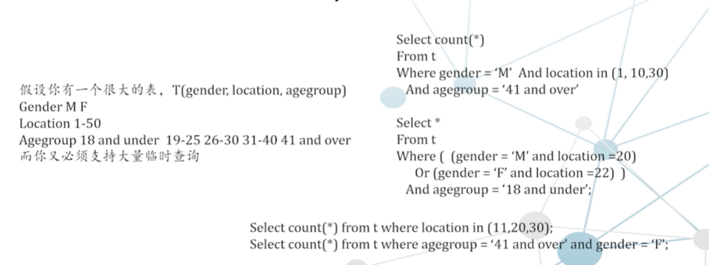

**缺点**: **对于写操作非常不友好**

**原因**: 位图索引的**键值指向多行**, 如果一个session修改了一个索引的数据,则**该索引指向的所有行都会被查找到**.无法锁定单独一个条目,**可能在修改时要锁住整个目录**,导致并发性下降严重 几乎变成串行化. 

这就是位图索引**不能应用在OLTP**应用中的原因.

### 4.2 位图连结索引  bitmap join index

oracle 九代? 之后,出现的.

一般情况下,我们都是在 **一张表上建立索引,且只使用这个表上的列**.

而位图联结索引:

- 允许使用**另外某个表的列** 对 **一个给定表** 建立索引。
- 实际上，这就是允许**对一个索引结构**(而不是表本身)中的数据进行**逆规范化**。

下图的例子,常常需要对多个表进行联结后进行查询.

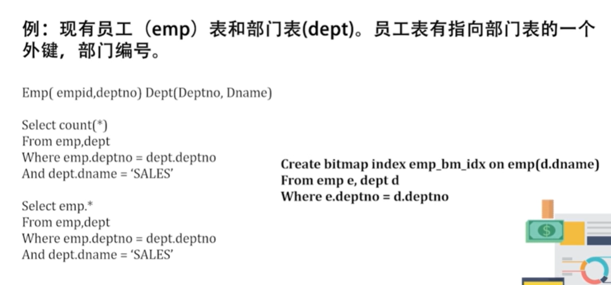

一般的索引方法:

- 在部门表的部门名称上构建一个索引,,
- 并用它来查询 部门名称为"销售" 的所有部门编号id
- 再回到员工表使用索引 查找根据部门编号匹配的行.

位图联结索引:

- **对部门名称建立索引后,指向员工表**.

位图联结索引的**前提条件**:

**必须连接到另一张表的主键/唯一键**

### **4.3Mysql没有位图索引,该怎么办**

1.优化替代**索引组合**:(**传统办法**)

- Select * from profiles where sex= 'M’ order by rating limit 10;
  可以添加sex，rating列上的**复合索引**。

2.**低选择性添加特殊索引** 最重要的手段

- select * from profiles wheresex= 'M’ order by rating limit 100000, 10;
  依旧很慢，更好的策略是**限制用户查看的页数**。
- 也可以: Select * from t inner join (
  Select id from t
  Where x.sex = 'm' order by rating limit 100000, 10) AS x USING id;

Google刚发布时用了limit限制, 如果看很后面的页数还是会很卡. 后面直接最多限制20页.

## 5.索引使用的典型问题

- **使不使用索引大部分情况**由数据库引擎自己决定
- 程序员**只负责构建索引**，数据库**引擎判断是否应该使用索引**
- **如果索引不被查询使用**，将产生巨大的负担，就不该被构建

索引使用的典型问题

- 函数和类型转化对索引的影响
- 索引和外键
- 同一个字段，多个索引
- 系统生成键

### 5.1函数和类型转化对索引的影响

Where f(indexed_col)=some value

这种检索条件会使索引无法发挥作用

- **函数**
- **隐式类型转化**

例:**字符串列和数字比较时**，大多数数据库引擎不会立即生成运行时错误，
而是**隐式地将字符串列转换为数字**。此时会**跳过索引**。

### 5.2外键索引的问题

系统对外键建立索引很**普遍**。

为什么要对外键建立索引？

- 删除操作时，可以快速通过外键的索引找到要删除的行。
- 并发时需要 A表加锁/B表加锁。 添加索引能够让上锁后操作的时间边短。
- **例外**：表B只是一个字典表，就不需要对表A的外键建立索引。
  - 因为字典表不容易被修改。

建立索引必须有理由
, 无论是对外键，或是其他字段都是如此.

### 5.3同一字段，多个索引

索引中字段顺序影响大，但表中顺序无影响。

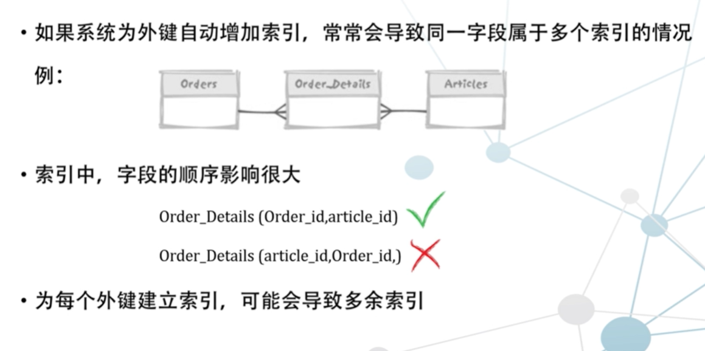

如这个Order_details是由两个外键构成. 且Article是字典表,因此article_id不需要构建索引.

如果Order_id 在前面,article_id在后, 则自动构建的索引是复合索引(Order_id,article_id),此时只需要一个索引.

如果article_id在前,Order_id 在后, 则自动构建的索引是复合索引(article_id,order_id),此时还需要一个外键索引order_id, 共有两个索引.性能下降.

### 5.4系统生成键

构建数据库时经常使用**系统提供自增字段**,作为主键 它性能也最高。

系统生成键: 

- 系统生产序列号远好于
  寻找当前最大值并加1
  并 用一个专用表保存“下一个值”且加锁更新

但系统生成键作为主键仍然存在并发的问题:

- 主键索引的主要用途是**确保主键的唯一性**.
- 并发插入时 **生成的序列号非常接近**,将**键值插入到主键索引中同一个块**的可能性变大了.
- 此时进程将竞争同一个索引页,插入并发性大幅度下降.

解决方案：反向键索引,此时属于同一个结点的块几率更小.

### 总结:为什么查询优化器没有使用我创建的索引?

情况1:**索引列不在使用的最前列(复合索引时)**

- 假设: T, T(X,Y)上有索引，做SELECT * FROM T WHERE Y=5

情况2: B树索引**不能为NULL建立索引条目**

- 使用SELECT COUNT(*) FROMT,而且T上有索引，但是优化器仍然全表扫描

情况3:函数值问题

情况4:隐形函数转化

情况5:使用索引，实际反而会更慢.

- 当做了测试后,证明索引确实能提高查询效率时,才建立索引.

情况6:查询优化器做出了错误的判断

- 优化器根据统计信息来判断索引的使用.
- 没有正确的统计信息，造成查询优化器无法做出正确的选择

**不使用索引原因**: 

- 不能使用索引，使用索引会返回不正确的结果
- 不该使用索引，如果使用了索引就会变得更慢

总结: 根据索引访问的不同特点, 充分理解要处理的数据做出合理的判断，才能获得高效方案。

## 6.数据库的物理组织形式

这里的物理实现是讲基本概念, cmu15-445更详细.

**关系型数据库的核心特点: 读写冲突**

在并发用户数很大的系统时,选择

- 尽量以紧凑的方式存储数据,利于读
- 尽量将数据分散存储,利于并发写入

数据库基本的物理存储细节

- 数据查询要快, 要建立索引
- 数据更新要快, 不要建立索引

但没有两全其美的**并发的修改密集型**, 即不能做到 查询快时更新也快.

核心思想：

所有**有利于读的技术一定不利于写**，**有利于写的技术一定不利于读**. 

如果都有利于,则会丧失一些特征. 如 NoSOL放弃的是关系型数据库的强一致性的特点.

### 6.1 页模式

**行迁移**: 块被填满 且 修改记录变大时, 一个块会分裂成两个块.也就是一条记录存在两个块中. 物理IO读次数增加到2.

如果记录继续变大填满了两个块, 则数据库会找一个非常大的块来容纳该条记录 并 删除原来两个块. 以防多次行迁移.

多次行迁移的发生,是数据库使用越久越慢的原因.

**为了避免行迁移**:

- 数据库使用更为冗余的策略:
  保持大概30%的空间来处理未来的更新。

  - 也就是说, 块被填满70%的空间时，对数据库引擎来说，不能再插入记录。
- 每一页将通过前后指针, 将块组织成链表模式, 其目的是优化全表查询效率
- 目录页的本质也是页，普通页中存的数据是项目数据，而目录页中
  存的数据是普通页的地址。
- 表的物理存储是一一个树状的结构。
- 所有的叶节点都是**随机文件**，是**堆文件的组织形式**。

以上也是数据库基本的物理存储细节. 

### 6.2把索引当成数据仓库

把尽量在索引中多存储数据的原则扩展到极限，构建一个**以主键为首位的索引**，**存储表中所有的数据**。 即(复合索引包括所有列)

即索引本身就是表.

Oracle中的对应的数据存储模式: IOT， **索引组织表**。

**比较索引组织表与只有主键索引的表插入的开销**

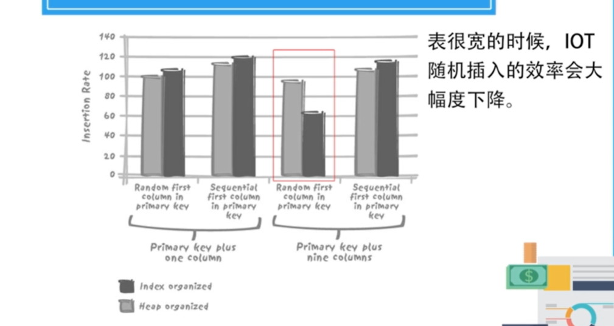

- IOT是一种**顺序文件**，麻烦的两件事是**宽表的随机插入(复合索引字段多)**和**数据包含长字符串**。
- 对于正常的事务型数据库使用IOT是得不偿失的. 

IOT最大的优点：**内部已经排好序**，利于范围的查询 如时间范围搜寻.

### 记录强制排序

为了使得**表中数据有序**,  很多数据库使用了**聚簇索引**.

聚簇索引
-clustered index
或者 -clustering index

- 范围查询效率非常高
- 代价:非范围查询也要进行范围扫描

- 主键更新会导致记录的重新排序，从而导致记录物理位置的变化

- 为了更加安全, 聚簇索引可以和索引组织表一样，根据主键来定义. 因为主键被更新的概率小,或者说不应该被更新.

- 聚簇索引也可以是非主键索引,这是和索引组织表不一样的地方.

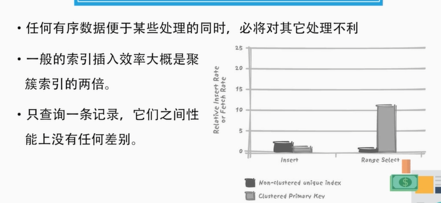

一旦出现**范围查询**,聚簇索引的性能是非聚簇索引的二十倍.

### 总结

聚簇索引, 索引组织表, 这种从物理结构上的优化, 必然存在明显的缺点.

**聚簇结构**

优点:某些情况下能成倍地，一个数量级地提高效率。

缺点:会使其它操作的效率降低。

**优化方案**: 

可以和社交网络, nosql一样.

用顺序文件实现数据组织, 同时需要禁止一切更新操作.

## 7.分区的介绍

分区(partition)也是一种最常用的物理组织技术. 也是数据分组的方式. 

可以很好的应对大数据量和高并发.

分区，简单地讲，就是将一个大型的表，在物理上分成多个小型的表。但借助数据库引擎，看到的仍是一张完整的表. 

分区使得查询效率和并发(concurrency)效率在很多情况下得到提升. 并且这种方式是可以自然扩充的. 即系统架构的可伸缩性 (scalable)

分区采用的是分而治之思想, 但分而治之不一定对所有事情有帮助, 比如对于售后来说基本上没有什么差别.

要从以下几点了解分区:

- 分区的底层逻辑是什么?
- 有哪几种分区的方式?
- 每种分区方式能解决什么样的问题?
- 不同的分区方式对项目会带来怎么样的影响?

### 7.1循环分区

分区技术的由来

最早由sybase提出分区这个概念，把60G的数据分成10个区，也就是10个
物理文件。这样，每次备份，相当于顺序备份十个文件，每个文件6分钟。

因此分区最早**用于数据库高效管理**的而不是数据管理.

那个时候使用的是**循环分区**, 不受数据影响的内部机制。

- 分区定义为各个磁盘的存储区域，插入数据时，数据会按照某种方法循环的加载到各个分区上，以保持插入时磁盘IO操作的平衡。
- 对并发的随机查询很有帮助(**即越分散越适合并发**)，循环分区可以看作是随机分布数据的一
  种机制。

和循环分区很像, 分布式，也是一种分散的方式，也是一种**透明分散**的逻辑。

循环分区是为了方便管理,但开发者发现了分区的好处, 为了方便开发者, 出现了数据驱动分区.

### 7.2 数据驱动分区

数据驱动的分区，最核心的一个概念是**分区键(partition key)**,

也就是说, 分区时根据**一个或多个字段的值**，来决定这条记录应该放入哪个分区中。此时不同分区的数据有 或强或弱的联系.

> 就像范围查询一样:  如果某一个**范围的数据都集中在一个页**中，那么**查询的效率将大幅度提高**。

分区也一样，只不过粒度从页扩展到了分区。

**滑动窗口**是 **最早数据驱动分区**方式。

最大的数据库一般都是金融业, 电信, 移动互联网, 社交网络.

**大量的历史数据** 就是其数据库庞大的主要原因.

但现实往往对**最新的数据比较感兴趣**, 随着数据的增加, 对历史数据的兴趣会消退.

**最常被查询的往往是那些可把比较新的数据**。

因此，**以根据日期/时间进行分区**，**常用的数据和不常用的数据分别放在不同的分区当中.**

**总结**:

分区实现的本质:  逻辑上是一张表，物理上是多个物理文件，甚至是多个物理环境.

**OB的表分区就是生成多个副本，存储在不同区域的OB服务器中**

## 8.分区的方式和应用

### 8.1数据驱动分区的实现方式

用数据值来划分分区

**哈希分区(Hash-partitioning)**

- 对**分区键进行哈希运算**，根据运算结果进行分区.
- 能保证**根据分区键可以快速找到记录**，但对范围搜索没有任何帮助。
- 其实更接近与循环分区, 只是它还能 负载均衡提高并发的能力. 

**范围分区(Range- partitioning)**

- 滑动窗口，就是范围分区，根据连续数据的范围对数据进行分区。
- **非常适合处理历史数据**，每一个分区专门用来存储特定范围内的数据。
- 一般系统还会设定else分区,来存储所有**可能漏网的数据**(其他)
- 应用: 时间范围, 字母范围

**列表分区(List-partitioning)**

- 是一种最具手工风格的分区类型，适合**定制某种特殊的解决方案**。
- **分区键必须明确指定**，但**分区键只能有一列**，不能像范围或者哈希分区那样同时指定多个列做为分区键，但它的**单个分区对应值可以是多个**。

- 一旦插入的列值不在分区范围内，则插入/更新就会失败.
- 因此
  通常建议使用列表分区时，要创建一个**default分区**存储那些**不在指定列表内的记录**。

很多数据库中分区可以嵌套，即分区可以再建立子分区，叫sub partition.子分区是分区内的分区。

- 一种二位分区处理的方法，比如在时间的分区中，建立哈希分区等
- **OB把它叫做二级分区**，再举个例子，**类似于用户账单领域，会按照user id做哈希分区，按照账单创建时间做范围分区**。

数据驱动的分区是最常使用的分区方式，用数据值本身作为分区的基础，这时候**数据分区最具有开发使用的价值**。

### 8.2分区是把双刃剑

**数据驱动的分区并没有全部地解决并发问题**.

例如，一个表如果按照时间分区，把一年的数据按星期分入五十二个不同的分区中，**查询起来确实非常快**, **但更新呢?**

- 如果滑动窗口是52个星期, 则每个星期的事务将**涌入同一个分区** 来插入新数据库.
- 此时,并发开销，内存争用都会大幅度提升，因为大型表中的其它数据都不访问**只访问最近的区域**.

有时候，52个分区这样的滑动窗口也没有任何问题，比如数据仓库中，所有的数据都是通过单一进程进行插入，根本毫无并发压力。

按照地理分区来方便插入时, 一旦进行时间范围查询, 反而此时数据分散, 效率很低.

但最常使用的方式是多层分区的方式, 先时间分区,再地区分区.

**IOT类似的问题:“冲突”**

A.通过分区键将数据聚集，利于高速检索;

B.对于并发执行的插入操作，分散的数据可以避免访问过于集中的问题。

在时间空间中, AB目标可能是相互矛盾的. 所以需要搞清楚主要问题是什么,并且根据主要问题进行分区. 同时计算两方面的得失,看看结果是否可以接受. 

因为**数据库的性能是以吞吐量为指标,而不是某一类型的操作效率.**

### 8.3分区与数据分布

表非常大，且希望避免并发写入数据的冲突就一定要用分区吗?

- 假设有一个客户订单明细表，该表中大部分数据都来自于同一个客户20%的客户贡献了80%的销量，
- 那么**按照客户的ID对数据进行分区**，就**不会有太大的帮助**。

查询小客户数据: 在客户ID上的索引可选择性就会很高，因此查询效率也会很高。

- 此时**完全不需要分区**.
- 聪明的查询优化器在获得关于键值分布的统计数据
  之后，就可以检测到数据分布的不均衡，**而选择使用索引**。

查询大客户数据:

- 优化器也知道**扫描表是效率最高的处理方式**，由于
  大客户的数据在表中占很大的比例，比如80%， 仅仅扫描该客户所在的分区**并不比全表扫描快多少**，
  所以性能提升也不大。

对分区表进行查询时，当**数据按分区键均匀分布时，**
**收益最大**

- 比如时间分区，往往一年
  中多个分区的数据相对比较**均衡**，**均衡分布，使用分区的收益才是最大的**。

### 8.4数据分区的最佳方法

整体改善业务处理的操作,才是**选择分区的目标**. 也就是说,改善不合理的业务流程,才是设计的重中之重.

- 当有多个处理执行时，解决方案就不应该过度偏袒其中任何一个. 

- 只要是**根据数据值决定物理位置的存储方式**，如聚簇索引、分区, **更新数据的代价都非常高**。

  - 对普通表的更新，几乎是**在物理地址不变**的情况下进行，最多只是修改和移动表中的一些字节。
  - 但**如果选择了索引和分区**，更新很可能导致一系列的删除、插入和
    相关的索引、分区的维护工作。
- 一旦更新分区键，就像更新索引键值一样，都会**引起数据的移动**。
  - 分区数据移动的代价更大,因为不同分区的数据移动**可能是不同物理区域,甚至是不同机器的传输和拷贝**, 一般来说,要**避免不同分区的数据移动**.

除了**默认存储方式(堆文件, 单库单表)**外，都会带来复杂性。如果复杂性超过好处,就坚决避免.

选错存储方式会带来大幅度的性能降低.

任何需求都会有变化，任何商业的流程都会发生改变，**任何计划周详数据库设计都可能被推倒重来.** 

在表不段变大的过程中,分区基本上是必然的处理手段,但还是谨慎地选择物理模式 并且小心地测试. 由于最初物理设计不佳而导致大型数据库推倒重来的代价是巨大的.

