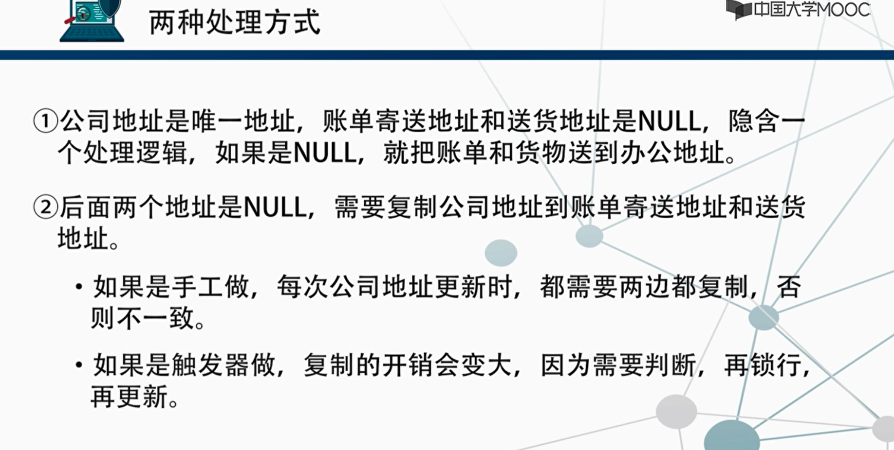
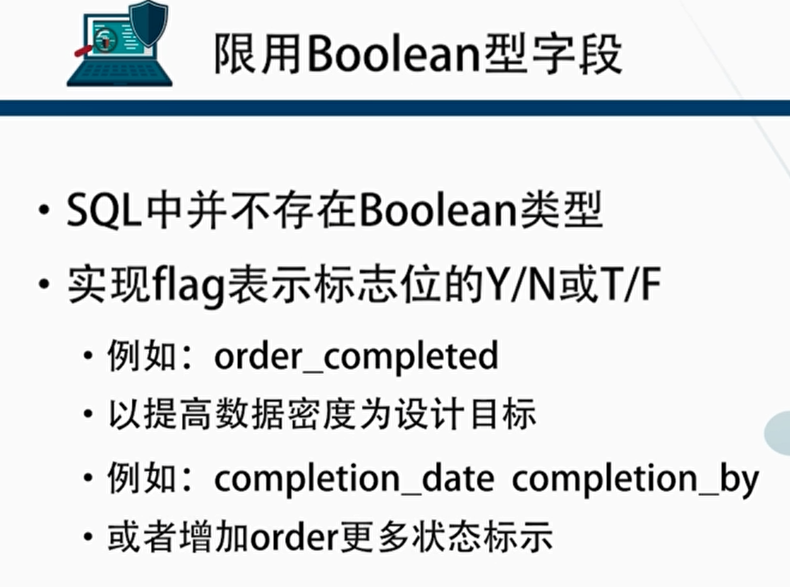
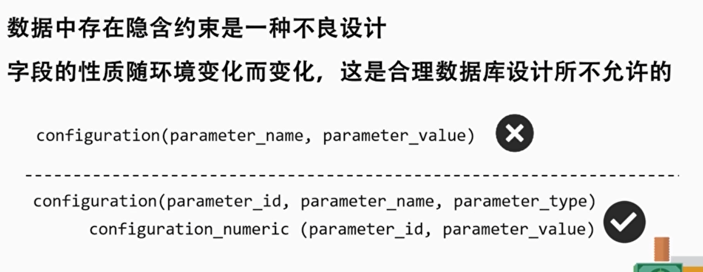
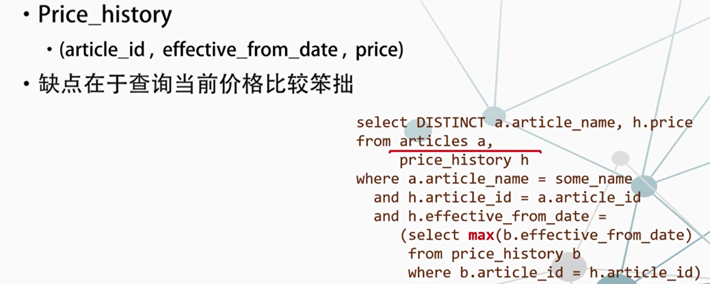
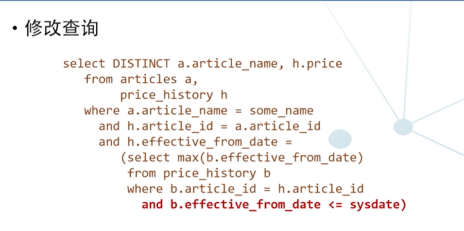
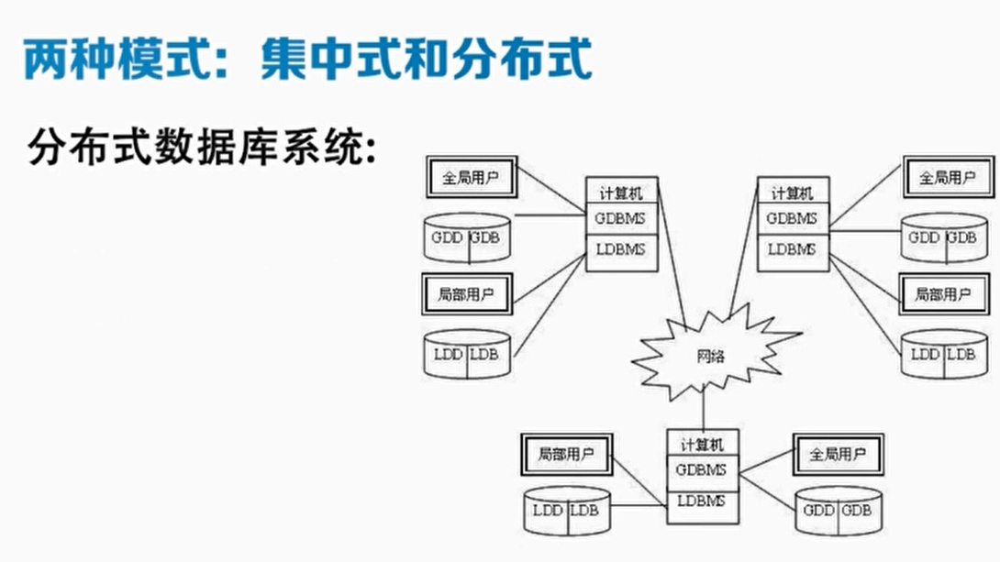

计算机程序首要目标完成业务需求。

容易只重视技术手段，忽略了商业活动的数据质量，仅仅想按期交付完成需求功能的程序。

**需要关注的问题：**

- 数据代表了什么
- 数据之间有什么关系
- 数据能推导出什么有价值的结论
- 数据的质量到底怎么样
- 怎么提高数据质量

未来是数据的世界。

强调良好的模型和合理的数据库设计是任何信息系统的基础，是互联网企业的钱袋子

## 1.规范化设计

学习任何数据库产品，无论是关系的，还是非关系的，本质上是对现实世界的一种模型。

不同类型的数据库，本质上存储数据的模型是不一样。

和任何模型一样，数据库也不是精确的模型，而仅仅是对纷繁复杂的现实世界有限的描述，对特定的一个业务活动的描述往往不止一种方法。这些在技术上都可以是语义正确的。

但通常只有一种办法最贴近业务需求。

被接受为真理不需要证明的事实，就是公理体系，其它学科叫原理而推演出来的新事实，就是定理。

关系表中的一行，就是一个对事实的描述。

表就相当于公理，通过一张表或者多张表的join操作，获得的其它事实，就是从公理推导出的定理。

**表是公理系统，视图和查询是定理系统**。

保证数据的一致性，即保证基于数据库的任何查询与原始数据具有同样有效性。

NoSql 无法在数学上保持一致性。

### 1.1关系理论与实现的差异

- 关系理论中，**关系是不包含重复数据**的。
  - 现实中间结果集包含重复数据。
- 关系是处理**无限数据集**的
  - 关系数据库再大，它也是处理有限数据集的，有限数据集不仅要保证正确，
    还要提高效率。
  - 中间结果集的产生，就是不需要把多个表完整的做完笛卡尔积再进行条件的筛选和投影，而是一步一步进行，以提高效率，**中间结果集未必包含全部的字段或者记录**，有可能出现重复数据。
- 关系理论中，**记录之间没有顺序的**。

**规范化的原理**：按照严格的逻辑要求，将不同的数据项组织在一起，变成结构化信息。

数据库设计的三大范式：为了建立冗余较小、结构合理的数据库，设计数据库时必须遵循一定的规则。

数据库领域的理想主义者认为数据的分析应超越三范式，至少要满足BC范式，甚至是五范式。

规范化为什么重要：规范化能让混沌变得有序
数据库的表经过规范化之后，结构非常自然。

严格逻辑规则的三范式：为清晰地获得常识，提供清单指南。

**表结构如果没有规范化就会面临天大的风险?**

- 主要是数据的不一致性
- 不满足规范化，或者模型出现一些问题，会导致数据处理的代码在性能很庞大的数据库应用中犯错率大大提高

## 2.字段设计 - 地址和空值处理

第一范式
数据库表中的所有字段都是**单一属性，不可再分**。

第二范式
数据库的表中不存在非关键字段对任一候选关键字段的**部分函数依赖**。

第三范式
在第二范式的基础之上定义的。如果数据表中不存在非关键字段对任意候选关键字段的传递函数依赖则符合第三范式。

### 2.1地址

把地址拆分成什么程度，取决于要如何使用地址，**业务需求决定原子级的地址属性**。

拆分不是凭空揣测，也不是根据书上的或者其它组织项目的拆分的方式，而**只取决于项目的实际情况**。

如果将地址继续拆分为小区、楼栋、门牌号等原子型数据项，很多时候会无法处理，甚至需要合并几个字段，会制造麻烦

### 2.2空值的处理

空值的核心含义是 **我不知道**

一般认为，数据表中，存在空值意味着关系模型设计上存在问题,
因为它会动摇查询优化的基础。

本质上，关系模型的**完备性是以二值逻辑为基础**。真或者假。

如where需要。

数据库不得不处理这种三值模型，T，F，再加上is null

如果在需求中间，有80%的客户，这**三个地址都是一种**公冒，一个，不是那种公司、是在一起的小公司，那该如何处理？

隐含逻辑会导致程序逻辑变复杂，代码出错风险提高。

几乎没有任何十全十美的设计，每一种设计都有麻烦
根据数据的情况，不同类型公司的比例，查询和更新事务的比例，一定存在一个可能最适合的方案，但一定不存在一个一定适合的方案。

**空值对程序逻辑是危险的，如果必须使用空值，要清楚它在特定情况的影响，做出最佳性能的设计。**

## 3.布尔类型和历史数据

### 3.1限用布尔类型

还可以用不同的表来跟踪订单。

追求数据密度极端的例子:四个属性取值都是T/F， 可以用0-15这16个数值代表
四个属性所有组合状态。但可能违反了原子性的原则。

只有程序员知道，优化器不知道。

特别是若字符串型的字段**有时包含字符有时包含数字**，对数据库设计来说不是技巧，而是说明最初的数据库设计，对领域的定义比较混乱。

用更通用的表，然后建立子类型。

例如:“如果账单寄送地址是null，就是用总部地址
” 不好

尽可能多的**定义约束**，把语义的约束通过字段类型
和字段长度放在DBMS中去
检查去约束。

提高健壮性、可读性扩展性，**数据的语义属于DBMS，别放到应用程序**中

### 3.2历史数据

关系设计的真正难题：处理**时间段**的数据。

可以设置**价值终止时间**。当前价值有效，终止时间为空。

但在查询方面有根本缺陷。

如双十一的价格自动变化。

当前的价格由当前日期之前的最大日期决定。

也可用非规范化建模

当前价格的选择，是每一个产品页面刷新的必须进行的一个数据库操作，操
作非常频繁，为了提高这
个操作的效率，非规范化
打破范式是一个好的选择。

同时**保存价格失效和生效日期，或者同时保存价格生效日期和有效天数**。

此时可以在数据插入或者更新时，增加更多检查以维护数据的完整性，但代价是性能下降。

**另一种方式**

分别创建当前价格表和历史价格表，并定义一个操作触发器，当价格改变时
将数据从当前价格表移到历史价格表。 适合特定应用，但不适合预设价格。

也可以通过分区的方式
把失效的历史价格丢到历史的分区中，然后所谓的
price_ history表就客观上小多了，查询更快。

## 4.数据的处理模式和存储设计

### 4.1处理模式（操作模式）

操作模式：指数据应该以**异步模式**处理(例如批处理系统)
，
还是**同步模式处理**(例如
实时交易系统)

操作模式

- 异步模式处理(批处理) :是所有数据处理方式的先驱。

- 同步模式处理(实时交易)

处理数据的方式会影响物理结构的设计

- 如果某些操作过于复杂，要跨很多系统很多物理环境时，等待同步实时交易，不可控因素会很大，这时需采用异步方式，放弃实时性的好处，而追求更直接的健壮和稳定性

**大规模的批处理，我们需要关注吞吐量**

**如何选择异步和同步**

1. 选择不同模式，是整个系统需求，以及所处理数据所在的**物理结构所决定**的。

2. 从性能的角度来说，如果**无需必要，可以不选择同步**的方式。

   比如网络爬虫，天生就应该使用异步的方式，数据库多库之间的数据传输，也大概率应该采用异步的方式。

3. 往往采用批处理这种异步方式时，**很容易发现某些事情**花的时间太长，也
   就是异步的批处理方式，比较**容易发现问题**，批处理系统一-直在压榨系统的
   性能。

   **同步不容易发现问题**，只有在高并发和大数据量时暴露，在最糟的时候才会暴露，会极大影响业务。

4. 尽量只在必须要同步的时候，才设计成同步，否则都可尝试使用异步模式

### 4.2存储层面的设计

不需要考虑节点的协调问题。

网格集群包括现在最重要的云计算等皆是采用数据分布式的模式，
经常提到的**OB数据库就是典型的分布式数据库**。

**结构越复杂，健壮性越低**。

**性能的杀手:对远程数据的透明访问**

原因:

- 无论看起来有多透明，跨多个软件层或者网络层的代价都很高
- 试试执行一个在本地数据表中插入几千行数据的代码，相对比的是，执行另一个跨机器的同样程序通过指向连接进行操作。差异是几倍的。
- 来自不同数据源的分布式数据结合起来非常困难。比较数据源A和数据源B的数据，必须**拷贝A的数据到B**，或者反过来，拷贝B的数据到A，无论怎样都要面对开销很大的数据传输的代价。

远程的数据拷贝，**脱离了数据源环境**，就**不能从数据规划中获益**

理论上来说，查询本地数据最有效的方式是嵌套的循环，程序员知道最佳过滤条件分布，
优化器能快速定位和找到最好的查询计划。

但如果部分数据位于远程，只能选择：

- 使用嵌套的循环，每次循环开销很大
- 建立远程数据的本地副本，然后操作该副本，但此副本没有任何索引

**数据库该如何部署？**

**平衡**，离数据越近，访问越快。

**那为什么说分布式比集中式更快？**

因为**吞吐量**，分布式吞吐量的上限高于集中式。

分布式吞吐量优

**总结**

讨论了进行数据库规划的基础知识，包括数据建模的基本原则，特别是规范化、字段设计、历史数据等等问题。

以及在不同情况下，错误的设计是如何导致各种后果的。

忽视基本设计原则，会导致性能问题，而解决这些问题会浪费惊人的精力和智慧。

## 8.1大尺度的问题

如果一个系统很大，可是还使用过去小尺度下的规则，就会出问题。

一旦尺度变大，**就需要用工程化的方式去组织，花费更多的成本去协调。**

不可能用没有并发的系统，去应付高并发、大数据量场景。

绝大多数人的编程技术和数据处理能力，都需要在更大的项目中去领悟去提高。

一个软件系统，一个复杂的数据库，太容易出错。系统越复杂，出错的频率就不成比例地增加。

timestamp不确定

一个数据库系统整体的工作如果是100%，实现业务需求，所需要的工作大概只有20%，剩下80%的工作是性能、监控、审计、备份、恢复、错误处理安全机制等一系列的工作。

棘手问题
棘手问题不是用来解决的，它也许根本解决不了，只能应付。

好的判断来自经验
而经验来自坏的判断

