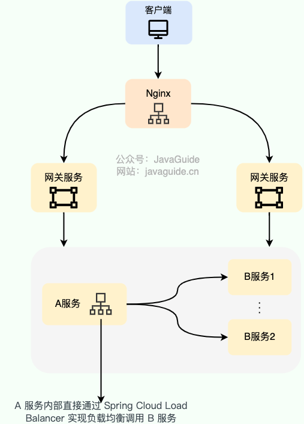
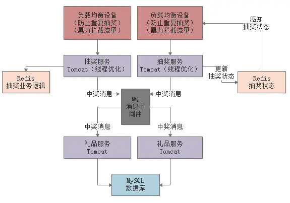

# 实战梳理

## 高性能设计

### CDN

### 负载均衡

服务端负载均衡

应用于系统外部 和 网关层 中间, 

软件负载均衡 。软件负载均衡通过软件（比如 LVS、Nginx、HAproxy ）实现负载均衡功能

硬件负载均衡 。硬件负载均衡通过硬件设备（比如 F5、Radware ）实现负载均衡功能

四层负载均衡 工作在 OSI 模型第四层，也就是传输层.
- 能够看到数据包里的源端口地址以及目的端口地址，会基于这些信息通过一定的负载均衡算法将数据包转发到后端真实服务器。

执行第七层负载均衡的设备通常被称为 反向代理服务器 。
- 核心是报文内容（如 URL、Cookie）层面的负载均衡

客户端负载均衡 

主要应用于系统内部的不同的服务之间，可以使用现成的负载均衡组件来实现。
Dubbo 属于是默认自带了负载均衡功能

#### 负载均衡算法

随机算法: 有一个比较明显的缺陷：部分机器在一段时间之内无法被随机到，毕竟是概率算法，就算是大家权重一样， 也可能会出现这种情况。

轮询法: 没有配置权重的话，每个请求按时间顺序逐一分配到不同的服务器处理。如果配置权重的话，权重越高的服务器被访问的次数就越多

两次随机法: 两次随机算法是在随机算法的基础上进行了改进，通过两次随机选择来提高随机性，减少因随机数分布不均匀而导致的性能问题。

哈希算法: 根据客户端 IP 地址或者请求 URL 计算哈希值，然后对服务器列表的大小进行取模运算，得到的结果就是要访问的服务器序号。

一致性哈希法: 一致性哈希算法是一种分布式算法，主要用于负载均衡。一致性哈希算法的基本思想是将整个哈希值空间组织成一个虚拟的圆环，

最小连接数法: 最小连接数法是根据后端服务器的当前连接情况来决定请求应该分发到哪一台服务器上，选择当前连接数最少的服务器来处理当前请求。

加权最小连接数法: 加权最小连接数法是在最小连接数法的基础上增加了权重的概念，权重越高的服务器被选中的概率越大。

最快响应时间法: 最快响应时间法是根据后端服务器的响应时间来决定请求应该分发到哪一台服务器上，选择响应时间最短的服务器来处理当前请求。

#### 七层负载均衡解决方案

DNS 解析

反向代理。

### 数据库优化

### 消息队列

## 高可用设计

## 典型问题

### 百万用户抢券的系统设计

[字节高并发优惠券系统](https://mp.weixin.qq.com/s/iZ9BX6cCCp_TB-SC3knuew)

[如何设计一个百万级用户的抽奖系统？](https://juejin.cn/post/6844903847031226382)

#### 负载均衡层限流

1. 配置过滤脚本

- 判断如果同一个用户在1分钟之内多次发送请求来进行抽奖，就认为是恶意重复抽奖，或者是他们自己写的脚本在刷奖，这种流量一律认为是无效流量，在负载均衡设备那个层次就给直接屏蔽掉。
- 使得请求的QPS为真实的用户数

2. 开奖后暴力拦截

1000个券，可能有1000万人来抢，但是只有1000个券，所以在券抢完后，就可以直接拦截所有请求，不再进行后续的处理。

即拦截无效流量
做到50万人一起请求，结果就可能2万请求到了后台的Tomcat抽奖服务中，48万请求直接拦截掉了。

可以通过Redis来共享抽奖状态

#### 服务层

线程数优化，选择合适的线程数

用Redis代替MySQL实现业务逻辑

##### 限流削峰

如果确实发放几w以上的奖品，那么抽奖服务还会调用礼品服务。

而礼品服务等后续服务可能非常耗时，且不易扩展部署。

可以通过消息中间件进行流量削峰，将抽奖服务和礼品服务解耦，礼品服务可以慢慢处理，不会影响抽奖服务的性能。

秒杀

rpc调用的流程

如何实现注册中心的高可用

十亿条淘宝购买记录，怎么获取出现最多的前十个

这是一道典型的有限内存的海量数据处理的题目。一般这类题目的解答无非是以下几种：

分治，hash映射，堆排序，双层桶划分，Bloom Filter，bitmap，数据库索引，mapreduce等。

具体情形都有很多不同的方案。这类题目可以到网上搜索一下，了解下套路，后面就基本都会了。
