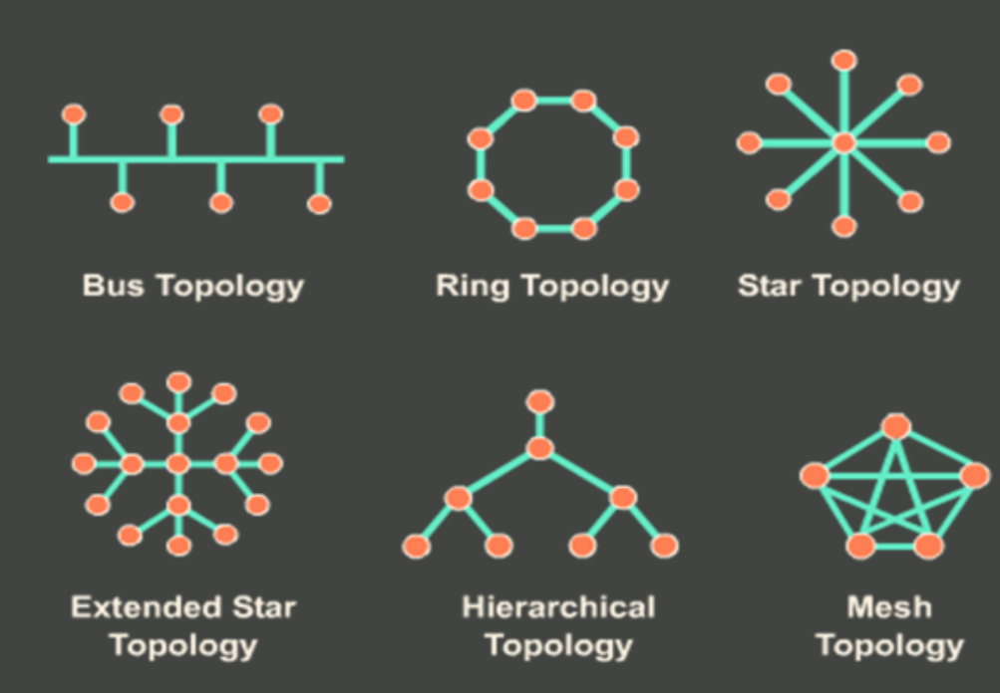
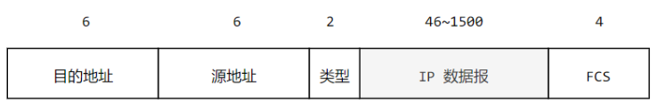
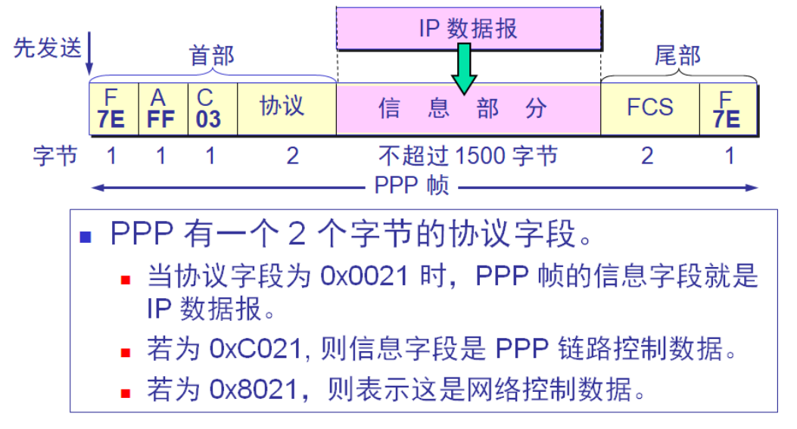
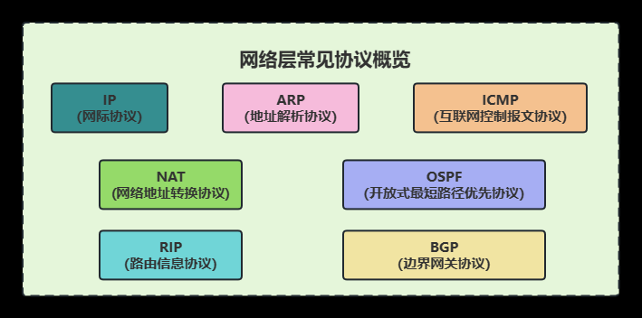
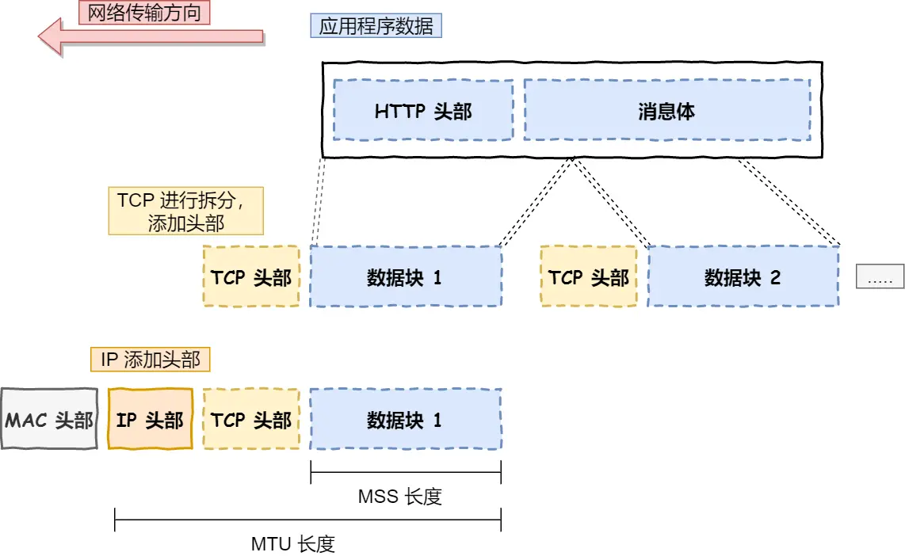
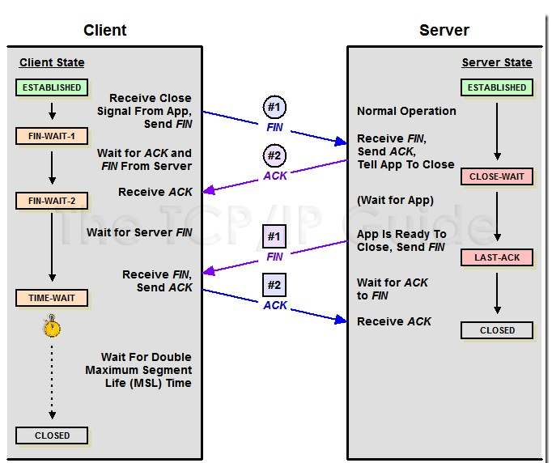
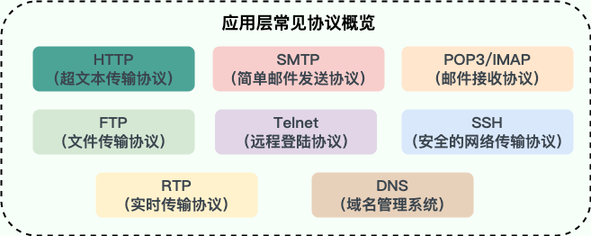

# 计算机网络基础

## 概述

- LAN：Local Area Network，局域网
- WAN：Wide Area Network，广域网
- **ISP** Internet Service Provider 因特网服务提供商

### 服务与协议

**协议**是**水平**的，**对等实体**之间的**通信规则**。**对等实体**是指**同一层**级**可发送接收**信息的硬件或软件进程.

**服务**是**垂直**的，是由下层为上层通过**层间接口**提供的. 下层实现的**所有功能不都是服务**,只有能够**被上层看得见的**功能才是服务. 上层使用下层的**SAP**访问下层的服务.

- **SAP Service Access Point**: 服务接入点.同⼀节点相邻两层交换信息的连接点.
  - 数据链路层的SAP是MAC地址，网络层的SAP是IP地址，传输层的SAP是端口.
- SDU(服务数据单元): 为完成⽤户所要求的功能⽽应传送的数据
- PCI(协议控制信息): 控制协议操作的信息。
- PDU(协议数据单元): n-PDU = n-SDU + n-PCI。 n-PDU = (n-1)-SDU。

**协议三要素：**

* 语法: 规定信息格式
* 语义: 说明通信双方应当怎么做;用于协调与差错处理的控制信息
* 规则: (时序)定义了何时进行通信，先讲什么，后讲什么，讲话的速度等。

**服务的类型**：

面向连接服务与无连接服务
  * 面向连接服务：双方通信前要**事先建立**一条**通信线路**. 该线路包括建立连接、使用连接(通信)、释放连接这三个过程。
  * 无连接服务: 双方通信前不需要建立通信线路.

可靠服务与不可靠服务
  * 可靠服务:通过具有**检错,纠错,应答**机制,保证**数据正确,可靠地**传送到目的地.
  * 不可靠服务: 不保证数据正确,可靠地传送到目的地.

应答服务与不应答服务

### 模型

**层次模型的好处：**

- 降低复杂度
- 标准化接口
- 灵活性好
- 易于实现和维护

OSI七层模型**

|            | 任务                                                     | 功能                                                         | 协议                             | 传输单位                |
| ---------- | -------------------------------------------------------- | ------------------------------------------------------------ | -------------------------------- | ----------------------- |
| 物理层 | 在物理媒介上为数据端设备执行任务                         | **透明**地传输比特流                                         |                                  | 比特                    |
| 数据链路| 将网络层传来的**数据报**组装成帧                         | 封装成帧,**差错控制**,**流量控制**,传输管理                  | SDLC,HDLC,PPP,STP,帧中继         | 帧                      |
| 网络层 | 将分组传输到目的端,为分组交换网上的**主机**提供通信服务. | 1.将传输层产⽣的**报⽂段**或⽤户数据报封装成分组 2.路由选择 3.**流量控制** 4.拥塞控制 5.**差错控制** | IP, IPX.ICMP, IGMP,ARP,RARP,OSPF | 数据报,IP分组           |
| 传输层 | 负责主机中两个**进程**之间的通信(端到端)                 | **流量控制, 差错控制**,服务质量,数据传输管理                 | TCP, UDP                         | 报文段TCP,用户数据报UDP |
| 会话层 | **管理主机之间**的会话**进程**                           | 建立,管理,终止会话.也称建立同步SYN                           |                                  |                         |
| 表示层 | 处理**两个通信系统**之间**交换信息**的**表现方式**       | 抽象的标准方法定义数据结构,数据压缩,加密,解密                |                                  |                         |
| 应用层 | 提供系统与⽤户的接口                                     | 为特定类型的网络应用提供接入到OSI模型的手段                  | FTP.SMTP,HTTP,DNS,Telnet,SNMP    |                         |

五层模型
应⽤层:会话层+表⽰层+应⽤层。**处理高级协议，显示问题，编码和会话控制等问题**

TCP/IP四层模型
网络接入层: 物理层 + 数据链路层

应用层是工作在操作系统中的用户态，传输层及以下则工作在内核态

下面按照TCP/IP四层模型来讲解

#### 物理层

物理层：负责**传输比特流**，**物理连接**，**电气特性**，**机械特性**等。

#### 数据链路层

数据链路层：负责**封装成帧**，**差错控制**，**流量控制**，**传输管理**等。

传输单位：帧 frame

#### 网络层

**网络层**：负责**将分组传输到目的端**，为分组交换网上的**主机**提供通信服务。

#### 各层设备

**物理层设备**:集线器Hub、中继器、调制解调器

**数据链路层设备**: 网卡、交换机、网桥

**网络层设备**:网卡、路由

## 物理层

任务： 在各种传输媒体上，透明地传输比特流

**传输介质**:

* UTP Unshielded Twisted Pair 非屏蔽双绞线
* STP Shielded Twisted Pair 屏蔽双绞线 抗电磁干扰能力强

**设备**:

* 中继器：用于放大数字信号
* 集线器：多个端口的中继器
* 特点：物理层设备既不能隔离冲突域也不能隔离广播域

**三种通信方式**:

- 单⼯/ **simple** Transmission:单向信号只能在⼀个⽅向上传播。(收⾳机)
- 半双⼯/ **half-Duplex** Transmission：信号可双向传播，但不能同时传播。(对讲机)
- 全双⼯/ **full-Duplex** Transmission：信号可以同时在两个⽅向上传播。(电话)

通道复用技术：

- 频分复用（FDM，Frequency Division Multiplexing）：不同用户在不同频带，所用用户在同样时间占用不同带宽资源
- 时分复用（TDM，Time Division Multiplexing）：不同用户在同一时间段的不同时间片，所有用户在不同时间占用同样的频带宽度
- 波分复用（WDM，Wavelength Division Multiplexing）：光的频分复用
- 码分复用（CDM，Code Division Multiplexing）：不同用户使用不同的码，可以在同样时间使用同样频带通信

**三种数据传输方式**：

* 电路交换
  * 通信前为双方建立专有的通信线路
  * 优点
    * 传输快,时延小,**有序**,避免冲突
  * 缺点
    * 信道利用率低,建立连接时间长,灵活性差
* 数据报交换
  * 以报文为传输的数据单位, 采用**交换节点存储**转发的方式
  * 优点
    * 线路利用率搞，无连接,动态分配路线,
  * 缺点
    * 交换节点存储要求大
    * **转发时延**大
* 分组交换
  * 面向连接的虚电路
    * 通信前，在源主机和⽬的主机之间 建⽴⼀条虚连接，分组通过该路径顺序传送到⽬的主机。
  * 无连接的数据报
    * 数据报的⽅式:将报⽂分割为较短的分组，交换机根据转发表转发分组传送到⽬的主机。
  * 将报文分割成多个分组，交换机根据**转发表**逐个传输
  * 优点
    * ,简化交换节点的存储，加速传输
  * 缺点
    * 传输时延大
    * **失序**,丢失重复问题

## 3. TODO: 数据链路层 

### 使用的协议

**WAN(广域网)**:覆盖范围很广的**长距离网络**，由具有**存储转发功能的结点交换机**和**连接链路**组成。采用**交换**技术。

**LAN(局域网)**:某一较**小区域内**由多台计算机相互连成的计算机网络。采用**广播**技术。

### 广播信道 -- 以太网

#### 局域网

局域网是一种典型的广播信道
- 主要特点是网络为一个单位所拥有
- 地理范围和站点数目均有限, 方便广播

主要有以太网、令牌环网、FDDI 和 ATM 等局域网技术，**目前以太网占领着有线局域网市场**。

局域网有以下拓扑结构:

**总线拓扑**

* 优点: 所有的节点都能通信
* 缺点: 一旦总线上的**一点断开**,会影响到所有**两边的节点**

**双环型拓扑**: 在环型拓扑基础上增加了一个冗余环路,增加了可靠性和灵活性.

**星型**：

* 优点:允许所有的节点方便的交流
* 缺点:中间节点崩溃会导致整个网络的崩溃.传输冲突也是一个严重的问题.

**网络型**：

* 优点:连通性和可靠性好
* 缺点:介质的连接和数量无法控制.

#### 以太网

以太网是一种星型拓扑结构局域网, **IEEE 802.3**标准.

> 早期使用集线器进行连接，集线器是一种物理层设备， 作用于比特而不是帧，当一个比特到达接口时，集线器重新生成这个比特，并将其能量强度放大，从而扩大网络的传输距离，之后再将这个比特发送到其它所有接口。如果集线器同时收到两个不同接口的帧，那么就发生了碰撞。
> 
> 使用集线器的星形拓扑:
> - 星形拓扑的中心是 集线器 hub 
> - 使用集线器的以太网**在逻辑上仍是一个总线网**，各工作站使用的还是 CSMA/CD 协议，并共享逻辑上的总线。

目前以太网使用**交换机**替代了集线器

交换机是一种链路层设备，它不会发生碰撞，能根据 MAC 地址进行存储转发。

**以太网分层**：

- **LLC 逻辑链路控制** LLC (Logical Link Control)子层
  - 建⽴和释放数据链路层的**逻辑连接**。
  - 提供与⽹络层的**接口**。

- **MAC 媒体接入控制** MAC (Medium Access Control)子层。
  - 负责控制与**连接物理层的物理介质**。

**网卡(适配器)**：

又称 通信适配器adapter 、**网络接口卡 NIC** Network Interface Card  

功能就是
- 串行/并行转换
- 实现以太网协议

**MAC地址**

网卡从网络上每收到一个 MAC帧 就首先用硬件检查 MAC帧 中的 MAC 地址.

- 如果是发往本站的帧则收下，然后再进行其他的处理。
- 否则就将此帧丢弃，不再进行其他的处理。

**MAC帧格式**

- **类型字段** 标志**上一层**使用的协议
- 首部 14字节 尾部 4字节。
- 数据最少是 64-18 = 46字节.少于64时，数据字段后面加入整数字节填充。
- 在**MAC帧前面**会加入用于**比特同步的8字节**

**无效的MAC帧**

- 数据字段的长度与长度字段的值不一致；

- 帧的长度不是整数个字节；

- 用收到的帧检验序列 FCS 查出有差错；

- 数据字段的长度不在 46 ~ 1500 字节之间。

- 有效的 MAC 帧长度为 64 ~ 1518 字节之间。

- 对于检查出的无效 MAC 帧就简单地丢弃。以太网不负责重传丢弃的帧。

**以太网重要特性**：

使用 CSMA/CD 协议的以太网**不能进行全双工通信**而**只能进行双向交替通信（半双工通信）**。

发送的不确定性使整个以太网的平均通信量远小于以太网的最高数据率。

#### 介质访问控制

使得 **使用广播信道的结点** 隔离 **其他结点发送的信号**,以协调活动结点的传输,

**介质访问控制协议 处于MAC**层。

##### 信道划分技术

通过**多路复用技术**, 把多个信号组合传入同一个物理信道.

* FDM 频分多路复用 将物理信道**根据频率**划分 成 多个子信道,**每个子信道**传输一种信号.
* TDM 时分多路复用 将物理信道 按照时间划分成若干时间片, 不同信号轮流使用.
* STDM 统计时分多路复用 在TDM的基础上,通过按实际需要来分配时间片.
* WDM 波分多路复用 光的频分多路复用
* CDM 码分多路复用 各个信号不同编码,既**共享信道频率又共享时间**.
  * CDMA 码分多址

##### 随机访问

通过**检测冲突**的方法来实现介质访问控制.

* 纯ALOHA协议 ：不检测直接发送,**若超时**则随机时间重发.
* 时隙ALOHA协议： 不检测直接发送,**若超时**则固定时隙重发.
* CSMA协议 ：载波监听多点接入
  * 1-坚持CSMA, 闲则发送,忙则继续监听
  * p-坚持CSMA, **闲**则以**p的概率发送**, 1-p的概率等待下一个时隙,忙则**等待随机时间** **监听**
  * 非坚持CSMA, 闲则发送,忙则**等待随机时间**重新监听.
* CSMA/CD 带碰撞检测的 CSMA
  * 先听后发
    * 发送前一直在监听,闲则发送.
  * 边听边发
    * 发送的时候监听**是否有冲突**.
  * 冲突停发
    * 有冲突则停止发送.
  * 随机重发
    * 停止发送后,随机一段时间重发
* CSMA/CA (用于**无线网**) Collision Avoidance
  * 无线网进行碰撞检测的难度大,则将CSMA/CD的**碰撞检测**改为了**碰撞避免**.
  * 发送数据时⼴播告知其他节点，让其他节点在某段时间内不要发送数据。利⽤ACK信号，对信道进⾏预约，以免出现碰撞。

##### 轮询访问

适用于环型总线.

令牌传递协议:在环形⽹络中，只有得到令牌的主机才能够发送数据。

FDDI环(光纤分布式数据接口): 令牌环形网络的一种。

#### 网桥

**用于连接多个以太网(局域网)**

- **透明网桥**
  - (选择的**不是最佳路由**):按照自学习算法填写转发表，按转发表转发。
  - **工作原理**
    - 维护转发表：收到一个帧时，先将它的**源地址记录**下来自学习。
    - 拿目的地址比较转发表，如果找到对应项，直接往对应项记录的接口发送该帧。
    - 否则，向出来接口X外的**其他接口广播**该帧。
  - **STP(生成树协议)**：
    - 该协议应用于在**网络中建立树形拓扑**，**消除**网络中的**环路**，**避免**由于环路存在而造成的**广播风暴**问题。
    - 即**互连在一起的网桥在进行彼此通信后，就能找出原来的网络拓扑的一个子集**。在这个子集里，整个连通的网络中不存在回路，即在任何两个站之间只有一条路径。
  - 所谓**自学习建立转发表**
  
  1. MAC地址为A的设备A，发出的帧从接口X进入网桥。
  2. 根据反向操作，网桥知道一定能从接口X发送帧给A设备。
  
- **源路由网桥**
  - (选择的是最佳路路由): 先发送 **发现帧**，按返回结果转发。
  - **工作原理**
    - 源站以广播的方式发送发现帧，每个**发现帧记录所经过的所有路由**。
    - 发现帧到达目的后，返回源站。
    - 源站从这些发现帧中选择最佳路由。

#### 交换机

**交换式集线器**常称为**以太网交换机(switch)**或**第二层交换机**.

- 有十几个接口,实质上就是一个多接口的网桥。
- 以太网交换机的**每个接口都直接与主机相连**，并且一般都工作在**全双工**方式。
- 每个用户在通信时是独占传输媒体的带宽，对于拥有 *N* 对接口的交换机的总容量为 *N*´10 Mb/s。这正是交换机的最大优点。 
- **工作原理与透明网桥一致,自学习**

**可用来实现VLAN**

**VLAN(虚拟局域网)**: 网络中的站点**不拘泥于所处的物理位置**，而可以根据需要灵活地加入不同的逻辑子网中的一种网络技术。

### 点对点信道 -- 接入因特网

协议: PPP协议

互联网用户通常需要连接到某个 ISP 之后才能接入到因特网

ISP: Internet Service Provider 因特网服务提供商

PPP 协议是用户计算机和 ISP 进行通信时所使用的数据链路层协议。

为网络层提供服务

* 无确认的无连接
* 有确认的无连接
  * 不用建立链路，但目的主机收到帧后需要发送确认帧。
* 有确认的有连接
  * 建立连接，传输数据，释放连接。

链路管理
- 管理建立、维持和释放链路的过程。

组帧 与 帧定界

- 确定帧的**首部尾部**等**控制信息**的**界限**。

字符计数法

- **帧的头部** 使用 **计数字段** 标明帧内字符数
- **缺点:** 计数字段出错,会导致不能划分帧边界。
- 字符填充的首尾界符法
  - 用于异步传输
- 比特填充首尾标志法
  - 用于同步传输,用硬件来实现.
  - 每5个0后面加1个1.

帧同步
- 在二进制比特流中，**确定帧的开始和结束位置**。

透明传输
- 比特流能在链路上传输, 不改变比特流的内容(网络层不需要关系实现)

差错控制
- 确认发送的数据帧是否被**正确**接受。
  * 检错编码
    * 奇偶校验法
    * 循环冗余码CRC
  * 纠错编码
    * 海明码

流量控制
- 由接收方控制发送方的流量。
  - 停等流量控制
    - 与可靠传输中一致
  - 滑动窗口流量控制

可靠传输
- ARQ法 : Automatic Repeat reQuest 重传出错的帧.
  - 本质上是使用**确认**机制和**超时重传**机制
  - ARQ分为
  - 停等协议
    - 发送方发送一个帧之后,必须要等待对方确认后才可以发送下一个帧.
    - 若等待时间超过规定时间,则发送方超时,重传原始帧.
  - GBN 后退N帧协议
    - 发送方发送完一个帧后,可以继续再发送若干帧. 发送方若收到确认帧,则可以继续发送.
    - 对于每一个帧,发送方判断超时时,重传该帧即之后的所有帧(**包括被确认的帧**).
    - 接收方发现某个帧出错, 则**丢弃该帧和后续所有帧**( **不返回否定帧** ).
  - SR选择重传机制
    - 发送方只重传 **超时** 或 **被出错(返回否定)** 的帧.
    - 接收方应当**加大接收窗口** 来 接收**不连续但是未出现差错**的帧,等重新收到出错帧的重传帧后⼀并提交给主机。

#### PPP协议

**PPP Point To Point Protocol 点对点协议**：

面向**字节**的数据链路层协议，应用于**直接连接在两个节点的链路**上，通过**拨号**或者**专线**方式，**建立点对点连接**发送数据。

**HDLC High-Level Data Link Control 高级数据链路控制协议**

面向**比特**的数据链路层协议。提供了**编号**和**确认**机制，能够提供**可靠传输**。

PPP**协议特点**：

- **简单**——这是首要的要求
- **不进行**
  - 纠错 
  - 流量控制
  - 半双工或单工链路 

 **三个组成部分**

- 封装：一种封装多协议数据报的方法。PPP 封装提供了不同网络层协议同时在**同一链路传输的多路复用技术**。
- **LCP**链路控制协议 LCP (Link Control Protocol)
- **NCP**网络控制协议 NCP (Network Control Protocol)

**IPCP(网际协议控制协议)**：用于**建立、配置**和**检测**数据链路连接的连接控制协议**LCP** 以及 用于**建立和**
**配置**不同网络层协议的网络控制协议**NCP协议簇**。

#####  PPP 协议的帧格式

PPP 是面向字节的，所有的 PPP 帧的长度都是整数字节。   

**首部**

- **标志字段** F = 0x7E （符号“0x”表示后面的字符是用十六进制表示。十六进制的 7E 的二进制表示是 01111110） **标记首尾**

- **地址字段** A 只置为 0xFF。地址字段实际上并不起作用

- **控制字段** C 通常置为 0x03

**首部有5字节，尾部3字节**

**尾部**

- FCS：帧检验序列，一般由CRC得出但不是唯一方法
  - 使用FCS表示使用了 **无差错接受**
- **标志字段** F=7E **标记首尾**

**透明传输**：

- 同步传输时 采用硬件来完成比特填充（和 HDLC 的做法一样）
- 异步传输时 **特殊的字符填充法**，当**信息字段中**出现：
  - 7E标志字段 转成 5E
  - 7D转义标记 转成 5D
  - ASCII码字符（小于0x20的） 前面加入7D并改变编码

**PPP 不提供序号** 和 **确认的可靠传输**的原因：

- PPP 的信息字段放入的数据是 IP 数据报。**数据链路层**的**可靠传输**并**不能保证网络层的传输**也是**可靠**的
- **帧检验序列 FCS** 字段可**保证无差错接受**
- 数据链路层出现差错的概率不大时，使用比较**简单**的 PPP 协议较为合理。

**PPP 协议的工作状态**：

1. 当**用户拨号接入 ISP** 时，**路由器**的调制解调器对拨号**做出确认**，并**建立**一条**物理连接**。

2. **PC 机** 向 **路由器发送**一系列的 **LCP 分组**（封装成多个 PPP 帧）。

3. 这些分组及其响应选择一些 **PPP 参数**，和进行**网络层配置**。**NCP** 给新接入的 PC机**分配**一个**临时的 IP 地址**，使 **PC 机**成为**因特网上的一个主机**。

4. **通信完毕**时，**NCP** 释放**网络层连接**，**收回**原来分配出去的 **IP** 地址。接着，**LCP**释放**数据链路层连接**。**最后释放**的是**物理层连接**。

### 数据链路层设备特点

- 数据链路层设备**能够隔离冲突域**但**不能隔离广播域**。
- 都**按MAC地址转发**

## 网络层

**网络层提供的两种服务**

- 面向有连接的虚电路服务

- 面向无连接的数据报服务

| 对比的方面                 | 虚电路服务                                         | 数据报服务                                             |
| -------------------------- | -------------------------------------------------- | ------------------------------------------------------ |
| 思路                       | 可靠通信应当由网络来保证                           | 可靠通信应当由用户主机来保证                           |
| 连接的建立                 | 必须有                                             | 不需要                                                 |
| 终点地址                   | 仅在连接建立阶段使用，每个分组使用**短的虚电路号** | 每个分组都**有终点的完整地址**                         |
| 分组的转发                 | 属于同一条虚电路的分组均**按照同一路由**进行转发   | 每个分组**独立选择路由**进行转发                       |
| 当结点出故障时             | 所有通过出故障的结点的虚电路**均不能工作**         | 出故障的结点可能会**丢失分组**，一些路由可能会发生变化 |
| 分组的顺序                 | 总是**按发送顺序**到达终点                         | 到达终点时**不一定按**发送顺序                         |
| 端到端的差错处理和流量控制 | 可以由网络负责，也可以由用户主机负责               | 由用户主机负责                                         |

### IP协议 (Internet Protocol)

TCP/IP 协议中最重要的协议之一，属于网络层的协议，主要作用是定义数据包的格式、对数据包进行路由和寻址，以便它们可以跨网络传播并到达正确的目的地。

目前 IP 协议主要分为两种，一种是过去的 IPv4，另一种是较新的 IPv6，目前这两种协议都在使用，但后者已经被提议来取代前者。

IP协议格式：

- IP 协议会将传输层的报文作为数据部分
- 再加上 IP 包头组装成 IP 报文
- 如果 IP 报文大小超过 MTU（以太网中一般为 1500 字节）就会再次进行分片，得到一个即将发送到网络的 IP 报文。

**三种IP地址的编址方法**:

- **分类**地址（二级IP地址）: 最基本的编址方法
- **子网**划分（三级IP地址）: 对最基本的编址方法的改进
- **超网**: 比较新的**无分类编址 CIDR**方法

**传统分类地址**：

| 类别 | 网络号()  | 主机号 | 网络号范围  | 每个网络最大主机数 | 内网地址                       |
| ---- | ------------ | ------ | ------------ | --------------- | ------------------ | ------------------------------ |
| A  | 8            | 24     | 1.0.0.0 - 126.             | 16777214 = 2^24 - 2   | 10.0.0.0 到 10.255.255.255     |
| B    | 16           | 16     | 128.1        | 191.255         | 65534 = 2^16 - 2   | 172.16.0.0 到 172.31.255.255   |
| C    | 24           | 8      | 192.0.1      | 223.255.255     | 254 = 2^8 - 2  | 192.168.0.0 到 192.168.255.255 |
| D    | **组播地址** |        | 224.0.0.0    | 239.255.255.255 |                    |                                |
| E    | 保留         |        |              |                 |                    |                                |

16777214 = 2^24 - 2

65534 = 2^16 - 2

254 = 2^8 - 2

**特殊地址**：

- **广播地址**：除网络号外全为1
- 127.0.0.1：本地保留地址
- **0.0.0.0**：设置了缺省网关时的缺省路由

**内网地址**：

RFC 1918 指明的专用地址(private address)（内网地址）

10.0.0.0 到 10.255.255.255

172.16.0.0 到 172.31.255.255

192.168.0.0 到 192.168.255.255

**划分子网方法**：

- IP 地址中增加了一个 “**子网号**字段”，使两级的 IP 地址变成为**三级**的 IP 地址。划分子网已成为因特网的正式标准协议。
- ABC类地址的**默认子网掩码**就是对应网络号的位数。
- 255.0.0.0 / 255.255.0.0 / 255.255.255.0

**子网掩码**: 通过**与IP地址进行与操作**，将IP地址划分成网络地址和主机地址两个部分。

**划分子网的匹配方法**: 将IP地址 与 该网络的子网掩码相与得到网络号,判断是否匹配.(不能得出唯一网络地址)

**无分类编址CIDR**：

- CIDR Classless Inter-Domain Routing **无分类域间路由选择**：使用**各种长度的网络前缀**来代替分类地址中的**网络号和子网号**的一种子网划分方式。
- 格式：网络前缀 + 主机号。从三级地址回到两级地址。
- CIDR记法 128.14.32.0/20. 20表示的是网络前缀位数。主机号位数 = 32 - 网络前缀位数

**VLSM (Variable Length Subnet Mask) 变长子网掩码**：在一个划分子网的网络中可同时使用几个不同的子网掩码。CIDR是在VLSM基础上研究出的。

**路由聚合(构成超网)**: CIDR 地址块可以表示很多地址，这种地址的聚合常称为**路由聚合**，它使得**路由表中的一个项目**可以表示**很多个（例如上千个）**原来**传统分类地址**的**路由**。

- 缩短路由表尺寸
- 支持不连续子网

**超网**：前缀长度**不超过 23** 位的 CIDR 地址块都包含了多个 C 类地址。**这些 C 类地址合起来**就构成了超网。

**特定主机路由**：为**特定的目的主机** **指明一个路由**。采用特定主机路由可使网络管理人员能够更**方便地控制**网络和**测试**网络，同时也可在需要考虑某种安全问题时采用这种特定主机路由。

**默认路由**：采用默认路由可以**减少路由表所占用的空间**和**搜索路由表所用的时间**。 当目的网络**不在路由表中**就选择**默认路由**。

**如何找下一跳路由器**：路由器将IP送交**下层网络接口软件**，**使用 ARP** 负责将下一跳路由器的 IP 地址转换成硬件地址。硬件地址放在MAC帧首部，**根据硬件地址找到下一跳**。

**分组转发算法工作原理**:

- 数据包首部提取主机IP地址D
- 判断能否**直接交付**
  - 传统分类: 直接提取网络地址N,网络N与路由器直接相连就直接交付.
  - 划分子网: 将路由器相连的各网络进行匹配.匹配成功就直接交付.
- 判断是否有**特定路由**
  - 都是通过判断是否有**目的地址为D**的特定路由
- 在路由表中查找
  - 传统分类:直接一一匹配.
  - 划分子网:IP地址 与 每一个项目的子网掩码相与后匹配.
  - 无分类编址: 使用**二叉线索树**进行**最长前缀匹配**.前缀越长,地址块越小,地址越具体.
- 使用默认路由, 如没有
- 报告转发失败.

**路由环路**:用户的数据包不停在网络上循环发送，始终到达不了目的地，严重浪费网络资源。

**路由环路解决方法**:

- Defining a Maximum/定义最大跳数(一般为15)：**超过最大跳数**则**抛弃报文**。
- 路由毒害/Route Poisoning:当路由信息的跳数超过定义最大跳时，不是直接从路由表中删除该路由信息，而是**向相邻路由发送**相关路由信息，**通知其他路由该路径失效**。
- Split Horizon/**水平分割**:路由器从某个接口接收到的更新信息**不允许再从这个接口发回去**。
- Hold-Down-Timers/抑制计时器器:如果一条路由更新的跳数大于路由表已记录的该路由的跳数，**启动计时器**，在计时器超时前，路由器不再接收关于这条路由的更新信息。

### 4.1 路由协议(IGP RIP OSPF, BGP)

**静态路由与动态路由**

- **静态路由**：非自适应路由，指由网络管理员**手工配置的路由**信息。**简单开销小**，但**不能及时适应**网络变化。
- **动态路由**：自适应路由选择，**通过路由交换的信息**来构造路由表。**复杂开销大，能适应**变化。

**自治系统 AS**
 (Autonomous System)  ：

一个 AS 对其他 AS 表现出的是一个**单一的**和**一致的路由选择策略**。

**IGP与EGP**：

- 内部网关协议 **IGP** (Interior Gateway Protocol)  即在**一个自治系统内部使用的路由选择**协议。目前这类路由选择协议使用得最多，如 **RIP 和 OSPF** 协议。
- 外部网关协议**EGP** (External Gateway Protocol)  在自治系统之间使用的。在外部网关协议中目前使用最多的是 **BGP**-4。

**DV 距离向量 / DVP(Distance Vector Protocol) 距离矢量协议** ：所有结点都**定期**地将他们整个**路由表传送给**所有与之直接**相邻的结点**。RIP IGRP.

**LS 链路状态 / LSP(Link State Protocol) 链路状态协议**： 主动测试**所有邻接结点的状态**并定期将链路状态传播**给所有其他结点**。OSPF

**IGRP（Interior Gateway Routing Protocol）与 EIGRP 增强:**

- Cisco 专用协议，以延迟，带宽，负载，可靠性为度量标准
  最大跳数：255 每 90 秒更新

**RIP **:

- 基于**距离向量**的路由选择协议（Bellman-Ford）
  - 每个路由器维护从自己到其他网络的**跳数**。
  - 使用**UDP**,按固定的时间间隔(30s)  和 相邻路由器 交换 自己的路由表,并维护自己的路由表。
- 在带宽、配置和管理方面要求低，适合于规模较小的网络中
- **好消息传播得快，而坏消息传播得慢**。网络出故障的传播时间往往需要较长的时间(例如数分钟)。这是 RIP 的一个主要缺点。

**RIP工作原理**:

- **收到**相邻路由器X的**RIP报文**.
- **修改RIP报文**,把所有项目的下一跳字段改成X,距离++.
- 对于**每个项目**
  - 路由表中无该项目的**目的地址**, 加入到路由表中.
  - 否则, 路由表已有的下一跳是X,直接替换.
  - 否则, 项目中的距离更小,直接替换.
  - 否则,啥都不做.
- **检测相邻路由器心跳**:3分钟没有收到相邻路由器传报文,将与它的距离置为16(不可达)

**OSPF**:

- 是**分布式的链路状态**协议。 
  - 只有当链路状态**发生变化**时，路由器**直接用 IP 数据报**用**洪泛法**向**所有路由器**发送 **与自己的相邻路由器的链路状态LSA（依据LSA而不是Hello）**.
    - “链路状态” 就是说明本路由器都和哪些路由器相邻，以及该链路的**“度量”**(metric)。   
- Link - state database 链路状态数据库LSDB
  - 全网的拓扑结构图.在全网范围内一致.
  - 能够较快更新.

**OSPF工作原理**:

- OSPF路由器相互发送 HELLO 报文，**建立邻居**关系
- **邻居**路由器之间相互**通告自身的链路状态信息(LSA)**; 
- **经过**一段时间的 **LSA 泛洪**后所有路由器**形成统一的 LSDB** 
- 路由器根据 SPF最短路 算法，以⾃⼰为根**计算最短⽣成树**，**形成路由转发信息**.

**BGP**:

- Border Gateway Protocol 边界网关协议,属于**EGP**

  BGP 是不同自治系统的路由器之间交换路由信息的协议。

  - 边界网关协议 BGP 只能是力求寻找一条**能够到达目的网络且比较好**的路由（不能兜圈子），而**并非要寻找一条最佳路由**。 

  - BGP 协议交换路由信息的结点数量级是**自治系统数的量级**，这要比这些自治系统中的网络数少很多。
  - BGP **支持 CIDR**

**BGP工作原理**:

- 每个自治系统至少有一个路由器作为BGP发言人。
- 不同自治系统的
  BGP发言人都过**建立TCP连接**交换不同自治系统之间的路由信息。

**“转发”和“路由选择”的区别**:

- “转发”(forwarding)就是**路由器根据转发表**将用户的 **IP 数据报从合适的端口转发**出去。

- “路由选择”(routing)则是按照**分布式算法**，根据**从各相邻路由器得到的关于网络拓扑的变化** 情况，动态地**改变所选择的路由**。

- **路由表**是根据**路由选择算法**得出的。而**转发表是从路由表得出**的。

**ACL**: 访问控制列表Access Control Lists
一些告诉路由哪些包该拒绝哪些包能通过的序列集。可以根据源地址，目的地址，链路协议来决定。如果包没有在ACL找到相应的条目，则会被丢弃。

### 4.2 IP多播/组播(IGMP,NAT)

**多播/组播**: 主机之间 **一对一组**的通讯模式，同组的主机可接收此组内所有数据. 发送者只需要发送一次, **组播路由器**只向有需求者复制并转发其所需数据。

**组播地址**: 使用D类地址 224.0.0.0 ~ 239.255.255.255.每个D类地址标识一个组.

**IGMP**:

- **网际组管理协议 IGMP** (Internet Group Management Protocol
- **IGMP 使用 IP 数据报传递其报文**，不把 IGMP 看成是一个单独的协议，而是属于**整个网际协议 IP 的一个组成部分**
- **不是**对所有组播成员管理的协议
- 不知道成员数和成员分布情况
- 让连接在本地局域网的**组播路由器**知道是否有**主机加入/退出多播组**.

**IGMP工作原理**:

- **主机的加入**
  - 想加入的主机,向**对应组播组的组播地址**发送IGMP.
  - **本地组播路由器**收到后,将**该组成员关系**发送给**因特网**上的**其他组播路由器**.
- **探询主机**
  - 本地**组播路由器周期性探询**本地主机.主机收到后响应.
  - 如有一个组经过几次探询都没有主机响应,则不再转发该组成员关系.

**VPN**: 基于TCP/IP的虚拟专用网,分为内联网和外联网,使用**内网地址**.

**NAT**:Network Address Translation 网络地址转换:实现**专用网络地址和公用网络地址**之间的转化。当私有网和公网主机通信的私有IP经过NAT时，**将IP包中的私有IP与NAT的公有IP进行转换**。

**NAT** 软件 ：需要在**专用网连接到因特网**的**路由器**上安装 **NAT** 软件

**NAT路由器**：装有 NAT 软件的路由器叫做 NAT路由器，它至少有一个有效的外部全球地址 IP*G*。

**PAT/NAPT(端口地址转换)**:将本地网上的多个设备映射到一个单一的公共ip地址。

### 4.4 ARP RARP DHCP

**ARP**:

- ARP 地址解析协议：源主机在向目标主机**发送IP包前**，通过**广播ARP请求包**，将**目标主机的IP地址映射为MAC地址**。
- 每一个主机都设有一个ARP 高速缓存(ARP cache)，里面有所在的局域网上的各主机和路由器的 **IP 地址到硬件地址**的映射表。

**ARP的四种典型使用情况**：

- 发送方是主机 / 路由器，要发送IP数据报到**本网络的另一个主机**。
  - 用ARP找目的主机的硬件地址
- 发送方是主机 / 路由器，发送IP数据报的另一个网络上。
  - 用ARP找到本网络 **另一个路由器**的硬件地址。

**ARP工作原理**：

- 源主机在向⽬标主机发送 IP 包前，如果源主机不知道⽬标主机的 MAC地址。
- 源主机**向以太网所有计算机广播**一个填有⽬标主机IP的**ARP请求包**。
- **目标主机接收请求**后，向源主机回复填充上了⽬标主机的 MAC
  地址**ARP 应答包**。
- 源主机得到 **ARP 应答**后，将⽬标主机的 MAC 地址存入本机ARP高速缓存，便于下次使用。

**RARP(反向地址转换协议)**:用于将局域网中的某个主机的**物理地址转换为IP地址**。

**RARP协议工作原理**:

1. 源主机发送一个**声明自己的MAC地址**的**请求分配IP地址**的本地的RARP广播包。
2. 本地网段上的**RARP服务器**收到此请求后，检查其RARP列表，查找该MAC地址对应的IP地址；
3. 如果存在，RARP服务器就给源主机发送一个包含此IP地址响应数据包；如果不存在，**RARP服务器对此不做任何的响应**；
4. 源主机如果收到从RARP服务器的响应信息，就利用得到的IP地址进行通讯；如果一直没有收到
   RARP服务器的响应信息，表示初始化失败。

**DHCP（动态主机配置协议 !!应用层!! ）**：用于给网络中的主机**动态分配**IP地址。

**DHCP工作原理**：

1. 寻找服务器：DHCP客户端广播”DHCP**发现**消息”，寻找网络中的DHCP服务器。
2. 提供IP地址: DHCP服务器收到“DHCP**发现**消息”后，就广播”DHCP**提供**消息”，包括提供**客户端的IP地址和**
   **相关配置信息**。
3. 请求分配IP: DHCP客户端收到“DHCP**提供**消息”，如果接收客户端提供的相关参数，则广播“DHCP**请求**消息”向DHCP服务端请求使用该IP地址。
4. 确认分配:DHCP服务端收
   到”DHCP**请求**消息后“，广播”DHCP**确认**消息“，将IP地址分配给DHCP客户端。

**DHCP和RARP的区别**：

- RARP只能实现简单的从MAC地址到IP地址的**查询**工作，RARP服务器上的
  MAC地址和IP地址必须**事先静态配置**好。
- DHCP可以实现除静态分配以外的**动态IP地址分配**以及**IP地址租期管理等**复杂功能。

### 4.5 ICMP

**ICMP(英特网控制报文协议):** 用来给**主机或路由器报告差错和异常**情况。ICMP 报文作为 IP 层数据报的数据，加上数据报的首部，组成 IP 数据报发送出去。  

一种用于传输网络状态和错误消息的协议，常用于网络诊断和故障排除。例如，Ping 工具就使用了 ICMP 协议来测试网络连通性。

**ICMP种类**：

- ICMP 差错报告报文
  - 终点不可达 
  - 源点抑制(Source quench) 
  - 时间超过 
  - 参数问题 
  - 改变路由（重定向）(Redirect)
- ICMP 询问报文
  - 有两类 **回送请求和回答报文**、**时间戳请求和回答报文**

**PING**：

- Packet InterNet Groper 分组网间探测 ：

- PING 是**应用层直接使用网络层 ICMP** 的例子，它没有通过运输层的 TCP 或UDP。
- 用来测试两个主机之间的连通性。
- PING 使用了 ICMP **回送请求与回送回答报文**。

**Traceroute/Trace**：工作在**网络层**，使用了**时间超过报文**

### 4.5设备

网络层设备 -- 路由器: **既能隔离冲突域又能隔离广播域**

## 传输层

核心是服务应用层，实际的传输功能是在网络层实现的。

**传输层的功能**:
- 端到端的逻辑通信;
- 收到的报文进行差错检测;
- 提供面向连接的TCP和无连接的UDP.

**传输层提供的信道**:

- TCP: 逻辑通信道就相当于一条全双工的可靠信道.
- UDP:不可靠的无连接信道.

**运输协议数据单元 TPDU**.Transport Protocol Data Unit

### UDP

- User Datagram Protocol 用户数据报协议
- 提供**面向事务**的**简单不可靠**信息传送服务
- TPDU: UDP **报文或用户数据报**。 
- 传输开销小、报文头部小 **8字节**

### TCP

- Transmission Control Protocol 传输控制协议
- 提供**面向连接**的、**可靠**的**字节流**服务
- TPDU: **TCP 报文段**(segment)
- 传输开销大、报文头部大
- **全双工**

应用需要传输的数据可能会非常大，如果直接传输就不好控制，因此当传输层的数据包大小超过 MSS（TCP 最大报文段长度） ，就要将数据包分块，这样即使中途有一个分块丢失或损坏了，只需要重新发送这一个分块，而不用重新发送整个数据包。在 TCP 协议中，我们把每个分块称为一个 TCP 段（TCP Segment）。

当设备作为接收方时，传输层则要负责把数据包传给应用，但是一台设备上可能会有很多应用在接收或者传输数据，因此需要用一个编号将应用区分开来，这个编号就是端口。

传输层的报文中会携带端口号，因此接收方可以识别出该报文是发送给哪个应用。

**端口port**：**2字节16位**，用来**标识和区分某一台主机上的不同应用进程**。

**套接字 Socket**：由主机IP地址和端口号组成。唯一标识了某台主机上的某个应用进程。

SSH 22

HTTP 80，SNMP 161

DNS 53，SMTP 25

**TELNET 23**，FTP 21

#### 三种可靠传输机制

- TCP数据**编号**: 建立连接时协定初始编号,每一个**字节**对应一个**编号**,保证数据有序提交应用层。
- TCP数据**确认**: 对接收到的数据的**最高序号表示确认**。
- TCP**重传**机制: 设置计时器**超时重传**。

**流量控制**： 端与端之间通信量的控制。**让发送方的发送速率不要太快**，既要让接收方来得及接收，也不要使网络发生拥塞。一般使用滑动窗口进行流量控制。

**拥塞控制**：使网络能够承受现有的**网络负荷**。本质是根据自己估算的网络拥塞程度**设置拥塞窗口的值cwnd**来限定发送速率。

#### 拥塞控制四种方法

- 慢开始: cwnd = 1，每收到一个确认cwnd++
- 拥塞避免: 设置慢开始门限 ssthresh
  - 当 cwnd < ssthresh 时，使用慢开始算法。
  - 当 cwnd > ssthresh 时，使用**拥塞避免算法**：每过一个RTT往返时间cwnd++
  - 出现拥塞时，ssthresh 为 cwnd/2 ，cwnd = 1
  - 思想：乘法减小，加法增大

- 快重传: 
  - 接收方**每收到一个 失序 的报文段**后就**立即**发出**重复确认**。
  - 发送方只要**一连收到三个重复确认**就应当立即**重传对方尚未收到的报文段**。
- 快恢复: 发送方**一连收到三个重复确认**，ssthresh = cwnd/2，但cwnd不变，此时是由RRT线性增大。

#### 三次握手

- **第一次**
  - 客户机发送**连接请求报文段**，请求建立连接
  - client：置为syn_send，发送请求 SYN = 1, seq = x
- **第二次**
  - 服务机收到请求后,发回**确认报文段**.
  - 同时发送自己的序列号.
  - server：置为syn_recvd,发送 SYN = 1,seq = y，ACK x. 
- **第三次**
  - 客户端收到确认后，发回**确认报文段**.
  - A 的 TCP 通知上层应用进程，连接已经建立。  
  - client:置为established
  - server 收到 该确认报文段后，置为established

**TCP三次握手的原因**:

- 因为第二次服务端接收到连接请求的时候，也想建立连接，所以将SYN和ACK一起发送。

- 第一次和第二次：为了保证**服务端能收接受到客户端**的信息并能做出正确的应答。
- 第二次和第三次：为了保证**客户端能收接受到服务端**的信息并能做出正确的应答。

#### 四次挥手过程

- **第一次**：**客户端**发送**FIN报文请求释放连接**。用来关闭客户端到服务端的数据传送。单向关闭。
- **第二次**：**服务端**收到这个FIN后，**发回ACK确认**。客户端到服务端方向的连接释放，TCP处于半关闭。客户端无法向服务端发送数据，但服务端仍然可以向客户端发送数据。
- **第三次**：**服务端**发送**FIN报文释放连接**，用来关闭服务端到客户端的数据传送。
- **第四次**：**客户端发送ACK**，并等待2MSL。若客户端在2MSL内**未收到**服务端**重发的FIN报文**，则客户端在2MSL后关闭。TCP连接释放完成。

**TCP四次挥手原因**

当客户端请求释放连接时，服务端发回ACK确认，但是服务端并不一定也要关闭TCP连接。即服务端不一定会马上关闭SOCKET。所以会将**ACK报⽂文和FIN报文分开**发送。

**四次挥手的状态转换**

netstat -an

客户端处于 ESTABLISHED 状态时发送 FIN 报文，进入 FIN-WAIT-1 状态。

服务端收到 FIN 报文后,发送 ACK 报文确认,进入 CLOSE-WAIT 状态。

客户端收到 ACK 报文后,进入 FIN-WAIT-2 状态,等待服务端发送 FIN 报文。

服务端准备好关闭连接时,发送 FIN 报文,进入 LAST-ACK 状态。

客户端收到 FIN 报文后,发送 ACK 报文确认,进入 TIME-WAIT 状态,等待 2MSL(最大报文生存时间)后进入 CLOSED 状态。

服务端收到 ACK 报文后,进入 CLOSED 状态,TCP 连接关闭。

**TCP最后一次挥手客户端要等待2MSL(最长报文寿命)时间的原因:**

-  若**客户端**发送**最后的ACK丢失**，
  则**服务端会在经过MSL后重发FIN报文**。若客户端此时已经关闭，则无法重发ACK，则**服务端则无法进入关闭状态**。

TCP建立的连接、虚电路建立的连接、电路交换三者区别：

- **TCP建立的连接**：只是在TCP的TCB(传输控制块中)存储了**目的地址**的**端口信息**。

- **虚电路路建立的连接**：指通信前，在**源主机**和**目的主机**之间建立一条虚连接，**分组**通过**该路径顺序**
  传送到目的主机。

- **电路交换**：是建立**真实**存在的**物理连接**。

## 应用层

### http

**HTTP**: HyperText Transfer Protocol 超文本传输协议

- **面向事务的(transaction-oriented)应用层**协议。HTTP 使用 **TCP 连接进行可靠的**传送。HTTP是客户端与服务端交互的协议。

**HTTPS**：HTTP**通信接口部分用SSL和TLS协议代替**。通常是HTTP直接和TCP通信，当使用SSL时，则演变为先和SSL通信，再由SSL和TCP通信了。

### SMTP POP3 IMAP(电子邮件协议)

都是基于TCP

- 发送邮件的协议：SMTP
- 读取邮件的协议：POP3 和 IMAP

**SMTP**(简单邮件传输协议)：规定了两个相互通信的SMTP进程之间如何交换信息

**MIME**: 在SMTP协议的基础上**增加了邮件主体的结构**，并定义了**传送非ASCII码**的编码规则。

**POP3**(**邮局版本协议**3): 支持客户端**远程管理在服务器上的电子邮件**，邮件发送到服务器上，**客户端调用邮件客户机程序以连接服务器**，并**下载**所有未阅读的电子邮件。

**IMAP**： Internet Message Access Protocol 互联网邮件访问协议 是一个**联机协议**。当用户 PC 机上的 IMAP 客户程序打开 IMAP 服务器的邮箱时，用户就可看到邮件的首部。

- **优点**
  - 用户可以**在不同的地方使用不同的计算机**随时上网阅读和处理自己的邮件

- **缺点**
  - 如果用户没有将邮件复制到自己的 PC 上，则邮件一直是存放在 IMAP 服务器上。因此**用户需要经常与 IMAP 服务器建立连接**。 

**SMTP POP IMAP 三者的区别**

- **发信人的用户代理** 向 **源邮件服务器发送邮件**，以及**源邮件服务器** 向 **目的邮件服务器发送邮件**，都是使用 **SMTP** 协议。
- 而 **POP** 协议或 **IMAP** 协议则是**用户** 从 **目的邮件服务器**上 **读取邮件**所使用的协议。

### FTP TFTP

**FTP**：(文本传输协议File Transfer Protocol): 运行在TCP之上，用于在**异构网络**中任意计算机之间传送文件。FTP 是一种不安全的协议.

**TFTP**(简单文件传输协议 运行在UDP之上):用于在**客户端与服务端**之间进行**简单文件传输**。TFTP有自己的差错改正措施，不支持交互。

**FTP工作原理**：

- 使用**客户服务器**方式。
- 可同时为多个客户进程提供服务。
- FTP 的服务器进程由两大部分组成：**一个主进程**，负责接受新的请求；另外有**若干个从属进程**，负责处理单个请求。
- 使用两个TCP连接：
  - **控制连接**在整个会话期间一直保持打开，FTP 客户发出的**传送请求**通过控制连接**发送给**服务器端的**控制进程**。
  - 用于传输文件的是“**数据连接**”，被 控制连接 创建。**端口20**

### Telnet

**TELNET**：简单的**远程终端协议**，使用C/S方式，使用TCP连接。

Telnet 协议的最大缺点之一是所有数据（包括用户名和密码）均以明文形式发送，这有潜在的安全风险。这就是为什么如今很少使用 Telnet，而是使用一种称为 SSH 的非常安全的网络传输协议的主要原因。

### SSH（Secure Shell Protocol，安全的网络传输协议）

基于 TCP 协议，通过加密和认证机制实现安全的访问和文件传输等业务

### RTP（Real-time Transport Protocol，实时传输协议）

通常基于 UDP 协议，但也支持 TCP 协议。它提供了端到端的实时传输数据的功能，但不包含资源预留存、不保证实时传输质量，这些功能由 WebRTC 实现。

### DNS (Domain Name System)域名系统

基于 UDP 协议，用于解决域名和 IP 地址的映射问题。

因特网采用**层次结构的命名树**作为主机的名字，并使用**分布式**的域名系统 DNS。用来将域名转换为IP地址。

**域名服务器**：**域名服务器程序在专**设的结点上运行，运行该程序的机器称为**域名服务器**。

**基础结构域名**(infrastructure domain)：这种顶级域名只有一个，即 **arpa**，用于**反向域名解析**，因此又称为**反向域名**。 

**DNS查询方式 域名解析过程**：

- **主机向本地域名服务器**的查询一般都是采用**递归查询**。
  - 知道则回复。如本地域名服务器不知道，则本地域名服务器就以 **DNS 客户**的身份，**向其他域名服务器**继续发出查询请求报文。
- **本地域名服务器**向**根域名服务器**的查询通常是采用**迭代查询**。
  - **根域名服务器要么**给出所要查询的**IP 地址**，要么告诉本地域名服务器：“你下一步**应当向哪一个域名服务器**进行查询”。

### 其他概念

**WWW**：

- 万维网 WWW (World Wide Web)**并非某种特殊**的**计算机网络**。
- 是一个**大规模的、联机式**的**信息储藏所**。是**分布式超媒体**(hypermedia)系统，它是**超文本**(hypertext)系统的扩充。
- **浏览器**就是在用户计算机上的**万维网客户程序**。
- **万维网服务器**：**万维网文档**所**驻留的计算机**的**运行服务器程序**
- **页面**(page)：在一个**客户程序主窗口上显示出**的**万维网文档**

**HTML**(HyperText **Markup** Language 超文本标记语言): **文档结构标记语言**，使用约定的标记对页面上的信息进行描述。

**URL**: 统一资源定位符Uniform Resource Locator， 标识万维网上的各种文档。每个文档在整个因特网都具有唯一的URL。

- 格式：协议(ftp/http)://主机:端口/路径。

- 协议。URL 的前缀通常表示了该网址采用了何种应用层协议，通常有两种——HTTP 和 HTTPS。当然也有一些不太常见的前缀头，比如文件传输时用到的ftp:。
- 域名。域名便是访问网址的通用名，这里也有可能是网址的 IP 地址，域名可以理解为 IP 地址的可读版本，毕竟绝大部分人都不会选择记住一个网址的 IP 地址。
- 端口。如果指明了访问网址的端口的话，端口会紧跟在域名后面，并用一个冒号隔开。
- 资源路径。域名（端口）后紧跟的就是资源路径，从第一个/开始，表示从服务器上根目录开始进行索引到的文件路径，上图中要访问的文件就是服务器根目录下/path/to/myfile.html。早先的设计是该文件通常物理存储于服务器主机上，但现在随着网络技术的进步，该文件不一定会物理存储在服务器主机上，有可能存放在云上，而文件路径也有可能是虚拟的（遵循某种规则）。
- 参数。参数是浏览器在向服务器提交请求时，在 URL 中附带的参数。服务器解析请求时，会提取这些参数。参数采用键值对的形式key=value，每一个键值对使用&隔开。参数的具体含义和请求操作的具体方法有关。
- 锚点。锚点顾名思义，是在要访问的页面上的一个锚。要访问的页面大部分都多于一页，如果指定了锚点，那么在客户端显示该网页是就会定位到锚点处，相当于一个小书签。值得一提的是，在 URL 中，锚点以#开头，并且不会作为请求的一部分发送给服务端

## TODO: 在浏览器上输入URL后发生了什么

### HTTP

### DNS

### 操作系统协议栈 -- HTTP传输工作

### TCP 

### IP

### MAC
- **浏览器**会**解析**URL
- **浏览器**会**查询**DNS服务器，**获取**URL中的**域名**对应的**IP地址**
- **浏览器**会**向**该**IP地址**的**服务器**发出**HTTP请求**
- **服务器**接收到**请求**后，会**根据**请求的**路径**找到**对应的文件**
- **服务器**会**将**该文件**返回**给**浏览器
- **浏览器**会**解析**文件，**并**将**解析**后的**文件**显示在**页面**上

- 应用层决定请求URL后,由于IP地址还未知,首先会发起域名解析请求。
- 域名解析请求通过UDP传输到本地DNS服务器。
  - DNS服务器根据域名查询缓存或者递归查询根DNS、顶级域名服务器等,直到获取到目标主机的IP地址。
  - DNS服务器回复客户端IP地址,此过程采用UDP传输。
- 客户端获得IP后对请求进行封装,生成HTTP请求报文。
- 传输层:HTTP请求报文交给TCP协议处理。TCP会为该通信会话建立连接,并将HTTP报文切成一个个TCP段,每个TCP段添加序列号等控制信息。
- 网络层:TCP段交给IP处理。IP给每个TCP段添加源IP地址、目标IP地址、检查字以及其他控制信息,将其封装成IP数据报。
- 链路层:IP数据报交给链路层(如以太网)处理。以太网将IP数据报装入以太网帧中,添加源MAC地址、目标MAC地址等,形成真正通过物理链路传输的帧格式数据。
- 物理层:将以太网帧通过以太网卡发送到 physical network 即万兆交换机等,再通过光纤或电缆等物理传输媒介传输到目标主机。
- 目的主机接收到帧后,各层逆向解析和处理,最终应用层获取到完整的HTTP请求报文。
- 服务器应用处理请求逻辑,生成HTTP响应报文。响应报文经过TCP/IP封装打包成 frames 后,返回客户端,各层相反的顺序传送。
- 客户端得到完整的HTTP响应,应用层解析响应,返回给用户,完成整个请求响应过程。

## TODO: Linux 收发网络包的过程

