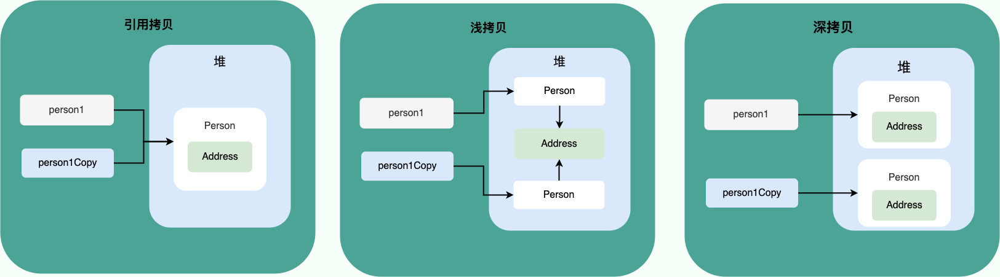

# 面向对象

## 面向对象的特征

- 封装
- 继承
- 多态

## 接口和抽象类的区别

- 抽象类是对类的抽象，接口是对行为的抽象

类可以实现多个接口，但只能继承一个抽象类

## 深拷贝，浅拷贝，引用拷贝

- 浅拷贝：在堆上创建一个新的对象，但是只是复制了对象的引用，对象的内容并没有复制，所以新对象和原对象的内容是一样的
- 深拷贝：在堆上创建一个新的对象，同时复制了对象的内容，所以新对象和原对象的内容是不一样的
- 引用拷贝：不会创建新的对象，只是复制了对象的引用，所以新对象和原对象的内容是一样的

## Object类

Object是所有类的父类，因此任何类的对象都可以赋值给Object类型的变量。

### Object的方法

- `equals`：比较的是内容
- `hashCode`：返回对象的哈希码值

