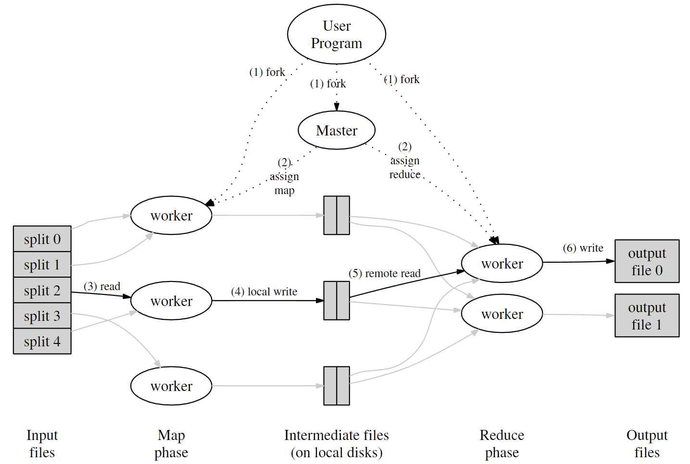
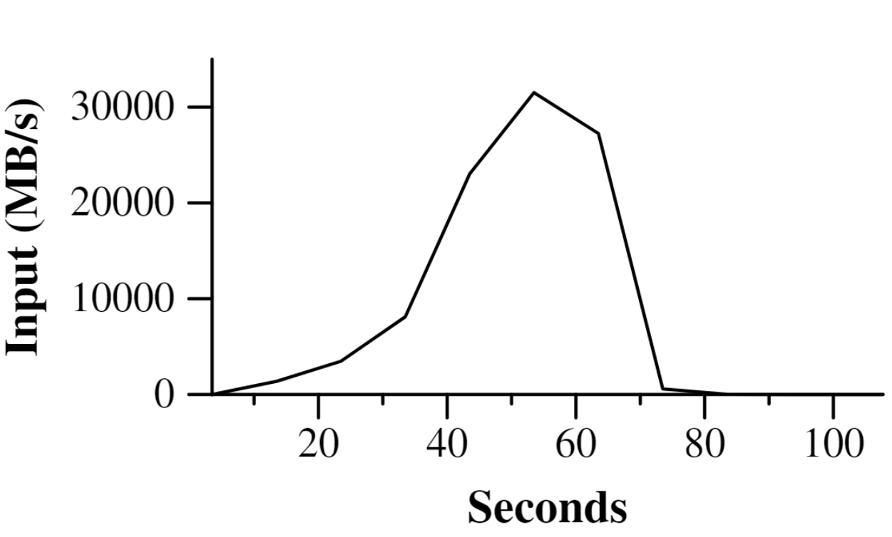
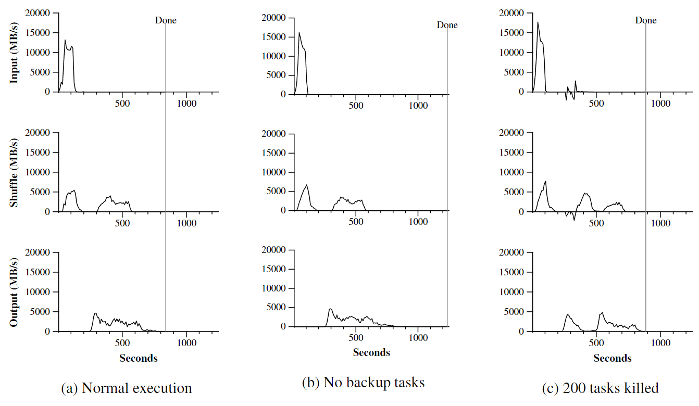
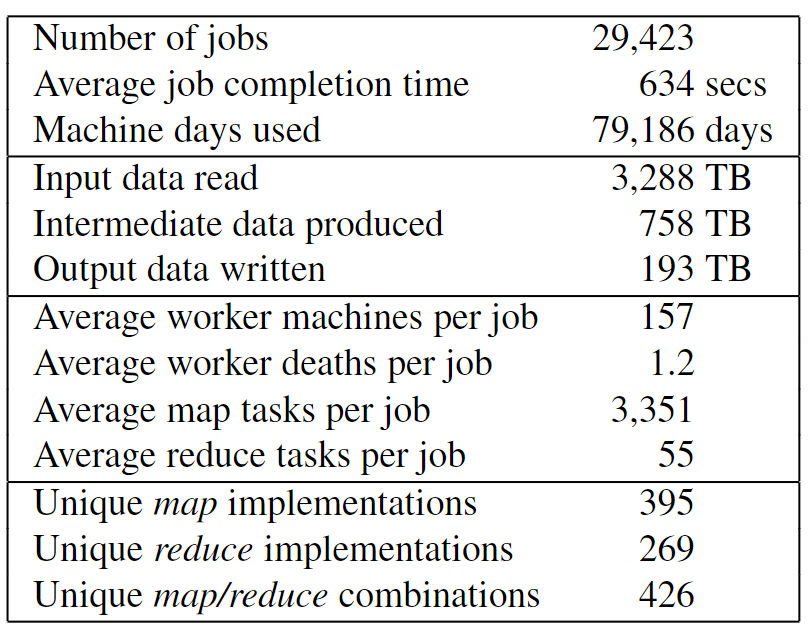

MapReduce: 一种用于大规模数据处理的简化并行计算模型

引用: Jeffrey Dean and Sanjay Ghemawat. 2008. MapReduce: simplified data processing on large clusters. Commun. ACM 51, 1 (January 2008), 107–113. https://doi.org/10.1145/1327452.1327492

论文: [MapReduce: Simplified Data Processing on Large Clusters](https://static.googleusercontent.com/media/research.google.com/zh-CN//archive/mapreduce-osdi04.pdf

## 摘要

MapReduce 是一个用于处理和生成大数据集的编程模型和相关实现。

用户需要指定一个 map 函数来处理键/值对，生成一组中间键/值对，还有一个 reduce 函数来合并与同一个中间键相关联的所有中间值。

许多现实世界的任务都可以用这个模型来表达，就像论文中所示的那样。以**这种函数式风格编写的程序会自动并行化**，并在一大群廉价机器上执行。运行时系统负责处理输入数据的分区细节，调度程序在一组机器上的执行，处理机器故障，并管理所需的机器间通信。

这使得没有任何并行和分布式系统经验的程序员可以轻松利用大型分布式系统的资源。

我们的 MapReduce 实现运行在一大群廉价机器上，而且具有高度可扩展性：典型的 MapReduce 计算在成千上万台机器上处理着数百 TB 的数据。程序员发现这个系统易于使用：已经实现了数百个 MapReduce 程序，并且每天有上千个 MapReduce 作业在 Google 的集群上执行。

## 1. 介绍

在过去的五年里，作者和谷歌的许多其他人实现了数百种专用计算，处理大量原始数据，例如爬取的文档、网页请求日志等，以计算各种派生数据，例如倒排索引、网页文档的图结构的各种表示、每个主机爬取的页面数量摘要，给定日中最常见的查询集等等。大多数**这样的计算在概念上都很简单**。但是，输入数据通常很大，计算必须分布在数百甚至数千台机器上才能在合理的时间内完成。**如何并行化计算、分布数据以及处理故障等问题，使原本简单的计算变得复杂**，需要大量的复杂代码来解决这些问题。

针对这种复杂性，我们设计了一个新的抽象，**允许我们表达我们试图执行的简单计算，但隐藏了并行化、容错、数据分布和负载平衡等混乱的细节在一个库**中。我们的抽象受到Lisp和许多其他函数式语言中存在的map和reduce原语的启发。

我们意识到，我们的大多数计算涉及将map操作应用于输入中的每个逻辑“记录”，以计算一组中间键/值对，然后将reduce操作应用于所有共享相同键的值，以适当地组合派生数据。我们使用具有**用户指定的map和reduce操作的函数模型，可以轻松地并行化大型计算，并使用重新执行作为容错的主要机制**。

这项工作的主要贡献是一个简单而强大的接口，可以实现大规模计算的自动并行化和分发，结合了该接口的一个实现，在大规模PC集群上实现了高性能。

- 第2节描述了基本编程模型并给出了几个示例。
- 第3节描述了针对我们基于集群的计算环境定制的MapReduce接口的实现。
- 第4节描述了我们发现有用的编程模型的几个细化。
- 第5节对我们的实现在各种任务中的性能进行了测量。
- 第6节探讨了在谷歌内部使用MapReduce的情况，包括我们将其用作重写生产索引系统的基础的经验。
- 第7节讨论了相关和未来的工作。

## 2. 编程模型

编程模型计算接受一组输入键/值对，并产生一组输出键/值对。MapReduce库的用户将计算表示为两个函数：Map和Reduce。

用户编写的Map函数接受一个输入对，并生成一组中间键/值对。MapReduce库将所有与相同中间键I关联的中间值组合在一起，并将它们传递给Reduce函数。

Reduce函数也由用户编写，接受一个中间键I和该键的一组值。它将这些值合并在一起，形成可能更小的一组值。通常，每次调用Reduce都只产生零个或一个输出值。中间值通过迭代器提供给用户的reduce函数。这使我们能够处理太大而无法放入内存的值列表。

### 2.1 示例

下面考虑在大量文档集合中计算每个单词出现次数的问题。用户将编写类似以下伪代码的代码:

```python
    map(String key, String value):
      // key: 文档名
      // value: 文档内容
      for each word w in value:
        EmitIntermediate(w, "1");

    reduce(String key, Iterator values):
      // key: 单词
      // values: 与key关联的值的迭代器
      int result = 0;
      for each v in values:
        result += ParseInt(v);
      Emit(AsString(result));
```

Map函数将文档名和内容作为输入，并为每个单词w生成一组中间键/值对。对于每个单词，我们发出一个中间键/值对，其中键是单词，值是字符串“1”。

reduce函数将为特定单词发出的所有计数相加在一起。

此外，用户编写代码来填写一个mapreduce规范对象，其中包含输入和输出文件的名称，以及可选的调优参数。

然后，用户调用MapReduce函数，将规范对象传递给它。用户的代码与MapReduce库（用C++实现）链接在一起。

此示例的完整程序文本:
```cpp
// 本节包含一个程序，用于统计命令行指定的一组输入文件中每个唯一单词的出现次数。
#include "mapreduce/mapreduce.h"

// 用户的map函数
class WordCounter : public Mapper {
public:
    virtual void Map(const MapInput& input) {
        const string& text = input.value();
        const int n = text.size();
        for (int i = 0; i < n; ) {
            // 跳过前导空白
            while ((i < n) && isspace(text[i]))
                i++;
            // 寻找单词结尾
            int start = i;
            while ((i < n) && !isspace(text[i]))
                i++;
            if (start < i)
                Emit(text.substr(start, i - start), "1");
        }
    }
};

REGISTER_MAPPER(WordCounter);

// 用户的reduce函数
class Adder : public Reducer {
    virtual void Reduce(ReduceInput* input) {
        // 遍历所有具有相同键的条目，并将值相加
        int64 value = 0;
        while (!input->done()) {
            value += StringToInt(input->value());
            input->NextValue();
        }
        // 发出输入键（input->key()）的总和
        Emit(IntToString(value));
    }
};

REGISTER_REDUCER(Adder);

int main(int argc, char** argv) {
    ParseCommandLineFlags(argc, argv);
    MapReduceSpecification spec;

    // 将输入文件列表存储到 "spec" 中
    for (int i = 1; i < argc; i++) {
        MapReduceInput* input = spec.add_input();
        input->set_format("text");
        input->set_filepattern(argv[i]);
        input->set_mapper_class("WordCounter");
    }

    // 指定输出文件:
    // /gfs/test/freq-00000-of-00100
    // /gfs/test/freq-00001-of-00100
    // ...
    MapReduceOutput* out = spec.output();
    out->set_filebase("/gfs/test/freq");
    out->set_num_tasks(100);
    out->set_format("text");
    out->set_reducer_class("Adder");

    // 可选: 在map任务中执行部分求和以节省网络带宽
    // 组合器函数
    out->set_combiner_class("Adder");

    // 调优参数: 最多使用2000台机器和每个任务100 MB的内存
    spec.set_machines(2000);
    spec.set_map_megabytes(100);
    spec.set_reduce_megabytes(100);

    // 现在运行它
    MapReduceResult result;
    if (!MapReduce(spec, &result))
        abort();

    // 完成: 'result' 结构包含有关计数器、花费时间、使用的机器数量等的信息
    return 0;
}

```


### 2.2 类型

即使先前的伪代码是以字符串输入和输出为基础编写的，从概念上讲，用户提供的Map和Reduce函数具有关联的类型：
```python
    map (k1,v1) -> list(k2,v2)
    reduce (k2,list(v2)) -> list(v2)
```

也就是说，输入的键和值和输出的键和值来自不同的领域。此外，**中间键和值来自与输出键和值**相同的领域。

我们的 C++ 实现将字符串传递给用户定义的函数，并将其留给用户代码在字符串和适当类型之间进行转换。


### 2.3 更多示例
以下是几个简单的有趣程序的示例，可以很容易地表达为 MapReduce 计算。

分布式 Grep：如果匹配提供的模式，则Map函数发出一行。Reduce函数是一个恒等函数，只是将提供的中间数据复制到输出。

URL 访问频率计数：Map函数处理 Web 页面请求的日志并输出 〈URL，1〉。Reduce函数将同一 URL 的所有值相加，并发出一个 〈URL，总计数〉 对。

反向 Web-Link 图：Map函数为在名为源的页面中找到的指向目标 URL 的每个链接输出 〈目标，源〉 对。Reduce函数将与给定目标 URL 关联的所有源 URL 的列表串联在一起，并发出：〈目标，列表（源）〉

每个主机的术语向量：术语向量汇总了出现在文档或一组文档中的最重要的单词，作为 〈word，frequency〉 对的列表。Map函数为每个输入文档（其中主机名从文档的 URL 中提取）发出一个 〈主机名，术语向量〉 对。Reduce函数为给定主机传递了所有每文档术语向量。它将这些术语向量相加，丢弃不经常出现的术语，然后发出一个最终的 〈主机名，术语向量〉 对。

倒排索引：Map函数解析每个文档，并发出一系列 〈单词，文档 ID〉 对。Reduce函数接受给定单词的所有对，对相应的文档 ID 进行排序，并发出一个 〈单词，文档 ID 列表〉 对。所有输出对的集合形成一个简单的倒排索引。很容易扩展这个计算以跟踪单词位置。

分布式排序：Map函数从每个记录中提取键，并发出一个 〈键，记录〉 对。Reduce函数保持所有对不变地发出。此计算依赖于第 4.1 节描述的分区设施和第 4.2 节描述的排序属性。


## 3 实施

MapReduce 接口的许多不同实现是可能的。正确的选择取决于环境。例如，一个实现可能适用于小型共享内存机器，另一个适用于大型 NUMA 多处理器，还有一个适用于更大的网络机器集合。

本节描述了一个针对谷歌广泛使用的计算环境的实现：大量使用廉价个人计算机连接在一起，采用交换式以太网 [4]。在我们的环境中：
1. 机器通常是运行 Linux 的双处理器 x86 处理器，每台机器配备 2-4GB 内存。
2. 采用廉价的网络硬件 - 通常是 100 兆位/秒或 1 千兆位/秒的机器级别，但总体双向分割带宽要低得多。
3. 一个集群由数百或数千台机器组成，因此机器故障很常见。
4. 存储由廉价的 IDE 硬盘直接连接到个别机器上提供。内部开发的分布式文件系统 [8] 用于管理存储在这些硬盘上的数据。文件系统使用复制在不可靠的硬件上提供可用性和可靠性。
5. 用户向调度系统提交作业。每个作业由一组任务组成，并由调度程序Map到集群中的一组可用机器。

### 3.1 执行概述

Map 调用通过自动分区输入数据到一组 M 个分片的方式分布在多台机器上。输入分片可以由不同的机器并行处理。Reduce 调用通过使用分区函数（例如，hash(key) mod R）将中间键空间分成 R 个部分进行分区。分区数量（R）和分区函数由用户指定。


上图显示了我们实现的 MapReduce 操作的整体流程。当用户程序调用 MapReduce 函数时，将发生以下动作序列（图中的编号标签对应下面列表中的编号）：
1. 用户程序中的 MapReduce 库首先将输入文件分成 M 个片段，通常每个片段为 16 MB 到 64 MB（用户可以通过可选参数控制）。然后，在一组机器上启动许多程序副本。
2. 程序的其中一个副本是特殊的 - **主节点。其余的是工作节点，由主节点分配工作。有** M 个Map任务和 R 个Reduce任务要分配。主节点选择空闲的工作节点，并为每个分配一个Map任务或Reduce任务。
3. 被分配Map任务的工作节点读取相应输入分片的内容。它**从输入数据中解析出键/值对，并将每对传递给用户定义的 Map 函数**。由 Map 函数产生的中间键/值对在内存中进行缓冲。
4. **定期**，缓冲的对会被写入本地磁盘，并由分区函数分成 R 个区域。这些缓冲对的位置被传回给主节点，负责将这些位置转发给Reduce工作节点。
5. 当Reduce工作节点收到主节点关于这些位置的通知时，它**使用RPC从Map工作节点的本地磁盘读取缓冲数据**。当Reduce工作节点读取了所有中间数据时，它会根据中间键对数据进行排序，以便将相同键的所有出现组合在一起。**排序是必要的，因为通常许多不同的键Map到同一个Reduce任务。**如果中间数据量太大无法放入内存，则使用外部排序。
6. Reduce工作节点遍历排序后的中间数据，并对每个唯一的中间键进行处理，**将键和相应的中间值集合传递给用户的 Reduce 函数**。Reduce函数的输出附加到此Reduce分区的最终输出文件中。
7. 当所有Map任务和Reduce任务完成时，主节点唤醒用户程序。此时，用户程序中的 MapReduce 调用返回给用户代码。

成功完成后，mapreduce 执行的输出可用于 R 个输出文件中（**每个Reduce任务一个文件**，文件名由用户指定）。

通常，**用户不需要将这些 R 个输出文件合并为一个文件** - 他们通常将这些文件作为另一个 MapReduce 调用的输入，或者从另一个能够处理被分成多个文件的输入的分布式应用程序中使用它们。


### 3.2 主数据结构

主节点保持着几个数据结构。对于每个Map任务和Reduce任务，它存储状态（空闲、进行中或已完成），以及工作机器的标识（对于非空闲任务）。

主节点是中间文件区域的位置从Map任务传播到Reduce任务的通道。

因此，对于每个已完成的Map任务，主节点存储由该Map任务产生的 R 个中间文件区域的位置和大小。

当Map任务完成时，会接收到此位置和大小信息的更新。这些信息被逐步推送给具有正在进行的Reduce任务的工作节点。


### 3.3 容错性

由于 MapReduce 库旨在使用数百或数千台机器处理大量数据，因此该库必须能够优雅地容忍机器故障。

#### 工作节点故障

主节点**定期对每个工作节点进行 ping**。如果一段时间内没有从工作节点接收到响应，主节点将该工作节点标记为失败。

> 任何状态的Map任务被重置
由该工作节点完成的**任何Map任务**都将被重置回初始空闲状态，因此可以被重新调度到其他工作节点上。

> 进行中的Reduce被重置
类似地，由失败的工作节点**进行中**的任何Map任务或Reduce任务也将被重置为空闲状态，并且有资格重新调度。

> 已完成的Reduce任务不需要被重置

由于其输出存储在失败机器的本地磁盘上，因此**已完成的Map任务在失败时会被重新执行**，并且因此无法访问。
**已完成的Reduce任务无需重新执行**，因为其输出存储在全局文件系统中。


当工作节点 A 首先执行Map任务，然后稍后由工作节点 B（因为 A 失败）执行时，**执行Reduce任务的所有工作节点**都会收到重新执行的通知。
尚未从工作节点 A 读取数据的任何Reduce任务将从工作节点 B 读取数据。

MapReduce 对大规模工作节点故障具有弹性。
    例如，在一个 MapReduce 操作期间，运行中的集群上进行网络维护导致每次有 80 台机器成为几分钟内无法访问。MapReduce **主节点简单地重新执行了不可访问的工作节点机器完成的工作**，并继续向前推进，最终完成了 MapReduce 操作。


#### 主节点故障

主节点定期写入上述主数据结构的周期性检查点是很简单的。如果主任务死亡，则可以从最后一个检查点状态启动新的副本。

然而，考虑到只有一个主节点，它的故障是不太可能的；因此，我们当前的实现在主节点故障时会中止 MapReduce 计算。客户端可以检查此条件，并在需要时重试 MapReduce 操作。


#### 故障存在时的语义

当用户提供的Map和Reduce运算符是其输入值的确定性函数时，我们的分布式实现产生的输出与整个程序的非故障顺序执行所产生的输出相同。

我们依赖于Map和Reduce任务输出的原子提交来实现此属性。每个进行中的任务**将其输出写入私有临时文件**。

一个Reduce任务产生一个这样的文件，而**一个Map任务产生 R 个这样的文件（每个Reduce任务一个）**。

当Map任务完成时，工作节点向主节点发送一条消息，并在消息中包含 R 个临时文件的名称。如果主节点收到已经完成的Map任务的完成消息，则会忽略该消息。否则，它会将 R 个文件的名称记录在主数据结构中。

当Reduce任务完成时，Reduce工作节点**将其临时输出文件原子地重命名为最终输出文件**。如果相同的Reduce任务在多个机器上执行，则**对同一最终输出文件将执行多个重命名调用**。我们依赖底层文件系统提供的原子重命名操作来保证最终的文件系统状态仅包含由Reduce任务的一次执行产生的数据。

我们的大多数Map和Reduce运算符是确定性的，而我们的语义在这种情况下等同于顺序执行，这使得程序员很容易理解其程序的行为。当Map或Reduce运算符是非确定性的时，我们提供了更弱但仍合理的语义。

在非确定性运算符存在的情况下，特定Reduce任务 R1 的输出等同于顺序执行非确定性程序产生的 R1 的输出。然而，不同Reduce任务 R2 的输出可能对应于**由不同顺序执行非确定性程序产生的 R2 的输出**。

考虑Map任务 M 和Reduce任务 R1 和 R2。设 e(Ri) 是执行 Ri 的已提交的执行（正好有一个这样的执行）。较弱的语义出现是因为 e(R1) 可能已读取由 M 的一个执行产生的输出，而 e(R2) 可能已读取由 M 的不同执行产生的输出。


### 3.4 本地性
在我们的计算环境中，网络带宽是相对稀缺的资源。我们通过利用输入数据（由 GFS [8] 管理）存储在构成我们集群的机器的本地磁盘上的事实来节省网络带宽。

GFS 将每个文件划分为 64 MB 的块，并在不同的机器上存储每个块的多个副本（通常为 3 个副本）。

MapReduce 主节点考虑输入文件的位置信息，并尝试在包含相应输入数据副本的机器上安排Map任务。如果失败，它将尝试在靠近该任务输入数据副本的地方安排Map任务（例如，在与包含数据的机器相同网络交换机上的工作机器）。
当在集群中的大部分工作节点上运行大型 MapReduce 操作时，大多数输入数据都是本地读取的，不会消耗网络带宽。

### 3.5 任务粒度
我们将映射阶段细分为 M 个部分，将Reduce阶段细分为 R 个部分，如上所述。

理想情况下，M 和 R 应远大于工作节点的数量。让每个工作节点执行许多不同的任务可以改善动态负载平衡，并且在工作节点失败时加快恢复速度：它已完成的许多Map任务可以分散到所有其他工作节点上。

在我们的实现中，M 和 R 的大小存在实际的限制，因为主节点必须根据上述描述做出 O(M + R) 的调度决策，并在内存中保持 O(M * R) 的状态。（然而，内存使用的常数因子很小：状态的 O(M * R) 部分大约包含每个Map任务/Reduce任务对的一个字节的数据。）

此外，R 通常受用户约束，因为每个Reduce任务的输出最终都会在单独的输出文件中结束。

在实践中，我们倾向于选择 M，使每个单独的任务大约为 16 MB 到 64 MB 的输入数据（这样上面描述的本地性优化效果最佳），并且我们将 R 设为我们预期使用的工作节点数量的小倍数。

我们经常使用 M = 200,000 和 R = 5,000 来执行 MapReduce 计算，使用 2,000 个工作节点。

### 3.6 备用任务
延长 MapReduce 操作总时间的常见原因之一是“拖延者”：一个机器在计算中完成 **最后几个映射或Reduce任务中的一个** 时花费异常长的时间。

拖延者可能出现的原因很多。
- 一个有坏硬盘的机器可能会经常发生可纠正错误，从而将其读取性能从 30 MB/s 减慢到 1 MB/s。
- 集群调度系统可能已将其他任务调度到该机器上，导致由于竞争 CPU、内存、本地磁盘或网络带宽而更慢地执行 MapReduce 代码。
- 我们最近遇到的一个问题是机器初始化代码中的一个错误导致处理器缓存被禁用：受影响的机器上的计算速度下降了一百多倍。

我们有一个通用机制来缓解拖延者的问题。
- 当 MapReduce 操作**即将完成时**，主节点会**安排剩余正在进行的任务的备用执行**。
- 只要**主要执行或备用执行完成**，任务就被标记为已完成。
- 我们已经调整了这个机制，使其通常将操作使用的**计算资源增加不超过几个百分点**。

我们发现这显著缩短了完成大型 MapReduce 操作所需的时间。例如，第 5.3 节中描述的排序程序在禁用备用任务机制时需要花费的时间要长 44%。

## 4.优化
虽然简单地编写映射和Reduce函数提供的基本功能对大多数需求已足够，但我们发现一些扩展很有用。这些在本节中描述。

### 4.1 分区函数
MapReduce 的用户指定他们希望的Reduce任务/输出文件数量（R）。使用中间键上的分区函数将数据分区到这些任务中。

提供了一个默认的分区函数，使用哈希（例如“hash(key) mod R”）。这往往会产生相当均衡的分区。

但是，在某些情况下，通过键的某些其他函数对数据进行分区是有用的。例如，有时输出键是 URL，我们希望所有单个主机的条目都最终出现在同一个输出文件中。

为了支持这种情况，MapReduce 库的用户可以提供一个特殊的分区函数。例如，使用“hash(Hostname(urlkey)) mod R”作为分区函数将导致同一主机的所有 URL 最终出现在同一个输出文件中。

### 4.2 排序保证
我们保证在给定分区内，中间键/值对按照递增的键顺序处理。

这个排序保证使得生成每个分区的排序输出文件变得容易，当输出文件格式需要支持通过键进行高效的随机访问查找，或者输出的用户发现按排序数据很方便时，这是很有用的。

### 4.3 组合器功能
在某些情况下，每个Map任务产生的**中间键中存在重复**，并且用户指定的Reduce函数是**可交换和可结合**的。

这种情况的一个很好的例子是第 2.1 节中的单词计数示例。由于单词频率往往遵循 Zipf 分布，每个Map任务将产生数百或数千个形式为 <the, 1> 的记录。

所有这些计数都将通过网络发送到单个Reduce任务，然后由Reduce函数相加以产生一个数字。我们**允许用户指定一个可选的组合器函数**，在将数据发送到网络之前对其进行部分合并。

组合器函数在执行Map任务的每台机器上执行。通常情况下，相同的代码用于实现组合器和Reduce函数。

Reduce函数和组合器函数之间唯一的区别是 MapReduce 库如何处理函数的输出。Reduce函数的输出写入最终输出文件。组合器函数的输出写入一个**中间文件**，该文件将被发送到Reduce任务。

部分合并显着加速了某些类别的 MapReduce 操作。
2.1示例中使用了组合器函数

### 4.4 输入和输出类型
MapReduce 库提供了对几种不同格式的输入数据进行读取的支持。

例如，“文本”模式输入将每一行视为一个键/值对：键是文件中的偏移量，值是行的内容。另一个常见的支持格式存储按键排序的键/值对序列。

每种输入类型的实现都知道如何将自己分割成适当的范围以作为单独的Map任务进行处理（例如，文本模式的范围分割确保范围分割仅发生在行边界处）。

用户可以通过**提供简单的读取器接口的实现来添加对新输入类型的支持**，尽管大多数用户只使用少量预定义的输入类型之一。

读取器不一定需要提供从文件读取的数据。例如，可以轻松定义一个从数据库或内存中映射的数据结构中读取记录的读取器。

类似地，我们**支持一组输出类型**，以产生不同格式的数据，用户代码可以轻松地添加对新输出类型的支持。

### 4.5 副作用
在某些情况下，MapReduce 的用户发现从他们的Map和/或Reduce操作中**产生辅助文件作为附加输出**是很方便的。

我们**依赖于应用程序编写者使这些副作用具有原子性和幂等性**。通常，应用程序将写入临时文件，**并在完全生成后原子地**将此文件重命名。

我们**不支持由单个任务产生的多个输出文件的原子两阶段提交**。因此，产生具有跨文件一致性要求的多个输出文件的任务应该是确定性的。在实践中，这种限制从未成为问题。


### 4.6 跳过错误记录
有时用户代码中存在错误，导致 Map 或 Reduce 函数在某些记录上出现确定性崩溃。这种错误会阻止 MapReduce 操作完成。

通常的做法是修复错误，但有时这是不可行的；也许错误是由于不可用的第三方库中的 bug。

此外，有时可以忽略一些记录，例如在大型数据集上进行统计分析时。我们提供了一种可选的执行模式，其中 MapReduce 库会**检测哪些记录导致确定性崩溃，并跳过这些记录以继续向前推进**。

每个工作进程都安装了一个信号处理程序，用于捕获段错误和总线错误。在调用用户的 Map 或 Reduce 操作之前，MapReduce 库会将参数的序列号存储在一个全局变量中。如果用户代码生成信号，信号处理程序会发送一个“最后一口气”的 UDP 数据包，其中包含序列号到 MapReduce 主节点。

当主节点在特定记录上看到多次失败时，它表示应该在下一个重新执行相应的 Map 或 Reduce 任务时跳过该记录。

### 4.7 本地执行
调试 Map 或 Reduce 函数中的问题可能会很棘手，因为实际的计算发生在一个分布式系统中，通常在数千台机器上进行，并由主节点动态地进行工作分配决策。

为了帮助进行调试、分析和小规模测试，我们开发了 MapReduce 库的替代实现，它在本地机器上顺序执行 MapReduce 操作的所有工作。为用户提供了控制，以便计算可以限制在特定的Map任务上。

用户使用特殊标志调用其程序，然后可以轻松地使用任何有用的调试或测试工具（例如 gdb）。

### 4.8 状态信息
主节点运行一个内部 HTTP 服务器，并为人类消费者导出一组状态页面。

状态页面显示计算的进度，例如已完成多少任务、正在进行多少任务、输入字节数、中间数据字节数、输出字节数、处理速率等。

页面还包含每个任务生成的标准错误和标准输出文件的链接。用户可以使用这些数据来预测计算需要多长时间，以及是否应该向计算中添加更多资源。这些页面还可以用于确定计算是否比预期的慢得多。

此外，顶级状态页面显示了哪些工作节点失败，以及它们在失败时正在处理哪些映射和缩减任务。在尝试诊断用户代码中的错误时，这些信息非常有用。


### 4.9 计数器
MapReduce 库提供了一个计数器功能，用于**计算各种事件的发生次数**。

例如，用户代码可能希望计算处理的总单词数或索引的德语文档数等。

要使用此功能，用户代码创建一个命名计数器对象，然后在 Map 和/或 Reduce 函数中适当地递增计数器。例如：
```python
Counter* uppercase;
uppercase = GetCounter("uppercase");
map(String name, String contents):
    for each word w in contents:
        if (IsCapitalized(w)):
            uppercase->Increment();
        EmitIntermediate(w, "1");
```

来自各个工作机器的计数器值会**定期传播到主节点（通过 ping 响应搭载）**。

主节点汇总成功的映射和缩减任务的计数器值，并在 MapReduce 操作完成时将它们返回给用户代码。
当前的计数器值也显示在主节点状态页面上，以便人类观察实时计算的进度。

在聚合计数器值时，**主节点消除相同映射或缩减任务的重复执行的影响**，以避免重复计数。（重复执行可能源自我们对备用任务的使用以及由于失败而重新执行任务。）

MapReduce 库自动维护了一些计数器值，例如处理的输入键/值对数和生成的输出键/值对数。

用户发现计数器功能对于检查 MapReduce 操作的行为非常有用。例如，在某些 MapReduce 操作中，用户代码可能希望确保生成的输出对数恰好等于处理的输入对数，或者处理的德语文档的比例在总处理的文档数中的可容忍比例内。


## 5 性能
在这一部分，我们将衡量在一个大型机群上运行的两个计算的MapReduce性能。
- 一个计算搜索大约1TB的数据，寻找特定的模式。
- 另一个计算对大约1TB的数据进行排序。

这两个程序代表了MapReduce用户编写的真实程序的一个大的子集 - 一个类别的程序将数据从一种表示形式转换为另一种表示形式，另一个类别从大数据集中提取少量有趣的数据。

### 5.1 机群配置
所有程序都在一个包含大约1800台机器的机群上执行。每台机器配备两个2GHz的Intel Xeon处理器，并启用超线程技术，4GB内存，两个160GB IDE硬盘，以及一个千兆以太网连接。这些机器排列成一个两级树形交换网络，根节点拥有约100-200 Gbps的聚合带宽。所有机器都位于同一个托管设施，因此任何一对机器之间的往返时间都不到一毫秒。

在4GB内存中，大约有1-1.5GB被集群上运行的其他任务所占用。这些程序是在一个周末下午执行的，当时CPU、磁盘和网络大部分时间都是空闲的。

### 5.2 Grep
grep程序扫描10^10个100字节的记录，搜索一个相对罕见的三字符模式（该模式在92337条记录中出现）。输入被分成大约64MB的片段（M = 15000），整个输出放在一个文件中（R = 1）。


上图显示了随时间推移计算的进展情况。

Y轴显示了扫描输入数据的速率。随着越来越多的机器被分配给这个MapReduce计算，速率逐渐提高，当分配了1764个工作节点时，达到了30GB/s以上的峰值。随着映射任务的完成，速率开始下降，并且在计算进行到大约80秒时降为零。整个计算大约需要150秒完成。这包括约一分钟的启动开销。这种开销是由于将程序传播到所有工作机器，以及与GFS交互以打开1000个输入文件集并获取所需信息以进行位置优化而造成的延迟。


### 5.3 排序
sort程序对1010个100字节的记录进行排序（约1TB的数据）。该程序是模仿TeraSort基准测试[10]设计的。

排序程序由不到50行的用户代码组成。三行Map函数从文本行中提取一个10字节的排序键并发出键和原始文本行作为中间键/值对。我们使用内置的Identity函数作为Reduce运算符。这个函数将中间键/值对不改变地作为输出键/值对。最终排序后的输出被写入一组2路复制的GFS文件（即，程序的输出为2TB）。与之前一样，输入数据被分割成64MB的片段（M = 15000）。我们将排序后的输出分成4000个文件（R = 4000）。分区函数使用键的初始字节将其分隔成R个片段之一。我们的分区函数对这个基准测试具有键的分布的内置知识。在一般的排序程序中，我们会添加一个预处理的MapReduce操作，该操作将收集键的样本并使用样本键的分布来计算最终排序传递的分割点。


图显示了排序程序正常执行的进度。左上角的图表显示了读取输入的速率。速率峰值约为13 GB/s，并在大约200秒内迅速下降，因为所有的映射任务在200秒之前都已完成。请注意，输入速率小于grep。这是因为排序映射任务将大约一半的时间和I/O带宽用于将中间输出写入其本地磁盘。相应的grep的中间输出尺寸可以忽略不计。
左中的图表显示了数据从映射任务发送到减少任务的网络速率。这种洗牌在第一个映射任务完成后立即开始。图表中的第一个驼峰是约为1700个减少任务的第一批（整个MapReduce分配了约1700台机器，并且每台机器最多执行一个减少任务）。计算约300秒后，这些第一批减少任务中的一些完成，我们开始为剩余的减少任务洗牌数据。所有的洗牌在计算约600秒后完成。
左下的图表显示了排序数据由减少任务写入最终输出文件的速率。在第一个洗牌周期结束和写入周期开始之间有一个延迟，因为机器正在忙于排序中间数据。一段时间后，写入速率维持在约2-4 GB/s。所有写入在计算约850秒后完成。
包括启动开销，整个计算需要891秒。这与TeraSort基准测试[18]的当前最佳报告结果1057秒相似。
需要注意的几点：输入速率高于洗牌速率和输出速率，因为我们的局部性优化 - 大多数数据从本地磁盘读取，绕过了我们相对带宽受限的网络。洗牌速率高于输出速率，因为输出阶段写入了排序数据的两个副本（我们为了可靠性和可用性原因制作了输出的两个副本）。我们写入两个副本，因为这是我们底层文件系统提供的可靠性和可用性机制。如果底层文件系统使用纠删码[14]而不是复制，那么写入数据的网络带宽要求将会降低。


### 5.4 备份任务的影响
在图(b)中，我们展示了禁用备份任务的排序程序执行。执行流程与图3(a)中显示的类似，唯一不同的是存在一个非常长的尾部，在那里几乎没有任何写入活动发生。
在960秒后，除了5个减少任务外，所有任务都已完成。然而，这最后几个慢性病者直到300秒后才完成。整个计算需要1283秒，比经过的时间增加了44%。
### 5.5 机器故障
在图(c)中，我们展示了排序程序的执行，我们在计算几分钟后故意杀死了1746个工作进程中的200个。底层集群调度程序立即在这些机器上重新启动了新的工作进程（因为只有进程被杀死，机器仍然正常运行）。

工作进程的死亡表现为负的输入速率，因为一些之前完成的映射工作消失了（因为对应的映射工作者被杀死了），需要重新做。这个映射工作的重新执行发生得相对迅速。整个计算包括启动开销在内在933秒内完成（仅比正常执行时间增加了5%）。

## 6 经验
我们在2003年2月编写了MapReduce库的第一个版本，并在2003年8月进行了重大改进，包括局部性优化、动态负载平衡跨工作机器的任务执行等。自那时起，我们惊讶地发现MapReduce库在我们处理的问题类型上具有广泛的适用性。

它已经在Google内部的各个领域广泛应用，包括：
- 大规模机器学习问题，
- Google新闻和Froogle产品的聚类问题，
- 提取用于生成流行查询报告（例如Google Zeitgeist）的数据，
- 为新实验和产品从网页中提取属性（例如从大量网页中提取地理位置以进行本地化搜索），
- 大规模图计算。


图4显示了随着时间的推移，我们在主要源代码管理系统中检入的单独MapReduce程序数量的显著增长，从2003年初的0增加到截至2004年9月底近900个独立实例。MapReduce之所以如此成功，是因为它使得编写一个简单的程序，并在半个小时内在一千台机器上高效运行成为可能，极大地加快了开发和原型周期。此外，它允许没有分布式和/或并行系统经验的程序员轻松利用大量资源。在每个作业结束时，MapReduce库记录了作业使用的计算资源的统计信息。


在表1中，我们展示了Google在2004年8月运行的一些MapReduce作业的统计信息子集。

### 6.1 大规模索引
迄今为止，我们对MapReduce的最重要的使用之一是完全重写了用于Google网页搜索服务的生产索引系统。索引系统将由我们的爬取系统检索到的大量文档作为输入，存储为一组GFS文件。这些文档的原始内容超过20TB的数据。索引过程作为五到十个MapReduce操作的序列运行。使用MapReduce（而不是之前版本索引系统中的特定分布式操作）带来了几个好处：
- 索引代码更简单、更小、更容易理解，因为处理容错、分布和并行化的代码被隐藏在MapReduce库中。例如，计算的一个阶段的代码量从约3800行C++代码减少到使用MapReduce表达时约为700行。
- MapReduce库的性能足够好，我们可以将概念上无关的计算分开，而不是将它们混合在一起以避免对数据的额外传递。这使得改变索引过程变得容易。例如，在旧的索引系统中需要几个月的变更，在新系统中只需要几天就能实现。
- 索引过程的操作变得更加容易，因为大部分由机器故障、慢机器和网络故障引起的问题都由MapReduce库自动处理，无需操作员干预。此外，通过向索引集群添加新机器来改进索引过程的性能也很容易。


## 7 相关工作
许多系统提供了受限制的编程模型，并利用这些限制自动并行化计算。例如，可以使用并行前缀计算在N个处理器上以log N时间计算N个元素数组的所有前缀[6, 9, 13]。根据我们在大型现实世界计算中的经验，MapReduce可以被视为对其中一些模型的简化和提炼。更重要的是，我们提供了一个可容忍故障的实现，可以扩展到数千个处理器。相比之下，大多数并行处理系统只在较小的规模上实现，并将处理机器故障的细节留给程序员。

批量同步编程[17]和一些MPI原语[11]提供了更高级别的抽象，使程序员更容易编写并行程序。这些系统与MapReduce之间的一个关键区别在于，MapReduce利用受限编程模型来自动并行化用户程序，并提供透明的容错机制。

我们的局部性优化受到了诸如主动磁盘[12, 15]等技术的启发，其中计算被推送到靠近本地磁盘的处理元素，以减少跨I/O子系统或网络发送的数据量。我们在普通处理器上运行，其中直接连接了少量磁盘，而不是直接在磁盘控制器处理器上运行，但总体方法是相似的。

我们的备份任务机制类似于Charlotte系统[3]中采用的急切调度机制。简单的急切调度的一个缺点是，如果一个给定的任务导致重复的故障，整个计算将无法完成。我们通过跳过错误记录的机制来解决一些这样的问题。

MapReduce实现依赖于一种内部集群管理系统，该系统负责在大量共享机器上分发和运行用户任务。尽管本文的重点不在此，但集群管理系统在精神上与其他系统如Condor [16]类似。

MapReduce库中的排序设施与NOW-Sort [1]的操作类似。源机器（映射工作器）对要排序的数据进行分区，并将其发送到R个减少工作者之一。每个减少工作者在本地排序其数据（如果可能的话在内存中）。当然，NOW-Sort没有用户可定义的Map和Reduce函数，这使得我们的库具有广泛的适用性。

River [2]提供了一个编程模型，其中进程通过在分布式队列上发送数据进行通信。与MapReduce类似，River系统试图在异构硬件或系统扰动引入的非均匀性的情况下提供良好的平均性能。River通过仔细调度磁盘和网络传输来实现平衡的完成时间。MapReduce采用了一种不同的方法。通过限制编程模型，MapReduce框架能够将问题划分为大量的细粒度任务。这些任务动态地调度在可用工作者上，以便更快的工作者处理更多的任务。受限编程模型还允许我们在作业结束时调度任务的冗余执行，这在存在非均匀性（例如慢速或卡住的工作者）时极大地减少了完成时间。

BAD-FS [5]与MapReduce有着非常不同的编程模型，与MapReduce不同，它的目标是跨广域网络执行作业。然而，它们有两个基本的相似之处。一是这两个系统都使用冗余执行来从故障引起的数据丢失中恢复。二是它们都使用了局部感知调度来减少在拥塞的网络链路上传输的数据量。

TACC [7]是一个旨在简化高可用网络服务构建的系统。与MapReduce类似，它依赖于重新执行作为实现容错的机制。

## 8 结论
MapReduce编程模型在Google被成功地用于许多不同的目的。我们将这一成功归因于几个原因。
- 首先，该模型易于使用，即使是对于没有并行和分布式系统经验的程序员，因为它隐藏了并行化、容错、局部优化和负载平衡的细节。
- 其次，大量的问题都可以很容易地表达为MapReduce计算。例如，MapReduce用于生成Google生产的网络搜索服务的数据，用于排序，数据挖掘，机器学习以及许多其他系统。
- 第三，我们开发了一个MapReduce的实现，可以扩展到包含数千台机器的大型集群。该实现有效地利用了这些机器资源，因此适用于Google遇到的许多大型计算问题。

我们从这项工作中学到了几件事情。
- 首先，限制编程模型使得并行化和分布计算变得容易，并使得这样的计算具有容错性。
- 其次，网络带宽是一种稀缺资源。因此，我们系统中的许多优化都旨在减少在网络上传输的数据量：局部优化允许我们从本地磁盘读取数据，将中间数据写入本地磁盘的单个副本可以节省网络带宽。
- 第三，冗余执行可以减少慢速机器的影响，并处理机器故障和数据丢失。