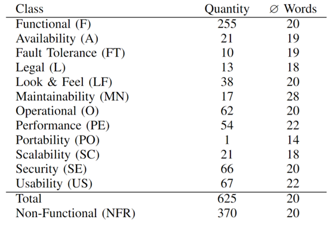
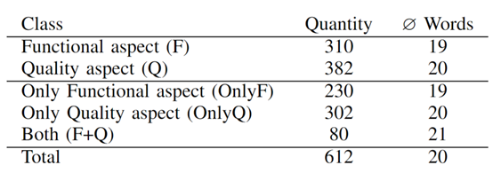
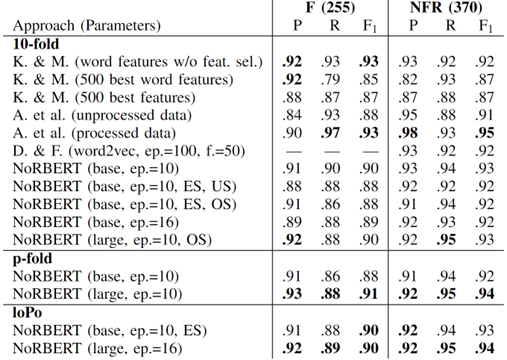

NoRBERT: Transfer Learning for Requirements Classification
Tobias Hey， Jan Keim， Anne Koziolek， Walter F. Tichy
Karlsruhe Institute of Technology (KIT)

## 引用
T. Hey, J. Keim, A. Koziolek and W. F. Tichy, "NoRBERT: Transfer Learning for Requirements Classification," 2020 IEEE 28th International Requirements Engineering Conference (RE), Zurich, Switzerland, 2020, pp. 169-179, doi: 10.1109/RE48521.2020.00028.

论文：https://sdq.kastel.kit.edu/publications/pdfs/hey2020.pdf 
仓库：https://github.com/tobhey/NoRBERT 

## 摘要
本文提出了NoRBERT，它使用了BERT模型进行微调，在需求工程领域进行迁移学习。他在PROMISE NFR数据集上，对功能性和非功能性需求的分类任务F1分数高达94％。对于分类非功能性需求的子类，超越了最近的方法，最常见的类别平均F1分数达到87%。在一个未见过的项目设置下，它比最近的方法高出15个百分点。此外，我们根据所包含的关注点，即功能、数据和行为，来分类功能性要求，标记了PROMISE NFR数据集中的功能性需求，并应用于测试NoRBERT，最终取得了高达92%的F1分数。NoRBERT提高了需求分类的准确性，并且可以很好地应用于未见过的项目。

## 1 引言
需求的主要来源仍然是自然语言文档。对需求进行分类对于在项目早期识别出特定需求（如与安全相关的需求）非常重要。尽管已有的自动分类方法在多样化数据集上表现不错，但它们在未见过的项目上的性能会下降，因为需求的表述和结构依赖于项目和作者，而现有方法缺乏泛化能力。为了解决这个问题，我们探索了迁移学习方法，这种方法在NLP领域广泛应用，通过在大型数据集上训练来捕捉文本的深层含义，并能针对特定任务进行微调，从而在少量数据下实现更好的性能和泛化。
我们提出了NoRBERT方法，它基于BERT模型。BERT是一种预训练在大型文本语料库上的语言模型。BERT可以通过提供少量数据在特定任务上进行微调。我们使用NoRBERT在PROMISE NFR数据集上进行需求分类，并测试了其在重新标记的NFR数据集上的泛化能力。此外，我们还使用NoRBERT根据Glinz提出的关注点对功能性需求进行分类。这种方法在需求工程中特别有用，因为它可以在有限的标记数据情况下提供有效的分类。
本文的贡献包括以下三方面：
	我们研究了通过迁移学习对已知和未知项目的需求进行分类的改进程度。
	我们提供了一个新的数据集，根据功能、数据和行为的关注点进一步对功能性需求进行分类。
	我们评估了基于迁移学习的方法在新数据集和任务上的表现。

## 2 技术介绍
### 2.1相关工作
在需求工程领域，功能性需求与非功能性需求的区分是一个广泛研究的主题。功能性需求指的是系统必须执行的具体任务，而非功能性需求则涉及系统的质量标准，如性能、可靠性等，它们没有明确的执行标准。一些研究者将非功能性需求视为质量目标，而另一些则将其归类为系统属性或约束。
自动从文档中提取和分类需求是研究者关注的重点，已经发展出多种方法。例如，Cleland-Huang等人利用信息检索技术，通过识别指示词来分类需求，但这种方法在精确度上有所欠缺。Hussain等人通过使用特定词汇和决策树分类器改进了需求分类。Kurtanović和Maleej则采用自动化特征选择来预测需求类别。还有研究者使用深度学习技术，如卷积神经网络（CNN），来分类需求。
尽管这些方法展示了不同技术的潜力，但它们在实际应用中可能存在局限性，如过度依赖特定数据集、对措辞和句子结构敏感，或需要手动预处理。此外，这些方法在泛化到新项目上的能力上也存在不足。为了解决这些问题，我们尝试迁移学习方法，以期望在较少的训练数据下实现更好的性能和泛化能力。
### 2.2 BERT介绍
BERT（Bidirectional Encoder Representations from Transformers）是一种语言模型（LM）。用于预测词序列中词的概率，具有迁移学习的能力，即能在微调后适应不同任务。它起源于词嵌入技术，如word2vec，但通过使用ELMo的双向LSTM解决了word2vec忽略词义歧义的问题。BERT采用预训练和微调的方法进一步发展了语言模型，。
BERT的核心是Transformer架构，它用自注意力编码器-解码器结构替代了LSTM。自注意力层让模型能够识别并赋予相关词更高的权重，而忽略不相关的词。Transformer的多头注意力机制使模型能同时关注不同位置的词，提高了对词义的理解。
BERT的训练结合了双向预训练和掩码语言建模。在训练中，一部分输入词被掩码，模型需要预测这些词，同时学习判断句子是否可能连续。这种训练方法使BERT在多个NLP任务上取得了优异的表现。
BERT有两个版本：基础模型和大模型，分别具有不同数量的编码器层、隐藏单元和注意力头，参数数量也有所不同。基础模型有1.1亿参数，而大模型有3.4亿参数。BERT最初是在英文维基百科和BooksCorpus上训练的。BERT和类似的方法目前正在取代传统的自然语言处理系统。Tenney等人对BERT的不同层次和底层学习结构的分析表明，BERT重塑了类似于NLP流水线的相似结构。
 
图1：用于微调 BERT 进行分类的架构。
图1展示了如何使用BERT进行分类。输入被分词。BERT的第一个输入标记始终是特殊标记[CLS]。标记[SEP]是一个特殊的分隔符标记，例如用于分隔句子，而标记[PAD]用于填充。对于分类和类似的下游任务，BERT产生的唯一输出是BERT为第一个标记([CLS])产生的输出，这是所有标记的聚合输出。这个聚合输出可以输入到一个单层前馈神经网络中，该网络使用softmax为不同类别分配概率。
## 3 实验评估
### 3.1 实验设置
研究问题。在本文中，我们研究以下研究问题： 
RQ1：迁移学习在需求分类中的表现如何？ 
RQ2：迁移学习是否提高了在未见项目上对需求进行分类的性能？ 
RQ3：迁移学习方法能够多大程度上检测到功能性需求的子类？ 
评估数据集。为了回答RQ1和RQ2，我们利用了两个现有的数据集。一个是广泛使用的PROMISE NFR数据集，该数据集在RE'17数据挑战中进行了处理，另一个是由Dalpiaz等人提供了一个重新标记的版本。前者来自15个项目的625个需求。这625个需求包括255个功能性需求和370个非功能性需求。表I显示了数据集中类别的分布以及每个类别需求的平均长度。每个需求只被标记为一个类别（F或11个NFR子类之一）。这些类别的分布不均匀。该数据集中F类要比NFR类少115个，且NFR子类的数量差异很大，从可用性的67个到可移植性的1个不等。可用性、安全性、操作性和性能是超过50个示例的类别，而容错性、法律性、可维护性和可移植性的类别则低于20个。
表I：原始 NFR 数据集的分布
  
由于数据集中F和NFR之间的区分有争议，并且数据集包含重复和错误标记的需求，Dalpiaz等人提供了一个重新标记的数据集。表II展示了数据集的概述。它仅由原始625个需求中的612个组成，并且仅使用了两个类别。一个需求可以具有功能性（F）或质量方面（Q）或两者都有。80个需求两者都有。230个需求仅具有功能性方面（OnlyF），而302个需求仅包含质量方面（OnlyQ）。
表II：重新标记的 NFR 数据集的分布

对比方法。基于数据集，我们将我们的方法应用于以下任务： 
任务1：在原始NFR数据集上对F/NFR进行二元分类。 
任务2：在原始NFR数据集上对四个最常见的NFR子类（US，SE，O，PE）进行二元和多类分类。 
任务3：在原始NFR数据集中对所有NFR子类进行多类分类。
任务4：使用Dalpiaz等人提供的重新标记的NFR数据集，根据功能和质量方面对需求进行二元分类。
评估指标。对于所有任务，使用精确率（P）、召回率（R）和F1分数（F1）。对于多类分类，还报告了预测类别的加权平均F1分数（A）。
采用不同的设置来评估这些任务，包括使用.75-split描述了一个单次分成75%训练和25%测试集分割的数据集，以及使用了分层的10折交叉验证，即将数据集分割为10次，其中90%为训练集，10%为测试集，并对结果进行平均。分层分割确保数据集中类别的分布在训练集和测试集中保持一致。
为了进一步研究方法的可迁移性，使用了两种特定于项目的折叠策略。使用p-fold描述了Dalpiaz等人使用的项目级交叉验证，将数据集分割为10次，其中3个项目作为测试集，12个项目作为训练集，确保功能和质量方面的均匀分布。此外，还使用了一种留一项目交叉验证（loPo），即在n-1个项目上进行n次训练，并在留出的项目上进行测试。对于像NFR子类这样高度不平衡的二元任务，我们尝试了欠采样和过采样策略。我们还尝试了早期停止（ES）和不同的训练周期数。早期停止是一种常用的正则化技术，用于避免迭代学习器过拟合。

### 3.2NORBERT: 使用BERT进行非功能性和功能性需求分类 
我们使用BERT的微调版本来研究迁移学习对需求分类任务的影响。
我们使用了两种不同的预训练BERT模型，基础和大型模型，都是带词性的版本。我们还尝试了不带词性的模型，但带词性的模型表现更好。这可能是因为需求中使用的命名实体被误认为是普通名词。我们使用BERT分词器，不对需求进行预处理。在预训练模型的基础上，我们定义了输出层，即分类头。我们使用BERT的序列中的第一个标记[CLS]的输出。这个输出被输入到由一个单层的线性神经元组成的前馈神经网络的分类头。输出直接计算自加权输入的总和（再加上一些偏差）。我们使用softmax函数为不同的标签获得概率分布。在训练过程中，我们使用交叉熵损失函数，并使用以下公式量化预测分布与真实分布的接近程度。：

H(p，q)=-∑_x▒〖p(x)  log⁡〖q(x)〗 〗

p(x)表示目标概率，q(x)表示实际概率，x代表不同的标签。对于正确标签，p(x)设为1，其他错误标签设为0。损失函数旨在惩罚不准确或不确定的预测，同时奖励那些准确的自信预测。
我们使用AdamW优化器而非传统的随机梯度下降来更新网络权重。AdamW引入了权重衰减校正，但不补偿偏差。我们设置权重衰减为0.01，最大学习率为2e-05，与BERT原始论文中的设置相同。实验表明，批量大小16在所有测试中表现最佳。我们根据模型大小设定最大序列长度，以优化性能并避免内存问题。
在微调NoRBERT的超参数时，我们认为增加训练周期可以提高模型对训练数据的拟合度，但也可能增加过拟合的风险。实验显示，对于二元分类，10到32个训练周期，对于多类分类，10到64个训练周期效果最佳。
### 3.3任务1分类功能性和非功能性需求 
对于第一个任务，我们想要衡量NoRBERT在原始PROMISE NFR数据库上将需求分类为功能性（F）或非功能性（NFR）的性能。
我们使用分层10折交叉验证设置来回答关于迁移学习在需求分类性能方面的RQ1。我们训练了二元分类模型，即预测一个需求是F还是NFR，并与其他最新方法进行比较。
表III：在 PROMISE NFR 数据集上的 F/NFR 分类。粗体数值显示每个类别的每个指标的最高得分。
 
表III显示了我们的结果与其它方法报告的结果的比较。NoRBERT 在功能性需求和非功能性需求的 F1 分数上分别为 90% 和 93%。在NFR上，除了依赖手动提供的字典和规则进行数据预处理的Abad等人的方法外，NoRBERT超过了所有其他方法。NoRBERT与之相比不需要手动预处理，因此可以轻松地迁移到任何其他数据集。
我们的10折交叉验证结果显示，模型性能不受BERT模型选择或训练周期数的显著影响。Kurtanovi ´c和Maleej在功能性需求上取得了更高的F1分数，但他们的方法可能存在过拟合问题。
表III中的结果也有助于回答关于我们方法泛化能力的RQ2。10折没有考虑到数据集包含不同项目、不同领域和措辞。为了评估在未见过的项目上的性能，我们使用了特定于项目的设置（loPo和p-fold）。结果与10折评估相似或更好。这表明NoRBERT能够从训练期间看到的措辞中泛化出来。在不同项目和领域的数据集上，NoRBERT也能保持稳定性能。这与需要针对每个项目调整的手动字典和规则定义方法形成鲜明对比。
### 3.4 非功能性需求子类的分类
为了解决PROMISE NFR数据库中定义的非功能性需求（NFR）子类的分类任务。首先研究了数据库中四个最频繁的NFR子类的分类（任务2）。接着还研究了所有NFR子类的分类（任务3）。
#### A. 任务2: 最常见NFR子类的分类
我们使用NoRBERT对四种最常见的NFR进行了二元和多类分类。结果显示，NoRBERT在二元分类中取得了高达83%的加权平均F1分数，在多类分类中达到了87%。NoRBERT在大多数类别上的表现都超过了Kurtanovi´c和Maleej的模型。此外，NoRBERT在不同设置下的表现也有所不同，最佳二元分类结果是在16个周期、过采样和早停的情况下获得的。
表V: NFR 数据集上所有 NFR 子类的多类别分类。16、32 和 50 表示使用的时代数，bin 表示二元分类，mult 表示多类分类，B 和 L 分别表示使用的 BERT 模型（基础/大型）。bin16 还额外使用了 OS，multiL32 使用了 ES。LDA 和 NB（朴素贝叶斯）是指 Abad 等人的方法，其中有（P）或没有（UP）预处理过的数据。
 
#### B. 任务3: 所有NFR子类的多类分类
我们使用NoRBERT对所有NFR子类别进行了多类分类。多类分类器尤其是在代表数量较少的类别上表现良好。所有多类模型在平均性能上都优于相应的二元分类器。基于BERT-large的模型在这项任务上表现最佳，这可能是因为它们具有更大的参数空间，能够更好地处理语言的微妙差异。NoRBERT在这项任务上的表现超过了Navarro-Almanza等人的方法，这表明迁移学习在这项任务上优于基于词嵌入的深度学习。
我们还探讨了NoRBERT在未见过的项目上的性能（RQ2）。在p折和loPo设置中，NoRBERT的性能略有下降，但多类分类器仍然优于二元分类器。尽管在loPo设置中NoRBERT的表现略逊于p折，但多类分类器和大型模型在所有设置中都优于二元分类器。
NoRBERT在分类NFR子类别方面表现出色，即使在训练数据有限的情况下也能识别出代表性不足的子类别。NoRBERT提供了一种可行的方法来替代手动数据预处理。
### 3.5 任务4: 功能性和质量方面的分类
功能性（F）和非功能性需求（NFR）之间的区别并不总是清晰的，一些需求包含了两者的方面。因此，我们在Dalpiaz等人提供的重新标记的PROMISE NFR数据库上衡量NoRBERT的性能[9]，并将NoRBERT与Kurtanovi´c和Maleej[8]的方法进行比较。
表 VI：重新标记的 PROMISE NFR 数据集中类的二元分类。粗体数值代表每个类别每个指标的最高分。星号标记的 F1 分数与其他出版物报道的精度和召回率不匹配。
 
表VI显示了在重新标记集上训练的二元分类器的结果。我们使用与Dalpiaz等人相同的设置，即.75-split、10-fold、p-fold和随机种子（42），此外还评估了loPo设置。NoRBERT在所有这些设置中都优于其他方法。因此，迁移学习方法明显提高了分类需求的性能（RQ1）。
在.75分割中，NoRBERT的基础模型在纯功能或质量类别上表现更佳，而大型模型在其他类别上表现更好。在10折交叉验证中，NoRBERT的最佳模型平均优于Dalpiaz等人的最佳模型10个百分点，尤其在仅含功能方面的需求上（F1得分91% vs 73%）。p折和loPo的结果显示NoRBERT在未见项目上的迁移能力强。与Kurtanovi´c和Maleej的方法相比，NoRBERT在处理未见项目上表现更好，平均F1得分高出15个百分点。
这表明NoRBERT具有良好的泛化能力，无需重新训练即可在实际项目中使用。我们认为，在评估需求分类方法时，应更重视其在未见项目上的表现。
### 3.6功能性需求的分类
NoRBERT在分类非功能性需求上表现出了良好的效果。现在研究它在分类功能性需求方面的表现。功能性需求通常根据它们所属的产品部分（例如用户界面或业务逻辑）来分类。有些模型则采用基于关注点的方法，包括功能性和行为性需求以及数据。如果我们想要开发能够自动理解功能性需求的系统，比如自动化追踪或建模系统，那么了解功能性需求的子类别就很重要，因为它们定义了需求可能的实现方式。
我们采用了Glinz提出的基于关注点的模型，它帮助我们理解功能性需求是描述系统的功能、系统展示的行为，还是仅仅是数据和数据结构。我们使用以下子类别：
	功能：系统应执行的功能。 例子：系统应允许房地产经纪人查询MLS信息。
	数据：应成为系统状态一部分的数据项或数据结构。 例子：审计报告应包括估计中使用的回收部件总数。
	行为：系统展示的行为或由一个或多个刺激触发的反应。 例子：如果射门被标记为命中，产品应允许进攻球员定义射门。
需求可能包含多个关注点，这些类别可能会重叠，例如，“只有注册客户可以购买流媒体电影”。它既包含功能也包含行为。
为了回答RQ3，即迁移学习方法是否能够识别功能性需求中的关注点，由两位作者独立手动标记了PROMISE NFR数据集中的310个功能性需求。我们使用了Krippendorff的α（Kα）来衡量标注者间的一致性，发现功能和数据类别的一致性超过了0.8，而行为类别的一致性为0.752，虽然略低，但仍然是可接受的。
表VII: 功能性需求数据集概述
 
表VII显示了项目中类别的分布。需求的数量少于每个项目中类别代表的数量，因为每个需求可能包含多个关注点。项目11到14包含的需求数量较少，因为它们主要由非功能性需求组成。
A. 在功能性需求数据集上评估NoRBERT
我们使用标记好的数据集来评估NoRBERT在分类功能性需求上的表现。我们训练了二元分类模型，并在10折交叉验证和loPo（低代表性项目）设置下进行了评估。
表 VIII：使用 NoRBERT 在新数据集上对功能性需求子类进行二元分类，采用 10 折交叉验证和 loPo 设置。粗体数值代表每个类别每个指标的最高分。b 和 l 分别代表基础模型和大型模型

表VIII结果显示，NoRBERT在功能和行为类别上表现良好，但在数据类别上的召回率较低。这可以归因于这个类别缺乏训练数据和数据集的不平衡。我们发现欠采样和过采样对不同类别的影响不同。
在loPo设置中，NoRBERT的表现与10折交叉验证相似，功能类别的F1分数甚至略有提高，但数据类别的性能下降到了56%。尽管如此，与10折交叉验证相比，这个结果仍然是好的。我们还发现，在loPo设置中，大型模型在所有类别上的表现优于基础模型，这可能是因为loPo设置要求更好的泛化能力。
为了回答RQ3，我们可以得出结论，对于这些数据量，NoRBERT在处理功能性需求方面表现不错，尤其是在功能和行为类别上。虽然数据类别的表现有待提高，但通过更多的训练数据，NoRBERT的性能有望进一步提升。这可能有助于能够改进诸如追踪链接恢复或自动化建模等方法。