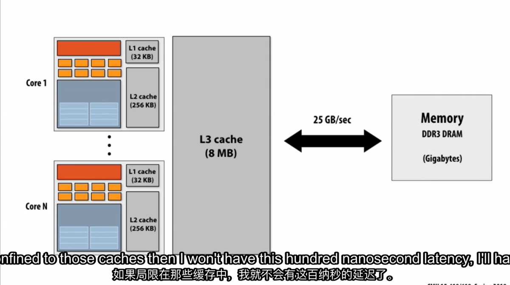
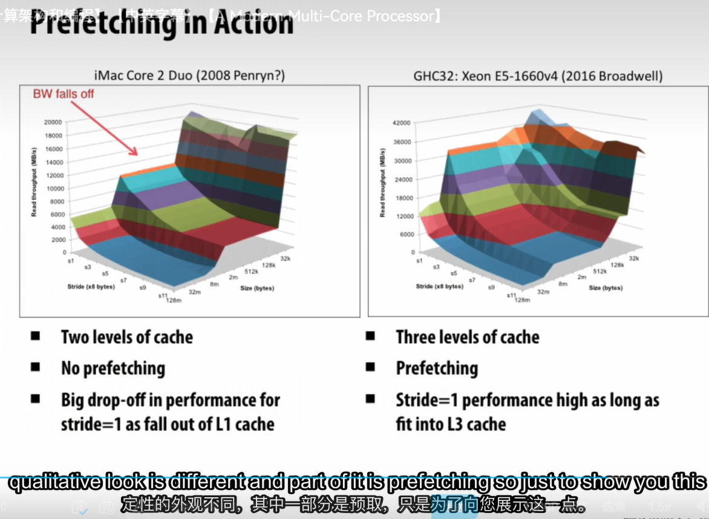
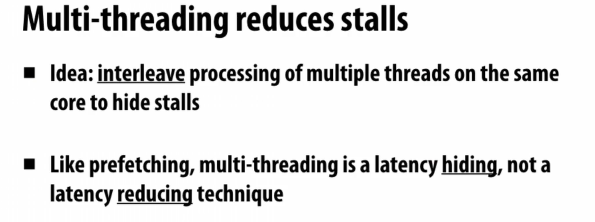
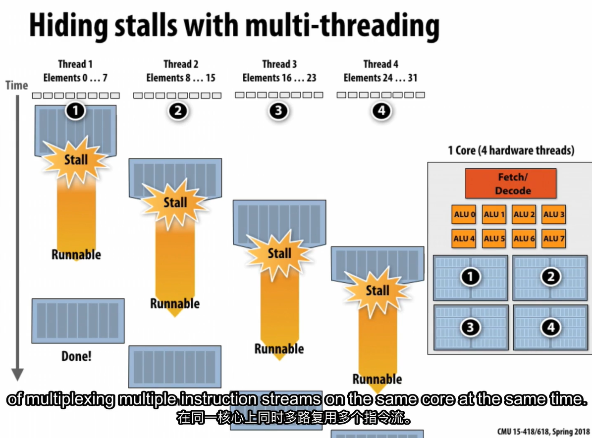

## 并行程序

```c++
void sinx(int N, int terms, float* x, float* result) {
    for (int i = 0; i < N; i++) {
        float value = x[i];
        float number = x[i] * x[i] * x[i];
        int sign = -1;
        int denom = 6;
        for (int j = 0; j < terms; j++) {
            value += sign * number / denom;
            sign *= -1;
            denom *= (2*j+3)*(2*j+2);
            number *= x[i] * x[i];
        }
        result[i] = value;
    }
}
```

转换成汇编后大致如下:

```asm
ld r0, addr[r1]
mul ri, r0, r0
mul r1, r1, r0

可以看到每次循环都是独立的。

对于最简单的是顺序执行。

通过超线程(超标量处理器具有从单个指令流中提取多个指令的能力)可以提高性能。有时称指令级并行性。(ILP, Instruction Level Parallelism)

但在这些汇编指令中必须顺序执行。
因此实现指令级并行性是一个挑战。


但即使是纯顺序执行的代码,也有很多方式使其运行更快(基于写代码的方式和编译器的智能程度). Pentium 4 比如先取多条指令等.

(有个黑匣子会预测分支,预测错误的话就会清空流水线,浪费时间)


解决方法:
1. 通过pthread编写并行性的程序
2. 假设有一种语言可以表示并行性,编译器可以自动并行化程序
如: forall(int i from 0 to n-1){}
   
   自动并行化可能的解决方法:
   1. 直接分为k个线程,每个线程处理n/k个循环. 然后将结果合并
   2. 在硬件上执行.

有一堆性能较低但具有并行性的处理器时, 也需要更多电力/时间来驱动很多信号从一端到另一端.


## CPU && GPU
GPU将核心的概念带到了极致, 抛弃了所有的分支预测, 只是控制逻辑而不完成计算.


对于上面的程序有垂直和水平两种分割方式:
- 垂直: 每个线程处理一个循环
- 水平: 同时处理多个循环, 如先同时进行所有的第一个乘法...


## SIMD Single Instruction Multiple Data
假设我正在执行的多次操作之间没有依赖关系,都能够并行运行.
a single instruction is applied to multiple data elements simultaneously.
即:
同时对8个数值和另一个地方的8个数值取出并进行加法. 有时这些数值可以被称作向量.

使用AVX intrinsics的向量化程序:
```c++
void sinx(int N, int terms, float* x, float* result) {

    for (int i = 0; i < N; i+=8) {
        __m256 origx = _mm256_load_ps(&x[i]);
        __m256 value = origx;
        __m256 number = _mm256_mul_ps(origx, _mm256_mul_ps(origx, origx));
        float sign = -1;
        __m256 denom = _mm256_set1_ps(6);
        for (int j = 0; j < terms; j++) {
            
            
            //value += sign * number / denom;
            __m256 tmp = _mm256_div_ps(number, denom);
            tmp = _mm256_mul_ps(tmp, _mm256_set1_ps(sign));
            value = _mm256_add_ps(value, tmp);
            sign *= -1;
            //denom *= (2*j+3)*(2*j+2);
            denom = _mm256_mul_ps(denom, _mm256_set1_ps((2*j+3)*(2*j+2)));
            
            //number *= x[i] * x[i];
            number = _mm256_mul_ps(number, _mm256_mul_ps(origx, origx));
        }
        _mm256_store_ps(&result[i], value);
        //result[i] = value;
    }
}
```

编译成汇编后大致如下:

```asm
vloadps xmm0, addr[r1]
vmulps xmm1, xmm0, xmm0
vmulps xmm2, xmm1, xmm0
...
...
...  
vstoreps addr[xmm2], xmm0
```

AVX代表高级矢量扩展, 256代表每次可以处理256位的数据, 也就是8个float.
有多个版本:

```md
AVX: 128位 = 4 * 4 * 8 = 32字节
AVX2: 256位 = 8 * 4 * 8 = 32字节
AVX512: 512位 = 16 * 4 * 8 = 64字节
```

XMM寄存器是特殊的32字节 256位寄存器, 有16个, 从xmm0到xmm15. 用于支持vectorized SIMD指令.

那么有没有办法让编译器自动将代码向量化呢?

- 有,GCC的-O3选项可以自动向量化代码.

但只有非常结构化,精心编写的代码才能被自动向量化.

### 条件

如果加入条件判断,如何向量化?

```c++
if(x < 0){
    x = -x;
}else{
    x = x;
}
```

SIMD可能的做法:
设置一个掩码, 用于标记哪些元素需要执行哪些不需要执行.

```md
x < 0: 1 1 0 0 1 0 0 0
x = -x: 1 1 0 0 1 0 0 0
翻转: 0 0 1 1 0 1 1 1
x = x: 0 0 1 1 0 1 1 1
```

但大多时候只保留了一半的效率,因为每次有可能只有一半的数据需要执行.
不过这很好的保证了一致性,因为分支结束后又回到了同一个执行路径.
即保持一致性,远离分歧.

coherent execution: 所有的线程都执行相同的指令.

divergent: a lack of instruction stream coherence.

对于生成这些矢量操作,要么有聪明的编译器,要么就是有耐心的程序员.

### SIMD execution on many modern GPUs

SPMD: Single Program Multiple Data

GPU给的不是SIMD,而是SPMD. 单个程序,多个数据. 意味着程序的不同部分可以执行不同的指令.

在这之下,还是用SIMD来实现大部分逻辑,采用异构的方式来实现并行.

但有n个加法, 即两个包含n个值的向量相加.
实际上不是所有单位都在等待计算.而是会先计算出如何分配到块中,底层块的实际大小是32, 32values而不是32byte. 这个被称作SIMD宽度,一般是8-32.

### GPU和CPU的差别

CPU i7:

- 4核
- 8 SIMD ALUs per core
- 每秒大概几千次浮点运算

GPU: RTX 1080

- 20 cores
- 32 SIMD ALUs per core
- 每秒大概8m次浮点运算

GPU的核心摒弃了分支预测等只用做control,因此可以有更多的ALU.填充进来.

大概是80:1的原始计算能力差异.

### 总结

三种方法实现并行计算

多核CPU:

- 线程级实现并行

SIMD:

- 指令级并行
- 通过向量化指令实现
- 但依赖于事先知道执行的指令优先级顺序

Superscaler:
exploit ILP within an instruction stream

## paart2 accessing memory

Memory latency: 从CPU到内存的时间

- example: DRAM访问时间 100 cycles, 100ns

Memory bandwidth: 从内存到CPU的时间

- example: 20GB/s 其实不是很快

Stall: CPU等待内存的时间
当cpu试图进行读取而内存不可用时，就会停等知道内存可用.

缓存就是为了解决Stall的问题.

在多级缓存中,靠近核心的缓存是私有的.

这样可以通过写入读出L2缓存的数据来实现通讯,而不需要经过DRAM.

缓存对延迟和带宽都有帮助.

### Prefecthing reduces stalls

硬件通常通过预取来**减少延迟**.
即预测下一次可能会访问的数据,并将其提前读取到缓存中.
不过可能会造成信息泄露

使用预取的效果:


### Multi-threading reduces stalls

让多个线程交替进行, 如asst1/prog2的实现


这也是超线程的实现,在一个核心中多路复用多个指令流.


对于CPU&GPU, 谁来组织线程是不同的做法.(操作系统 or 硬件)

通常情况下内存要比其他因素更加限制速度