## ISPC language

SPMD: Single Program Multiple Data
一种花哨的方式来说，就是一种并行编程的范式，它的特点是：在编程时，我们只需要写一个程序，然后在运行时，这个程序会被复制多份，每一份都会被分配到不同的处理器上去执行，这样就实现了并行。

用ISPC实现sinx

```c
export void sinx(uniform int N, uniform int terms,uniform float* x, uniform float* result){
    //assume N % programCount == 0
    for (uniform int i = 0; i < N;i += programCount){
        int idx = i + programIndex;
        float value = x[idx];
        float number = value * value * value;
        uniform int denom = 6;
        uniform int sign = -1;
        for (uniform int j = 0; j < terms; j++){
            value += sign * number / denom;
            number *= value * value;
            denom *= (2 * j + 3) * (2 * j + 2);
            sign *= -1;
        }
        result[idx] = value;
    }

}
```

使用C++来调用
调用ISPC的东西是个程序实例的集合, gang.

```c++
#include <iostream>
#include "sinx.ispc.h"

int N = 1000000;
int terms = 10;
float* x = new float[N];
float* result = new float[N];


//init x

//execute 
ispc::sinx(N,terms,x,result);

```

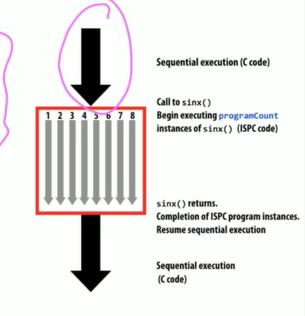

ispc中不需要手动设置programCount,programIndex

programCount: **number of simultaneous program** instances in the gang (uniform value)

programIndex: **id of the current program** instance in the gang(a non-uniform value)

uniform value: 一个值在gang中的所有实例中都是一样的

如果在ispc中直接使用sinx 并不会更快.

因为有一些相同的工作会被重复做很多次.
通过分离他们,可以减少重复计算的次数,从而提高效率.

一个设想的实现方法如下:
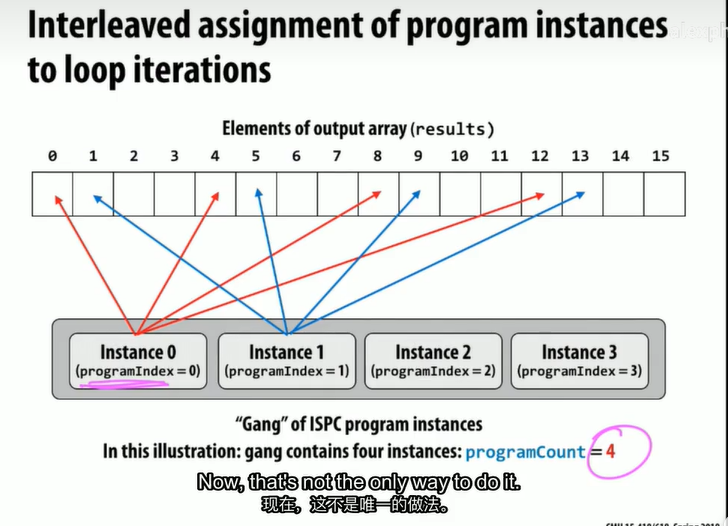

ISPC是为了更容易编写SIMD代码而设计的, 只需要通过特殊的宏或编译指示就可以使用SIMD指令.

programCount 就是 向量宽度

SPMD programming **abstraction**

ISPC compiler generates SIMD **implementation**

version2版本的代码,这是分块进行而不是交错的.

```c
export void sinx(uniform int N, uniform int terms,uniform float* x, uniform float* result){
    uniform int count = N / programCount;
    int start = programIndex * count;
    //assume N % programCount == 0
    for (uniform int i = 0; i < count;i += 1){
        int idx = start + i;
        float value = x[idx];
        float number = value * value * value;
        uniform int denom = 6;
        uniform int sign = -1;
        for (uniform int j = 0; j < terms; j++){
            value += sign * number / denom;
            number *= value * value;
            denom *= (2 * j + 3) * (2 * j + 2);
            sign *= -1;
        }
        result[idx] = value;
    }

}

```

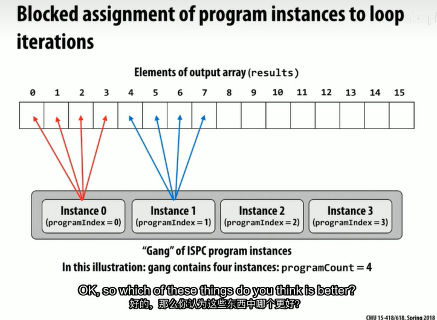

交错通常比分块更好,因为分块会导致数据的访问不连续. 当计算量不均匀时,分块会导致一些处理器的负载过重,而另一些处理器的负载过轻.

并且因为是同时进行的, 交错可以访问邻近的数据,这样可以增加cache的命中率.

根本原因:
矢量加载指令(寄存器)是一次加载多个数据,如果在很短的时间内,要加载的数据是连续的,那么就可以一次加载多个数据,如果数据是不连续的,那么就需要多次加载,这样就会降低效率.
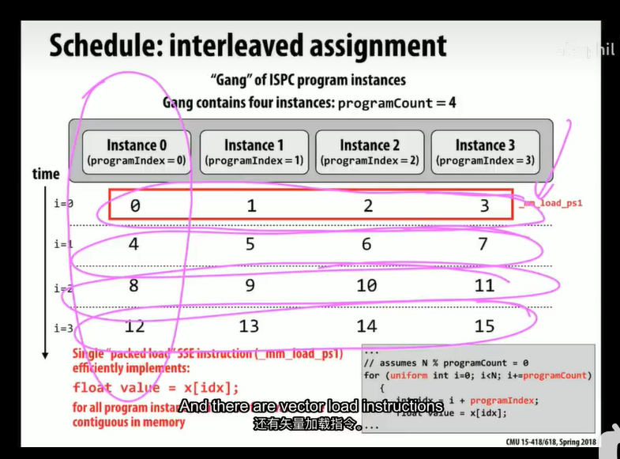

如果有个聪明的编译器,它可以自动将分块的代码转换为交错的代码,这样就可以兼顾两者的优点.

foreach就可以实现这个功能,让程序员不需要关心这些细节.

```c
export void sinx(uniform int N, uniform int terms,uniform float* x, uniform float* result){

    foreach(i = 0 ... N){
        float value = x[i];
        float number = value * value * value;
        uniform int denom = 6;
        uniform int sign = -1;
        for (uniform int j = 0; j < terms; j++){
            value += sign * number / denom;
            number *= value * value;
            denom *= (2 * j + 3) * (2 * j + 2);
            sign *= -1;
        }
        result[i] = value;
    }

}
```

ISPC的错误例子:

```c
export uniform float sumall(uniform int N, uniform float* x){
    uniform float sum = 0;
    foreach(i = 0 ... N){
        sum += x[i];
    }
    return sum;
}
```

错误:编译器会报错,因为sum是一个uniform value,它在所有的实例中都是一样的,但是在foreach中,每个实例都会对sum进行修改,这样就会导致错误.

修正这个错误:

```c
export uniform float sumall(uniform int N, uniform float* x){
    uniform float sum = 0;
    float partial_sum = 0;
    foreach(i = 0 ... N){
        partial_sum += x[i];
    }
    sum = reduce_add(partial_sum);
    return sum;
}
```

reduce_add原语: 允许将一组不同的值合并为一个值,这个值在所有的实例中都是一样的.

编译后的细节
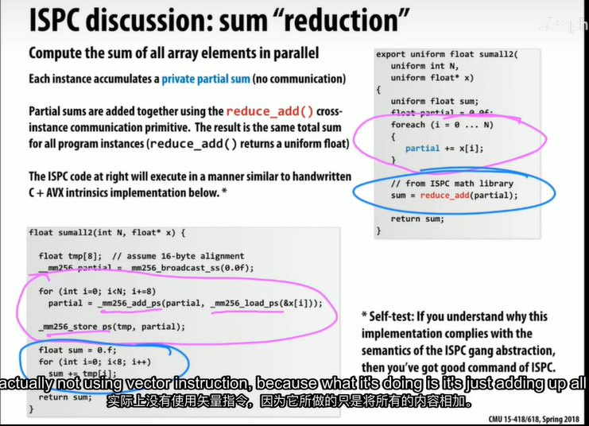

ISPC tasks: 基本上就是一个线程,但是它可以被分配到不同的处理器上去执行.

## 三种并行编程范式 和 三种 machine architecture

 聚焦于 communication 和 cooperation

 使用pthread时要call operate system
 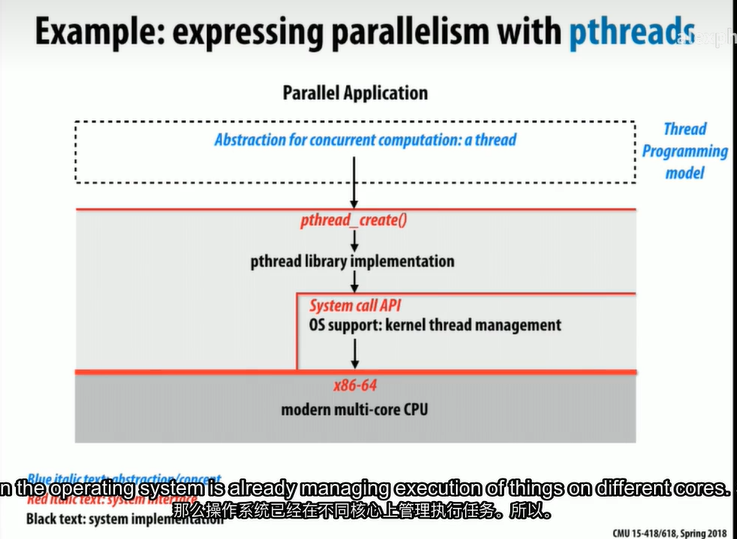

 而在ISPC中,只需要call compiler

 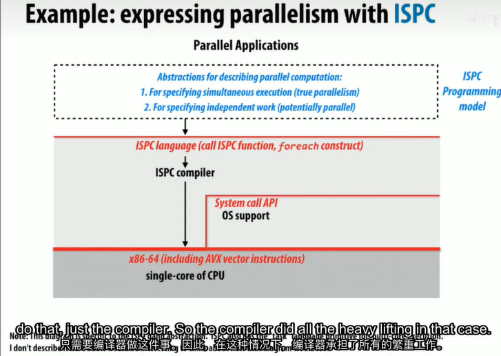

### Three models of communication(abstraction)

#### 1.Shared address space

asst3中会用到

多个线程之间通过互斥锁来进行通信

在硬件中, Dance-hall model
所有处理器在同一侧.

Symmetric Multiprocessor(SMP) system 就是如此

最简单的方式是总线, 但这样无法扩展,因为总线的带宽是有限的.
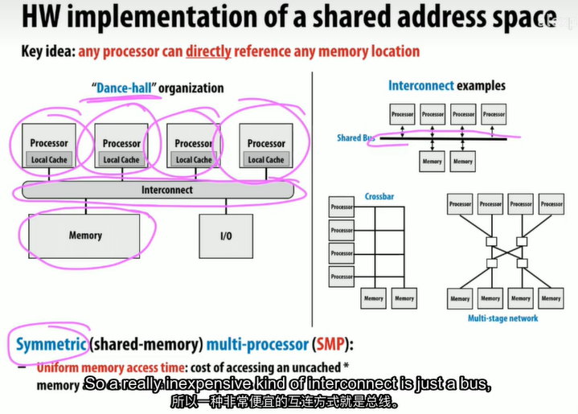
但实际中:
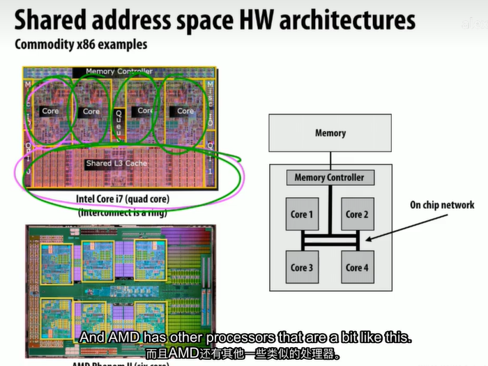
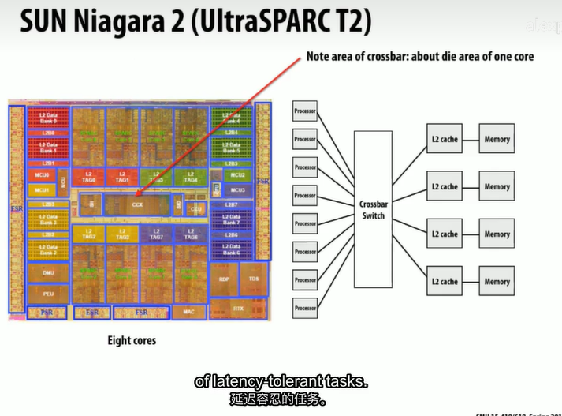

还有一种访问本地内存的方式,就是通过cache,这样就可以减少对总线的访问,从而提高效率.
Non-Uniform Memory Access(NUMA) system
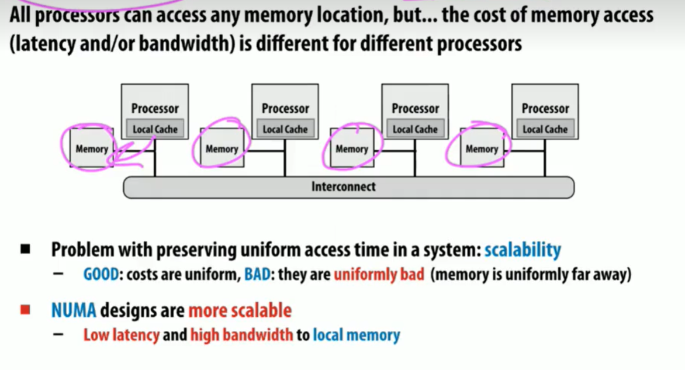

但它为程序员引入的复杂性是很大的,因为程序员需要手动的将数据放到本地内存中,这样才能提高效率.

shared address space的优点:

1. 程序员不需要关心数据的传输
2. 程序员不需要关心数据的分布

#### 2.Message passing

aasst4中会用到

由于实现缓存一致性需要额外的成本，因此在大型系统中，共享内存的实现是不可行的。在这种情况下，消息传递是一种更好的选择。

在消息传递中，每个处理器都有自己的私有内存，而且没有共享内存。要在处理器之间传递数据，必须使用显式的消息传递原语。

不需要任何硬件支持，因此可以在任何系统上实现。只需要网络。

可以构建大型系统，因为没有共享内存的限制。

这些原语允许程序员在处理器之间传递数据，但是程序员必须显式地指定数据的传输。这种方式的缺点是，程序员需要关心数据的传输，这样就会增加程序员的负担。

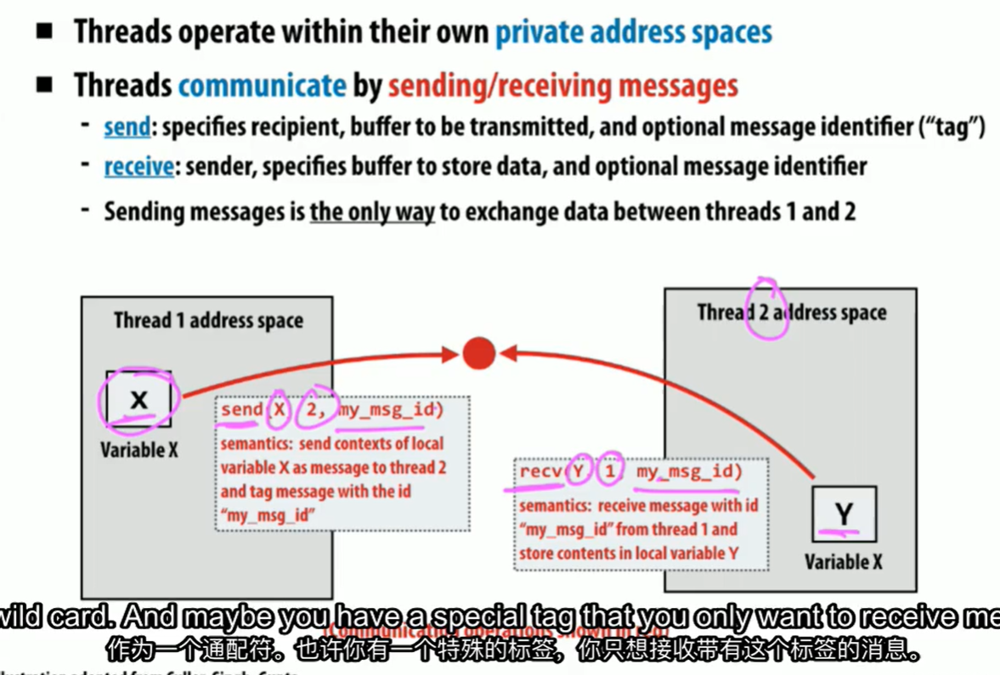

#### 3.Data parallel

asst2中会用到

上面两种方式可以在任何硬件上实现。

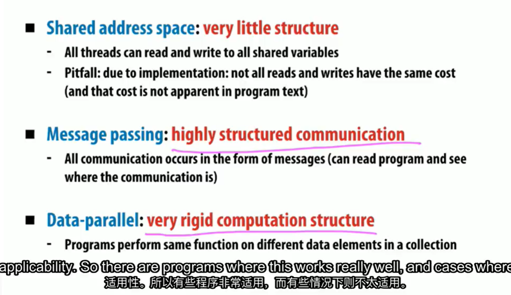

Data parallel对程序员来说是最简单的，因为程序员不需要关心数据的传输，也不需要关心数据的分布。但是，它只能在特定的硬件上实现，因为它需要硬件支持。

过去我们使用SIMD，现在使用SPMD。

并行程序的问题

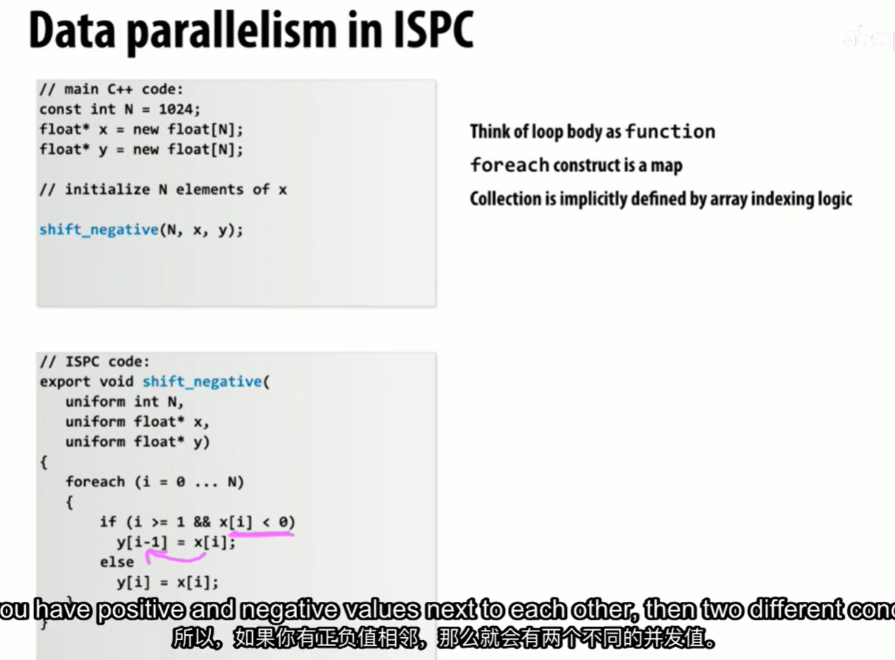

这样的并行会得到不确定的结果。

那么如何有原则性地使用并行呢？

有一个抽象概念是stream，可以避免并行竞争问题。

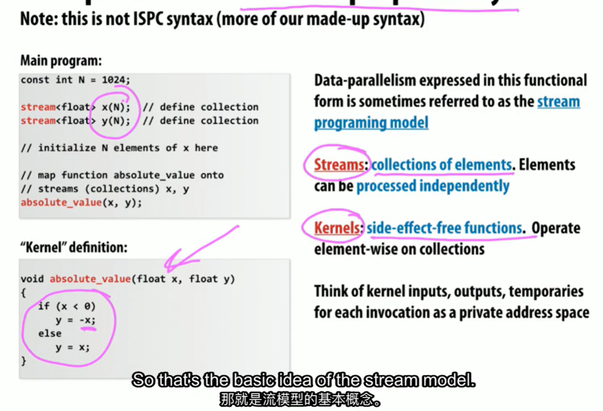

两个函数间的用法：

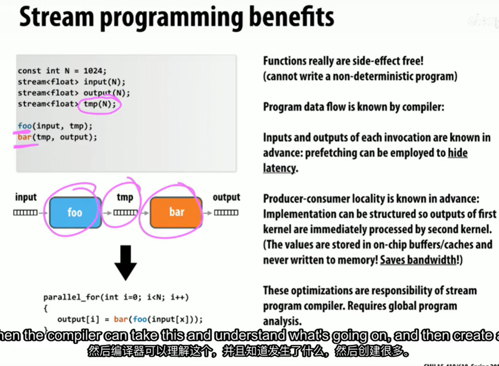

当如果使用stream，就必须创建tmp。不得不把临时数据写入浪费的带宽中。

所以我们希望也许有一些新的运算符可以做更加高级的操作。

gather: 将数据从不同的stream中收集到一个stream中。
scatter: 将数据从一个stream中分散到不同的stream中。

intel包括了gather，但不包括scatter。
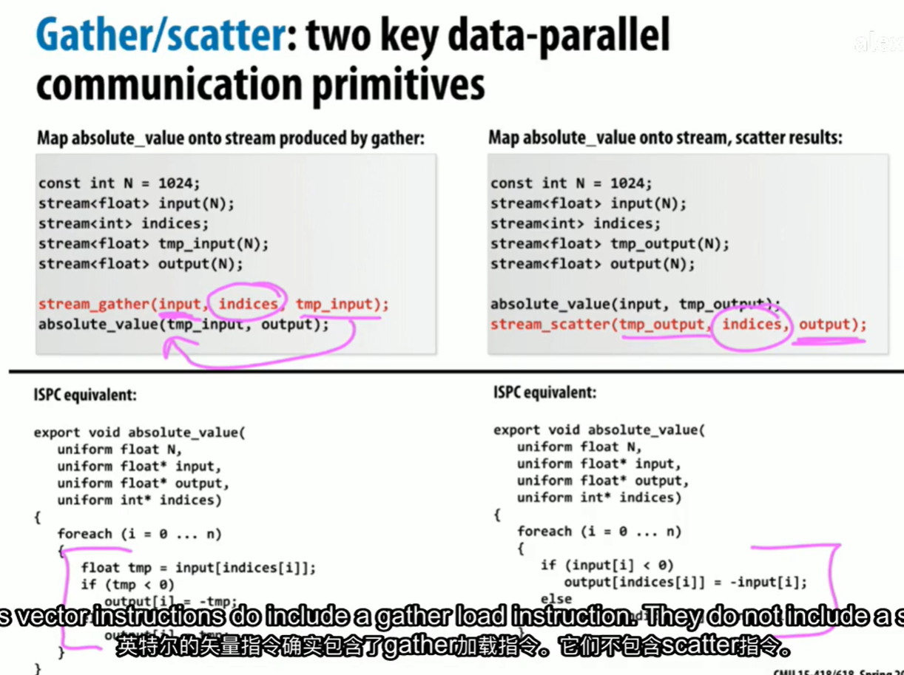

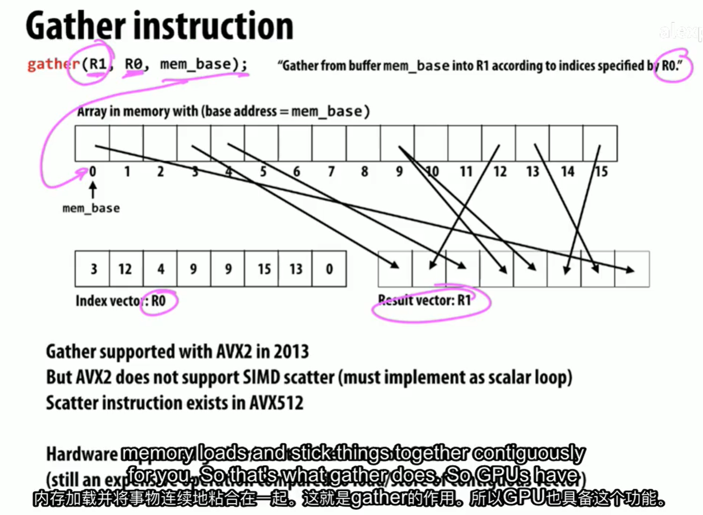

#### 总结

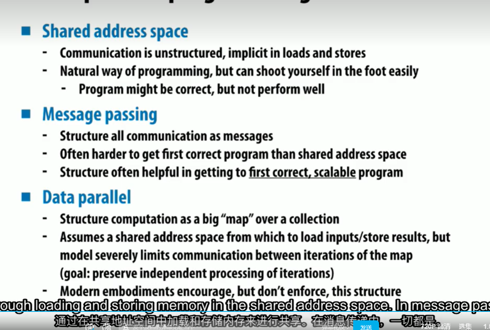

这些并不是完全独立的，而是可以组合使用的。

通常在实践中为了得到最好的性能，会使用以上所有的方式。

多核芯片内部通常是shared address space，但小规模情况下使用message passing。