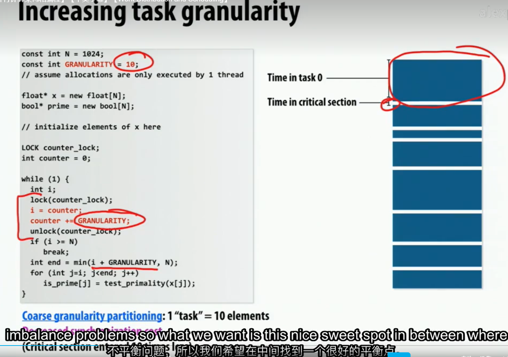

## 三种分配策略的总结

### 静态分配

优点:

- 几乎没有运行时的开销(关于分配)

缺点:

- 不总是均匀的分配任务

什么时候使用:

- (最简单的例子) 当知道每个任务的工作量相当的时候
- 当每个任务的工作量是可预测的,但不一定相等的时候

半静态分配

- 场景: 当工作量会随时间发生改变,当变化比较慢时.(任务量不可预测)
- 做法: 定期的重新分配任务

### 动态分配

场景: 当每个任务的工作量或者任务的数量是不可预测的时候

每个计算单元都要去获取任务

但这样的实现, 每次的任务可能会很少,
会使得更多的开销在争夺锁(获取任务的锁)上面.

有一个办法是一次性计算更多的任务.

但分配更多的任务可能会导致负载不平衡.

因此需要在分配任务数量上要找一个平衡, 不花费过多的时间在争夺锁上, 也不会导致负载不平衡.

**Schedule long tasks first**
但如果有一个大任务在最后，将出现如下情况：

因此，如果知道有一个大任务，可以提前处理，而不是放到最后一个.

#### Work stealing

当一个计算单元没有任务的时候, 从其他计算单元那里偷取任务.

实现的一些问题:

1.从哪个线程开始偷取任务呢?
有随机的, 也有从最后一个开始偷取的.

2.应该偷取多少任务呢?
应该偷取尽可能多一些,这样可以减少偷取任务的次数.

3.怎样检测一个计算单元是否有任务呢?
可能会循环遍历,

4.使用本地队列(分布式队列)会更快(在有互斥锁的情况下)

还有一种方式是使用特殊的数据结构来存储任务间的依赖关系, 从而可以在任务完成的时候, 自动的调度下一个任务.
缺点是额外开销

## 常见的并行编程模式

循环

创建显示线程

递归时的并行

递归可以编写出简单的代码, 但是递归的并行化是比较困难的.

因为递归的并行化需要在递归的每一层都要进行并行化, 并且需要在每一层都要进行同步.

但只要有独立的子问题, 就可以创造很多潜在的并行性.

## Fork-Join pattern

cilk_spawn: 会创建一个新的线程, 并且在新的线程中执行函数, 并且不会阻塞当前的线程.

cilk_sync: 会等待所有的子线程执行完毕, 并且会阻塞当前的线程.

每个函数的结尾隐式的调用了cilk_sync.

example:
有一个主线程+fork的线程.

快排的例子:
在规模较小的时候, 使用串行的快排. 这样可以减少线程的创建和销毁的开销.

**不要忽略了抽象和实现的区别.**
spawn不是生成一个具体的线程, 而是声明这里有一个可以并行的任务.

任务的数量至少需要比硬件线程多,但也不能大于100倍.
8倍是一个比较好的选择.

## Cilk的实现

假设我们要去实现clik_spawn 和 cilk_sync

线程池的实现(CILB):

thread1 需要找到一种方法来发现有新的任务可以执行.

所以thread 0不能简单的调用foo, 它的作用是执行foo.

但需要在执行foo前,把特殊的东西放入工作队列中.

此时如果另一个线程突然变得空闲, 它就可以从工作队列中获取任务.

为什么不把foo放入队列, 直接执行bar呢?(上面是执行foo bar放入队列)

这涉及到 continuation first(child stealing) 和 child first(continuation stealing) 的问题.

continuation first会导致线程0的大量工作排队.(广度优先队列)
child first会导致其他线程把下一个任务偷走时, 会导致线程0的工作队列为空.(深度优先队列)

实际上child first是合理的.(在递归中是最合适的)

在递归程序中,会先将所有深度的任务放入队列中.

按照之前优先执行大任务的策略, 其他线程会优先从队列顶部(先入的)中偷取任务.
因为在分而治之的算法中, 大任务会被分解成小任务, 因此大任务会先被放入队列中.

实际中使用了双端队列:

- 从队列头部获取任务
- 从队列尾部放入任务

但之前有一个问题: 很多队列,该从哪个队列中获取任务呢?
也许是随机的. 偷取任务的时候, 不随机的更可能会引起负载不均衡.

本地线程访问的是本地队列的尾部, 偷取时也是放入尾部.(偷其他队列的头部)
这样也有利于空间局部性.

那么如何实现同步呢?

Example1: stalling join policy
拖延政策: 所有我创建的任务都必须完成后, 我才能继续执行.

Example2: greedy join policy(cilk的实现方法)

有一个跟踪数据结构,但那个东西可以四处移动.

最后一个完成的线程会偷走这个数据结构

所以一旦最后一个任务完成, 就可以继续执行了.

这样不会浪费时间等待同步.

第一个方法实现起来更简单,但速度更慢.
因为它总是首线程只等待其他线程完成.

## 总结

