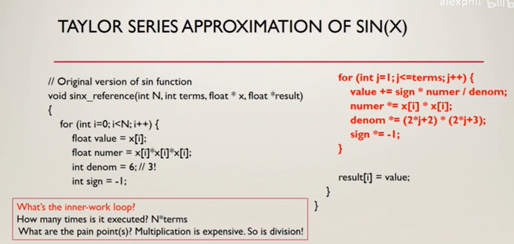
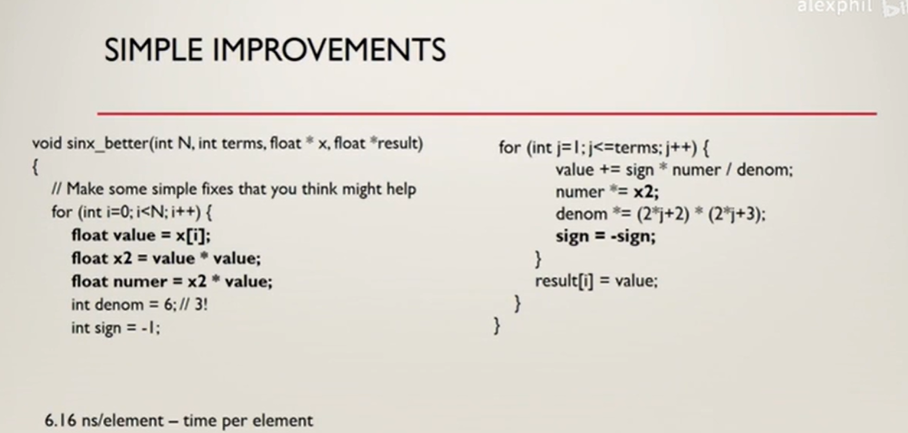
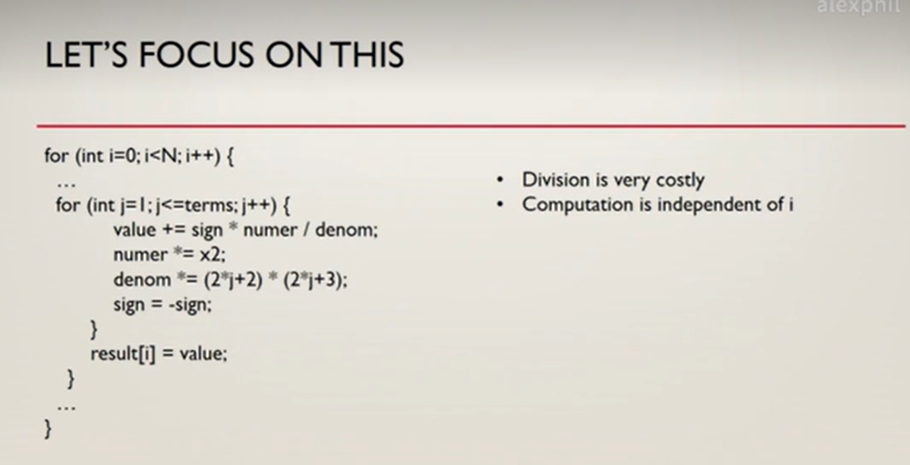
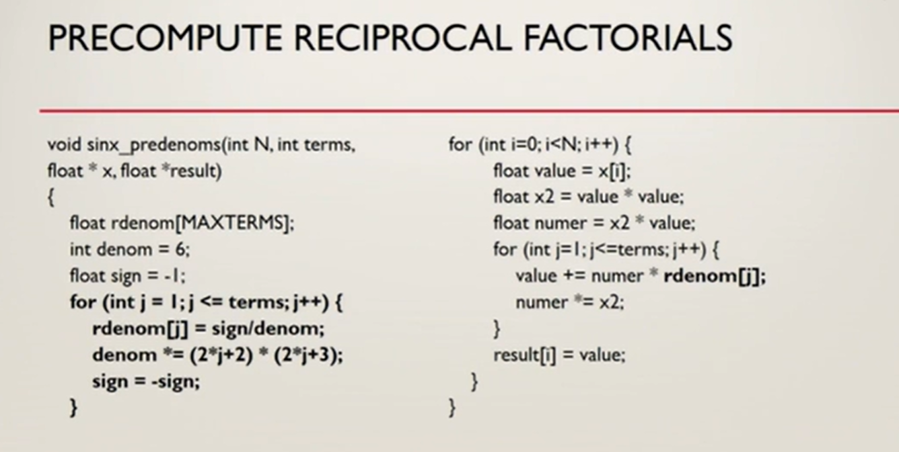
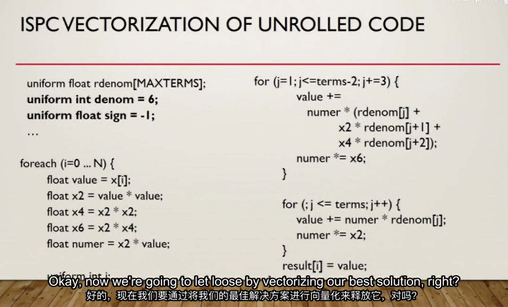
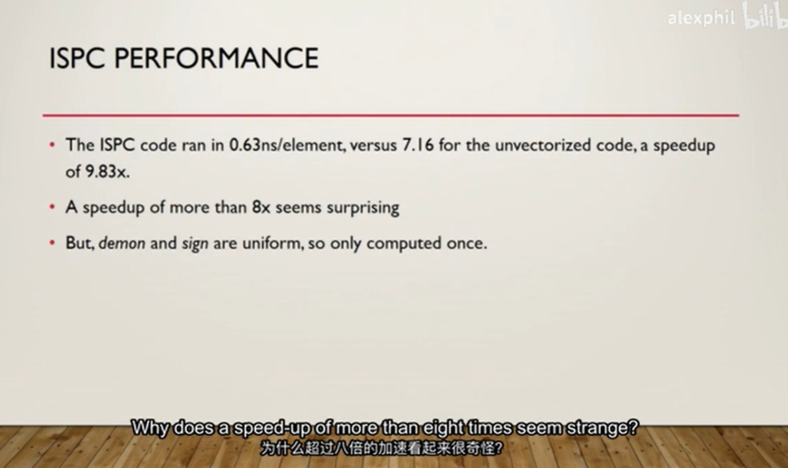
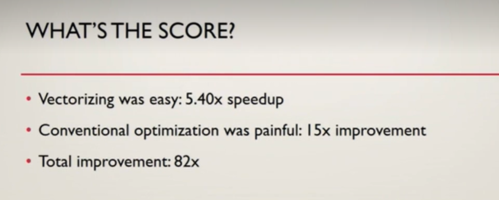

虚拟文件系统

/proc/cpuinfo

- model name
- cpu MHz - 频率
- cache size - 缓存大小
- siblings - 逻辑cpu数量
- processor - 逻辑cpu编号
- cpu cores - 物理cpu数量
- core id - 物理cpu编号
-

这样查看的cpu数量很多

siblings是逻辑cpu的数量

cpu cores是物理cpu的数量

为什么报告的processor数量是40而siblings是20呢?
因为报告的processor包括超线程的逻辑cpu. 这样操作系统就可以直接根据逻辑cpu的数量来分配任务.

Memory bandwidth - 内存带宽
Power consumption - 功耗
  能源消耗实际上是一个很大的问题.
Intel code name - 代号
Functional units

- latency - 延迟
- issue time - 发射时间
- capacity - 容量

[微处理架构](http://www.agner.org/optimize/microarchitecture.pdf)

## function units

- latency - 延迟，执行一个指令所需要的时钟周期数(不包括等待)
- issue time - 发射时间，指令发射到执行所需要的时钟周期数(包括等待)
- capacity - 容量

优化的地方:

- 搞清楚到底哪些代码是执行次数最多的(内部循环)(对实际使用情况来说)
- 基本运算消耗时间: 除法 > 乘法 > 加法 > 位移

基本的程序:

合并重复计算的简单的提升:

将除法次数减少,(不依赖于内层循环的变量的计算拿出来)

循环展开 loop unrolling

如果每一次循环都要进行一次是否终止的测试,开销会很大.(尤其是一次循环的计算 相比于 循环次数来说很小 时)

所以处理器从简单的策略开始,如预测循环的次数. 大部分都是基于统计预测的.

如果可以预测循环的次数,就可以将循环展开. 每次循环多执行4 或 8 或...次原来循环做的事情.

但展开时不一定均匀,

uniform可以使得循环展开的更好.

为什么8维向量获得了超过8倍的加速呢?
因为uniform, 原本要做8次的判断,现在只需要做一次.

常规优化提升了15倍
向量优化提升了5.4倍
总计提升了82倍

向量化很好且是free的,但不能忽略了传统的优化

传统的优化(213 program)使得速度提升了三倍

要做到极致的优化,就比如要花3个星期的时间在编码风格上, 最后30分钟花在向量化上.

但要看情况来决定编码风格的优化.
因为如果我们编写的代码不是执行次数最多(如内核,场景仿真,高频), 那么可能更需要的是可读性.

可读性变差 可能会导致bug很容易被引入, 并且非常不容易被发现和维护.