# L1 Relational Model & Relational Algebra

## 1.1 Databases

数据库：an organized collection of inter-related data that models some aspect of the real-world

数据库管理系统 DBMS：the software that manages a database

## 1.2 Flat File Strawman

数据库常常以CSV(comma-separated value)文件的形式存储，由DBMS进行管理。每次应用程序要读取或者更新记录时，都必须解析文件(parse files)。

## 1.3 Database Management System

* A general-purpose(通用) **DBMS** is designed to allow the definition, creation, querying, update, and administration of databases in accordance with some **data model**.
* A **data model** is a collection of concepts for describing the data in database
  * Examples: **relational** (most common), NoSQL (**key/value**, graph), array/matrix/vectors
* A **schema**(模式) is a description of a particular collection of data based on a **data model**

早期，数据库应用很难建立和维护，因为逻辑层和物理层之间存在着紧密的耦合。

* 逻辑层： 描述了数据库有哪些实体和属性。
* 物理层： 是这些实体和属性的存储方式。

所以早期的数据库，一旦改变了物理层，逻辑层也得跟着变。

## 1.4 Relational Model

人们每次改变物理层都要重新写数据管理系统，故Ted Codd注意到后提出了关系模型。

The relational model defines a database abstraction based on relations to avoid **maintenance overhead**(维护开销).

三要点:

* Store database in simple data structures (relations).
* Access data through high-level language, DBMS **figures out**(找出) best execution strategy.
* Physical storage **left up to**(取决于) the DBMS implementation.

三概念

The relational data model defines three concepts:

* Structure: The definition of relations and their contents. This is the attributes the relations have and the values that those attributes can hold.
* **Integrity**(完整性): Ensure the database’s contents satisfy constraints.
  * 实体完整性 entity integrity:主属性不能为空
  * 参照完整性 referential integrity: 外键的值必须存在
  * 用户定义的完整性
    * An example constraint would be that any value for the year attribute has to be a number.
* Manipulation: How to access and modify a database’s contents.

关系:

**A relation** is an **unordered** set that contains the relationship of attributes that represent entities. So the DBMS can store them in any way it wants, allowing for **optimization**(允许优化).

元组:

**A tuple** is a set of **attribute values** (also known as its **domain** 域 一组相同数据类型的值的集合) in the relation. **Originally**, values had to be atomic or scalar(标量), but **now** values can also be lists or **nested**(嵌套) data structures. Every attribute can be a special value, **NULL**, which means for a given tuple the attribute is **undefined**.

关系:

**A relation** with n attributes is called **an n-ary relation**.

键

**A relation’s primary key** uniquely identifies a single tuple.

* Some DBMSs automatically create an internal primary key if you do not define one.
* A lot of DBMSs have support for autogenerated keys so an application does not have to **manually increment**(手动增加) the keys, but a primary key is still required for some DBMSs.

**A foreign key** specifies that an attribute from one relation has to map to a tuple in another relation.

## 1.5 Data Manipulation Languages (DMLs)

Methods to store and retrieve information from a database.

There are two classes of languages for this:

* **Procedural**(程序上的): The query **specifies the (high-level) strategy** the DBMS should use to find **the desired result based on sets / bags.** (relational **algebra** 代数)
* Non-Procedural (**Declarative** 声明): The query specifies only what data is wanted and not how to find it. (relational **calculus** 微积分/关系演算)

一般现在都是用第二种的，我不管DBMS用什么**策略**，我只需要你给我我想要的数据。

## 1.6 Relational Algebra 关系代数

**Relational Algebra** is a set of fundamental operations to **retrieve**(检索) and manipulate tuples in a relation.

Each operator **takes in**(需要) one or more relations as inputs, and outputs a new relation. To write queries we can “**chain**(链)” these operators together to create more complex operations.

5种基本**关系操作**

* 选择,投影,并,差,笛卡儿积

传统**集合运算**

* 二目运算: 并,差,交,笛卡尔积

专门的**关系运算**

* 选择selection ,投影projection,连接 join,除 dividen

选择:在**关系R**中,选择符合条件的**元组**,是从行的角度进行运算.

投影:在**关系R**中,选择出**若干属性列**组成新的关系,从列的角度

连接:两个关系的**笛卡尔积**中,选取属性中满足一定条件的元组

* 自然连接 内连接: 不保留悬浮元组.
* 外连接 outer join : 保留**悬浮元组**(填NULL)的连接
* 左连接 left outer join: 只保留**左边关系R**中的悬浮空组.
* 右连接 right outer join: 只保留**右边关系R**中的悬浮空组.

除: R除以S得到T, 则T包含所有**在R而不在S**的**属性及其值**. 且T和S的所有组合都在R中.

# L2 Modern SQL

## 2.1 Relation Languages

用户只需要使用声明性语言（即SQL）来指定他们想要的结果。DBMS 负责确定产生该答案的最有效计划。

关系代数基于 sets (unordered, no duplicates)。 SQL基于 bags (unordered, allows duplicates)

## 2.2 SQL History

* SEQUEL Structured English Query Language

  SQL Structured Query Language
* 该语言由不同类别的命令组成：
  * **DML** Data Manipulation Language `SELECT, INSERT, UPDATE, DELETE`
  * **DDL** Data Definition Language Schema definitions for tables, indexes, views, and other objects.
  * **DCL** Data Control Language Security, access controls.
* SQL仍在不断发展的

## 2.3 Join

结合一个或多个表的列，产生一个新的表。用来表达涉及跨越多个表的数据的查询

```
CREATE TABLE student (
    sid INT PRIMARY KEY,
    name VARCHAR(16),
    login VARCHAR(32) UNIQUE,
    age SMALLINT,
    gpa FLOAT
);
CREATE TABLE course (
    cid VARCHAR(32) PRIMARY KEY,
    name VARCHAR(32) NOT NULL
);
CREATE TABLE enrolled (
    sid INT REFERENCES student (sid),
    cid VARCHAR(32) REFERENCES course (cid),
    grade CHAR(1)
);
找出在15-721拿到A的学术
SELECT s.name
FROM enrolled AS e, student AS s
WHERE e.grade = 'A' AND e.cid = '15-721'
AND e.sid = s.sid;
```

## 2.4 Aggregates 聚合函数

聚合函数接受一组列表，然后产生一个单一的标量值作为其输出。基本上只能在SELECT输出列表中使用！

函数：

* `AVG`
* `MIN`
* `MAX`
* `COUNT`

当使用goup时,聚合函数输出为每个组的输出.

having 在聚合计算的基础过滤输出结果.而不是where

```
SELECT AVG(s.gpa) AS avg_gpa, e.cid
FROM enrolled AS e, student AS s
WHERE e.sid = s.sid
GROUP BY e.cid
HAVING avg_gpa > 3.9;
```

## 2.5 Sting Operation

**SQL标准**是**区分大小写**的，而且只能是**单引号**！有一些函数可以处理字符串，可以在查询的任何部分使用。

* **Pattern Matching**:

  Like 关键字
  * `%` : matches any substrings (including empty).
  * `_` : matches any one character
* **String Function:** `SUBSTRING(S, B, E)` `UPPER(S)`
* **Concatenation**(连接) : `||` concatenate two or more strings together into a single string

## 2.6 Date and Time

* 时间函数
  * 当前日期时间 `NOW()`, `CURRENT_TIMESTAMP()`
  * 当前UNIX时间戳 `UNIX_TIMESTAMP()`
  * 当前日期 `CURRENT_DATE()`
  * 当前时间 `CURRENT_TIME()`
* 日期时间转换函数
  * 当前时间戳转换为北京时间 `FROM_UNIXTIME()`
  * 北京时间转换为时间戳 `UNIX_TIMESTAMP()`
  * 时间中解析年月日时间 `DATE_FORMAT(date, format)`

  ```
  select DATE_FORMAT('2021-01-01 08:30:50','%Y-%m-%d')
  
  
  ```
* 日期时间运算函数
  1. 在某个时间的基础上加上或者减去某个时间 `DATE_ADD(date,INTERVAL expr unit)` `DATE_SUB(date,INTERVAL expr unit)`
  2. 返回两个日期值之间的天数 `DATEDIFF(expr1,expr2))`

     ```
     select DATEDIFF('2021-01-02','2021-01-01')
     
     
     ```
  3. 时间差函数 `TIMESTAMPDIFF(unit,datetime_expr1,datetime_expr2)`

     unit：天(DAY)、小时(HOUR），分钟(MINUTE)和秒(SECOND)，TIMESTAMPDIFF函数比DATEDIFF函数用起来更加灵活

## 2.7 Output Redirection

你可以告诉DBMS将查询结果存储到另一个表中，而不是将查询结果返回给客户端（例如，终端）。结果存储到另一个表中。然后你可以在随后的查询中访问这些数据

* New Table: 将查询的输出存储到一个新的（永久）表中。

  ```
  SELECT DISTINCT cid INTO CourseIds FROM enrolled;
  
  
  ```
* Exustubg Table:

  将**查询的输出存储到数据库中已经存在的表**中。该表 目标表必须有与目标表相同数量和相同类型的列，但输出查询中的列名不需要匹配。

  ```
  INSERT INTO CourseIds (SELECT DISTINCT cid FROM enrolled)
  
  
  ```

## 2.8 Output Control

可以用ORDER BY来对输出进行排序,后面可以加`DESC`, `ASC`来指定排序策略

输出的数量可以用`LIMIT n` 进行指定,当然也可以用`OFFSET` 来提供一个bias。

```
ELECT sid, grade FROM enrolled WHERE cid = '15-721'
ORDER BY grade;
SELECT sid, name FROM student WHERE login LIKE '%@cs'
LIMIT 20 OFFSET 10;
```

## 2.9 Nested Queries

在其他查询中调用查询，在单个查询中执行更复杂的逻辑。嵌套查询往往难以优化。

外部查询的范围包括在内部查询中（即**内部查询可以访问来自外部查询**），反之不行。

* 内部查询几乎可以出现在一个查询的任何部分。
  1. `SELECT` Output Targets

     ```
     SELECT (SELECT 1) AS one FROM student;
     
     
     ```
  2. `FROM` **Clause**(条件):

  ```
  SELECT name
      FROM student AS s, (SELECT sid FROM enrolled) AS e
      WHERE s.sid = e.sid;
  
  
  ```
  3. `WHERE` Clause

  ```
  SELECT name FROM student
  	WHERE sid IN ( SELECT sid FROM enrolled );
  
  
  ```
  * 例子： 获取在15-445中注册的学生名字

```
SELECT name FROM student
    WHERE sid IN (
        SELECT sid FROM enrolled
        WHERE cid = '15-445'
);
```

请注意，根据它在查询中出现的位置，sid有不同的范围。

* 例子： 找到注册了至少一门课的最大的学生id

  ```
  SELECT student.sid, name
      FROM student
      JOIN (SELECT MAX(sid) AS sid
          FROM enrolled) AS max_e
      ON student.sid = max_e.sid;
  
  
  ```

### Nested Query Results Expressions:

* 关键字：
  * `ALL` Must satisfy expression for all rows in sub-query
  * `ANY` Must satisfy expression for at least one row in sub-query.
  * `IN` Equivalent to =ANY().
  * `EXISTS` At least one row is returned.
* 例子： 找到所有没有学生注册的课

  ```
  SELECT * FROM course
      WHERE NOT EXISTS(
          SELECT * FROM enrolled
          WHERE course.cid = enrolled.cid
  );
  
  
  ```

## 2.10 Window Functions

* 函数： 窗口函数可以是我们上面讨论的任何一个聚合函数。也有一些特殊的窗口函数。
  1. `ROW_NUMBER`: 当前列的数字
  2. `RANK`: 当前列的顺序
* Grouping: **OVER子句指定了在计算窗口函数时如何对图元进行分组**。使用**PARTITION BY**来指定分组

  ```
  SELECT cid, sid, ROW_NUMBER() OVER (PARTITION BY cid)
  	FROM enrolled ORDER BY cid;
  
  
  ```

  我们也可以在OVER中放入ORDER BY，以确保结果的确定性排序，即使数据库内部发生变化。

  ```
  SELECT *, ROW_NUMBER() OVER (ORDER BY cid)
  	FROM enrolled ORDER BY cid;
  
  
  ```
* **重要提示：**
* DBMS在窗函数排序后计算`RANK`，而在排序前计算`ROW_NUMBER`。
  * 找到每门课程中成绩第二高的学生

    ```
    SELECT * FROM (
        SELECT *, RANK() OVER (PARTITION BY cid
            ORDER BY grade ASC) AS rank
        FROM enrolled) AS ranking
    WHERE ranking.rank = 2;
    
    
    ```

## 2.11. Commom Table Expressions

在编写更复杂的查询时，通用表表达式（CTE）是窗口或嵌套查询的一种替代方法。复杂的查询时，可以替代窗口或嵌套查询。它们提供了一种方法来为用户在一个更大的查询中编写辅助语句.

可以理解为一个辅助表。

`WITH`子句将内部查询的输出与一个具有该名称的临时结果绑定。

* 例子： 生成一个名为cteName的CTE，其中包含一个单一属性设置为 "1 "的元组。从这个CTE中选择所有属性。

  ```
  WITH cteName AS (
  	SELECT 1
  )
  SELECT * FROM cteName;
  
  
  ```

  我们可以在AS之前将输出列绑定到名称上

  ```
  WITH cteName (col1, col2) AS (
  	SELECT 1, 2
  )
  SELECT col1 + col2 FROM cteName;
  
  
  ```

  一个查询可能包含多个CTE声明

  ```
  WITH cte1 (col1) AS (SELECT 1), cte2 (col2) AS (SELECT 2)
  SELECT * FROM cte1, cte2;
  
  
  ```
* 递归能力 在WITH后面**添加RECURSIVE关键字**允许CTE引用自己。这使得在SQL查询中可以实现递归。有了递归的CTE，SQL被证明是图灵完备的，这意味着它在计算上的表现力不亚于更多的通用编程语言
* 例子：打印从1到10的数字

  ```
  WITH RECURSIVE cteSource (counter) AS (
      ( SELECT 1 )
      UNION
      ( SELECT counter + 1 FROM cteSource
      	WHERE counter < 10 )
  )
  SELECT * FROM cteSource;
  
  
  ```

# Homework #1 - SQL

CASE 语句

```
SELECT name,
   CASE 
       when died is not null
       then died-born 
       else '2022' - born
   END as age
FROM people
where born >= '1900'
ORDER by age DESC,name 
LIMIT 20;
```

CAST AS TEXT 转换成字符串，字符串连接用 ||

```
select 
CAST(titles.premiered/10*10 AS TEXT)  || 's' as decade,
round(avg(rating),2) as avg,
max(rating) as top,
min(rating) as min,
count(*) as NUM_RELEASES
from ratings
join titles on titles.title_id = ratings.title_id
where decade is not null
GROUP by decade
order by avg DESC,decade
limit 20;
```

第一个with后，用,隔开

```
with person_title as (
    select people.name,
    people.person_id,
    crew.title_id
    from people
    join crew on crew.person_id = people.person_id
    join titles on titles.title_id = crew.title_id
    where born = 1955 and titles.type = "movie"
),
person_avg as (
    select person_title.name,round(avg(rating),2) as avg
    from RATINGS
    join person_title on person_title.title_id = ratings.title_id
    group by person_title.person_id
),
quantiles as (
    select * ,NTILE(10) OVER (ORDER BY avg ASC) as QuantileRating from person_avg
)
select 
name,avg
from quantiles
where QuantileRating = 9
order by avg DESC,name;
```

把表格数据压缩成一行，用，隔开

```
with p as(
    select akas.title as dubbed
    from titles
    join akas on akas.title_id = titles.title_id
    where primary_title = "House of the Dragon" and type = "tvSeries"
    group by primary_title,dubbed
    order by dubbed
)
select GROUP_CONCAT(dubbed,', ') from p;
```

# L3 -4Database Storage

## 3.1 Storage

The DBMS assumes that the primary storage location of the database is on non-volatile disk.

The DBMS's components manage the movement of data between non-volatile and volatile storage.

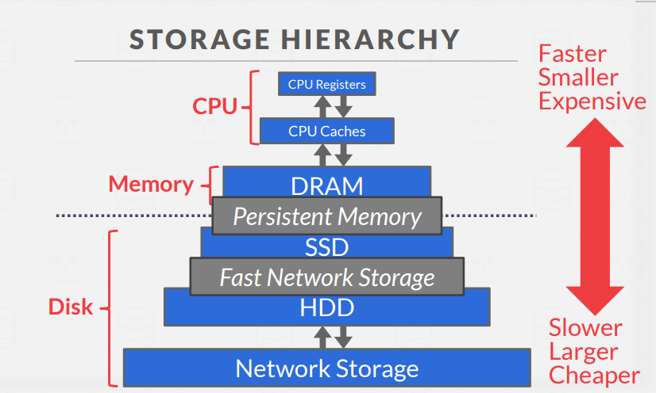

Volatile Devices:

* Volatile means that if you pull the power from the machine, then the data is lost.
* Volatile storage supports fast **random access** with byte-addressable locations. This means that the program can jump to any byte address and get the data that is there.
* For our purposes, we will always refer to this storage class as “memory.”

Non-Volatile Devices:

* Non-volatile means that the storage device does not require continuous power in order for the device to retain the bits that it is storing.
* It is also block/page addressable. This means that **in order to read a value at a particular offset**, the program **first has to load the 4 KB page into memory** that holds the value the program wants to read.
* Non-volatile storage is **traditionally better at sequential access** (reading multiple contiguous chunks of data at the same time).
* We will refer to this as “disk.” We will not make a (major) distinction between solid-state storage (SSD) and spinning hard drives (HDD).

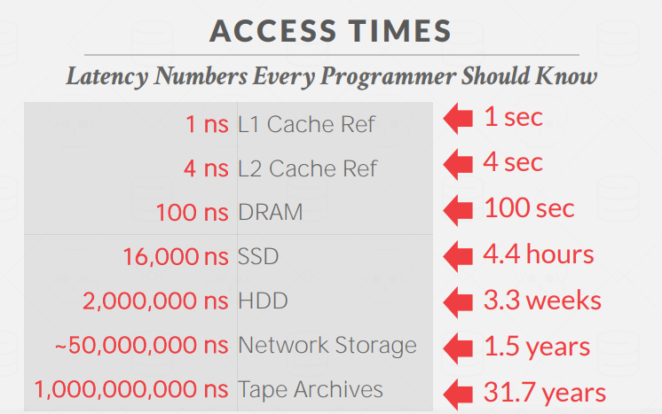

## 3.2 Disk-Oriented DBMS Overview

The database is **all on disk**, and the data in database files is organized into pages, with the first page being the directory page.

To operate on the data, the DBMS needs to bring the data into memory. It does this by **having a buffer pool** that **manages the data movement back and forth** between disk and memory

The DBMS also has an **execution engine** that will execute queries. The execution engine will **ask the buffer pool for a specific page**, and the buffer pool will take care of bringing that page into memory and **giving the execution engine a pointer** to that page in memory.

The buffer pool manager will **ensure** that **the page is there while the execution engine operates on that part of memory**.

## 3.3 DBMS vs OS

* DBMS的一个**高级设计目标是支持超过可用内存量**的数据库。因为访问disk的代价很大，所以使用disk应该要小心。我们不希望从磁盘上访问数据时停顿太久，从而拖慢其他一切。我们希望DBMS能够处理在等待从磁盘获取数据时，能够处理其他查询。
* 这个高层次的设计目标就像虚拟内存一样，有一个大的地址空间和一个供操作系统从磁盘引入页面的地方。
* 实现这种虚拟内存的方法之一是使用mmap来映射进程地址空间中的文件内容，这使得操作系统负责在磁盘和内存之间来回移动页面。 但不幸的是，如果**mmap遇到页面故障，进程将会被阻塞**。
  * 如果你需要写入，你永远不想在你的DBMS中使用mmap。
  * DBMS（几乎）总是想自己控制事情，而且可以做得更好，因为它知道更多关于被访问的数据和被处理的查询。
* 可以通过使用操作系统：
  * `madvise`: 告诉操作系统你打算何时读某些页面。
  * `mlock`: 告诉操作系统不要把内存范围换到磁盘上。
  * `msync`: 告诉操作系统将内存范围刷新到磁盘。

**出于正确性和性能的考虑，我们不建议在DBMS中使用**`mmap`。

## 3.4 File Storage

* 在其最基本的形式中，DBMS将**数据库存储为磁盘上的文件**。有些可能使用文件层次结构，有些则可能使用单个文件
* 操作系统对这些文件的内容一无所知。**只有DBMS知道如何解读它们的内容**，因为它是以DBMS特有的方式编码的。
* DBMS的存储管理器负责管理数据库的文件。它将文件表示为一个 页的集合。它还跟踪哪些数据被读和写到了页面上，以及这些页面有多少可用空间。这些页面中还有多少可用空间。

## 3.5 Database Pages

* DBMS将数据库组织在**一个或多个文件中的固定大小的数据块**，称为页。页面可以包含不同种类的数据（tuple、indexes等）。

> * 大多数系统不会将这些类型混合在一页中。 有些系统会要求页面是自成一体（self-contained）的，也就是说，阅读每个页面所需的所有信息都在页面本身。读取每一页的所有信息都在页面本身

* Each page is given a unique identifier.
  * The DBMS uses an indirection layer to map page IDs to physical locations.

There are three different **notions** of "pages" in a DBMS:

* Hardware Page (usually 4KB)
* OS Page (usually 4KB)
* Database Page (512B-16KB)

存储设备保证写的操作是atomic 原子的。 这意味着，如果我们的数据库页面比我们的硬件页面大，DBMS将不得不采取额外的措施 以确保数据被安全地写出来。 因为当系统崩溃时，程序可能已经完成了将数据库页面写入磁盘的一部分

Different DBMSs manage pages in files on disk in different ways.

* Heap File Organization
* Tree File Organization
* Sequential / Sorted File Organization (ISAM)
* Hashing File Organization

At this point in the **hierarchy**(层次结构) we don't need to know anything about what is inside of the pages.

## 3.6 Database Heap

A **heap file** is an **unordered** collection of pages with tuples that are stored in random order.

* Create / Get / Write / Delete Page
* Must also support iterating over all pages.

DBMS可以通过使用页面的链接列表或页面目录在磁盘上找到一个给定的页面ID

1. Linked List: Header page持有指向自由页列表和数据页列表的指针。然而，如果 DBMS正在寻找一个特定的页面，它必须在数据页列表上进行顺序扫描，直到它找到它要找的页面。
2. Page Directory:

   DBMS维护特殊的页面，跟踪数据页的位置以及每页的可用空间。

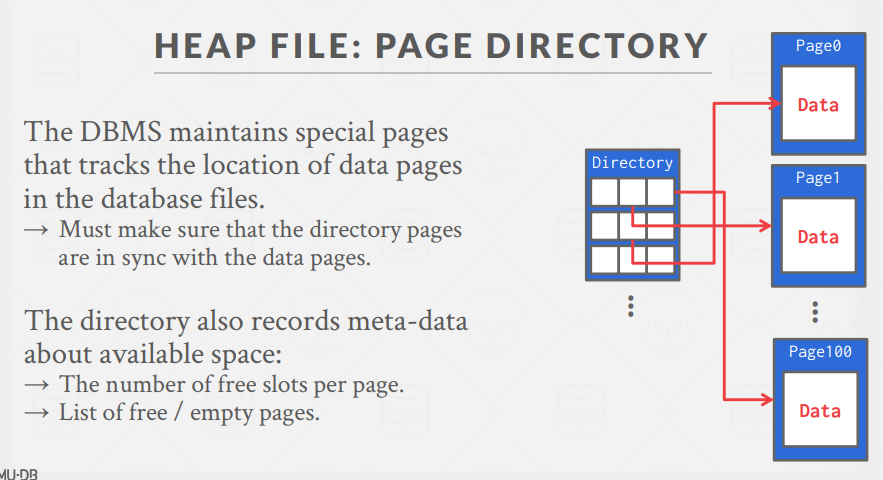

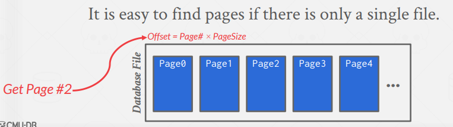

Need **meta-data** to keep track of what pages exist in multiple files and which ones have free space.

## 3.7 Page Layout

* 每个页面都包括一个header，记录关于页面内容的元数据。
  * Page size
  * Checksum
  * DBMS version
  * Transaction visibility
  * Self-containment(自成一体) (Some systems like Oracle require this.)

For any page storage architecture, we now need to decide **how to organize the data inside of the page.**

We are still assuming that we are only storing **tuples**.

Two approaches:

* **Tuple**-oriented (其实是 **slotted-page**)
  * 页面将slots映射到offsets,slot array 记录对应tuple的便宜量
  * Header keeps track of the number of used slots, the offset of the starting location of the last used slot, and a slot array, which keeps track of the location of the start of each tuple.
  * To add a tuple, the slot array will grow from the beginning to the end, and the data of the tuples will grow from end to the beginning. The page is considered full when the slot array and the tuple data meet
* Log-structured

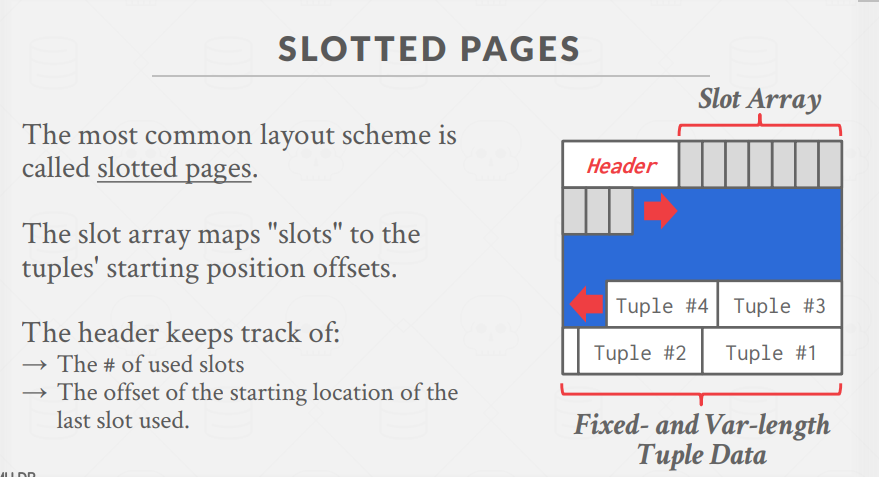

## 3.8 Tuple Layout

tuple 内部的结构

tuples本质上是一个字节序列。DBMS的工作是将这些字节解释为属性类型和值。

* Tuple Header：包含了tuple的元数据
  * DBMS的并发控制协议的可见性信息。关于哪个事务创建/修改了该元组
  * NULL值的位图。
  * 注意，DBMS不需要在这里存储关于数据库模式的元数据。
* Tuple Data：数据的实际属性
  * 属性通常按照你创建表时指定的顺序存储
  * 大多数DBMS不允许一个tuple超过一个页面的大小。
* Unique Identifier
  * 数据库中的每个tuple都被分配一个唯一的标识符
  * 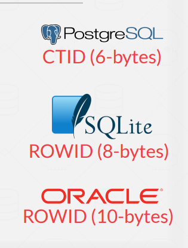
  * 一般是：`page_id + (offset or slow)`
  * 一个应用程序**不能**依赖这些ID来表示任何东西
* De-normalized Tuple Data:

  如果两个表是相关的，DBMS可以 "pre-join"它们，所以这些表最终会出现在 在同一个页面上。这使得读取速度加快，因为DBMS只需要加载一个页面而不是两个 独立的页面。然而，这使得更新更加昂贵，因为DBMS需要更多的空间给每个 tuples

  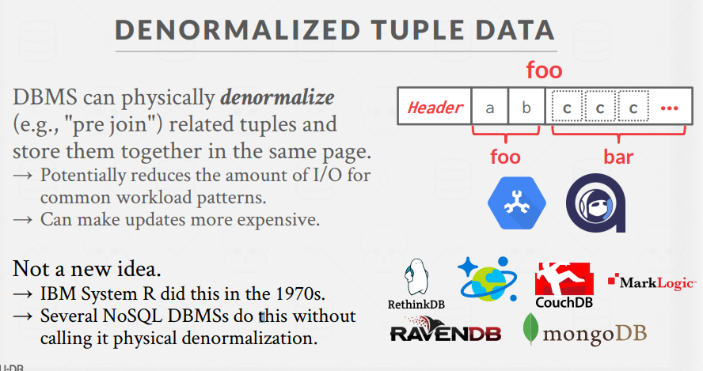

## 3.9 Log-Structured Storage

（也叫Append-only Sequence of Data） 参考: [Log-Structured 结构](https://www.cnblogs.com/muzhongjiang/p/15151758.html)

* 与Slotted-Page Design有关的问题是：
  * Fragmentation: 删除tuple会在page中留下空隙。
  * Useless Disk I/O:

    由于非易失性存储的block-oriented的性质，需要读取整个块来获取tuple。
  * Random Disk I/O: 磁盘阅读器可能不得不跳到20个不同的地方来更新20个不同的tuples，这可能会非常慢。

如果我们在一个**只允许创建新数据而不允许覆盖**的系统上工作呢？日志结构的存储模型与这个假设相配合，解决了上面列出的一些问题。

**Log-Structured Storage:** DBMS不存储tuples，**只存储日志记录**。

* 将数据库如何被修改的记录存储到文件中（放入和删除）。每条日志包含tuples的唯一标识符
* 要读取一条记录，DBMS会**从最新的到最旧的逆向扫描日志文件**，并 "重新创建 "这个 tuple。
* 写的快，读的可能慢。磁盘写入是连续的，现有的页面是不可改变的，这导致了随机磁盘I/O的减少。
* 在append-only的存储上工作得很好，因为DBMS不能回溯并更新数据。

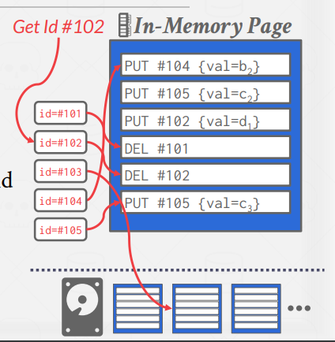

The log will grow forever. The DBMS needs to periodically **compact**(紧凑) pages to reduce wasted space.

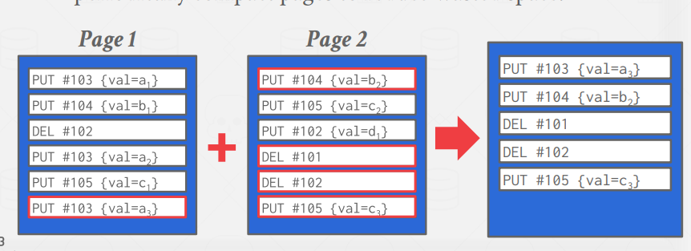

* 由于不再需要时间信息，数据库可以**将日志压缩到一个按id排序的表**中。这些被称为分类字符串表（SSTables），它们可以使tuple搜索非常快。

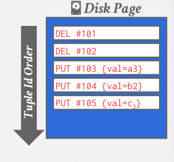

* 紧凑化的问题是，DBMS最终会出现写入放大的情况。(**它一次又一次地重写相同的数据**）。

Compaction coalesces larger log files into smaller files by removing unnecessary records.

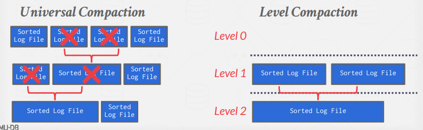

Log-structured storage managers are more common today. This is partly due to the **proliferation**(扩散) of RocksDB.

## 3.11 Data Representation

A tuple is essentially a sequence of bytes.

It's the job of the DBMS to **interpret** those bytes into attribute types and values.

The DBMS's **catalogs**(目录) contain the schema information about tables(数据表示方案) that the system uses to figure out the tuple's layout.

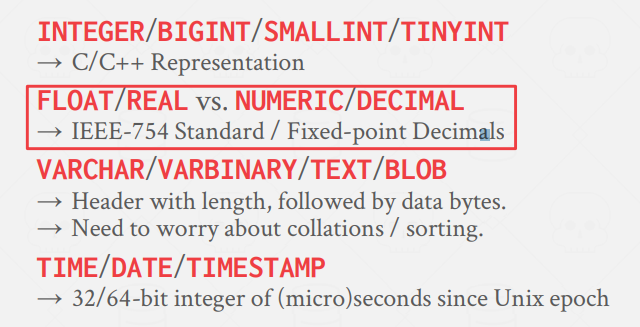

* **INTEGER, BIGINT, SMALLINT, TINYINT.** (Integers)大多数DBMS使用IEEE-754标准规定的 "native "C/C++类型来存储整数。这些值是**固定长度**的。
* **FLOAT, REAL** (Variable Precision Numbers) 这些是不精确的、可变精度的数字类型, "native "C/C++类型,这些值也是**固定长度**的。
  * **变精度数的运算比任意精度数的运算更快**，因为CPU可以直接对其执行指令。然而，在进行计算时**可能会出现精度损失**！
* **NUMERIC, DECIMAL.**(Fixed-Point Precision Numbers) 通常**以精确的、可变长度**的二进制表示法（像一个字符串）来存储.带有**额外的元数据**，这些数据将告诉系统诸如**数据的长度和小数点应该在哪里**。
* 当误差不可接受的时候，DBMS就要付出性能的代价来提高精度。

**VARCHAR, VARBINARY, TEXT, BLOB** Variable-Length Data

* 代表任意长度的数据类型。它们通常是用一个header来存储的，这个header可以追踪到字符串的长度，以便于跳转到下一个值。它还可能包含一个数据的校验和。
* **大多数DBMS不允许一个tuple超过一个页面的大小。** **但是！那些允许的系统将数据存储在一个特殊的 "溢出 "页**上，并让tuple包含一个对该页的引用。这些溢出页可以包含指向其他溢出页的指针，直到所有的数据都可以被存储。(类似分级页表)
* 有些系统会让你把这些大的数值存储在一个外部文件中，然后元组会包含一个指向该文件的指针。例如，如果数据库存储的是照片信息，DBMS可以将照片存储在外部文件中，而不是让它们占用DBMS中的大量空间。这样做的一个缺点是，DBMS**不能操作这个文件的内容**。因此，No durability protections. No transaction protections.没有耐久性或交易保护。

**TIME, DATE, TIMESTAMP.** Dates and Times 不同的系统对日期/时间的表示方法不同。通常情况下，它们被表示为一些单位时间 (自unix时代的（微/毫）秒）。

**System Catalogs**

为了使DBMS能够识别tuple的内容，它维护了 INFORMATION_SCHEMA**内部目录**来告诉它关于数据库的元数据。**元数据将包含关于数据库有哪些表和列的信息**，以及它们的类型和值的顺序。

大多数DBMS将其目录以其表的格式存储在自己的内部。他们使用 特殊代码来 "bootstrap "这些目录表。

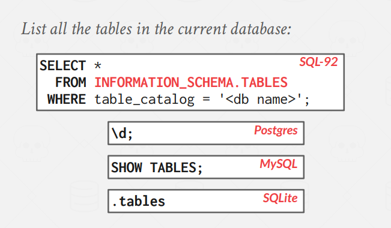

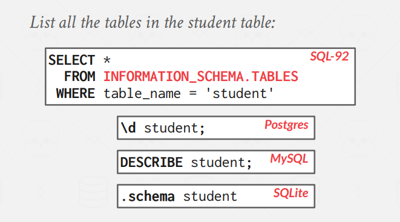

# L5 Storage Models & Compression

## 5.1 Database Workloads

OLTP: Online Transaction Processing

* An OLTP workload is characterized by **fast, short running operations**, simple queries that **operate on single entity at a time**, and **repetitive operations**.
* An OLTP workload will typically handle **more writes than reads**.

  > An example of an OLTP workload is the Amazon storefront. Users can add things to their cart, they can make purchases, but the actions only affect their account.

OLAP: Online Analytical Processing

* An OLAP workload is characterized by **long running(长期运行), complex queries, reads on large portions** of the database.
* In OLAP workloads, the database system is analyzing and **deriving**(推导/添加) new data from existing data collected on the OLTP side.

  > An example of an OLAP workload would be Amazon computing the most bought item in Pittsburgh on a day when its raining.

HTAP: Hybrid Transaction + Analytical Processing

A new type of workload which has become popular recently is HTAP, which is like **a combination which tries to do OLTP and OLAP together** on the same database.

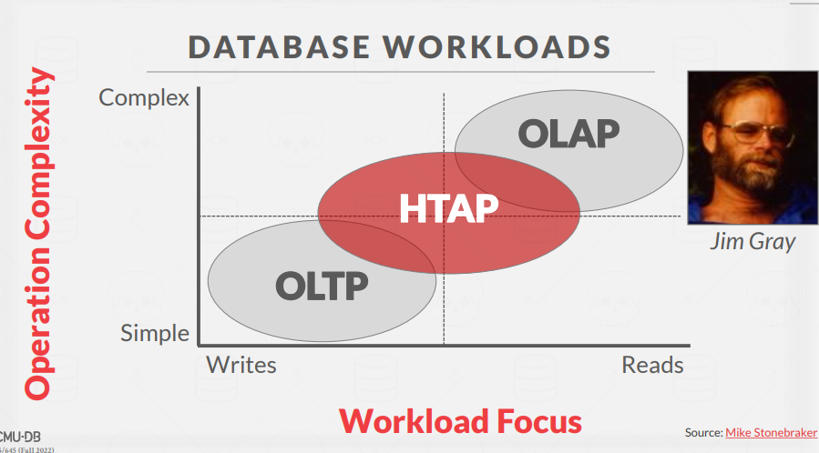

## 5.2 Storage Models

### N-Ary Storage Model (NSM)

In the n-ary storage model, the DBMS **stores all of the attributes for a single tuple contiguously in a single page**

This approach is **ideal for OLTP workloads** where requests are insert-heavy and transactions tend to operate only an individual entity.

It is ideal because it takes only one fetch to be able to get all of the attributes for a single tuple.

Advantages:

* Fast inserts, updates, and deletes.
* Good for queries that need the entire tuple.

Disadvantages:

* Not good for **scanning large portions of the table** and/or **a subset of the attributes.**

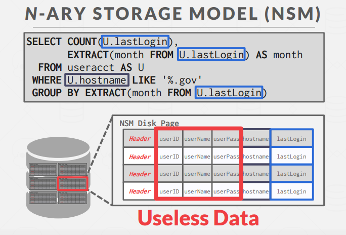

### Decomposition 分解 Storage Model (DSM)

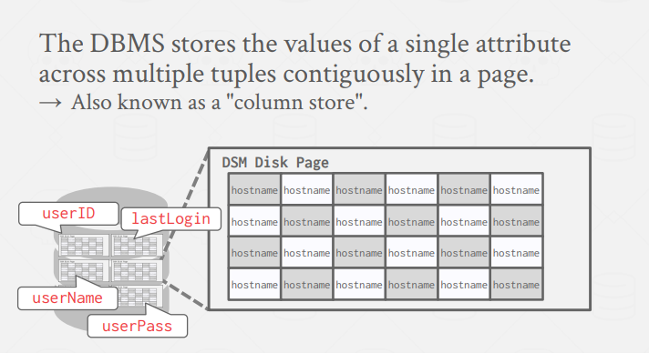

This model is **ideal for OLAP** workloads with many read-only queries that perform large scans over a subset of the table’s attributes.

Advantages:

* **Reduces the amount of I/O wasted** because the DBMS only reads the data that it needs for that query.
* Better query processing and data compression

Disadvantages:

* Slow for point queries, inserts, updates, and deletes because of tuple splitting/**stitching**(缝合).

To **put the tuples back together** when using a column store,there are two common approaches:

fixed-length offsets(most common): Each value is the same length for an attribute

Embedded Tuple Ids:Each value is stored with its tuple id in a column

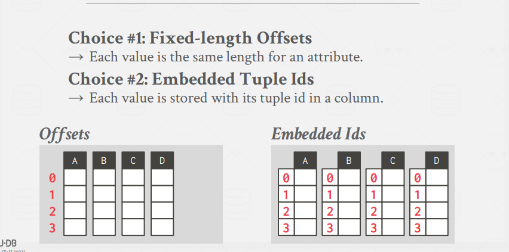

## 5.3 Database Compression

> * 压缩操作被在**disk-based** DBMSs广泛应用。因为disk的I/O总是瓶颈，所以压缩可以让系统提升性能，尤其是只读analyt Managical workloads上。
>
>   如果事先对tuples进行了压缩，DBMS可以获取更多有用的tuple，但代价是要付出更大的压缩和解压的计算开销。
> * 内存中的DBMS更加复杂，因为它们不必从磁盘中获取数据来执行一个查询。 内存比磁盘快得多，但压缩数据库可以减少DRAM需求和处理。
>
>   而且必须在速度和压缩率中取得一个平衡。压缩数据库可以减少DRAM的需求和查询执行过程中的CPU成本。
> * 如果数据集是完全随机的bits，那么我们没有办法进行压缩。然而，现实世界中的数据集有一些key properties 是可以进行压缩的。
>   * 数据集往往具有高度倾斜的属性值分布（例如，Brown语料库的Zipfian分布）。
>   * 数据集往往在同一元组的属性之间有很高的相关性（例如，邮政编码到城市。订单日期与发货日期）。 Manag

Given this, we want a database compression scheme to have the following properties:

* Must produce **fixed-length values**. The only exception is var-length data stored in separate pools. This because the DBMS should follow word-**alignment**(对齐) and be able to access data using offsets.
* Allow the DBMS to **postpone**(推迟) decompression as long as possible during query execution (late materialization).
* Must be **a lossless scheme** because people do not like losing data. Any kind of lossy compression has to be performed at the application level.

### Compression Granularity

在给DBMS增加压缩功能之前，我们需要决定我们要压缩什么样的数据。这个决定决定了压缩方案的可用性。有四个级别的压缩 Manag颗粒度（granularity）

* Block Level: 压缩同一张表的tuple块。
* Tuple Level: 压缩整个tuples的内容（仅NSM）。
* Attribute Level: 在一个tuple内压缩单个属性值。可以针对同一tuple的多个属性。
* Columnar Level:

  为多个tuple存储的一个或多个属性压缩多个值 (只限于DSM)。这允许更复杂的压缩方案。

## 5.4 Naive Compression

DBMS使用一个**通用的算法**对数据进行压缩 (e.g., gzip, LZO, LZ4, Snappy, Brotli, Oracle OZIP, Zstd)。 尽管DBMS可以使用几种压缩算法，但工程师们往往选择那些经常提供较低压缩率以换取更快的压缩/解压的算法。

naive compression例子： **MySQL InnoDB**

DBMS对磁盘页面进行压缩，将其压缩到2KB的幂数，并将其存储到缓冲池中。然而，每次DBMS试图读取数据时，缓冲池中的压缩数据必须被解压

缺点:

* 由于访问数据**需要对压缩的数据进行解压**，这就限制了压缩方案的范围。 如果目标是将整个表压缩成一个巨大的块，使用naive compression 方案是不可能的，因为每次访问都需要对整个表进行压缩/解压缩。 因此，对于MySQL来说，由于压缩范围有限，它将表分解成更小的块状。
* naive方案也没有考虑到数据的高级含义或语义。 该算法既不考虑数据的结构，也不考虑查询打算如何访问 数据。因此，这就**失去了利用late materialization 的机会**，因为DBMS不能知道它何时能够延迟数据的解压。

## 5.5 Columnar Compression 柱状压缩\*\*

### Run-length Encoding

Compress runs of the same value in a single column into triplets:

* The value of the attribute.
* The start position in the column segment.
* The # of elements in the run.

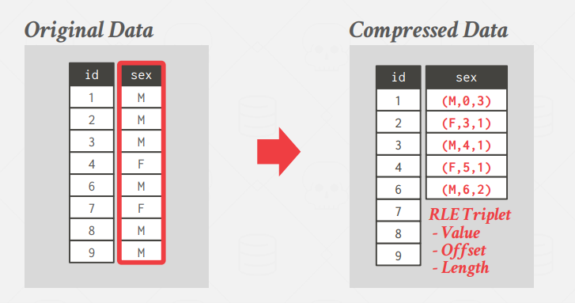

Requires the columns to be sorted **intelligently**(智能) to maximize compression opportunities.

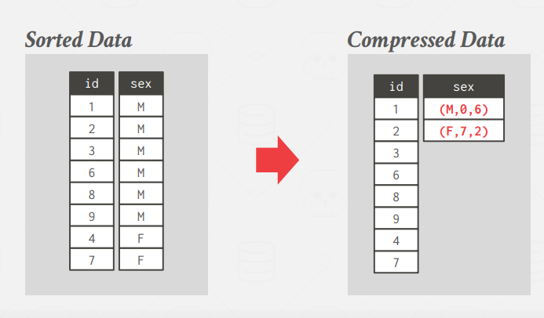

### Bit-Packing Encoding

When values for an attribute are **always less than the value's declared largest size,** **store them as smaller data type**.

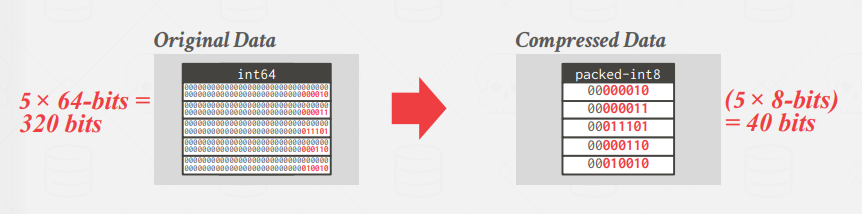

Bit-packing variant that uses a **special marker** to indicate when a value exceeds largest size and then maintain a look-up table to store them.

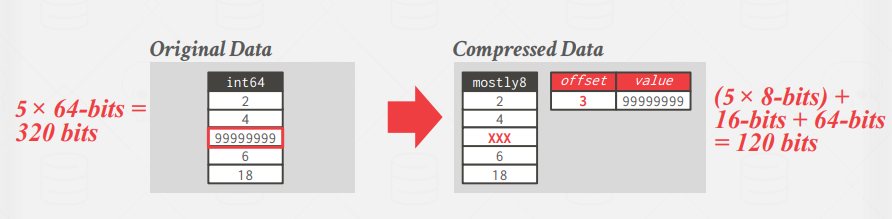

### Bitmap Encoding

Store a separate bitmap for each unique value for an attribute where **an offset in the vector corresponds to a tuple.**

* The i th position in the Bitmap corresponds to the i th tuple in the table.
* Typically segmented into chunks to avoid allocating large blocks of contiguous memory. Only practical **if the value cardinality(基数) is low**. Some DBMSs provide bitmap indexes.

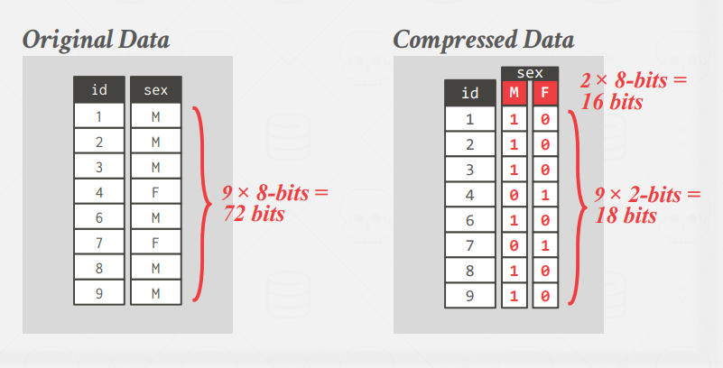

### Delta Encoding

**Recording the difference** between values that follow each other in the same column.

* Store base value in-line or in a separate look-up table.
* **Combine with RLE to get even better compression ratios.**

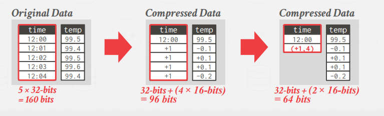

### Incremental Encoding

Type of delta encoding that **avoids duplicating common prefixes/suffixes between consecutive tuples**. This works best with sorted data.

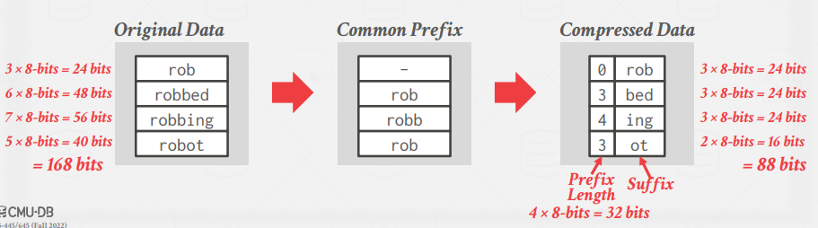

### Dictionary Encoding

Build a data structure that **maps variable-length values to a smaller integer identifier.**

Replace those values with their corresponding identifier in the dictionary data structure.

* Need to support fast encoding and decoding.
  * Encode/Locate: For a given uncompressed value, convert it into its compressed form.
  * Decode/Extract: For a given compressed value, convert it back into its original form.
  * No magic hash function will do this for us.
* Need to also support range queries.

**Most widely used compression scheme in DBMSs.**

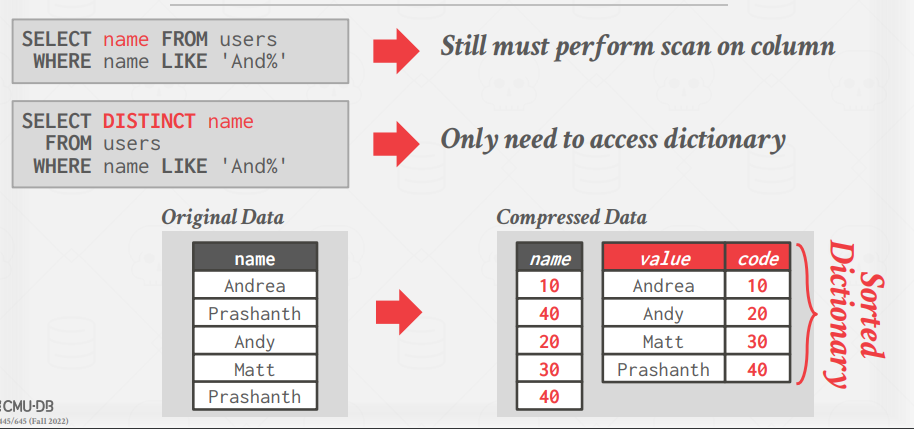

# Homework #2 [Storage & Indexes](https://15445.courses.cs.cmu.edu/fall2022/files/hw2-clean.pdf)

## Question 1: Storage Models

a database with a single table **R(q_id,txns,total,failed)**, where q_id is the **primary key**, and **all attributes are the same fixed width.**

Suppose R has 20,000 tuples that fit into 100 pages, **Ignore any additional storage** overhead for the table (e.g., page headers, tuple headers).

Assumptions:

* The DBMS does **not have any additional meta-data** (e.g., sort order, zone maps).
* R does **not have any indexes** (including for primary key q_id)
* **None** of R’s pages are already **in the buffer pool**.

```
SELECT total - failed FROM R
WHERE q id = 96 AND txns > 420;
```

### (a) Suppose the DBMS uses the decomposition storage model (DSM) with implicit offsets

* i What is the **minimum number of pages** that the DBMS will potentially have to read from disk to answer this query?

  题意是存在这样一条记录,找到该条记录最少的磁盘读次数.

  官方解答是: 4 pages. 1 to find the primary key, + 3 to access txns, total, failed at their corresponding offsets.

  因为使用分解存储模式DSM, 按列存储.

  因此找到主键后就可以通过偏移量找其他属性的值. 读盘次数的限制在找主键上.

  显然,找主键至少需要一次读盘.
* ii What is the **maximum number of pages** that the DBMS will potentially have to read from disk to answer this query?

  官方解答: 28 pages. **There are 25 pages per attribute.** In the worst case, we scan through all 25 pages to find the primary key, and then + 3 to access txns, total, failed at their corresponding offsets.

  上题可知,找主键次数决定了读盘次数.

  也就是当q_id = 96的记录越靠后, 找主键次数越多.

  因为没有顺序,所以96是无用的信息.

  同时因为**有四个属性,且所有属性大小固定**. 所以当每个属性都占25页时,且q_id=26所在的记录是最后一个(25),找主键次数最大为25次.

### (b)Suppose the DBMS uses the N-ary storage model (NSM)

* i. What is the minimum number of pages that the DBMS will potentially have to read from disk to answer this query?

  Solution: We find the tuple with the matching primary key on the first page. No need to look in other pages since all attributes are stored together.

  在第一页
* ii. [4 points] What is the maximum number of pages that the DBMS will potentially have to read from disk to answer this query?

  在最后一页 100

## Question 2: Cuckoo Hashing

几道哈希表计算的题目,较简单

2进制：0b，8进制：0o，10进制：无前缀，16进制：0x

## Question 3: Extendible Hashing

Consider an extendible hashing structure such that:

* Each bucket can hold up to two records.
* The hashing function uses the lowest g bits, where g is the global depth.

题目是一个二进制可扩展哈希. 哈希函数是二进制最低g位.

每个哈希值对应一个桶, 每个桶最多两个, 所有刚好就是二进制.

### (a) Starting from an empty table, insert keys 15, 14, 23, 11, 9.

二进制表示

```
15: 00001111
14: 00001110
23: 00010111
11: 00001011
9 : 00001001
```

插入步骤(括号内为局部深度,全局深度为最大局部深度)

```
插入15
全局: 1; 桶 1(1):15
14
全局: 1; 桶 1(1):15 ; 0(1):14
23
全局: 1; 桶 1(1):15,23; 0(1):14

11
全局: 1; 桶 1(1):15,23,11; 0(1):14
桶1此时有三条记录,需要扩展深度,扩展为2
全局: 2; 桶 11(2):15,23,11; 01(2):; 0(1):14
桶11此时有三条记录,需要扩展深度,扩展为3
全局: 3; 桶 111(3):15,23; 011(3):11;01(2):; 0(1):14

9
全局: 3; 桶 111(3):15,23; 011(3):11; 0(1):14; 01(2):9;
```

* i. What is the global depth of the resulting table?

  显然,当g至少等于3的时候才能使得同一个哈希值最多对应两个记录.
* ii. [4 points] What is the local depth the bucket containing 15?

  为3
* iii. [4 points] What is the local depth of the bucket containing 14?

  为1

### (b) Starting from the result in (a), you insert keys 12, 5, 7, 13, 2.

```
15: 00001111
14: 00001110
23: 00010111
11: 00001011
9 : 00001001
此时 全局: 3; 桶 111(3):15,23; 011(3):11; 0(1):14; 01(2):9;
12: 00001010
5 : 00000101
7 : 00000111
13: 00001101
2 : 00000010


12
全局: 3; 桶 111(3):15,23; 011(3):11; 0(1):14,12; 01(2):9;
5
全局: 3; 桶 111(3):15,23; 011(3):11; 0(1):14,12; 01(2):9;
7
全局: 3; 桶 111(3):15,23; 011(3):11; 0(1):14,12; 1(1):9,5;
此时111桶有3个,增加深度为4
全局: 4; 桶 1111(4):15;0111(4):23,7; 011(3):11; 0(1):14,12; 1(1):9,5;

13
全局: 4; 桶 1111(4):15;0111(4):23,7; 011(3):11; 0(1):14,12; 1(1):9,5;
01(2):13;

2
全局: 4; 桶 1111(4):15;0111(4):23,7; 011(3):11; 0(1):14,12; 1(1):9,5;
01(2):13;01(2):2
```

* i. [4 points] Which key will first cause a split (without doubling the size of the table)?

  这里的split操作指的是**增加桶的数量**,而不double.也就是不增加全局深度.(增加全局深度会翻一倍)

  所以是13第一个增加了桶的数量.
* ii. [4 points] Which key will first make the table double in size?

  7

### (c) Now consider the table below, along with the following deletion rules:

1. If two buckets satisfy the following:

(a) They have the same local depth d

(b) They share the first d − 1 bits of their indexes (e.g. b010 and b110 share the first 2 bits)

(c) Their constituent elements fit in a single bucket. Then they can be merged into a single bucket with local depth d − 1.

2. If the global depth g becomes strictly greater than all local depths, then the table can be halved in size. The resulting global depth is g − 1.

```
00
28:11100
8 :01000

01
25:11001

10
30:11110
22:10110
18:10010

011
11:01011
27:11011

111
23:10111
7 :00111
```

Starting from the table above, delete keys 25, 18, 22, 27, 7.

```
delete 25
00
28:11100
8 :01000

10
30:11110
22:10110
18:10010

011
11:01011
27:11011

111
23:10111
7 :00111

delete 18
00
28:11100
8 :01000

10
30:11110
22:10110

011
11:01011
27:11011

111
23:10111
7 :00111

delete 22
00
28:11100
8 :01000

10
30:11110

011
11:01011
27:11011

111
23:10111
7 :00111
此时00 和 10可进行合并
0
28:11100
8 :01000
30:11110

011
11:01011
27:11011

111
23:10111
7 :00111

delete 27
0
28:11100
8 :01000
30:11110

011
11:01011

111
23:10111
7 :00111
此时 011 和 111可合并为11,一次合并最多减少1, 此时global depth = 2
0
28:11100
8 :01000
30:11110

11
11:01011
23:10111
7 :00111

delete 7
0
28:11100
8 :01000
30:11110

11
11:01011
23:10111
```

* i. Which deletion first causes a reduction in a local depth.

22

* ii. Which deletion first causes a reduction in global depth.

  27

  Solution: Deleting 27 from bucket b011 allows it to merge with b111. Since these two buckets are the only ones of depth d = 3, this merge reduces the global depth to d = 2

## Question 4: B+Tree

还行,就是有个奇怪的点. 索引节点的值一般会出现在叶子节点上.

最后一题是找出指定的节点 非法的地方.

# P1

```
1: 0001
2: 0010
3: 0011
4: 0100
5: 0101
6: 0110
7: 0111
8: 1000
9: 1001

1 2 3 4
全局1 1(1):1,3;0(1):2,4;

5
全局1 1(1):1,3,5;0(1):2,4;

全局2 01(2):1,5;11(2)3;0(1):2,4;

6
全局2 01(2):1,5;11(2)3;00(2):4;10(2):2,6;

7
全局2 01(2):1,5;11(2)3,7;00(2):4;10(2):2,6;

8
全局2 01(2):1,5;11(2)3,7;00(2):4,8;10(2):2,6;

9
全局2 01(2):1,5,9;11(2)3,7;00(2):4,8;10(2):2,6;

全局3 001(3):1,9;101(3):5;11(2)3,7;00(2):4,8;10(2):2,6;

```

## LRU-K

The LRU-K algorithm **evicts**(剔除) a frame whose **backward k-distance** is maximum of all frames in the replacer.

**Backward k-distance** is computed as the **difference** in time between current timestamp and the timestamp of kth previous access.

A frame with less than k historical accesses is given +inf as its backward k-distance. When **multipe frames have +inf backward k-distance**, the replacer evicts the frame **with the earliest timestamp**.

先弄清楚逻辑在写，不要把时间花在无意义的bug上。

# P2 B+Tree

## 概述

内部节点：索引作用

叶子节点：包含真正的数据实体

由于树是动态增长和收缩，所以要处理 split 和 merge

> Since the tree structure grows and shrink dynamically, you are required to handle the logic of split and merge.

**Checkpoint #1 — Due Date: Oct 11 @ 11:59pm**

* **[Task #1 - B+Tree Pages](https://15445.courses.cs.cmu.edu/fall2022/project2/#b+tree-pages)**
* **[Task #2 - B+Tree Data Structure (Insertion, Deletion, Point Search)](https://15445.courses.cs.cmu.edu/fall2022/project2/#b+tree-structure)**

**Checkpoint #2 — Due Date: Oct 26 @ 11:59pm**

* **[Task #3 - Index Iterator](https://15445.courses.cs.cmu.edu/fall2022/project2/#index-iterator)**
* **[Task #4 - Concurrent Index](https://15445.courses.cs.cmu.edu/fall2022/project2/#concurrent_index)**

该project 要依赖于上一个 buffer pool 的正确实现。

由于第一个检查点与第二个检查点密切相关，在第二个检查点中，您将在现有的B+索引中实现索引抓取，因此我们传入了一个名为transaction的指针参数，其默认值为nullptr。在任务#4之前，您不需要更改或调用与参数相关的任何函数。

## Task #1 - B+Tree Pages

* **[B+Tree Parent Page](https://15445.courses.cs.cmu.edu/fall2022/project2/#b+tree-page)**
* **[B+Tree Internal Page](https://15445.courses.cs.cmu.edu/fall2022/project2/#b+tree-internal-page)**
* **[B+Tree Leaf Page](https://15445.courses.cs.cmu.edu/fall2022/project2/#b+tree-leaf-page)**

### B+Tree Parent Page

ParenPage 被 Internal Page 和 Leaf Page所继承。

并且只包含了 子类 所共享的信息。

**可以规定** `parent_page_id_` 为 `INVALID_PAGE_ID` 表示根节点。

| Variable Name | Size | Description |  | --------------- | ---- | --------------------------------------- |  | page_type_ | 4 | Page Type (internal or leaf) |  | lsn_ | 4 | Log sequence number (Used in Project 4) | | size_ | 4 | Number of Key & Value pairs in page | | max_size_ | 4 | Max number of Key & Value pairs in page | | parent_page_id_ | 4 | Parent Page Id | | page_id_ | 4 | Self Page Id | 


### B+Tree Internal Page

* 不存储真实数据。只存储 m个有序 key和m+1个child 指针。
* 因为key的数量和指针数量不相等。第一个key被设定为invalid。所有方法需要从第二个key开始（下标为1）
* 实际存储如下
* 键,指针,键,指针,...,键,指针.
* 此时有m+1个键,为了保证只有m个键,所以第一个键设置为无效的.

key的数量限制

* 在任何时间，最少装了一半（half-full）。
* 删除时，两个 half-full可以被joined 成为一个合法的 Internal Page
  * 或者被重新分配来避免merge
* 当插入到一个fullpage时，可以被split成两个。
* This is an example of one of the many design choices that you will make in the implementation of the B+ Tree.

三个泛型 KeyType, ValueType, KeyComparator。

**KeyType** 不一定直接可用大于小于号比较，所以引入了 KeyComparator，从 cpp 文件中的实例化可以看出用的是 GenericKey 和 GenericComparator，查看二者源码可以得到以下信息：

**GenericKey** 可以调用 ToString() 函数得到其 int64 表示，然后用 \*\*%ld 格式符打印。\*\*这对我们后面调试时非常重要。 GenericComparator 的比较规则是：左边小于右边时，返回 -1；左边大于右边时，返回 1；相等返回 0。

**ValueType** 代表的是指向子页面的指针，从实例化可以看出实际只用了 page_id_t，也就是 **int**。

数据存储上，其理论结构应为 <指针，键，指针，键…，键，指针>，为方便存储，实际上**在头部多补了一个无效键**，从而可以用一个 pair 的数组存储：

```
#define MappingType std::pair<KeyType, ValueType>
...
class BPlusTreeInternalPage : public BPlusTreePage {
...
private:
  // Flexible array member for page data.
  MappingType array_[1];
}
```

array_[1] 等价与 pair类型的指针.指向pair数组. 数组的每一个元素是<键,值>

在内部节点中,值代表指针.(第一个元素的键是无效的,但值是存在的).

因为节点对象使用的是预先分配好的固定空间，array_ 可以控制从该位置开始到 Page 的 data 结束为止的这一段空间。

因此，节点对象的生命周期也不是由 new 和 delete，而是由 BufferPoolManager 管理.

* 取一个页面，用 FetchPage；
* 使用结束归还一个页面，用 UnpinPage。
* page_id_ 不仅是 B+ 树中节点的编号，同时也是这个节点使用的 Page 在 BufferPool 中的编号。

### B+Tree Leaf Page

* 存储 m个有序key，m个 value 实体
* 在这次实现中，value 仅仅是64位的record_id, 被用于定位真实的tuples的存储位置.
  * see `RID` class defined under in `src/include/common/rid.h`.
* 对于键值对的数量限制与Internal Page一致.

**重要**

* 尽管叶子节点和内部节点有相同类型的key.但他们值的类型不一样.
  * 所以**max_size 也应该是不同的**
* 每个节点的 **data_**,都是从buffer pool 中fetch得到的 内存页面.
  * 所以当写或读时,要先使用唯一的page_id,从buffer pool 中fetch 出来.
  * 然后使用 reinterpret cast, 转换成 叶子节点或内部节点.
  * 并且要在读或写操作结束后,unpin这个页面.

## Task #2 - B+Tree Data Structure

* 只支持 unique keys. 也就是说,当有重复的key插入时, 不进行任何操作并返回false
* 同时当删除操作导致 页面key数量低于阈值时, 需要正确地执行 merge 和 redistribute(也叫做 coalescing) 操作.

对于checkpoint , B+Tree Index 只需要支持 **insertions** (`Insert()`), **point search** (`GetValue()`), and **deletes** (`Delete()`)

插入操作 引起 split操作的情况:

* 插入操作后, 叶子节点中 pair的数量 等于 max_size
* 插入 操作前, 内部节点 孩子数量等于 max_size

因为写操作会导致, root_page_id的改变,所以也要在 **header page** 同时更新 root_page_id (`src/include/storage/page/header_page.h`).

更新的方法是调用 `UpdateRootPageId` (已经提供了)

需要隐藏类型和比较.

```
template <typename KeyType,
          typename ValueType,
          typename KeyComparator>
class BPlusTree{
   // ---
};
```

* `KeyType`: 索引中key的类型,只可能是 `GenericKey`.
  * GeneriKey真实的size是特定的.
  * 是通过模板参数指定和实例化的，并取决于索引属性的数据类型.
* `ValueType`: 索引中值的类型. 只可能是 64-bit RID.
* `KeyComparator`: 用来比较两个KeyType实例 大小关系. 左边小于右边时，返回 -1；左边大于右边时，返回 1；相等返回 0。

## Checkpoint 1：查找，插入和删除

### 约定

这里约定 内部节点array中key 与子节点的关系.

- 左子节点的keys <= 父节点的keys
- 右子节点的keys > 父节点的keys

### 查找

给定key，返回查找的页面。

页面的数据存在叶子节点中。

因此要从根节点开始，一层一层往下找

```C++
findValue(const Page page,KeyType key){
    //二分查找 page的array中,找到最大的小于等于key的 pair
    return pair;
}
GetLeaf(Page root,KeyType key){
    Page now = root;
    while(now.type != leaf){
        now = findValue(now,key);
    }
    return now;
}
GetValue(KeyType key){
    Page now = GetLeaf(root,key);
    //现在now为叶子节点,在叶子节点中找对应的值.
    findValue(now,key);
    //如果返回值的key不相等则没找到.
    //相等则返回找到
}
```


### 插入(叶子节点)

因为以下的操作都基于至少有一个根节点的情况.

因此在最开始要判断是否为空树,如为空树则创建根, 直接返回


首先看键存不存在,如果已经存在,则直接返回.

因为B+树的真实数据存在叶子节点中. 因此插入的第一步就是在找到对应叶子节点,并**插入(叶子节点)**到对应位置.

此后可能会引起分裂.

1. 先直接**插入(叶子节点)**到叶子节点中.
2. 当发现**插入(叶子节点)**后, 叶子节点的pair数量等于max_size时进行分裂.


split(page) 操作**这里不分内部叶子节点**

- 当前节点是full page,因此可以将当前节点分裂成 (左子节点 half full,  新父节点 , half full)
- 其中新父节点的值是左子节点的最后一个.
- 新父节点 需要 **插入(内部节点)** 到原来的父节点中.
  - **插入(内部节点)前**, 要判断 **原父节点的孩子数量是否等于max_size**
  - 如果等于, 则先**将原父节点分裂** 后.
  - 再执行当前的**插入(内部节点)**操作.
- 特殊的. 如果page是根节点, 即没有原父亲节点.
  - 则将 根节点 更新成新父节点后, 返回即可.

**插入(内部节点)** : 因为在插入前已经处理好了插入操作的合法性,因此直接插入即可.

伪代码:

```C++
SetRoot(page_id){
 root_page_id = page_id;
    //一定要调用 UpdateRootPageId
}
split(page){
    //分裂出下面三个节点
    left_page, right_page;
    new_parent_page;//key为左节点的最后一个key, value为指向左节点的指针
    
    //判断是否为根节点
    if(page.type == rootType){
       SetRoot(new_parent_page.page_id);
        return ;
    }
    //获取父亲节点
    parent_page;    
    if(parent_page.isFull()){
        split(parent_page);
    }
    //将new_parent_page 插入到 parent_page中
    parent_page.insert();
}
Insert(key,value){
    //判断是否为空树
    if(root == valid){
        Page new_page = new Page(key,value);
        SetRoot(newpage.page_id);
        return ;
    }
    //先查找
    Page leaf_page = GetLeaf(root,key);
    //直接调用叶子节点的插入
    leaf_page.Insert(leaf_page, Page new page(key,value));
    
}
LeafPage::Insert(Page new_page){
    //直接插入,同时只需要更新指向 new_page 和 new_page的 next
    
    //满了就分裂.
    if(isFull()){
        split();
    )
}
InternalPage::Insert(Page new_page){
    //直接插入,但array中key的有效位置是从1开始
    
}  
//上面代码还需要考虑
//页面的创建和释放

```


### 删除

B+树最难的地方。但比起splay来说还是简单太多了。并且因为B+树只有叶子节点存值。在内部节点的删除上比B树简单了很多。

删除的核心操作：

1. 叶子节点/内部节点删除元素后;
   若小于下限,则按下面的优先级考虑;
2. 如相邻兄弟结点丰满（即 元素个数 大于 下限+1），则向兄弟结点**借**一个元素。（具体是 先从相邻方向上的父亲结点变成借来的元素左右(这里具体要看借左边还是右边)，而后对应相邻的兄弟补回这个元素）。否则：
3. 与相邻的兄弟结点 **合并** 

父亲节点被删除后, 需要继续执行上面的操作.

叶子节点和内部节点的差异:

- 借
  - 内部节点和B树操作一样, 先**从相邻方向上的父亲结点拿一个元素**，而后**对应相邻的兄弟补回这个元素**
  - 叶子节点的父亲只是索引节点,因此 把兄弟节点的元素拿来后, 父亲节点的值根据 从左边/右边拿 变成相应的合法的值即可.
  - 借的操作都**不会涉及父亲节点的删除**
- 合并
  - 内部节点和B树操作一样, 将兄弟和父亲节点一起合并. (也相当于删除了父亲节点)下限+(下限-1) + 1 等于上限,因此合法
  - 叶子节点是 两个叶子节点合并后直接删除父亲节点.
  


特殊地,如果删除的是根节点的元素，且根结点只有一个元素，则**下降一层**退出。

- 因为只有一个待删除的元素，说明目前只有一个儿子结点（刚刚合并了）。
- 直接将儿子结点作为根节点。


伪代码

```C++
//tree的Remove操作
Remove(){
    
    //1.判断是否为空
    if(empty){
    //返回
    }
    
    //2.找到叶子结点，并在叶子结点中删除该元素
    leaf_page;//找到叶子节点
    //TODO 删除元素
    
    //3.判断叶子结点元素个数是是否小于下限
    if( 小于 下限){
        UnderFlow()
    }
}
Underflow(){
            //3.0 判断是否为根节点
        if(IsRoot){
           //根节点的下限是1.说明应该减少一层.
            
           //3.0.1a找到根节点唯一的子节点.
           //该子节点变为根节点.
            
            
            //3.0.1b 根节点没有子节点
            //直接删除,树变成空树.
           return 
        }
        
        //3.1a. 找兄弟节点借
        Borrow{
        	//3.1a.1a找左兄弟节点借
            if(borrow(left_){
                return 
            }
            
            //3.1a.1b左兄弟不能借，就找右兄弟节点借
            if(borrow(right_){
                return 
            }
        }
        
        //3.1b.借失败了，就准备合并
        union{
            //3.1b.1a 左兄弟结点存在,就找左兄弟节点合并
            if(have(left) && union(left_){
                return 
            }
            
            //3.1b.1b 没有左兄弟节点, 找右兄弟节点合并.(除根节点外肯定至少有一个兄弟节点)
            if(union(right_){
                return 
            }
        }
}
borrow(bro_page){
    //如果兄弟节点的 size <= 下限,不能借
    if(bro_page size <= 下限){
        return ;
    }
    //否则可以借
    
    //是叶子结点
    //直接拿 对应兄弟结点最靠近的元素
    
    
    
    //是内部结点
    
    //加入的元素 = 中间父亲结点对应的元素
    //中间父亲结点对应的元素 = 兄弟结点最靠近的元素.
    //兄弟结点最靠近的元素删除
    
}
               
union(bro_page){
    //是叶子结点
    //两个结点合并成一个结点
    
    //是内部结点
    //好像都是直接把右合并到左就可以.
    
    
    //删除父亲结点中间的元素.
    //如果父亲结点size 小于等于 下限
    //父亲结点采取下溢操作
}
```